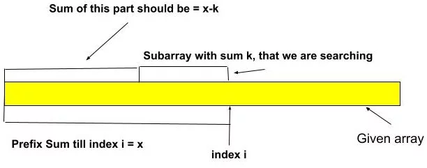
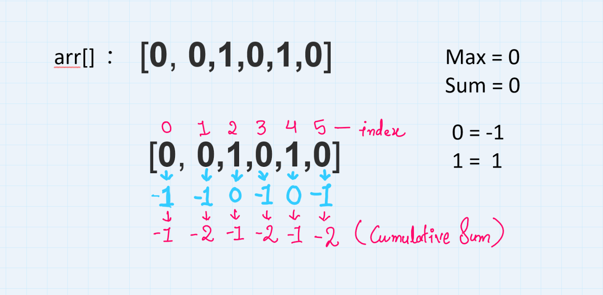
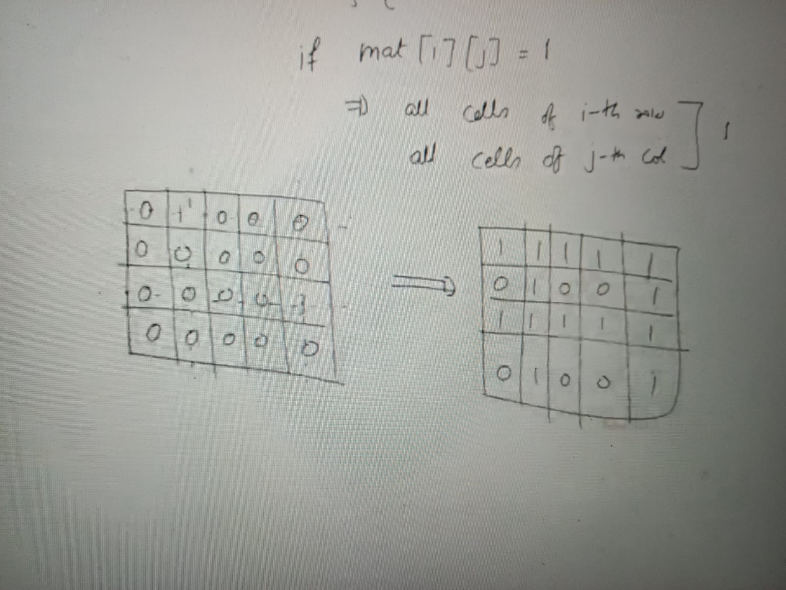
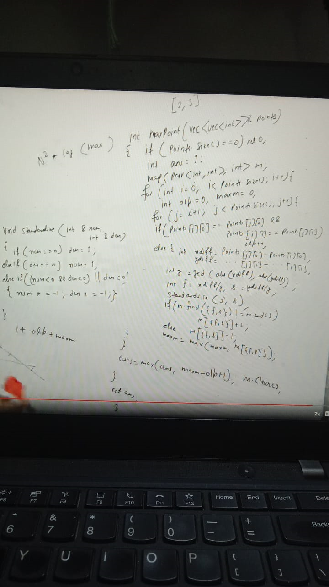

Observation:

Assume, the prefix sum of a subarray ending at index i is x. In that subarray, we will search for another subarray ending at index i, whose sum equals k. Here, we need to observe that if there exists another subarray ending at index i with sum k, then the prefix sum of the rest of the subarray will be x-k. The below image will clarify the concept:

Boolean Matrix::

MaxPoint:

