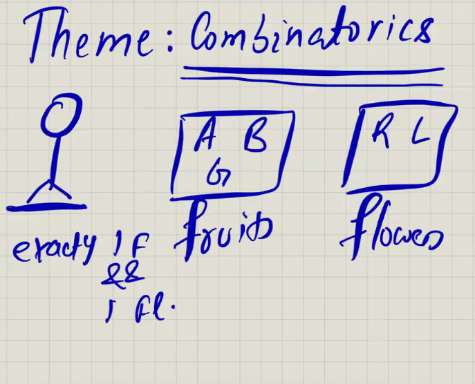

3 X 2 ( 3 are fruits and 2 is flowers) we have to check how many ways to perform first action
 = 3
same for flower = 2

total choices = 3 x 2 = 6

https://leetcode.com/problems/number-of-ways-to-divide-a-long-corridor/description/

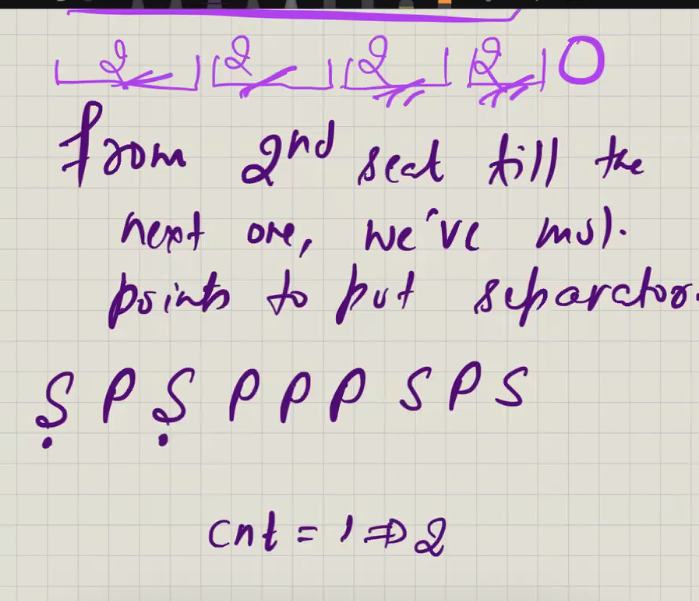

after count =2 , the moment we found second seat and find next seat in between we can put separater any where

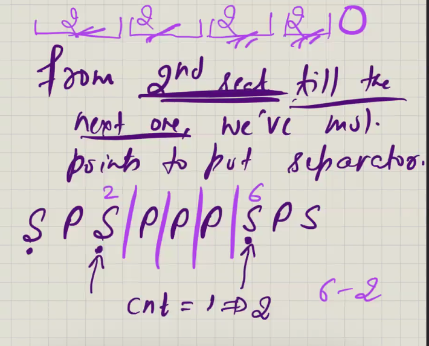

no of way to put first 1st separator  = j -i where j is second seat and i is first seat

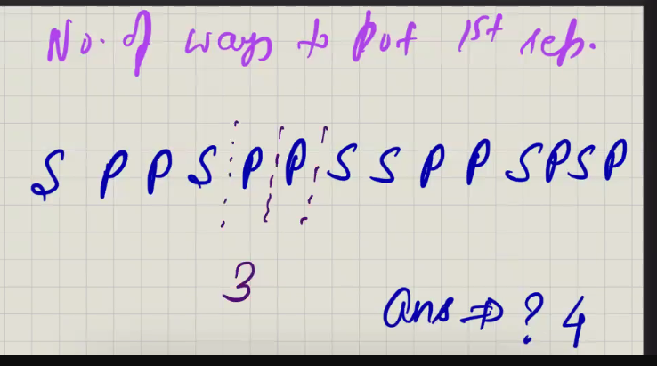

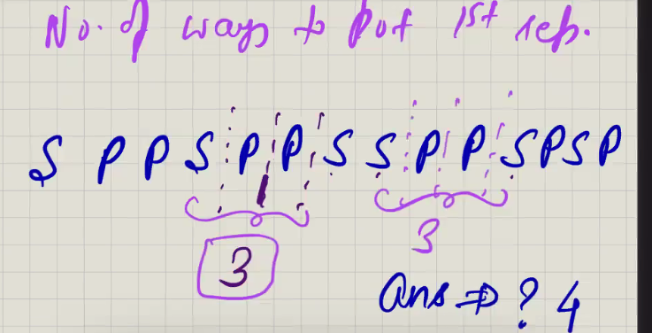

answer = 3 * 3 = 9 , means how many ways to putting 1st separator 2nd separator ...
means this is rule of product
 3 ways for 1st separator X 3 ways of second seaparator = 9

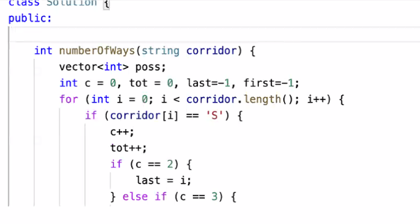

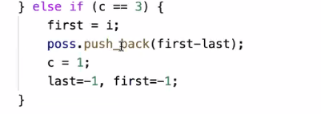
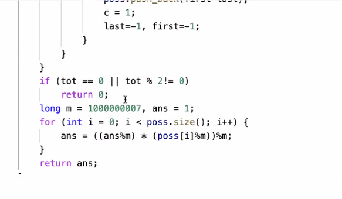

NUmber of ways to pick R items out of N items

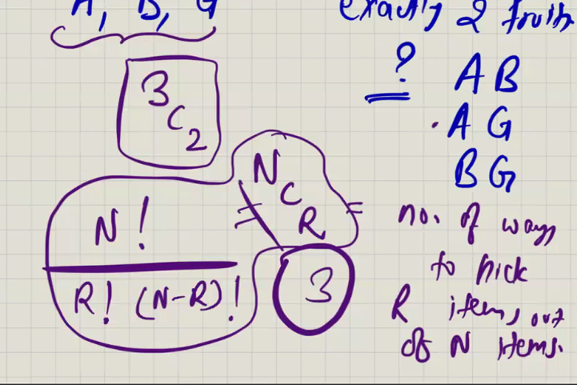

Permutation: diff. ordering of one thing example:

123
132
321
312
... = n! -> it come from rule of product 

how many ways to pick 1st item

(3)(2)(1) = 3 x 2 x 1
- - -
N! = total number of permutation
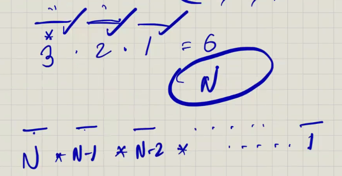

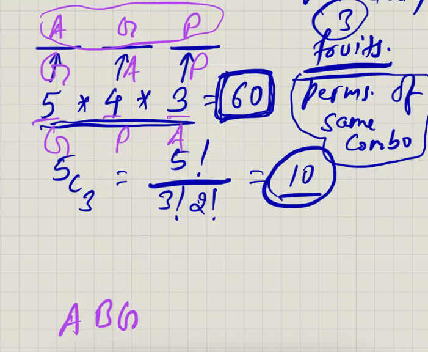

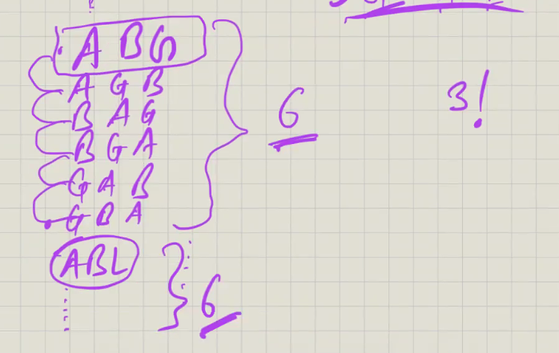
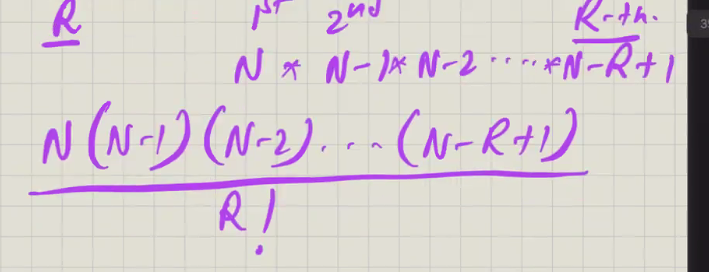
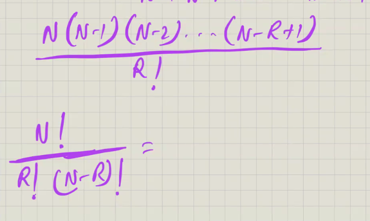
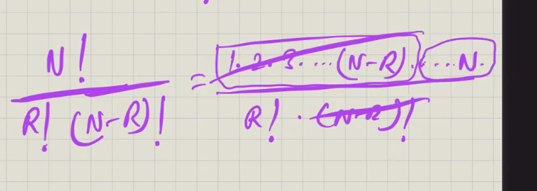

Problem:

https://codeforces.com/contest/131/problem/C

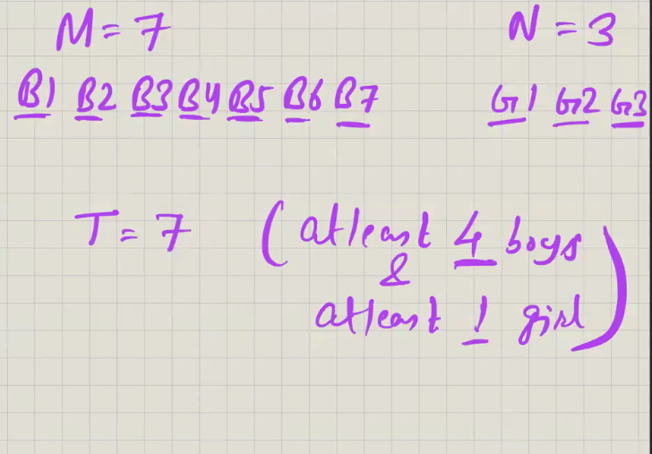

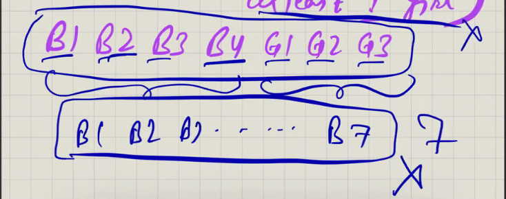

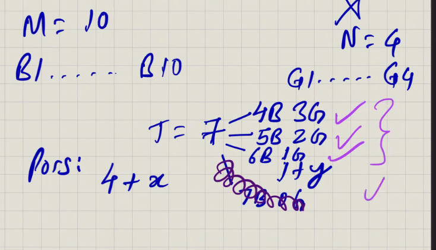

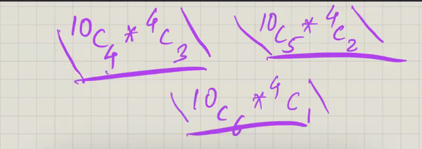
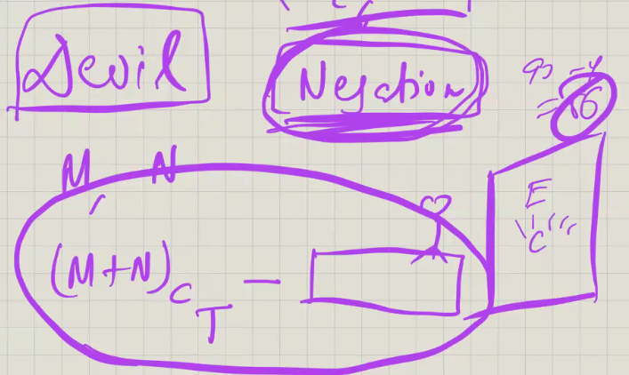

Pascal Triangle:

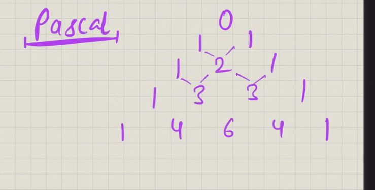

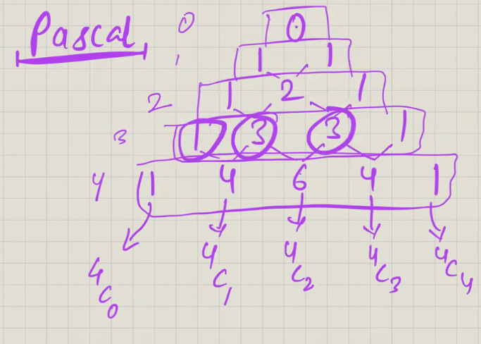

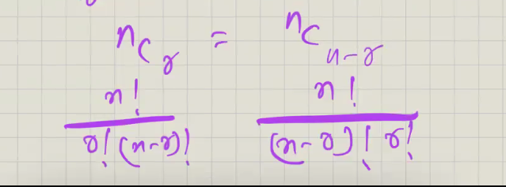

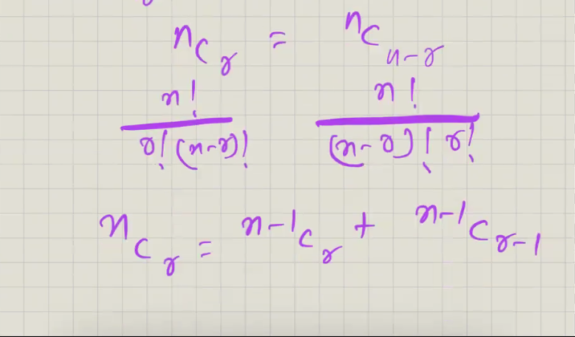
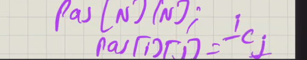

include the element or not include the element in any selection
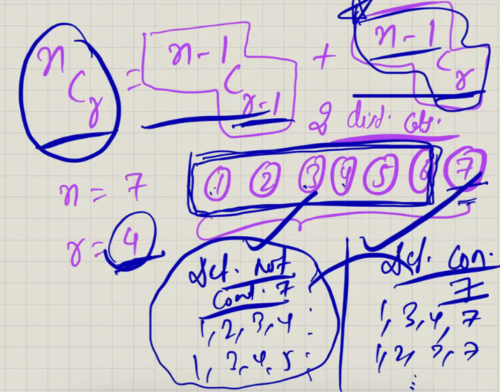