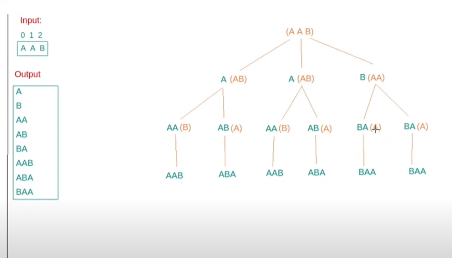

Tiles:

Path-1:

Maze = 4 X 4:

Print all the ways to source (0, 0) to (n-1, n-1)
rat can only move 1 step right and 1 unit is down
0 is safe and 1 is poisonous cell

Approach:

1. Let say Rat on cell (i, j) in that case it he has only 2 choices to move either right/down by 1 unit;
                    Right /   \Down
                        /      \
                    (i, j + 1) (i +1, j)
2. At (0, 0) out pair list's size is 0, which will go in list [{0, 0}].
3. make 1st move is right move, it means nothins right pair intersect with if rat move 1st down and get list of path
4. 
