Permutations of a String - 1
Permutation of a string ‘S’ is the rearrangement of its elements such that there is a one-to-one correspondence with the string itself. A string of length ‘N’ containing all distinct elements has ‘N!’ permutations.

In this lecture, we will learn the fundamentals of backtracking and will see how we can apply it to print all the permutations of a string.

Approach:

Recursion: We can place all the ‘N’ characters one by one at the zero index and then move on to the further indices to place the available characters respectively.

Disadvantage: Using call by value leads to enormous memory usage and if we use call by reference then the string changes during each function call. Because of this, we may not be able to print all the permutations.
Solution: Use backtracking & call by reference.

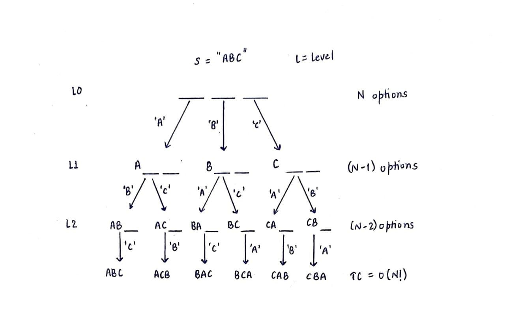

Backtracking: It states to -
Do something: If ‘i’ points to the current index, then perform the operation swap(s[i], s[j]) where i<=j<N to generate different permutations.
Recurse: Permute(s, i+1);  //make the recursive call for the next index
Undo that thing: Now we have to undo the previous swapping operation i.e. unswap(s[i], s[j]) where i<=j<N 

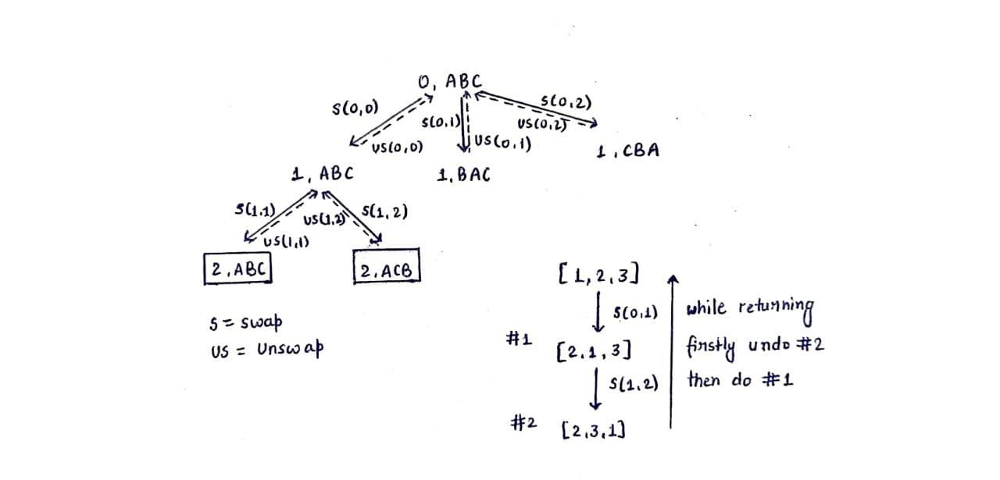

Time complexity: O(N!) = O(N^N)

Note: A string ‘t’ is a permutation of a string ‘s’ if and only if ‘t’ contains all the characters of ‘s’.

Permutations of a String - 2
In this lecture, we will consider another version of the previous problem, here we are given a string ‘s’ and we need to print all the permutations of that string in lexicographic order.

Lexicographic order also known as lexical order is generally the ascending order of strings based on the characters & symbols.

Eg. ABC < ACB < BAC < BCA < CAB < CBA

Approach:

Use recursion & backtracking to generate all the permutations and store them in a vector. Sort the vector to print all the different permutations in lexicographic order.
Time complexity: O(N! + NlogN) = O(N!)
Space complexity: O(N!)
If we carefully analyse the approach followed in the previous lecture, we got non-lexicographic permutations only in the cases where the portion of the string, rightward to our current index is unsorted. As indicated in the below recursion tree diagram:

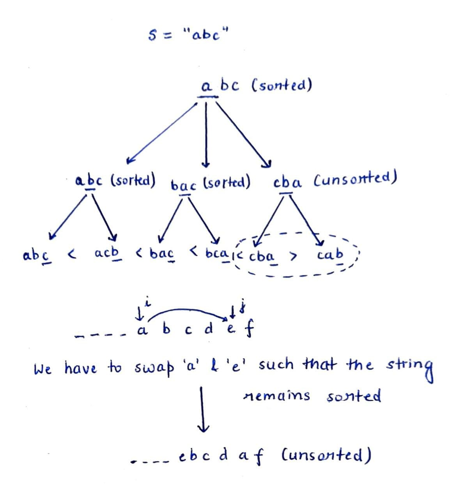

As evident from the above diagram, we need to sort the array from index ‘i+1’ to ‘j’ after swapping s[i] & s[j]. Is there a better way to do it?

Since we know that the initial array is already sorted, we can do it intelligently by right rotating the array elements from ‘i’ to ‘j’ by one unit.

Do: Right rotate the array by one unit
Recurse: Permute(s, i+1);
Undo: Left rotate the array by one unit

Previous: ...a b c d e f…
Now: ...e a b c d f...
This way we can easily print all the permutations in lexicographic order. 

### Permutations of a String - 3
In this lecture, we will discuss an advanced version of the “Permutation of a String” problem. Here, we have been given a string ‘s’ with non-distinct characters and we have to print all its permutations.

If ‘N’ is the length of a string and ‘a’, ‘b’ is the no. of repetitions of two different characters then the no. of permutations will be = N!/(a!*b!)

Eg. For s=”ababc”
Number of Permutations = 5!/(2!*2!) = 30

Approach:

What problem can arise if we follow the approach used in the previous two lectures?

It can lead to repetitions as evident from the below recursion tree diagram. The repetitions occur in two cases:

If we are swapping a character with itself. Eg. Node 1 & 3.
In Node 3 we swapped ‘a’ with ‘a’, thus leading to the same left(‘a’) & right(P(“bab”)) halves and the same set of permutations later on.
If we are swapping the current index with the same character that we had swapped it earlier with.  
Eg. Node 2 & 4. In Node 2 we swapped ‘a’ with ‘b’ & in node 4 we again swapped ‘a’ with ‘b’, thus leading to the same left(‘b) & right halves and the same set of permutations later on.
How same right halves? Since, P(“aab”) = P(“baa”) = {“baa”, “aba”, “aab”} 

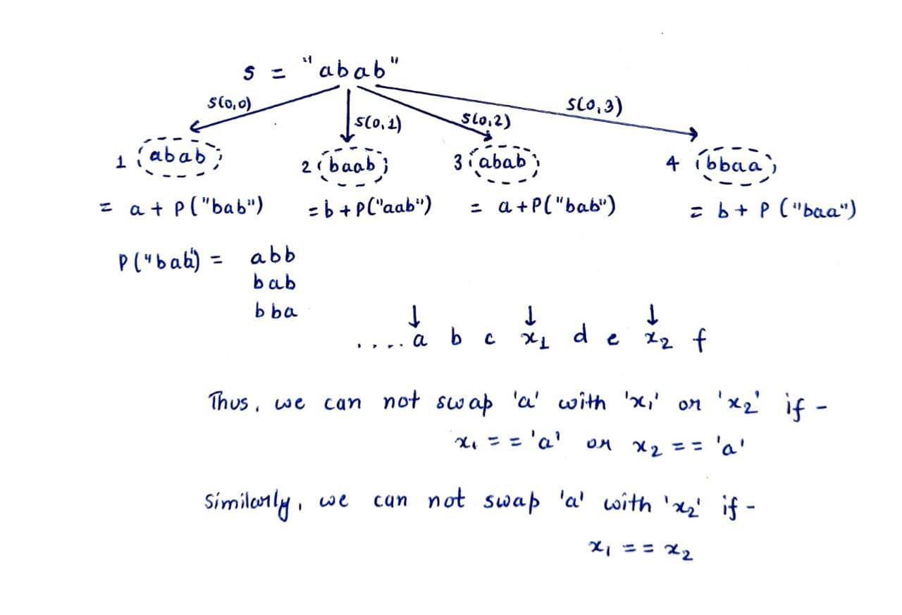

Therefore we have to account for the above two cases while writing the code. To implement this, we can maintain an array to keep track of all the swapped characters and we can swap s[‘i’] with s[‘j’] only if(frequency[s[j]-’a’]==0). After swapping we can increment the frequency of s[‘j’] so that the same character is not swapped again at its future occurrences. 

Paths - 1
We have been given a 2D matrix of dimension NxN with source(0,0) and destination(N-1, N-1). The matrix is filled with 0s & 1s, where ‘0’ indicates the cells that can be used for traversal while ‘1’ represents the cells that are not safe to travel. We have to print all the possible paths to reach from the source to the destination given that the steps are restricted to one unit rightwards or downwards at a time. 

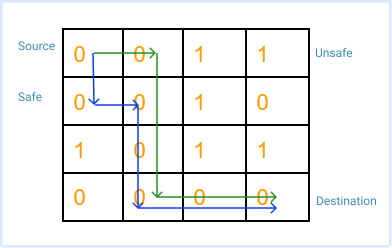

Approach:

How do we print a path? We can print the sequence of cells (i, j) in a valid path by storing them in a vector of pairs <vector<pair<int, int>>>

Do: Push the cell in the vector if it is safe(‘0’) to travel
Recurse: Move right & recurse
Move down & recurse
Note: Ensure that the right or down move is possible - boundary conditions
Undo: Pop the cell from the vector
Termination Condition: if(i==N-1 and i==j){ print(path); return; } 

Paths - 2
Here, we have been given a 2D maze of dimension NxN containing 4 digits: 0(safe to travel), 1(source), 2(destination), -1(unsafe to travel). We have to print the count of distinct paths from the source to the destination considering that at a time we can move only one unit in any of the four directions.

Approach:

If we know the number of distinct valid paths originating from all the first moves i.e. top(x), down(y), left(z) and right(w) from the source then the answer will be x+y+z+w.
In the previous question, each of our moves were progressive & it was impossible to go back. But here a step against the destination can also be taken. This can lead to a problem as we can revisit the same cell multiple times leading to an infinite loop.  

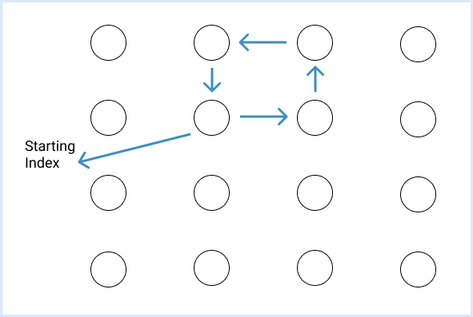

Therefore, we need to keep track of all the cells that have been visited. For this, we can use a boolean 2D array and mark the cells once they are visited.
Can it lead to any problem?
Hence, we have to use backtracking
Do: Visit a cell and mark visited
Move one unit in all four directions & recurse
Note: Keep a check on the boundary conditions while recursing in different directions
Undo: Unmark the cell once the recursion call is complete

N-Queens
Place ‘N’ Queens on an NxN chessboard such that no queen attacks other queens.

Approach:

For N=1 

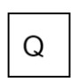

For N=2, Not possible

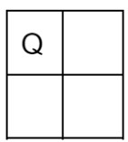

For N=3, Not possible 

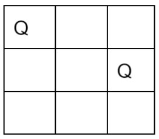

For N=4, 2 possibilities 

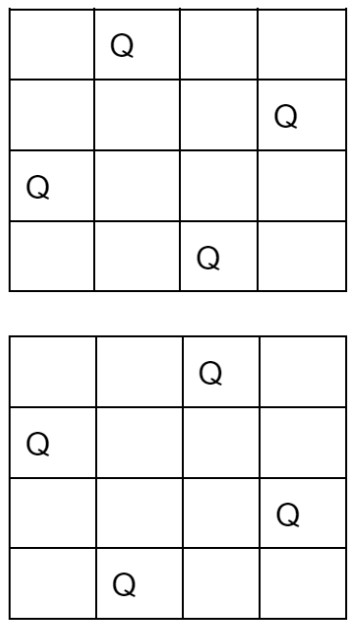

We can use recursion and backtracking to place the queens row-wise in such a way that they do not attack each other. If there are no possible configurations then we should return 0 otherwise add them in the count.
We can return the configuration of the queens by storing it in a 2D vector.
Do: Place a queen in a cell of a row
Recurse: Make a recursion call for that placement of the queen
Undo: Remove the queen from that cell
During recursion, there are multiple states where exploring each node can be a waste of time as the queen placement may not be appropriate in the beginning only. Therefore we can prune off these unnecessary states by using an isSafe method.
bool isSafe(int i, int j){
intx = i-1;
while(x>=0){   //check in same column
if(arr[x][j]==1){
return false;
}
x--;
x = i-1;
nt y = j-1;

while(x>=0 and y>=0){ //check in principal diagonal
if(arr[x][y]==1){
return false;
}
x--; y--;
}
x = i-1;
y = j+1;
while(x>=0 and y<n){  //check in secondary diagonal
if(arr[x][j]==1){
return;
}
x--; y++;
}
return true;
}

Sudoku Solver
Sudoku Solver:-

You have given a board(matrix) of 9 * 9. some cells are filled and some cells are empty. You need to fill those empty cells in such a way that every row and column should contain all the numbers from 1 to 9, any row or column should not contain duplicate values and the 3 * 3 submatrices should also contain  all the numbers from 1 to 9 and no duplicate value should be present.

Eg.

Given the sudoku board.

 
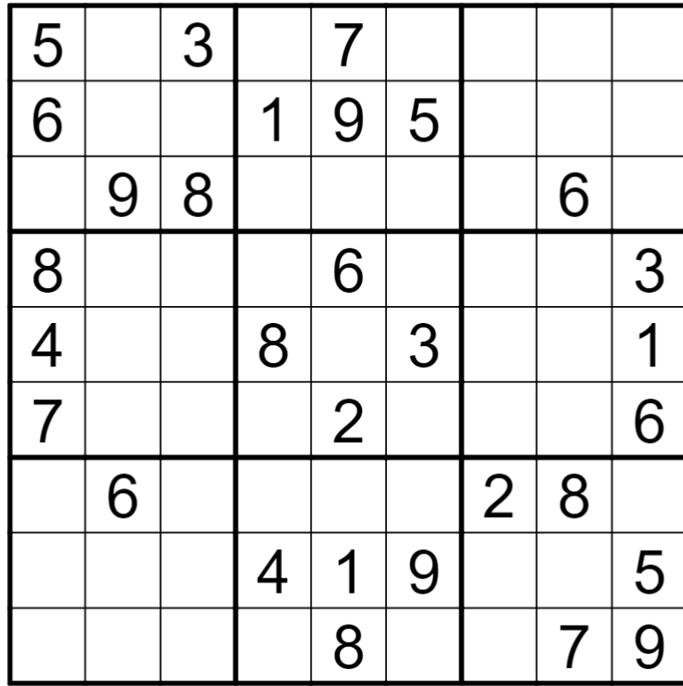

One of the solutions is shown below.

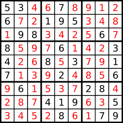

Approach:-

We can solve this problem by using a backtracking algorithm, where we will try to put every value from 1 to 9 and while putting the values, check the condition that our sudoku board is valid or not. By doing this, we are removing the useless choices. At any point, if there is no possible solution from that point, we'll backtrack from the process and try to put some other values. If we are able to fill all the empty cells without violating the rules of the sudoku board, our sudoku board is solved, and we return that grid.

Algorithm:-

Start from (0,0) cells, and check if it is not empty move to (0,1) else try to put values from 1 to 9 by which our sudoku board is valid and move to the next cell. Do it recursively.

Take care of the next cell. When we will be at the last column of any row, then move to the next row cell.

At any point, if we are not able to put any values at that cell, then backtrack the process.

The base case is when we reach the 9th row, our board would be completely filled, then return that board.

Check conditions while putting values on the board:-

Check in the same row whether the same value is present or not. If present, return false.

Check in the same column whether the same value is present or not. If present, return false.

Check in the 3 * 3 submatrix, in which this row and column belong. If the row is i and the column is j, then starting cell of the submatrix will be [ (i /3 ) * 3, (j / 3) * 3 ].  If present, return false.

If all the above conditions are true, return true at last.

In the check condition function, we are iterating the row and column of the board and submatrix for checking the condition, can we do it in a better way?

Yes, we can do this by taking three matrices. First will store whether a particular value is present in a particular row or not. The second will store whether a particular value is present in a particular column or not. The third will store whether the particular value is present in a particular submatrix or not:

rowf

columnf

matrixf

Pseudo code:-

void solveSudoku (board) {

bool ansFound = false;

vector <vector<int>> rowf , columnf, matrixf;

for(int i = 0; i < 9; i++){

vector<int> vec(9,0);

for(int j = 0; j < 9; j++){

if(board[i][j] != 0) vec[board[i][j]-1]++;

}

rowf.push_back(vec);

}

for(int j = 0; j < 9; j++){

vector<int>vec(9,0);

for(int i = 0; i < 9; i++){

if(board[i][j] != 0) vec[board[i][j]-1]++;

}

columnf.push_back(vec);

}

for(int i = 0; i < 9; i+=3){

for(int j = 0; j < 9; j+=3){

vector<int>vec(9,0);

for(int i1 = i; i1 < i + 3; i1++) {

for(int j1 = j; j1 < j + 3; j1++) {

if(board[i1][j1] != 0) vec[board[i1][j1]-1]++;

}

}

matrixf.push_back(vec);

}

}

vector<vector<int>>ans;

SS(board, 0, 0, ansFound, rowf, columnf, matrixf, ans);

board  = ans;  // copy the final answer to the board

}

void SS(board, i, j, ansFound, rowf, columnf, matrixf, ans){

if(ansFound){

return;

}

if(i == 9) {

ansFound = true;

ans = board;

return;

}

if(board[i][j] != 0) {

if(j < 8) SS(board, i, j + 1, ansFound, rowf , columnf , matrixf, ans);

// next cell of same row

else SS(board, i+1, 0, ansFound, rowf, columnf, matrixf, ans);

// first cell of next row

}

int matrixNumber = getSubmatrixNum(i,j);

// first submatrix is 0 , second is 1 , third is 2 and so on till the board .

for(int val = 1 to 9) {

if(rowf[i][val-1] == 0 and columnf[j][val-1] == 0 and matrixf[matrixNumber][val-1] == 0)

{

board[i][j] = val;

rowf[i][val-1] = 1;

columnf[j][val-1] = 1;

matrixf[matrixNumber][val - 1] = 1;

if(j < 8) SS(board, i , j + 1, ansfound  , rowf , colf , matrixf, ans);

// next cell of same row

else SS(board , i + 1 , 0 , ansfound , rowf , colf , matrixf , ans);

// first cell of next row

board[i][j] = 0;

rowf[i][val-1] = 0;

columnf[j][val-1] = 0;

matrixf[matrixNumber][val - 1] = 0;

}

}

}

Assignments:
https://leetcode.com/problems/verbal-arithmetic-puzzle/description/
https://onlinejudge.org/index.php?option=com_onlinejudge&Itemid=8&page=show_problem&problem=2026
https://leetcode.com/problems/sudoku-solver/description/
https://leetcode.com/problems/n-queens-ii/description/
https://leetcode.com/problems/n-queens/description/
https://www.geeksforgeeks.org/problems/word-boggle4143/1
https://leetcode.com/problems/word-search/description/
https://www.geeksforgeeks.org/problems/rat-maze-with-multiple-jumps3852/1
 

 

 