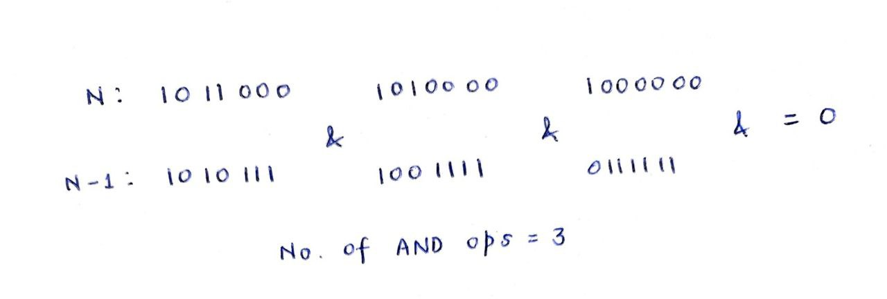
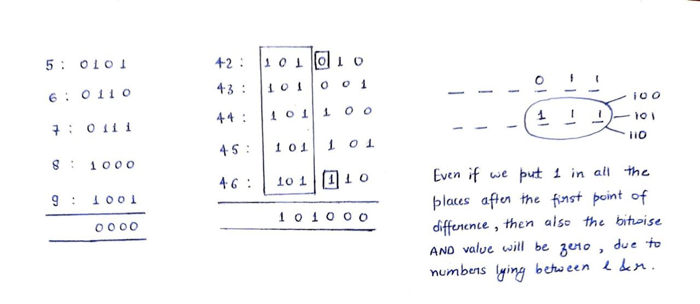
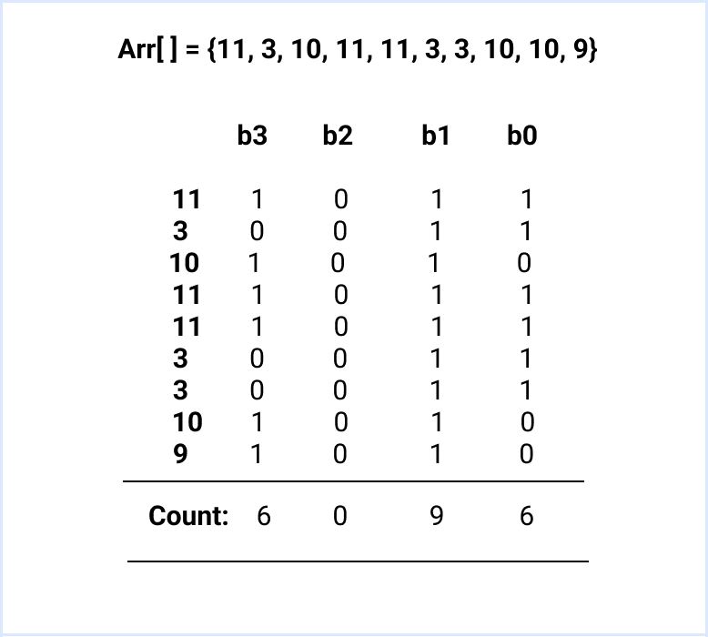
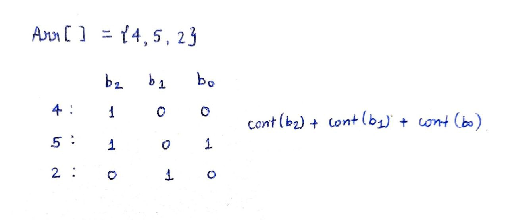
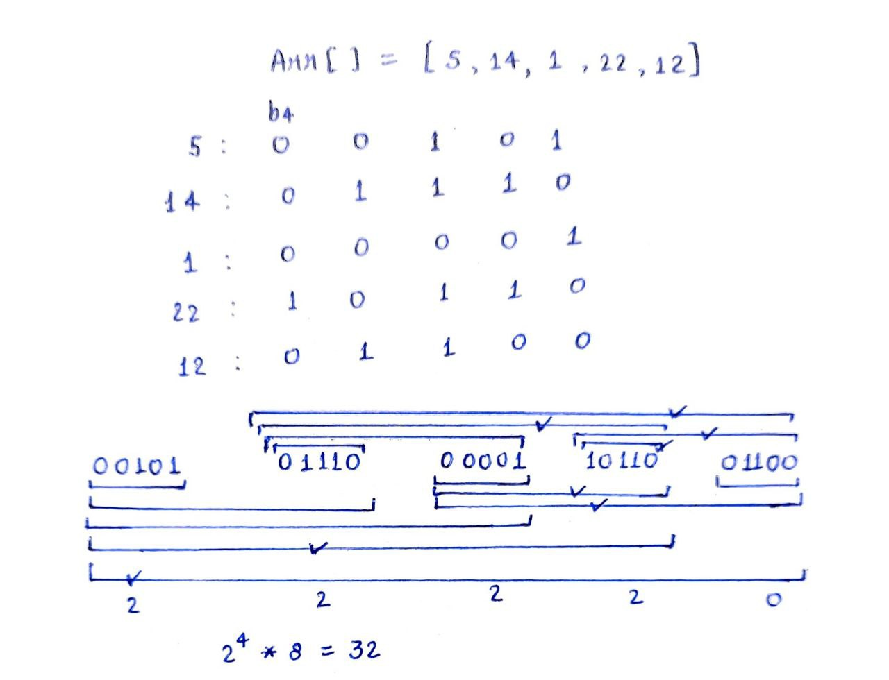

Bitwise Operators-1
A computer understands and stores information only in the form of Bits. Therefore, we have operators that allow us to work on the level of bits, called as Bitwise operators.

Bitwise AND (&) - This operator takes two numbers as operands and does AND for corresponding bits of the two numbers.

Eg. 5 & 3 = (101)2 & (011)2 = (001)2 = 1

b1 & b2 = 1, if b1=b2=1
= 0, otherwise

Bitwise AND of any number x with 0 is 0 itself
x & 0 = 0
Bitwise OR (|) - This operator takes two numbers as operands and does OR for corresponding bits of the two numbers.

Eg.  5 | 3 = (101)2 | (011)2 = (111)2 = 7

b1 | b2 = 1, if b1=1 or b2=1
= 0, otherwise

Bitwise OR of any bit with 1 is 1
b1 | 1 = 1
Bitwise XOR (^) - This operator takes two numbers as operands and does XOR for corresponding bits of the two numbers.

b1 ^ b2 = 1, if b1≠b2
= 0, otherwise

Bitwise XOR of a number with itself is equal to zero.
x ^ x = 0
Bitwise XOR of a number with zero is the number itself.
0 ^ x = x
Note: All the above bitwise operators follow the rule of Associativity.

Bitwise Operators-2
Left Shift (<<) - This operator takes two numbers and left shifts the bits of the first operand by ‘x’ places, where ‘x’ is the second operand.

Eg. (5<<2) = 20

For left shift, (num<<x) => num = num*(2^k)

Integer Overflow - Ensure that there is no integer overflow while using the bitwise left shift operator.

Eg. int x = (1<<31), it can lead to integer overflow (2^31 is out of integer range)

long int x = (1<<31), it will lead to integer overflow, since the RHS value is still an integer.

long int x = (1L<<31), it will work fine.

Right Shift (>>) - This operator takes two numbers and right shifts the bits of the first operand by ‘x’ places where ‘x’ is decided by the second operand.

Eg. (10>>2) = 2

In right shift, (num>>x) => num = num/2k

Note:

Bitwise operators are faster as compared to other operators as they work on a bit level, and hence, they are closer to the system.
Bitwise operators have lower precedence order, therefore enclose them with parentheses, so that the expressions give rightful results.
Eg. int x = 2 + 3<<1;   o/p = 10       
int x = 2 + (3<<1);  o/p = 8
Using Bitwise Operators
In this lecture, we will learn how to use bitwise operators for some trivial tasks.

How to check if a number is Odd or Even:
Since we know that all the powers of 2 (except 2^0) is even. Thus all the odd numbers will have 1 (2^0) as their least significant bit.

if(x&1){
cout<<”odd”;
}
else{
cout<<”even”;
}

How to check if the i-th bit of a number is 1/0, set/unset or ON/OFF:
Since, (1&x) = x, therefore, we can find a mask to check the i-th bit.
Eg. num = 1 0 1 1 0 0 1
& mask = 0 0 0 0 1 0 0
—--------------------------------
= 0 0 0 0 0 0 0
Therefore, the 3rd bit here is 0.
Where mask = (1<<i)

Is NUM a power of 2:
If we carefully observe the powers of 2:
1 = 1                 |  0 = 0
2 = 10              |  1 = 01
4 = 100           |  3 = 011
8 = 1000         |  7 = 0111
16 = 10000     |  15 = 01111

Here, (N & (N-1)) = 0, which is true for all the powers of 2. Thus we can check the value of bitwise AND of N and N-1. If it is zero, then N is a power of 2.

Note: We may have N<0, in such cases it is important to have a check on N.  
Count of set bits
Find the number of set bits in a given integer N.

Input: N = 14

Output: 3      (14 = (100101)2)

Approach:

We can use a mask for every bit and respectively calculate the number of set and unset bits.
Time complexity: O(|32|)
Space complexity: O(1)
Note: Avoid the cases of integer overflow while creating the mask.

If you observe the bitwise AND operation between N & N-1, then in every such operation we lose a 1 from the binary representation of N. Thus, we can carry out multiple such operations until N becomes zero.
Eventually, the number of bitwise AND operations will be the answer.  

Time complexity: O(num_of_bits)
Space complexity: O(1) 

Cumulative Bitwise AND
We have been given two integers l and r. Find the bitwise AND of all the numbers from left to right.

Input: l=8, r=11

Output: 8

Approach:

Brute Force - Calculate the bitwise AND of all the elements between l & r one by one.
Time complexity: O(r-l)

Think at the level of bits and try to observe some pattern.
Since we know that l<r, therefore the bit at bit position bi (from left) in r will be greater than or equal to that in l. After the first point of difference in the bit position of l and r, the bits in the resultant answer will automatically become zero. See the examples below.

You can validate it with the help of a few more examples. For implementing it, we can create a mask to find the first point of difference and consequently the final answer.
Time complexity: O(|32|)

Detecting odd one out
We have been given an integer array Arr[N] containing elements appearing for even number of times, except one such element. Find that element.

Input: Arr[ ] = {4, 11, 4, 7, 9, 7, 11}

Output: 9

Approach:

We can sort the elements and check which element is appearing once by traversing the array linearly.
Time complexity: O(NlogN)

Bit Manipulation - Since we know that x^x = 0, therefore we can take the XOR of all the array elements and the final answer will be the required element which is appearing once.
Time complexity: O(N)
Q. We have been given an integer array Arr[N] where every number comes thrice and one element appears once. Find that element.

Approach:

We can sort the elements and check which element is appearing once by traversing the array linearly.

Think at the level of bits and try to observe some pattern.
Let’s take an example of an array containing only the elements that are appearing thrice.
Arr[ ] = {11, 3, 10, 11, 11, 3, 3, 10, 10}

As you can see the count of the set bits of all the array elements is a multiple of 3. But, if we include an element that is appearing only once, then the count will get disturbed.

Hence, we can find the bit positions whose total count for set bits is not a multiple of 3, signifying the set bits for our answer variable.
Time complexity: O(N)

Hamming Distances
Hamming Distance is computed between two integers a and b. It is the total number of corresponding bits that are different in the binary representation of a and b.

For a = 4, b=17
Hamming Distance (4, 17) = 3

Q. We have been given an integer array Arr[N] containing non-negative numbers. Find the sum of hamming distances between all pairs.

Input: Arr[3] = {4, 5, 2}

Output: 6     HD(4, 5) + HD(4, 2) + HD(5, 2) = 6

Approach:

We can find all the pairs and use bitmask to check and compare the bits to calculate the Hamming distance.
Time complexity: O(N^2)

Reverse Lookup - Instead of finding the contribution of pairs, how about finding the contribution of a particular bit position?
Eg. Arr[ ] = {4, 5, 2}

We can find the number of set and unset bits for all different bit positions and use the Rule of Product to find the sum of all the hamming distances.
Time complexity: O(|32|)

Bitwise OR of subarrays
We have been given an integer array Arr[N]. Find the bitwise OR of all its subarrays.

Input: Arr[3] = {2, 1, 4}

Output: 22

Explanation: Subarray -
[2] = 2

[2, 1] = 2|1 = 3

[2, 1, 4] = 2|1|4 = 7

[1] = 1

[1, 4] = 5

[4] = 4

Sum = 2+3+7+1+5+4 = 22

Approach:

Brute Force - Create nested “for” loops to find all the subarrays and their respective bitwise OR values.
Time complexity: O(N^2)
Reverse Lookup: We can look at the level of bits and calculate the contribution due to a particular bit position bi. In the below example, we have taken the contribution at the level of b4.

We create initialise a variable next=N containing the index of the element with set bit at bit position bi.
We can then iterate from the end of the array and change the value of “next” as the nearest such element.
Total number of subarrays starting from index ‘j’ and containing set bit at position bi = N-j.
Total contribution of bi = 2i*(sum of subarrays containing set bit at bit position bi)

Time complexity: O(N)

Finding Minimum XOR
We have been given an integer array Arr[N]. Find the minimum value of Arr[i]^Arr[j], i≠j.

Approach:

Brute Force - Create a nested loop to consider all such pairs and find the minimum value of Arr[i]^Arr[j] accordingly.
Time complexity: O(N^2)
Note: Initialise the answer variable with 0, since 0^x = x

For a sorted array, the answer will always  be the XOR of adjacent pairs.
Proof: Let us consider three elements a, b, c such that a<=b<=c.
Then smallest: a = 0 1 0 0…..
b = 0 1 0 0/1…
c = 0 1 0 1…

In such a case the highlighted bit of b can be either 0 or 1. Let us investigate both the cases, one by one.
When highlighted bit = 0, then  a^b = 0, b^c = 1, a^c = 1
Similarly, when highlighted bit = 1, then a^b = 1, b^c = 0, a^c = 1

Thus, it is clear from the above example that the answer will always come from the adjacent pairs in a sorted array. The above proof can also be extended to cases with more than three elements.

Time complexity: O(NlogN)
Multiple XOR queries
We have been given an integer array Arr[N] and we have to process Q queries of the form [i, j]. For every query we have to find the XOR of elements from index i to j.

Approach:

Brute Force - Scan the array linearly to calculate the XOR for each query individually.
Time complexity: O(N*IQ)

Precomputation/Calculating prefix XOR- Since we know that:
x^x = 0
0^x = x

Therefore, we can calculate Prefix XOR till index i, then we can easily answer the XOR for any query within O(1) time = PXOR[j]-PXOR[i-1] (where i>0)
Time complexity: O(N+Q)
Pair with given XOR
We have been given an integer array Arr[N] and an integer k. We have to check if there is a pair (Arr[i], Arr[j]) such that Arr[i]^Arr[j]=k.

Input: Arr[5] = {7, 10, 3, 5, 9}, k=15

Output: True

Approach:

Brute Force - We can create two nested loops to individually check the XOR of all the pairs and see if such a pair exists or not.
Time complexity: O(N^2)

If we take XOR of both LHS and RHS then we get, Arr[j] = Arr[i]^k.
Therefore, We can fix one of the elements and search for the other one in the array. To make the process more efficient, we can sort the array and use binary search.
Time complexity: O(NlogN)
Find Two Elements
We have been given an integer array Arr[N] where every element comes twice except two elements which come only once. Find the two elements n1 & n2.

Input: Arr[8] = {4, 7, 9, 7, 5, 4, 3, 3}
Output:  9, 5

Approach:

We can sort and linearly traverse the array to find the elements that are appearing only once.
Time complexity: O(NlogN)

What will happen if we take XOR of all the elements?

For the given input example, it will be 0^5^9 = 10  (1100)2

Now if we closely analyse, the output then we can certainly say that the bits at b3 and b2 are different in n1 and n2.
WIth the help of this fact, we can use categorisation, that is by categorising the elements with set and unset bits and then take their XOR separately. Now, since we know n1 & n2 have different bits for that bit position, therefore they will be in different categories.

Category 1: n1^x^x^y^y^z^z = n1
Category 2: n2^p^p = n2

Time complexity: O(N) 
