Basics of Recursion
A process in which a function keeps calling itself is known as recursion and the corresponding function is called a recursive function. There are two important components to write a recursive function -

Recurrence relation
Termination condition
Eg. To find the factorial of a number N

Recurrence relation: N!=(N-1)*N

Termination condition: 0!=1

Single Branch Recursion
In Single branch recursion, a function calls itself only once inside its body leading to a single branch recursion tree. Recursion is internally implemented in the form of a stack where each function is treated as a member which is pushed into the stack.

int fact(int N){
if(N==0)return 1;
return N=fact(N-1);
}

main( ){
fact(5);
}

The control flow for the above code will be:

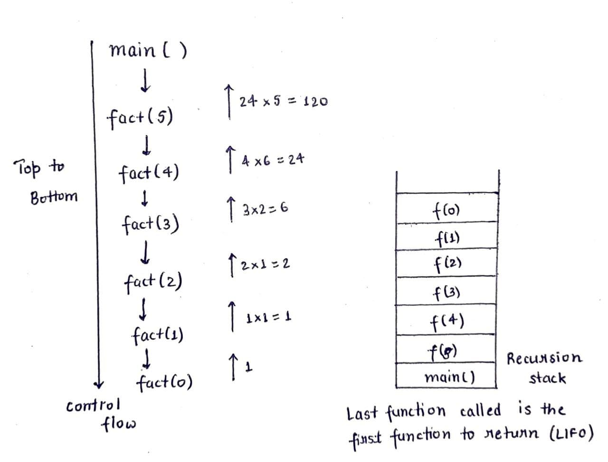

Recursion Tree Diagram
A recursion tree diagram helps to understand the control flow of a code. And in this lecture, we will learn how to make a multi-branch recursion tree diagram with the help of a sample recursive code.

void f(int x){
Print x;
if(x>=3) return;
f(x+1);
f(x+2);
}

int main( ){
f(0);
}

O/P = 012343234 

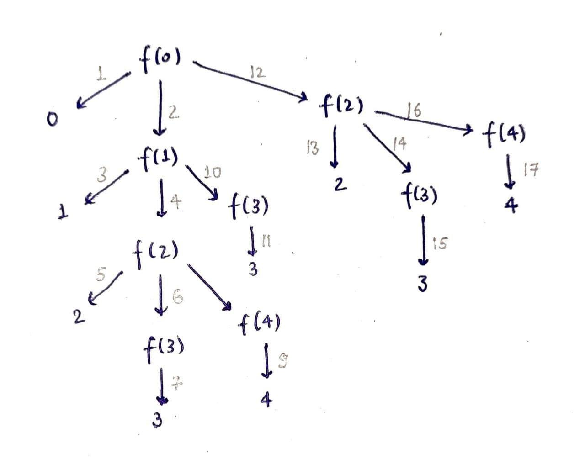

Recursion Stack Diagram
A recursion stack diagram, in parallel to the recursion tree diagram, helps us to understand the order of execution of different function calls. The space complexity of a recursive code is equal to the maximum height of the recursion tree diagram.

void f(int x){
Print x;
if(x>=3) return;
f(x+1);
f(x+2);
}

int main( ){
f(0);
}

O/P = 012343234

Pass by Reference
There are two ways to pass a variable to a function - Pass by value and Pass by reference.

In pass by reference, the function directly passes the address of the variable as an argument such that whatever changes are made in the function are reflected back onto the variable.

While in Pass by value, the function passes a copy of the variable. Hence, the changes are not reflected back onto the original variable.

Pass by value:

void func2(int y){
y++;
cout<<y;
return;
}

void func( ){
int x = 5;
func2(x);
cout<<x;
}

O/P: 65

Pass by reference:

void func2(int& y){
y++;
cout<<y;
return;
}

void func( ){
int x = 5;
func2(x);
cout<<x;
}

O/P: 66

Print from 1 to N
In this lecture, we will learn how to print the natural numbers from 1 to N with the help of recursion.

Step 1: Think of function definition - specify the function name, arguments and return type
Step 2: Termination condition, otherwise, stack overflow may occur
Step 3: Find a Recurrence relation
Step 4: Make the First call to the function

void print(int N){
if(N==0) return;
print(N-1);
cout<<N<<endl;
}

int main(){
print(5);
return 0;
}

Distinct Paths - 1
We have been given a 2D matrix of dimension M x N. We have to find the total number of distinct paths to reach from (0,0) to (M-1, N-1) under the constrained movement of one unit rightwards or downwards each time.

Approach: Top to Bottom

Recurrence Relation: If we know the number of unique paths from (1,0) & (0,1) to (M-1, N-1) individually. Then the total number of distinct paths from (0,0) to (M-1, N-1) will be:
CountPaths(0,0) = CountPaths(0,1) + CountPaths(1,0)

Thus we can form a recursive relation as:
CountPaths(i, j) = CountPaths(i, j+1) + CountPaths(i+1, j)
Termination Condition: Since we know that i<M and j<N and for i==M-1 or j==N-1 there is only one path to reach the destination. Therefore, the termination condition can be written as:
if(i==M-1 or j==N-1) return 1;
Recursion Tree:

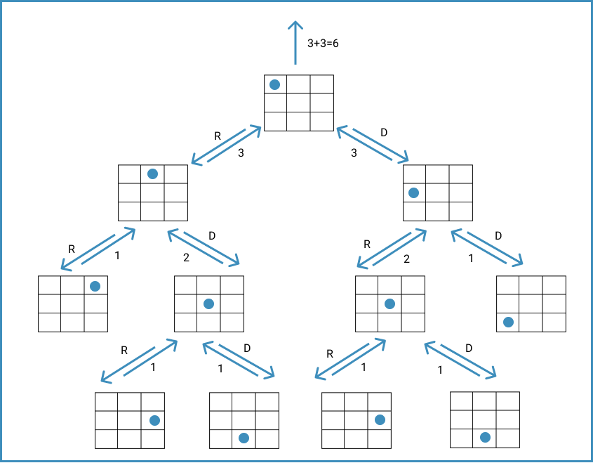

Time complexity: O(2^(M+N))
Space complexity: O(M+N) 

Distinct Paths: Alternate Implementation
In this previous problem on “Distinct Paths” we used a Top to Bottom approach. However, in this lecture, we will learn how we can solve the same problem using a Bottom to Top approach.

Approach: Bottom to Top

Recurrence Relation: Since we know that the number of distinct paths to reach (M-1, N-1) is equal to the sum of the number of distinct paths to reach (M-1, N-2) & (M-2, N-1).
Thus we can form a recursive relation as:
CountPaths(i, j) = CountPaths(i-1, j) + CountPaths(i, j-1)
Termination Condition: Since we know that i>=0 & j>=0 and for i==0 or j==0 there is only one path to reach that cell. Therefore, the termination condition can be written as:
if(i==0 or j==0) return 1;
Recursion Tree:
Time complexity: O(2^(M+N))
Space complexity: O(M+N)
Letter Combinations
We have been given a string containing digits from 2-9 inclusive and we have to return all possible letter combinations that the digit string could represent. The digits have been mapped to letters similar to the telephone buttons with 1 being mapped to none of the letters. 

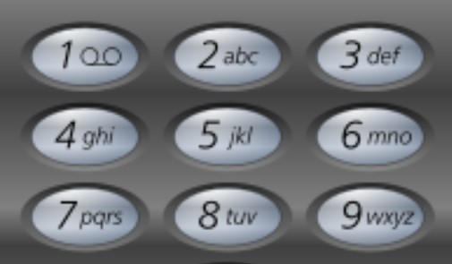

Approach:

We know that each digit points to a set of alphabets. So we can create nested loops to find all the possible letter combinations from a digit string. For eg. digit string = “23”
for(c1 ∈ [a,b,c]){
for(c2 ∈ [d,e,f]){
str = c1+c2;
print(str);
}
}
Will the above logic work for digit strings with different sizes?
In questions where we have multiple choices, we have the option to use recursion. Let us try to draw the recursion tree for the digit string = “237”

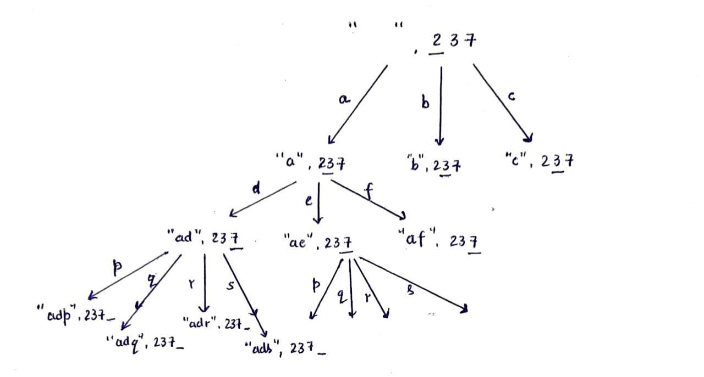

Note: We will pass the empty string by value and the digit string by reference since the former is changing in every function call while the latter remains the same.

Letter Combinations: Saving Space
In this lecture, we will analyze the solution to the previous problem of “Letter combinations” and see how we can find a space-efficient solution for it.

In the previous approach, for every function call, we were creating a new string to store the letter combinations because of which our program was space inefficient. Can you think of any alternative?

We can create a character array - char tmp[digits.length()+1] and pass it by reference. And we can take the help of overwriting to find the desired letter combinations within the same character array.

Space complexity: O(digits.length( ))

All Subsets of a set
In this lecture, we will learn how to find all the subsets of a set with the help of recursion.

A subset is a set of each of whose elements belong to an inclusive set. A set with n elements has 2n subsets.

Recursion call: subsets(i+1, tmp, size)
Termination condition: if(i==N){ print tmp; return;}
Recursion Tree: 

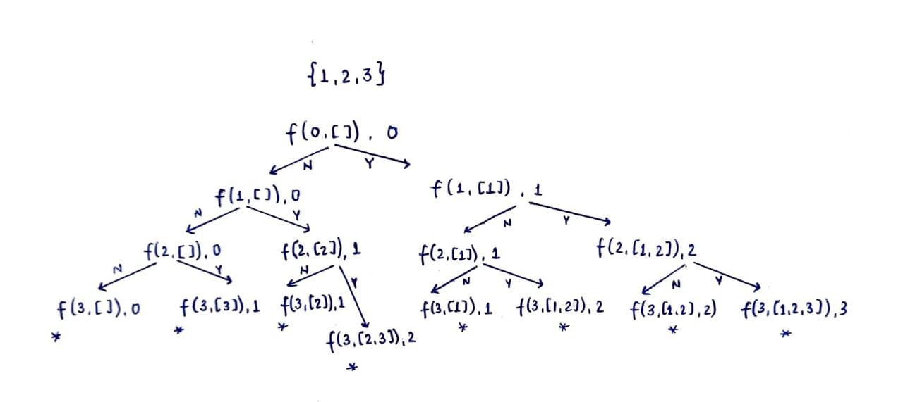

Time complexity: O(2^N)
Space complexity: O(N)

Subsets of a set with Bitmasking
Bitmasking is a technique used to select a certain number of bits from a collection of bits. In this lecture, we will learn how to find all the subsets of a set with the help of bitmasking.

A set S = {1, 2, 3} has the following subsets: 

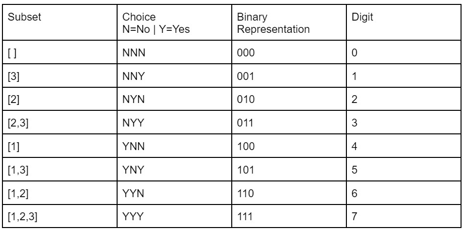

From the above table, we can clearly see how the binary representation of digits from 0 to 2^N-1 accounts for all the possible subsets of a set S with ‘N’ elements. Therefore, we can iterate over the numbers to find their binary representation and extract the 1s to print the elements of the subset.

Time complexity: O(2^N)
Space complexity: O(N)

Divide and Conquer
Divide and Conquer is an algorithmic paradigm where we divide a certain problem into several subproblems and recursively solve these subproblems. Once we get the result of the smaller subproblems, we start combining them to get the final result. Let us understand this concept with the help of a problem.

Q. Find the maximum element in Arr[N] = [7, 1, 4, 3, 2, 6, 5] through Recursion.

Approach:

We can divide the Arr[ ] into two parts from the middle and can separately find the maximum elements of the two halves. We can later compare the two maximas to find the overall maximum.
On the above logic, we can further divide the parts into two parts so that we have the smallest subproblem whose answer is already known to us.
In the given question, we can break a subarray with i=starting index and j=ending index into two halves - left(i,m) & right(m+1, j) where m=(i+j)/2. Then we can start solving the subproblems and return their maximum after every call.
Recurrence Relation: return max(findMax(i,m), findMax(m+1,j)):
Termination Condition: if(i==j) return Arr[ i ];
Since it is the only element left in the array when i becomes equal to j.
Recursion Tree:  

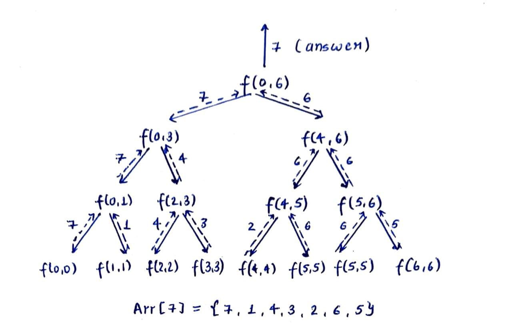

Time complexity: O(N)
Space complexity: Maximum size of call stack = O(log2N)

Fast Exponentiation
In this lecture, we will learn the fast exponentiation technique which is used to calculate large exponents of a number. Generally, it takes O(k) time to calculate N^k but with the help of the divide & conquer algorithm and recursion we can find it in O(log2k) time.

Eg. For 5^9

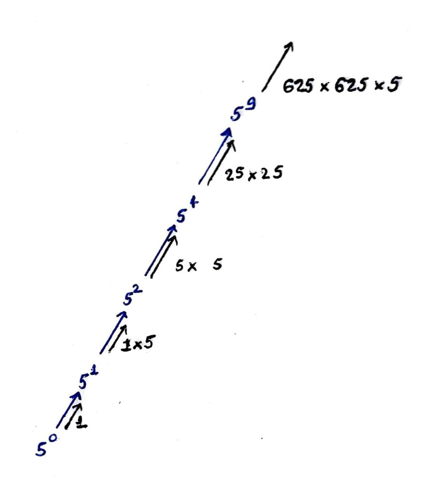

As clear from the example, we can divide the powers into two and can reduce the number of calculations to reach the final answer.

N^k = N^(k/2)*N^(k/2)  if k is even

     = N^(k/2)*N^(K/2)*N if k is odd

Time complexity: O(log2k)
Space complexity: O(log2k)

Balanced Parantheses
We have been given ‘N’ pairs of parentheses and we have to generate all the possible combinations of balanced parentheses.

Approach:

For N=3, 2*N=6
(   )                           For third position we have 1 choice i.e. ‘(‘
In  (   (                         For third position we have 2 choices i.e. ‘(‘ & ‘)’
In  (   (   (                            For fourth position we have 1 choice i.e. ‘)’
From the above example we can create the following cases:

Case I: Cnt(‘(‘) = Cnt(‘)’)
If the string is complete, do nothing
Otherwise, add a ‘(‘

Case II: Cnt(‘(‘) > Cnt(‘)’)
If Cnt(‘(‘) > N, add a ‘)’
Otherwise, add ‘(‘ and ‘)’
Recursion Tree:  

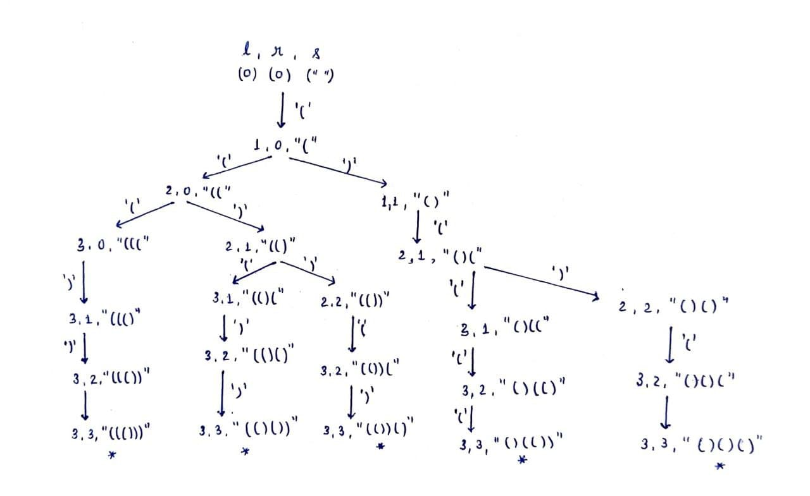
Time complexity: O(2^N)
Space complexity: O(N)

Lexicographic Subsets
The subsets of a set if arranged in ascending order are called lexicographic subsets. In this lecture, we will see how we can print the subsets of a set in lexicographic order with the help of recursion.

SS1: xyzp...

SS2: xyzq...

then SS1>SS2  if p>q

        SS1<SS2  if p<q

Input: N=3, S=[1, 2, 3]
Output: {1,2,3}: [ ], [1], [1 2], [1 2 3], [2], [2 3], [3]

Approach:

We can create a vector of vectors & store all the subsets. We can then sort them in lexicographic order.
Disadvantage: Extra space complexity & high time complexity
If the first element of a subset is shorter than the first element of another subset, then all the subsets starting with the first element will be lexicographically smaller as compared to the second element.
For S={1,2,3}
[ ] < [1..] < [2..] < [3..]

Recursion Tree:

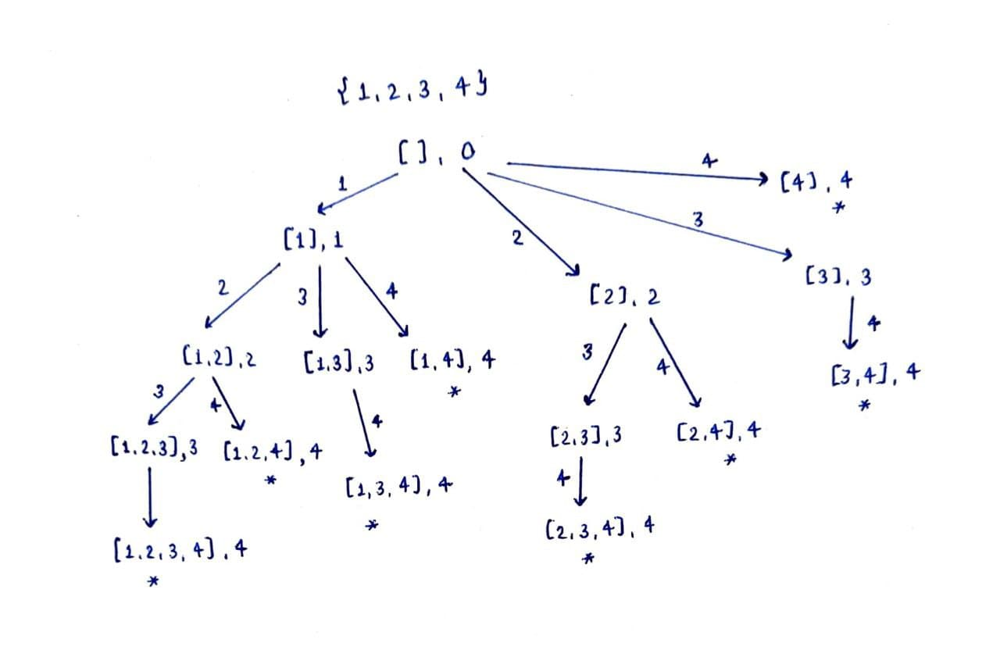

Time complexity: O(2^N)

Subset Sum-1
Here we are given an integer array containing ‘N’ distinct elements and a variable ‘SUM’. We need to find the count of distinct subsets of the array such that the sum of the subset is equal to SUM.

I/P = {1,2,3,4}, SUM = 4

O/P = 2  ∵ {3,1}, {4}

Approach:

Create all subsets of Arr[N] and check their sum.
Time complexity: O(2N)
Drawbacks: 1. High Time complexity
2. It will create many unnecessary subsets
Take sum=SUM and keep reducing it across different decision trees until sum==0 and count those decision paths.
Recurrence call: func(i+1, s-Arr[i]);
func(i+1, s)
Termination condition: if(i==N) return;
Recursion Tree: 
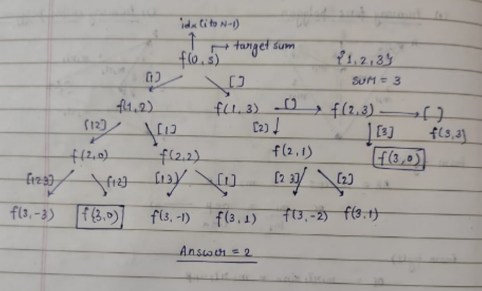
   Subset Sum-2
   In this lecture, we will discuss a comparatively harder version of the previous problem - “Subset sum”. Here, we have been given an integer array containing ‘N’ positive elements and a variable ‘SUM’. We need to find the count of distinct combinations of array elements such that the sum of the combination is equal to SUM.

I/P: Arr[2] = {1, 2}, SUM = 4
O/P: 3   ∵ [1, 1, 1, 1], [2, 2], [1, 1, 2]

Approach:

Why not negative elements?
The count will be infinite since we can select an element multiple times
Eg. [1, 2, -1], SUM = 4
Follow the approach used in the previous lecture but do not increase the index of the element for one call, i.e. select the element multiple times.

Recursion call: return func(sum-Arr[i], i) + func(sum, i+1)
Termination condition: if(sum<0 or i==N) return 0;
if(sum==0) return 1;

Recursion Tree:
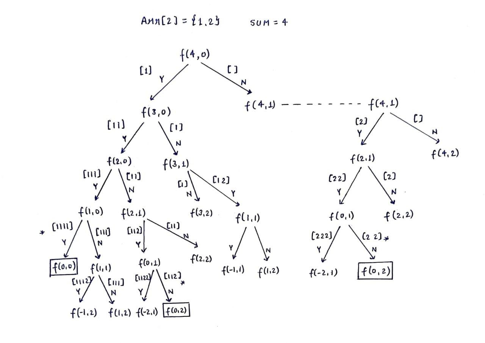

Assignments:
https://codeforces.com/problemset/problem/768/B
https://codeforces.com/contest/55/problem/B
https://leetcode.com/problems/restore-ip-addresses/description/
https://www.hackerrank.com/contests/gl-bajaj-self-evaluation-evening-batch/challenges/bracket-challenge-1/problem
https://leetcode.com/problems/generate-parentheses/description/
https://leetcode.com/problems/powx-n/description/
https://leetcode.com/problems/the-k-th-lexicographical-string-of-all-happy-strings-of-length-n/description/
https://leetcode.com/problems/sequential-digits/description/
https://www.geeksforgeeks.org/problems/subset-sums2234/1
https://leetcode.com/problems/combination-sum/description/
https://leetcode.com/problems/combination-sum-iii/description/
https://leetcode.com/problems/combinations/description/