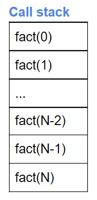

Introducing Time Complexity
The time complexity of an algorithm or a code is the number of operations it performs to complete a task with respect to the input size. It can also be described as the time taken by an algorithm to run as a function of input size regardless of the machine.

Time taken ∝ Number of operations ∝ Input size

Order of Expressions and Recurrence Relations
In this lecture, we will learn about the Order of expression and Recurrence relations. They help us in finding the time complexity of a code/algorithm.

Q. Find the Order if input size = N and no. of operations = aN^3+bN^2+cN+d, where a, b, c, d are constants.

=> O(N^3) since a, b, c, d<<N and the N^3 term dominates the other terms.

Recurrence relation - The time taken by a problem of size ‘N’ can be expressed in terms of the time taken for input size ‘n’ (N>n). This expression is known as Recurrence Relation.

i.e. TN = Tn + X

int arr[N];
int s = 0;
for(int i = 0; i<N; i++){
s+=arr[i];
}

The time taken to run the above code for input N can be expressed as -

T(N) = T(N-1) + O(1)
T(N-1) = T(N-2) + O(1)
T(N-2) = T(N-3) + O(1)
...
T(1) = T(0) + O(1)
On adding, we get
T(N) = T(0) + nO(1)     {∵T(0) = 0}
=> T(N) = nO(1)            i.e. the required recurrence relation

Interesting Code Snippets
In this lecture, we will try to find out the time complexity of some interesting code snippets by applying the concepts of Order of expression and Recurrence relation.

Note:

Time complexity is independent of the number of loops and it only depends on the number of operations.
1+2+3+...+N = N(N+1)/2 = O(N^2)
½+⅓+⅕+..+ = log(logN)
log1 + log2 + log3 +..+ logN = log(N!) = O(log(NN)) = O(NlogN)
N+N/2+N/4+...+ = 2N = O(N)
Space Complexity
Auxiliary Space complexity is the extra space required by an algorithm for a given input. It is represented by the Big-O notation.

Note: Space complexity doesn’t include the space taken by the input

Q. Find the space complexity of the following recursive code.

int fact(int N){
if(N==0) return 1;
return N*fact(N-1);
}

At first sight, the program may seem to require no extra space for execution but there is a hidden space complexity that is common in such recursive codes.

A recursive code is executed with the help of a call stack which keeps the track of all the function calls. This stack is created automatically by the memory to store these function calls.

Order of function calls: fact(N) -> fact(N-1) -> fact(N-2) -> fact(N-3) -> .... -> fact(0)

Space complexity = Maximum height of call stack = O(N) 