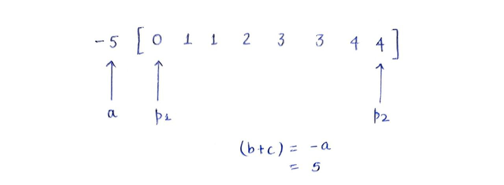
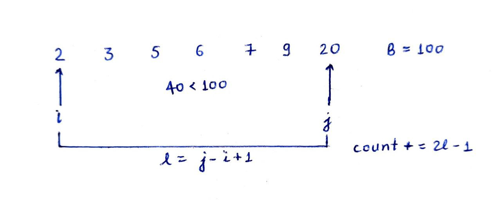
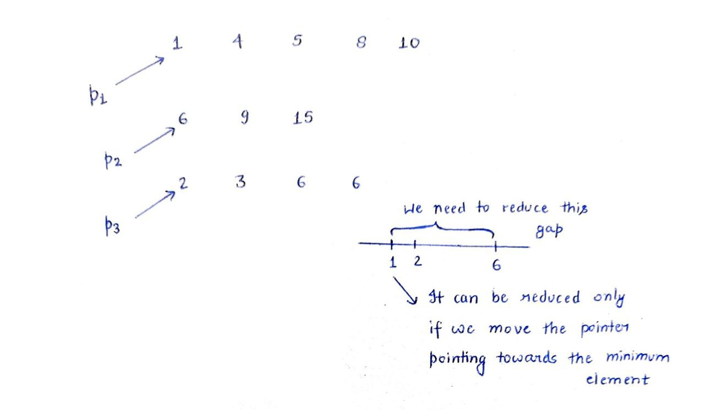
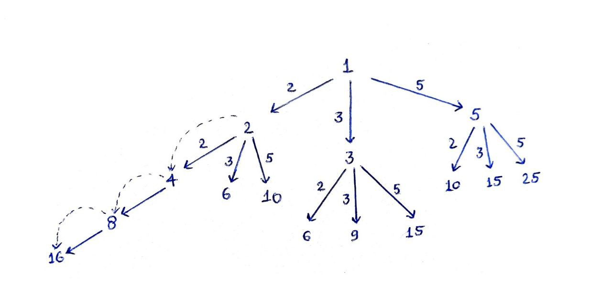
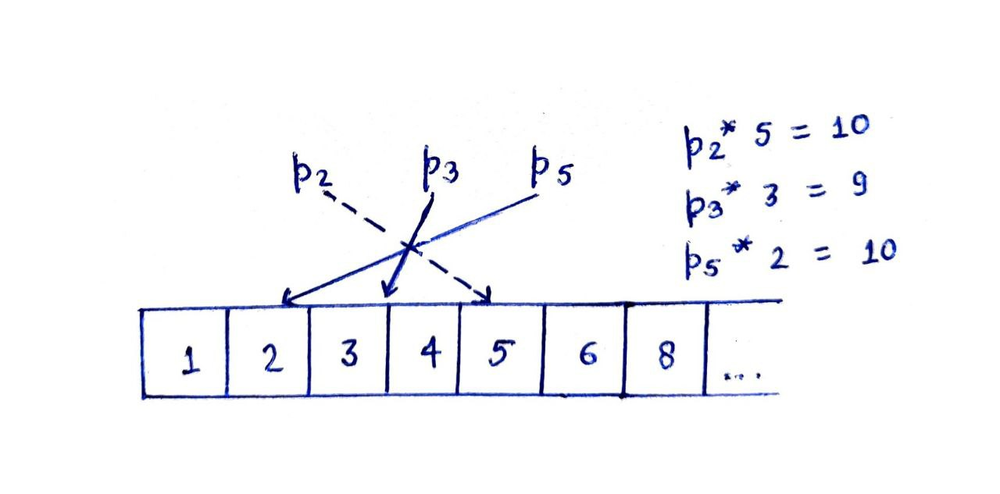

**Pair Sum-1**

We have been given a sorted integer array Arr[N] and an integer ‘SUM’. If there exists a pair (i, j) such that **Arr[i]+Arr[j]=SUM** then return true otherwise false.

Input: Arr[5] = {2, -1, 0,  3, 9}, SUM = 8

Output: True

Approach:

Brute Force - We can calculate the sum of all the possible pairs and return true if such a pair exists.

    Time complexity: O(N^2)
    Space complexity: O(1)

Binary Search - We can fix the first element – Arr[i] by iterating on the array and then apply binary search on the remaining array to find the second element - Arr[j] i.e. SUM-Arr[i].

**Time complexity: O(NlogN)
Space complexity: O(1)**

**Two Pointers -** 

We can initialize two variables - l & r, pointing to the first and the last element of the array. We can find their sum and move the pointers towards each other based on the value of Arr[i]+Arr[j] and SUM.

    If Arr[i]+Arr[j] > SUM, r--
    If Arr[i]+Arr[j] < SUM, l++
    If Arr[i]+Arr[j] = SUM, return true

    Time complexity: O(N)
    Space complexity: O(1)

Three key things that we should consider while using the Two pointer technique:

How many pointers do we need?
How do we initialize them?
How do we move them?

**Pair Sum-2**

We have been given a sorted integer array Arr[N] and we have to find the count of the total number of pairs (i, j) such that Arr[i]+Arr[j]=SUM where i≠j.

    Input: Arr[9] = {1, 41, 42, 51, 52, 53, 61, 62, 11}, SUM = 10
    Output: 7  {(41, 61), (41, 62), (42, 61), (42, 62), (51, 52), (52, 53), (51, 53)}

Approach:

Brute Force - We can check the sum of all the pairs and increment the count if they satisfy the given condition.
Time complexity: O(N^2)
Space complexity: O(1)

Binary Search - We can iterate on the array to fix the first element - Arr[i] and search the frequency of the second element - Arr[j] i.e. SUM-Arr[i] in the remaining array.
Time complexity: O(NlogN)
Space complexity: O(1)

**Two Pointers** - We can use the two pointer approach to initialise two variables - l & r,  pointing to the first and the last element of the array. We can increment the count if Arr[l] + Arr[r] = SUM.

For repeated elements, we can count their frequency and use the Product Rule to find the number of pairs.

For cases where Arr[i]=Arr[j]=SUM/2, we can find the count(k) of the element and use combinatorics(kC2) to add the total possible pairs into the count.

Time complexity: O(NlogN)
Space complexity: O(1)

**Pair Difference**

We have been given a sorted integer array Arr[N] and an integer ‘diff’. If there exists a pair (i, j) such that i≠j and Arr[i]-Arr[j]=diff then return true otherwise return false.

Input: Arr[5] = {11, 2, 7, 4, 15}, diff=2
Output: true            {(4, 2)}

Approach:

Brute Force - We can check the difference of all the possible pairs and see if it is equal to ‘diff’. We need to ensure that we do not miss situations like Arr[i]-Arr[j] = - diff i.e. where (j, i) is the desired pair.
Time complexity: O(N^2)
Space complexity: O(1)

Binary Search - Since we know that ‘diff’ can be both negative or positive therefore we should fix the first element or the second element accordingly. If diff>=0, then we can fix the second element i.e. Arr[i] = curr+diff otherwise we can fix the first element i.e. Arr[j] = curr-diff. After fixing one element we can search for the other element using binary search.

Time complexity: O(NlogN)
Space complexity: O(1)

Two Pointers - We can declare two variables - l & r, pointing to the first and the second element of the array. We can keep comparing their difference with ‘diff’ and move them according to the following conditions:
If Arr[i]-Arr[j] < diff, r++
If Arr[i]-Arr[j] > diff, l++
If Arr[i]-Arr[j] = diff, return true

Note: For Arr[i]-Arr[j]>diff, there can be a situation where l==r, in such cases we need to increment r to ensure that both the pointers do not point to the same element.

Time complexity: O(N)
Space complexity: O(1)

We can combine the above approach with the Product Rule and the law of Combinatorics to find the exact count of such pairs.
Subarray Sum
We have been given an unsorted array Arr[N], containing ‘N’ non-negative elements and an integer ‘SUM’. If there exists a subarray with sum = SUM then return true otherwise return false.

Input: Arr[5] = {5, 3, 4, 6, 2}, SUM = 15
Output: true        {3, 4, 6, 2}

Approach: Two Pointers

We can declare two pointers - i & j, representing the first and the last index of the subarray. Initially, they will point to the first index of the array.
We can calculate the sum of the subarray and move the pointers according to the sum. (All the array elements are non-negative)
If sum<SUM, j++ (expand the subarray)
If sum>SUM, i++ (shrink the subarray)
If sum=SUM, return true

Note: Ensure that i<j, there can be a case where i=j and sum>SUM. In such a case we need to check i & j before incrementing the value of i.

Time complexity: O(N)
Space complexity: O(1)
Triplet Sum
We have been given an unsorted integer array Arr[N]. Print all the unique triplets (a, b, c) such that a+b+c=0.

Input: Arr[9] = {-5, 0, 1, 1, 2, 3, 3, 4, 4]
Output: (-5, 1, 4), (-5, 2, 3)

Note: If (a1, b1, c1) and (a2, b2, c2) are two unique triplets then (a2, b2, c2) can not be a permutation of (a1, b1, c1).

Approach: Two Pointers

Since a+b+c = 0, therefore b+c = - a. Thus, we can fix one of the variables and use the Two pointer technique for the other two variables.
But to use Two pointers, we need a sorted array. Therefore, let us first sort the array and then iterate over it for ‘a’ and use two variables - p1 & p2 as pointers for ‘b’ & ‘c’.

In this way, we can easily find the triplets a, b & c such that a+b+c=0.
To ensure the uniqueness of triplets we need to skip the repeated elements at the level of a, b and c.

Time complexity: O(N^2+NlogN) ~ O(N^2)
Space complexity: O(1)

Note: While writing the code, keep a check on the array index out of bounds error.

Quadruplet Sum

Distinct Rectangles
We have been given an integer ‘B’ and a sorted array Arr[N] containing ‘N’ distinct elements. We have to find the number of rectangles (l, b) with distinct configurations that can be formed using array elements such that Area<B.

Input: Arr[3] = {2, 3, 5}. B=15

Output: 6      {(2, 2), (2, 3), (2, 5), (3, 2), (3, 3), (5, 2)

Approach:

Brute Force - We can run two nested “for” loops to find the area of all the possible rectangles and count the number of configurations satisfying the given condition.
Time complexity: O(N^2)
Space complexity: O(1)

Two Pointers - We can create two variables - i & j pointing to the first and the last element of the array. We can calculate the area of the rectangle formed by them and move the pointers according to the given condition -
If Arr[i]*Arr[j]>=B, j--
If Arr[i]*Arr[j]<B, increase the count & i++

How to increase the count?

{(2,2), (2, 3), (2, 5), (2, 6), (2, 7), (2, 9), (2, 20),(20, 2), (9, 2), (7, 2), (6, 2), (5, 2), (3, 2)}

Time complexity: O(N)
Space complexity: O(1) 

Longest Substring without repetition
We have been given a string S and we have to find the length of the longest substring containing distinct characters.

Input: S = abcdefcgkltmpq

Output: 11 (defcgkltmpq)

Approach:

Brute Force - Create two nested “for” loops to consider all the possible NC2 substrings. We can keep track of the frequency of the characters appearing in the substring and find the length of the longest substring accordingly.
Time complexity: O(N^2)
Space complexity: O(1)

Two Pointers - We can initialise two variables - i & j representing the first and the last index of the substring. We can maintain a frequency array to keep a track of frequency of characters within the substring.

How to move the pointers?

We have to move the pointers ensuring that all the characters of the substring are distinct and simultaneously updating their frequency in the freq[ ] array. We will increment ‘j’ if the current substring doesn’t contain the incoming character, otherwise we will increment ‘i’. We will continue this process until ‘j’ reaches the end of the given array.

TIme complexity: O(N)
Space complexity: O(1)
Smallest substring with all characters
We have been given two strings S and T. Return the minimum length substring of S that contains all the characters of T otherwise return an empty string if no such substring exists.

Input: S = ADOBECODEBANC
T = ABC

Output: BANC

Approach:

Brute Force - Consider all the possible NC2 substrings and compare the frequency of the characters appearing in them with those in T and return the minimum length substring.
Time complexity: O(N^2)
Space complexity: O(1)

Two Pointers - We can initialise two variables - i & j representing the first and the last index of the substring. We can maintain a frequency array freqs[ ] to calculate the frequency of the characters appearing in the current substring and compare them with those in the string T.

How to move the pointers?

Increment ‘j’ until our substring doesn’t contain all the characters (with same or greater frequency) appearing in the string T. After this, we will increment ‘i’ in such a way that our substring still contains all the desired characters of string T. We continue this process untill ‘j’ reaches the end of the array. In the meanwhile we keep tracking the answer by storing the first and last indices of the minimum length substring.

Time complexity: O(N)
Space complexity: O(1)

Note: The C++ STL contains a function called substr( ) that returns a substring of a string.
S.substr(i, len); returns a substring of length ‘len’ and starting with index ‘i’.  
Minimize the Expression
B[3] = {6, 9, 15}rted arrays A[m], B[n], C[p]. We have to minimize the value of the expression: max(a, b, c) - min(a, b, c) such that a∈A, b∈B, c∈C.

Input: A[5] = {1, 4, 5, 8, 10}

          B[3] = {6, 9, 15}

           C[4] = {2, 3, 6, 6}

Output: 1  (5, 6, 6)

Approach:

Brute Force - Create three nested “for” loops to find all the possible triplets and keep the track of the minimum possible value.
Time complexity: O(N^3)
Space complexity: O(1)

Two Pointers - We can initialise three variables, pointing to the first indices of all the three arrays A, B and C respectively. We can calculate the value of max(a,b,c)-min(a,b,c) and then move the pointers accordingly while keeping the track of the minimum value of the expression encountered.

How to move the pointers?

We will move the pointer that is pointing to the minimum value among the three to reduce the gap between max(a, b, c) and min(a, b, c). We have to continue the process until one of the pointers reaches the end of the array.

Time complexity: O(m+n+p)
Space complexity: O(1)

Note: For finding minimum value we generally initialise the answer variable to INT_MAX. But it doesn’t work when the answer variable is of long or long long data type. For them, we use LONG_MAX or LLONG_MAX.

Specific Prime Factorization
We have been given three prime numbers n1, n2, n3 and an integer N. Find the Nth natural number whose prime factorisation contains no other prime factor than n1, n2 or n3 i.e. num = (n1^i)*(n2^j)*(n3^k).

Input: n1 = 2, n2 = 3, n3 = 5, N = 7

Output: 8      (2^3.3^0.5^0)

Approach:

Brute Force - We can check the prime factorisation of all the natural numbers starting from 1 until we reach the desired number ‘num’.
Time complexity: O(num√num)
Space complexity: O(1)

If there is a number ‘num’ that satisfies the given rule, then num*n1, num*n2, num*n3 will also follow the given condition. Therefore, if we choose num=1(20. 30. 50), then we can generate all such numbers.
For eg. n1 = 2, n2 = 3, n3 = 5.

How to implement the above approach?

Recursion: After seeing the above diagram, the first thought that may have come to your mind is of using recursion. But recursion is a depth-first search type algorithm that will not work here as we may reach a number like 16 even before reaching numbers smaller than it.

Sorting: Another way is to generate all such natural numbers and sort them in an array to find the Nth such number. This method will not be the right choice as it will take too much space and time complexity.

Two Pointers: Since we know that the numbers are generated by multiplying with n1, n2 and n3. Therefore we can initialise three variables - p1, p2 and p3 pointing to the number whose ni multiplier is still not added to the list.

How to move the pointers?
We can compare the product of n1, n2 and n3 with the elements pointed by  p1, p2 and p3 and move the pointer(s) whose product is the smallest. We can move multiple pointers to avoid duplications in case they are yielding the same product.

Time complexity: O(N)
Space complexity: O(N)

Assignments:

https://leetcode.com/problems/ugly-number-ii/
https://www.geeksforgeeks.org/minimize-maxai-bj-ck-minai-bj-ck-three-different-sorted-arrays/
https://codeforces.com/contest/958/problem/F2
https://codeforces.com/contest/252/problem/C
https://leetcode.com/problems/subarrays-with-k-different-integers/description/
https://www.geeksforgeeks.org/problems/equivalent-sub-arrays3731/1?difficulty%5B%5D=1&page=1&category%5B%5D=two-pointer-algorithm&query=difficulty%5B%5D1difficulty%5B%5D2page1category%5B%5Dtwo-pointer-algorithm
https://leetcode.com/problems/count-number-of-nice-subarrays/description/
https://leetcode.com/problems/max-consecutive-ones-iii/description/
https://leetcode.com/problems/minimum-window-substring/description/
https://leetcode.com/problems/longest-substring-without-repeating-characters/description/
https://leetcode.com/problems/boats-to-save-people/description/
https://leetcode.com/problems/container-with-most-water/description/
https://leetcode.com/problems/3sum-closest/description/
https://leetcode.com/problems/4sum/description/
https://leetcode.com/problems/3sum/description/
https://leetcode.com/problems/remove-duplicates-from-sorted-array-ii/description/
https://leetcode.com/problems/remove-duplicates-from-sorted-array/description/
https://leetcode.com/problems/remove-element/description/
https://leetcode.com/problems/intersection-of-two-arrays/description/

