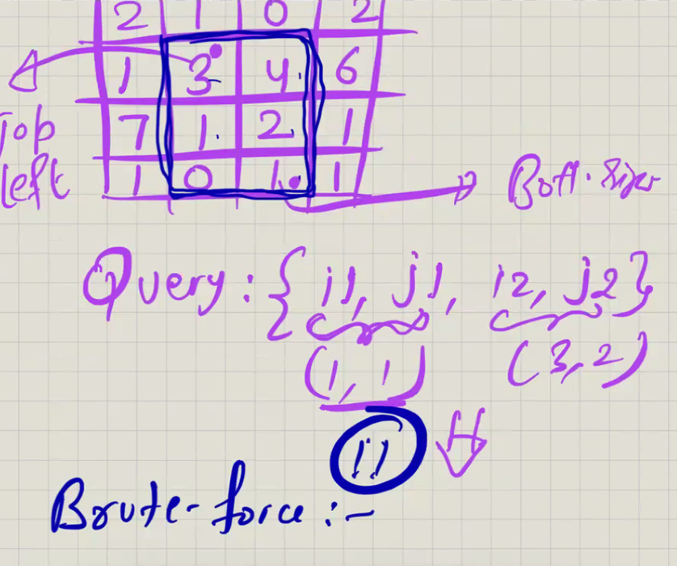
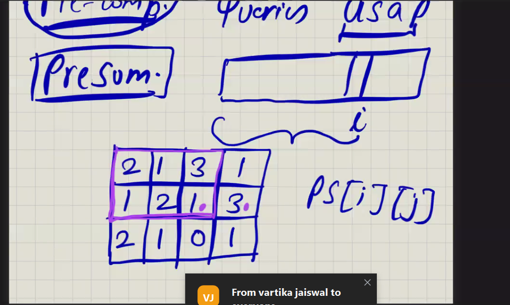
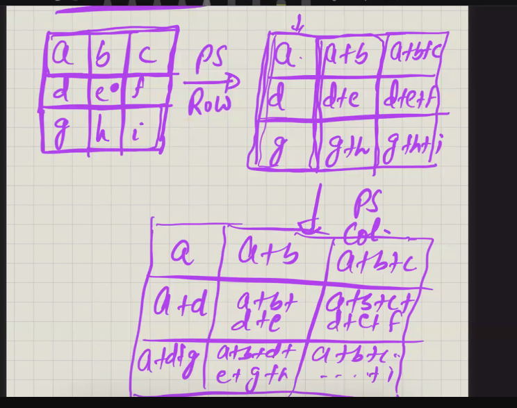
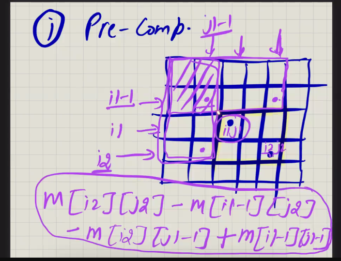
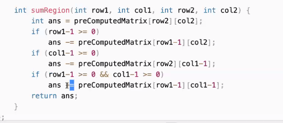
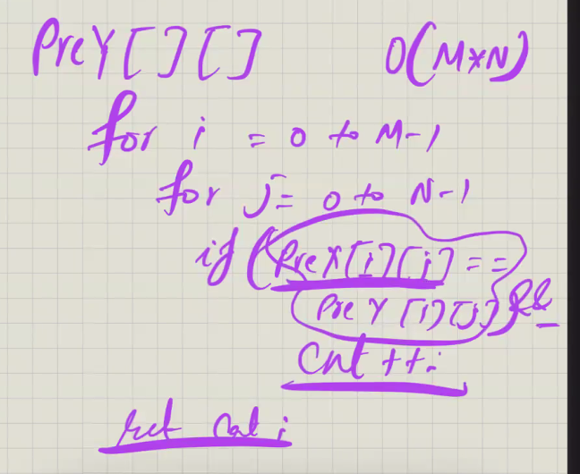
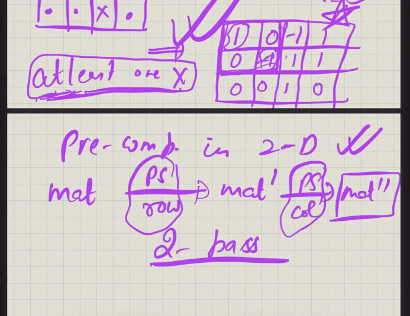
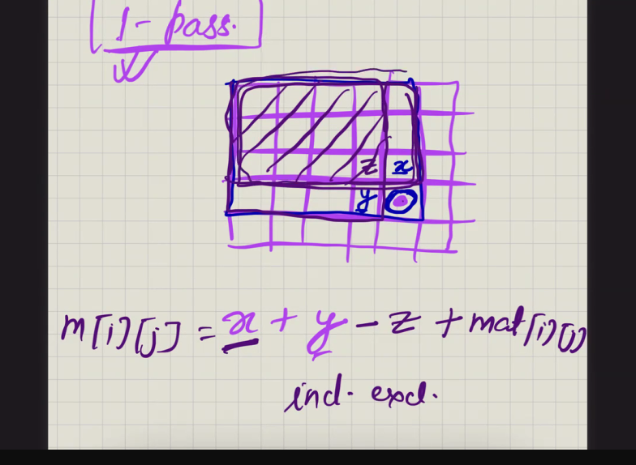
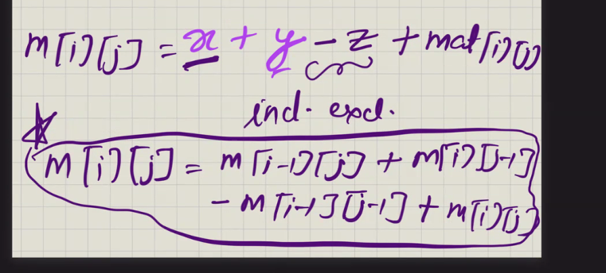

TC= o(N^2)

    for (r i1 to i2) {
     for (c = j1 to j2) {
      sum += mat[r][c]
    
    return sum;

`psa[i][j] = psa[i-1][j] + psa[i][j-1] - psa[i-1][j-1] + a[i][j]`

Prefix sum of row in one round and and prefix sum of col in other round

below formula gives submatrix sum =

o(m * n + Q) 

https://leetcode.com/problems/range-sum-query-2d-immutable/
https://leetcode.com/problems/count-submatrices-with-equal-frequency-of-x-and-y/description/?envType=problem-list-v2&envId=prefix-sum

    for(int i=1; i<=n; i++){
    for(int j=1; j<=m; j++){
    prefixSum[i][j] = matrix[i-1][j-1] + prefixSum[i-1][j] + prefixSum[i][j-1] - prefixSum[i-1][j-1];
    }
    }

