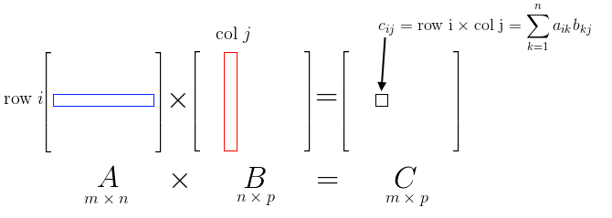
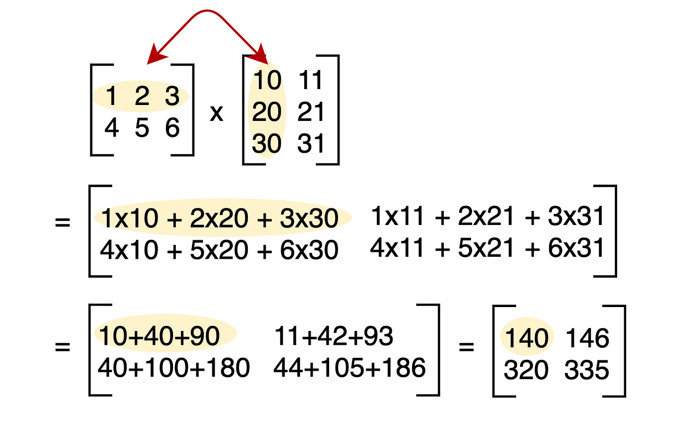

Scanning Data in 2D Arrays
To scan and print elements in a 2-D array,  we can use nested loops. Here's how you can do it:

#include <stdio.h>

int main() {

    int rows, columns;

 

    printf("Enter the number of rows: ");

    scanf("%d", &rows);

    printf("Enter the number of columns: ");

    scanf("%d", &columns);

 

    int matrix[rows][columns];

 

    // Scanning elements

    printf("Enter the elements of the matrix:\n");

    for (int i = 0; i < rows; i++) {

        for (int j = 0; j < columns; j++) {

            scanf("%d", &matrix[i][j]);

        }

    }

 

    // Printing elements

    printf("Elements of the matrix:\n");

    for (int i = 0; i < rows; i++) {

        for (int j = 0; j < columns; j++) {

            printf("%d ", matrix[i][j]);

        }

        printf("\n");

    }

    return 0;

}

Output:

Enter the number of rows: 2

Enter the number of columns: 3

Enter the elements of the matrix:

1 2 3

4 5 6

Elements of the matrix:

1 2 3

4 5 6

Adding two Matrices
Matrices can be added together if they have the same dimensions, meaning they have the same number of rows and columns.

To add two matrices together, you simply add corresponding elements from each matrix and store the result in the corresponding position of the result matrix.

For example, let's say we have two matrices:

Matrix A:

1 2 3

4 5 6

Matrix B:

7 8 9

2 3 4

To add these matrices, you would add the corresponding elements:

Result Matrix C:

1+7   2+8   3+9

4+2   5+3   6+4

Resulting in:

8 10 12

6 8 10

Program to add two matrices of dimensions m×n:

#include <stdio.h>

int main() {

int m, n;

printf("Enter the number of rows and columns for the matrices: ");

scanf("%d %d", &m, &n);

int matrix1[m][n], matrix2[m][n], result[m][n];

printf("Enter elements of first matrix:\n");

for (int i = 0; i < m; i++) {

       for (int j = 0; j < n; j++) {

scanf("%d", &matrix1[i][j]);

       }

}

printf("Enter elements of second matrix:\n");

for (int i = 0; i < m; i++) {

      for (int j = 0; j < n; j++) {

          scanf("%d", &matrix2[i][j]);

      }

}

// Adding matrices

for (int i = 0; i < m; i++) {

      for (int j = 0; j < n; j++) {

            result[i][j] = matrix1[i][j] + matrix2[i][j];

       }

}

// Printing the result

printf("Resultant matrix after addition:\n");

for (int i = 0; i < m; i++) {

      for (int j = 0; j < n; j++) {

           printf("%d ", result[i][j]);

       }

       printf("\n");

}

return 0;

}

Enter the number of rows and columns for the matrices: 2 3

Enter elements of first matrix:

1 2 3

4 5 6

Enter elements of second matrix:

7 8 9

2 3 4

Resultant matrix after addition:

8 10 12

6 8 10

Diagonals in Matrix
In a square matrix, there are two main diagonals: the left diagonal and the right diagonal.

Left Diagonal:

The left diagonal of a square matrix consists of elements from the top-left corner to the bottom-right corner. It is also known as the primary diagonal.

For example, in a 3x3 matrix, the left diagonal consists of elements a[0][0], a[1][1], and a[2][2]  i.e a[i][i]

Example:

1 2 3

4 5 6

7 8 9

The left diagonal consists of elements 1, 5, and 9.

Right Diagonal:

The right diagonal of a square matrix consists of elements from the top-right corner to the bottom-left corner. It is also known as the secondary diagonal. For example, in a 3x3 matrix, the right diagonal consists of elements a[0][2], a[1][1], and a[2][0] i.e i+j = n-1

Example:

1 2 3

4 5 6

7 8 9

The right diagonal consists of elements 3, 5, and 7.

Program to find the sum of left and right diagonal elements separately:

#include <stdio.h>

int main() {

int n, left_sum = 0, right_sum = 0;

printf("Enter the size of square matrix: ");

scanf("%d", &n);

int matrix[n][n];

printf("Enter the elements of the matrix:\n");

for (int i = 0; i < n; i++) {

      for (int j = 0; j < n; j++) {

          scanf("%d", &matrix[i][j]);

               if (i == j) // if on left diagonal

                  left_sum += matrix[i][j];

               if (i + j == n - 1) // if on right diagonal

                   right_sum += matrix[i][j];

       }

}

printf("Sum of left diagonal elements: %d\n", left_sum);

printf("Sum of right diagonal elements: %d\n", right_sum);

return 0;

}

The above code can also be written without iterating all the elements:

#include <stdio.h>

int main() {

int n, left_sum = 0, right_sum = 0;

printf("Enter the size of square matrix: ");

scanf("%d", &n);

int matrix[n][n];

printf("Enter the elements of the matrix:\n");

for (int i = 0; i < n; i++) {

     for (int j = 0; j < n; j++) {

        scanf("%d", &matrix[i][j]);

     }

}

// Sum of left diagonal elements

for (int i = 0; i < n; i++) {

      left_sum += matrix[i][i];

}

// Sum of right diagonal elements

for (int i = 0; i < n; i++) {

       right_sum += matrix[i][n - 1 - i];

}

printf("Sum of left diagonal elements: %d\n", left_sum);

printf("Sum of right diagonal elements: %d\n", right_sum);

return 0;

}

Lower and Upper Triangular Parts
In a square matrix, the upper triangular part consists of all the elements above the main diagonal (from top-left to bottom-right), including the diagonal itself. Similarly, the lower triangular part consists of all the elements below the main diagonal, including the diagonal.

Here's an example of a 3x3 matrix:

1 2 3

4 5 6

7 8 9

Upper Triangular Part:

1 2 3

5 6

    9

Lower Triangular Part:

1

4 5

7 8 9

Program to print the upper and lower triangular parts of a square matrix:

#include <stdio.h>

int main() {

    int matrix[3][3] = { {1, 2, 3},

                         {4, 5, 6},

                         {7, 8, 9} };

 

    printf("Upper triangular matrix:\n");

    for(int i = 0; i < 3; i++) {

        for(int j = 0; j < 3; j++) {

            if (i <= j) {

                printf("%d ", matrix[i][j]);

            } else {

                printf("  "); // Printing spaces for lower triangle elements

            }

        }

        printf("\n");

    }

 

    printf("\nLower triangular matrix:\n");

    for(int i = 0; i < 3; i++) {

        for(int j = 0; j < 3; j++) {

            if (i >= j) {

                printf("%d ", matrix[i][j]);

            } else {

                printf("  "); // Printing spaces for upper triangle elements

            }

        }

        printf("\n");

    }

    return 0;

}

For printing the upper triangular part, we iterate through each element of the matrix. If the row index (i) is less than or equal to the column index (j), then we print the element, otherwise, we print spaces.
For printing the lower triangular part, we again iterate through each element of the matrix. If the row index (i) is greater than or equal to the column index (j), then we print the element.
Initialising a 2D Array with values
You can initialize the array directly at the point of declaration. This method is straightforward and concise.

int matrix[3][3] = { {1, 2, 3},

                                {4, 5, 6},

                                {7, 8, 9} 

                               };

If you don't provide values for some elements during initialization of a 2D array in C, those elements will be implicitly initialized to 0 if the array is declared at global or static scope. However, if the array is declared locally (inside a function), the elements will contain garbage values.

Here's a simple example to illustrate this:

#include <stdio.h>

int main() {

int array[3][3] = { {1, 2}, // Only initializing the first two elements of the first row

                             {4}, // Only initializing the first element of the second row

                             {7, 8} }; // Initializing two elements of the third row

printf("Array:\n");

for(int i = 0; i < 3; i++) {

for(int j = 0; j < 3; j++) {

printf("%d ", array[i][j]);

}

printf("\n");

}

return 0;

}

In this example, the array is initialized with some elements missing. Here's how the initialization looks visually:

Copy code

1 2 x

4 x x

7 8 x

When you run this program, you might get output like this:

Array:

1 2 0

4 0 0

7 8 0

Transpose of a Matrix
Transpose of a Matrix:

The transpose of a matrix is a new matrix formed by swapping the rows and columns of the original matrix. In other words, if we have a matrix A, then its transpose, denoted by A^T, is obtained by interchanging the rows and columns of A.

For example, consider the following 3x3 matrix A:

1 2 3

4 5 6

7 8 9

The transpose of matrix A, denoted as A^T, is:

1 4 7

2 5 8

3 6 9

Here, the rows of the original matrix became the columns of the transposed matrix, and vice versa.

Code:

#include <stdio.h>

int main() {

    int rows, cols;

    printf("Enter the number of rows and columns of the matrix: ");

    scanf("%d %d", &rows, &cols);

    int matrix[rows][cols];

    printf("Enter the elements of the matrix:\n");

    for(int i = 0; i < rows; i++) {

        for(int j = 0; j < cols; j++) {

            scanf("%d", &matrix[i][j]);

        }

    }

    //printing the original matrix

    for(int i = 0; i < rows; i++) {

        for(int j = 0; j < cols; j++) {

            printf("%d ", matrix[i][j]);

        }

         printf("\n");

    }

 

    printf("Transpose of the Matrix:\n");

 

    for(int i = 0; i < rows; i++) {

        for(int j = i; j < cols; j++) {

            //swapping matrix[i][j] with matrix[j][i]

            int temp = matrix[i][j];

            matrix[i][j] = matrix[j][i];

            matrix[j][i] = temp;

        }

    }

 

    //printing the transpose matrix

    for(int i = 0; i < rows; i++) {

        for(int j = 0; j < cols; j++) {

            printf("%d ", matrix[i][j]);

        }

        printf("\n");

    }

    return 0;

}

Output:

Enter the number of rows and columns of the matrix: 3 3

Enter the elements of the matrix:

1 2 3

4 5 6

7 8 9

Original Matrix:

1 2 3

4 5 6

7 8 9

Transpose of the Matrix:

1 4 7

2 5 8

3 6 9

Multiplication of Matrices
To perform matrix multiplication of matrix A(m*n) with matrix B(n*p), we multiply each element of the rows of Matrix A with the corresponding element of the columns of Matrix B and sum up the results.

The resulting matrix, let's call it Matrix C, will have dimensions m*p, because the number of rows of Matrix A and the number of columns of Matrix B define the dimensions of the resulting matrix.

Example:

Program to print multiplication of two matrices:

#include <stdio.h>

int main() {

    int m, n, p;

 

    // Input the dimensions of the matrices

    printf("Enter the number of rows and columns of matrix A: ");

    scanf("%d %d", &m, &n);

    printf("Enter the number of columns of matrix B: ");

    scanf("%d", &p);

    // Define matrices A and B

    int A[m][n], B[n][p], result[m][p];

    // Input elements of matrix A

    printf("Enter elements of matrix A:\n");

    for(int i = 0; i < m; i++) {

        for(int j = 0; j < n; j++) {

            scanf("%d", &A[i][j]);

        }

    }

    // Input elements of matrix B

    printf("Enter elements of matrix B:\n");

    for(int i = 0; i < n; i++) {

        for(int j = 0; j < p; j++) {

            scanf("%d", &B[i][j]);

        }

    }

    // Initialize elements of result matrix to 0

    for(int i = 0; i < m; i++) {

        for(int j = 0; j < p; j++) {

            result[i][j] = 0;

        }

    }

    // Perform matrix multiplication

    for(int i = 0; i < m; i++) {

        for(int j = 0; j < p; j++) {

            for(int k = 0; k < n; k++) {

                result[i][j] += A[i][k] * B[k][j];

            }

        }

    }

    // Display the result matrix

    printf("\nResult of matrix multiplication A * B:\n");

    for(int i = 0; i < m; i++) {

        for(int j = 0; j < p; j++) {

            printf("%d ", result[i][j]);

        }

        printf("\n");

    }

    return 0;

}

Output:

Enter the number of rows and columns of matrix A: 2 2

Enter the number of columns of matrix B: 2

Enter elements of matrix A:

1 2

3 4

Enter elements of matrix B:

5 6

7 8

Result of matrix multiplication A * B:

19 22

43 50

Multi-dimensional Arrays

In C, multi-dimensional arrays (also called n-dimensional arrays) extend the concept of regular arrays to store data with more than two dimensions. Here's a breakdown:

What are Multi-Dimensional Arrays?

Imagine a regular array as a row of elements. A 2D array (like a matrix) is like a table with rows and columns. A 3D array goes one step further, creating a collection of 2D arrays stacked together. You can have even higher dimensions for more complex data structures.

Declaring and Initializing 3D Arrays:

Here's how to declare and initialize a 3D array in C:

data_type array_name[size1][size2][size3];

// Example: Declare a 3D array of integers with dimensions 2 (depth), 3 (rows), and 4 (columns)

int my_array[2][3][4];

// Initialization during declaration (optional)

int my_array[2][3][4] = {

    { {1, 2, 3, 4}, {5, 6, 7, 8}, {9, 10, 11, 12} }, // First layer (depth 0)

    { {13, 14, 15, 16}, {17, 18, 19, 20}, {21, 22, 23, 24} } // Second layer (depth 1)

};

Accessing Elements:

You access elements in a 3D array using three indices, one for each dimension. The first index represents the depth (layer), the second represents the row within that layer, and the third represents the column within that row.

// Example: Accessing element at depth 1, row 2, column 3

int element = my_array[1][2][3];

Scanning (Inputting) Elements:

for (int depth = 0; depth < 2; depth++) {

    for (int row = 0; row < 3; row++) {

        for (int col = 0; col < 4; col++) {

            printf("Enter element for depth %d, row %d, column %d: ", depth, row, col);

            scanf("%d", &my_array[depth][row][col]);

        }

    }

}