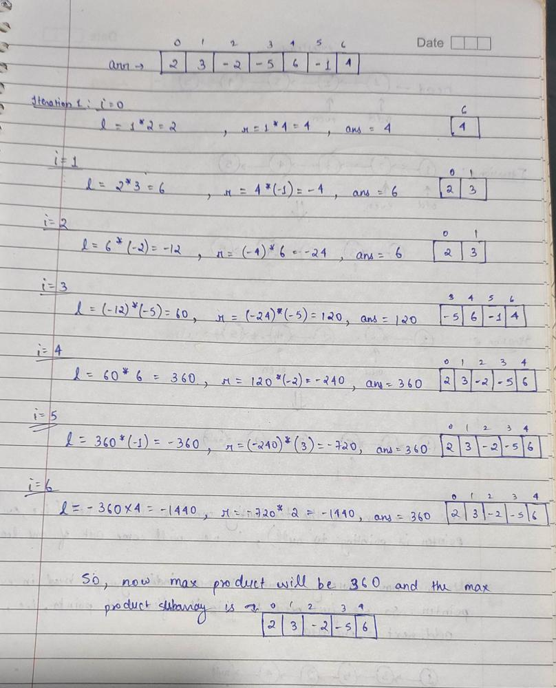

**Explanation** :

1. Through intution explanation we know that if all the elements are positive or the negative elements are even then ur answer will be product of complete array which u will get in variable l and r at the last iteration.
2. But if negative elements are odd then u have to remove one negative element and it is sure that it will be either right of max prefix product or left of max suffix product. So u need not to modify anything in your code as u are getting prefix product in l and suffix prduxt in r.
3. If array also contains 0 then your l and r will become 0 at that point...then just update it to 1(or else u will keep multiplying with 0) to get the product ahead making another subarray.

