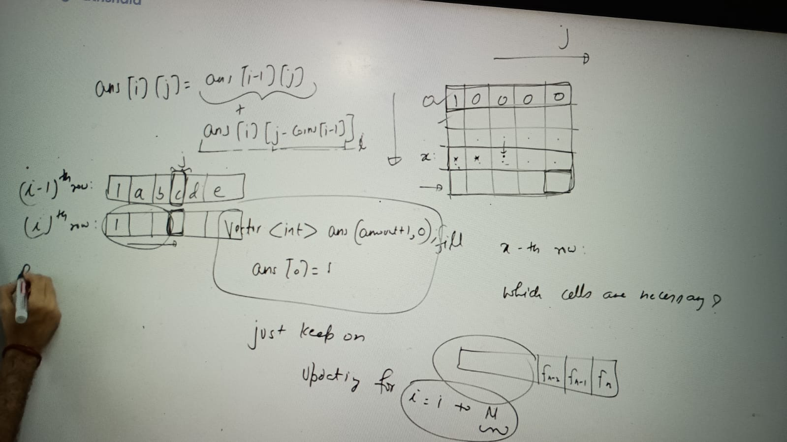
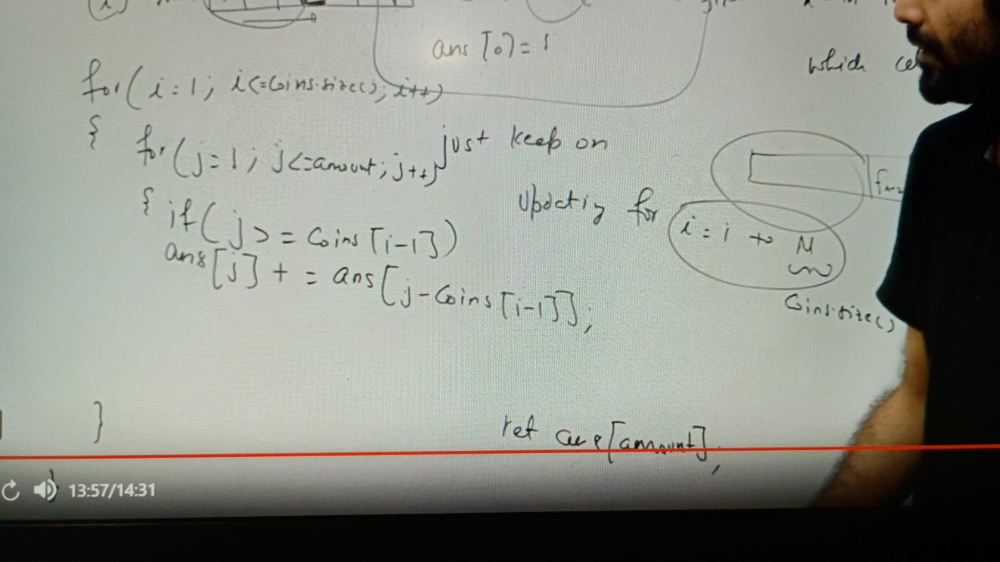

Problem:
We need to calculate the number of ways to make a target amount (j) using the first i denominations of coins in the bottom-up dynamic programming approach.

Explanation of the Line:
matrix[i][j] = Number of ways to make j, if we have the first i elements:

The value in matrix[i][j] represents how many ways you can form the amount j using the first i coins from the array coins.
Breaking it Down:

If you don't use the i-th coin at all, the number of ways to make j is the same as using the first i-1 coins (matrix[i-1][j]).
If you decide to use the i-th coin, then you also need to account for the remaining amount (j - coins[i-1]), which is represented by matrix[i][j - coins[i-1]].
Formula:

        matrix[i][j] = matrix[i-1][j] + matrix[i][j - coins[i-1]] (if j >= coins[i-1])
        matrix[i][j] = matrix[i-1][j] (if j < coins[i-1])
Example:
Let’s take:

coins = {1, 2, 3} (3 denominations)
amount = 4
Step-by-Step Solution:
Define the DP table:

Rows represent the number of coins (i).
Columns represent the amount (j).
matrix[i][j] = Number of ways to make amount j using the first i coins.
Initialize Base Cases:

    matrix[0][j] = 0 for all j > 0 (no coins to form the amount).
    matrix[i][0] = 1 for all i (1 way to form amount 0, by not using any coins).
Fill the Table Using the Formula:

text
Copy
Edit
matrix[i][j] = matrix[i-1][j] + matrix[i][j - coins[i-1]]
Filling the Table:
i/j	0	1	2	3	4
0	1	0	0	0	0
1	1	1	1	1	1
2	1	1	2	2	3
3	1	1	2	3	4
Step-by-Step for Each Cell:
Row 0: No coins → matrix[0][j] = 0 for all j > 0.

Row 1 (coin = 1):

    matrix[1][1] = 1: Only 1 way to make 1 using {1}.
    matrix[1][2] = 1: Only 1 way to make 2 using {1}.
Similarly, fill with 1 for all cells since we can only use coin {1}.
Row 2 (coins = {1, 2}):

    matrix[2][1] = matrix[1][1] + matrix[2][1-2] = 1 + 0 = 1 (cannot use coin 2 for amount 1).
    matrix[2][2] = matrix[1][2] + matrix[2][2-2] = 1 + 1 = 2 (two ways: {1+1} and {2}).
    matrix[2][3] = matrix[1][3] + matrix[2][3-2] = 1 + 1 = 2 (two ways: {1+1+1} and {2+1}).
    matrix[2][4] = matrix[1][4] + matrix[2][4-2] = 1 + 2 = 3.
Row 3 (coins = {1, 2, 3}):

    matrix[3][1] = matrix[2][1] + matrix[3][1-3] = 1 + 0 = 1.
    matrix[3][2] = matrix[2][2] + matrix[3][2-3] = 2 + 0 = 2.
    matrix[3][3] = matrix[2][3] + matrix[3][3-3] = 2 + 1 = 3.
    matrix[3][4] = matrix[2][4] + matrix[3][4-3] = 3 + 1 = 4.
Final Table:
i/j	0	1	2	3	4
0	1	0	0	0	0
1	1	1	1	1	1
2	1	1	2	2	3
3	1	1	2	3	4
Answer:
The number of ways to form amount = 4 using coins {1, 2, 3} is 4.
Ways: {1+1+1+1}, {1+1+2}, {2+2}, {3+1}.
Let me know if you'd like further clarification!

You said:
confused here :  matrix[0][j] = 0 for all j > 0 (no coins to form the amount).  can you explain with proper example only this case
ChatGPT said:
ChatGPT
Sure! Let’s focus specifically on the case where matrix[0][j] = 0 for all j > 0, which means there are no coins available, and we’re trying to form an amount.

Explanation:
matrix[i][j] represents the number of ways to form amount j using the first i coins.
If i = 0 (no coins available), then:
The only way to form amount 0 is to not use any coins, so matrix[0][0] = 1.
For any amount j > 0, it’s impossible to form that amount because there are no coins. Hence, matrix[0][j] = 0.
Example:
Let’s take:

coins = { } (no coins).
amount = 4.
Initialize the DP Table:
i/j	0	1	2	3	4
0	1	0	0	0	0
Step-by-Step:

Amount = 0 (j = 0):

1. There is 1 way to form amount 0: don’t use any coins.

        matrix[0][0] = 1.
        Amount = 1 (j = 1):

2. There are no coins available to form amount 1.

       matrix[0][1] = 0.
       Amount = 2 (j = 2):

3. There are no coins available to form amount 

    matrix[0][2] = 0.
    Amount = 3 (j = 3):

There are no coins available to form amount 3.
matrix[0][3] = 0.
Amount = 4 (j = 4):

There are no coins available to form amount 4.
matrix[0][4] = 0.

Why Does This Make Sense?
If you don’t have any coins (i = 0), it’s impossible to form any positive amount. The only case where the result is non-zero is when the amount is 0, which can be formed by doing nothing.
This base case is important because it sets the foundation for building the DP table when coins are added later (i > 0).

public class CoinChangeWays {

    public static void main(String[] args) {
        int[] coins = {1, 2, 5}; // Example denominations
        int amount = 5; // Example amount

        int result = countWaysToMakeAmount(coins, amount);
        System.out.println("Number of ways to make amount " + amount + ": " + result);
    }

    public static int countWaysToMakeAmount(int[] coins, int amount) {
        // Create a DP matrix: rows = coins + 1, columns = amount + 1
        int[][] dp = new int[coins.length + 1][amount + 1];

        // Base case: If amount = 0, there is 1 way to make it (use no coins)
        for (int i = 0; i <= coins.length; i++) {
            dp[i][0] = 1;
        }

        // Base case: If no coins are available (i = 0), there are 0 ways to make any amount > 0
        for (int j = 1; j <= amount; j++) {
            dp[0][j] = 0; // Explicitly setting this, though default is 0
        }

        // Fill the DP table
        for (int i = 1; i <= coins.length; i++) {
            for (int j = 1; j <= amount; j++) {
                if (j >= coins[i - 1]) {
                    // Include the coin + exclude the coin
                    dp[i][j] = dp[i][j - coins[i - 1]] + dp[i - 1][j];
                } else {
                    // Exclude the coin
                    dp[i][j] = dp[i - 1][j];
                }
            }
        }

        // Return the result at dp[coins.length][amount]
        return dp[coins.length][amount];
    }
}

i means here 1st i rows here. Optimization:

Assignments:
https://leetcode.com/problems/coin-change/description/
https://leetcode.com/problems/coin-change/description/
https://www.geeksforgeeks.org/problems/coin-change2448/1
https://www.geeksforgeeks.org/problems/coin-change2448/1
https://www.geeksforgeeks.org/problems/subset-sum-problem-1611555638/1
https://www.geeksforgeeks.org/problems/minimum-sum-partition3317/1