Given coins of several Denominations

coins[M] = {c0, c1, c2, ..... cm-1 }
int N;
we have infinite supply of cash denomination, find min no of coins regarding to make an amount "N"

e.g. [1, 5, 7]

N = 9

here we have infinite no of  flow to above coins means we have 1, & 7 rupees infinite coins, Now we have to make 9 Rupees coin in such a way that
we need minimum coins,

I/O = 7, 1, 1 = 3

So when we are at ith coin

x = N / coins[i]

required 

    amt = amount - x * coins[i]
    
    9 - 1 * 7  = 2

This is gready approach which wont work in this case every time, for more lets see below example:

N = 10

if we choose highest  = 7 then we have to choose 3 1's coins more so output would be = 4 ( 7, 1, 1, 1)

But there is more optimal way which is 5, 5 we just need to use 2 coins.

There is 1 edge case as well where we dont have any coins to get given amount 

e.g.

a = [2, 4, 6]

N = 5

I/O = -1  

Example : a = [3, 4, 7], N = 10

                    f(10)
      10 - 3 /  10 - 4 |      \ 10 - 7 = 3
           f(7)      f(6)     f(3)
      7 - 3 /   6 - 4 |         \   
          f(4)       f(2)..       f(0)... for all

    f (10) = min (1 + f(7)) OR
    
    f (10) = min (1 + f(6)) OR
    
    f (10) = min (1 + f(3)) OR
    
    f(n) = min(1 + f(i)), i <= 0 <= N 
                
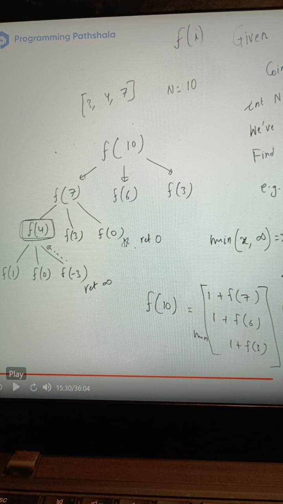

IN case all return  infinitive then there wont any way to build given amount so we have to check that as well

    long minCoins(int coins[], int N) {
       if (N < 0 ) return Integer.MAX_VAL;
       if (N == 0) return 0;
    
      long ans = Integer.MAX_VAL;
      for (int i = 0; i < a.length; i++) {
           ans = min(ans, 1 + minCoins(coins, N - coins[i]))
      }
      ret ans;
    }
    
    main() {
    long res = minCoins(int coins[], int N)
    if (res > Integer.MAX_VAL) return -1 else res
    }

lets say denomination is [1] and amount which we need to get 10 raise to the power 18(10^18)
Here only 1 way to get this. Can we gather 10^18 instances which leads to increase integer limit.

Here sub problem keep repeating: we use DP here as usual

    int ans = new int[n+1] // fill by -1
    long minCoins(int coins[], int N, ans) {
    if (N < 0 ) return Integer.MAX_VAL;
    if (N == 0) return 0;
    
    if (a[N] != -1) ret ans[N]
    
    long ans = Integer.MAX_VAL;
    for (int i = 0; i < a.length; i++) {
    ans = min(ans, 1 + minCoins(coins, N - coins[i]))
    }
    ret ans[n];
    }

bottom-up:
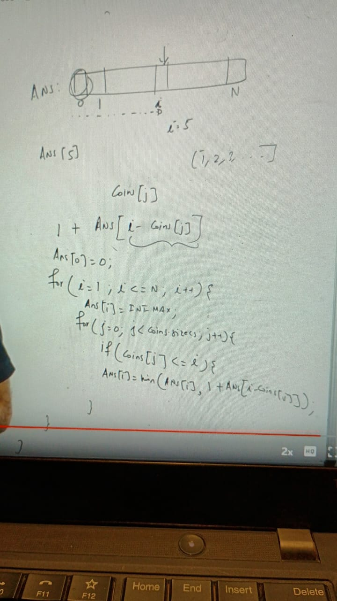
if (res > Integer.MAX_VAL) return -1 else res

### Coin change Problem-2

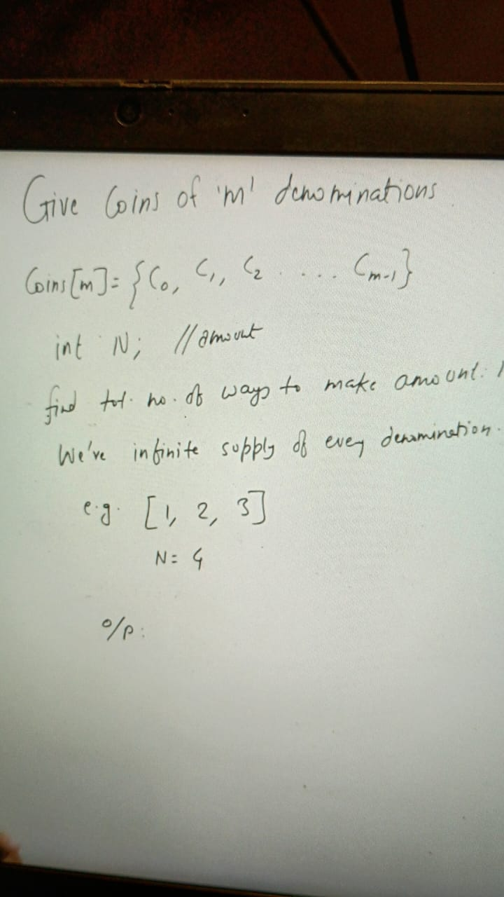
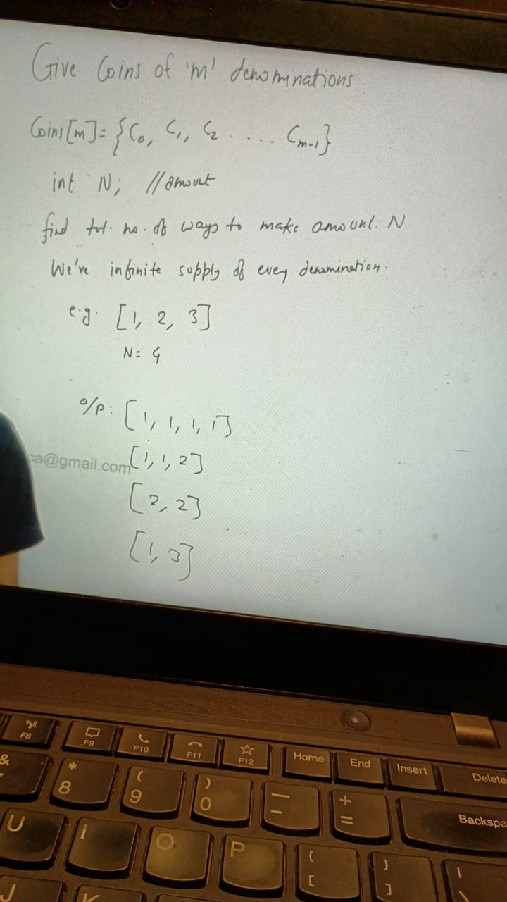

Issue with above approach:
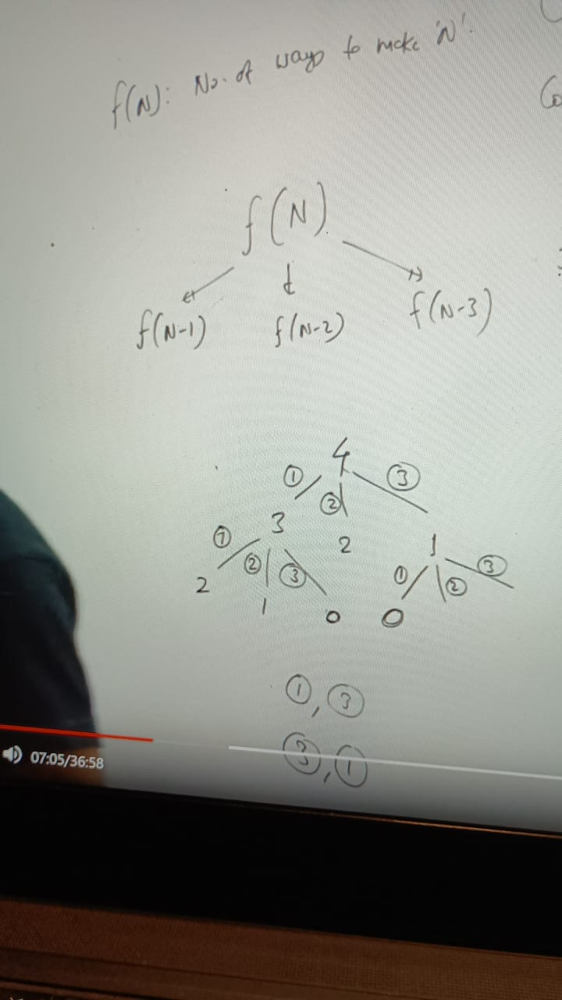

repetition can happen on any path

Problem is exactly same where we need to achieve all combinations of given sum in array
 
1. we can start from start or end Example in below array
   a = [1, 2, 3], sum = 4

    last index is = 2, we start from 2 at that point sum = 4, we have 2 choices either we can take or loose: f(2, 4) 

 a- take : remaining sum is 1 and index remain same = 2 because we taken we stay on same index= f(2, 1) -> always 3 will come

 b- Loose: since we are not taking element sum remains same and index would decrease by 1,  index= f(1, 4) -> no 3 will come because we left

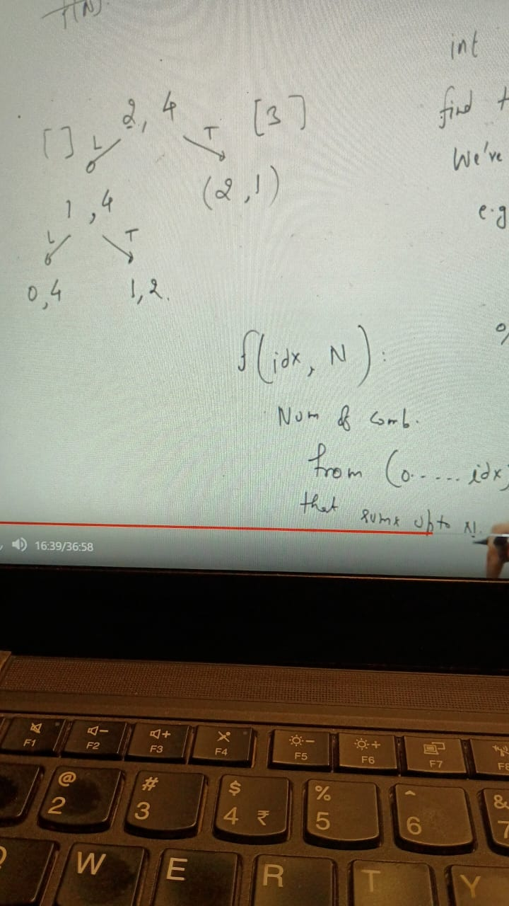
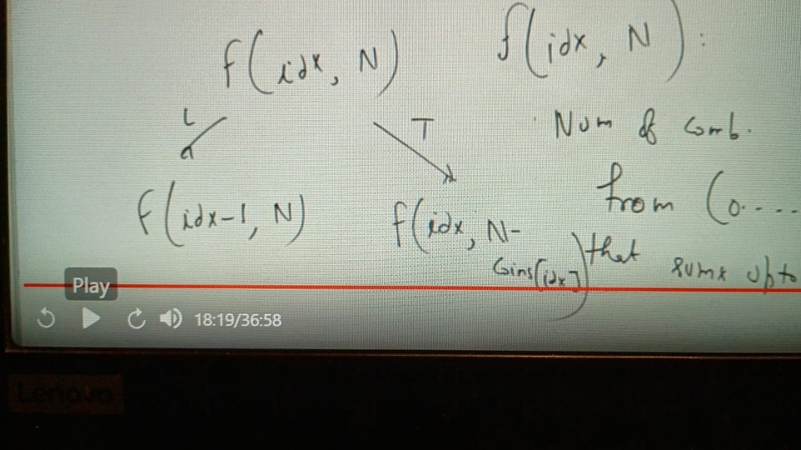
  
Top bottom imple:
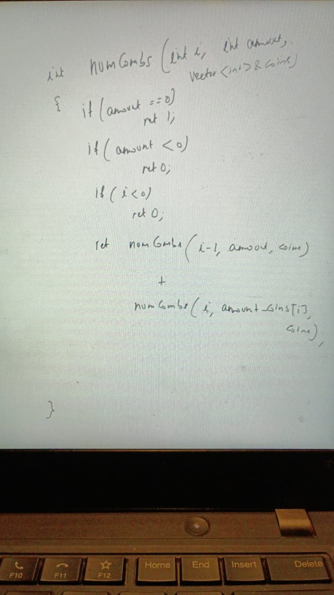

Since we have 2 state of this function do we need to choose 2d array for achieving DP, we have to store state of the function:

Since repetition will happen we have to go for DP:
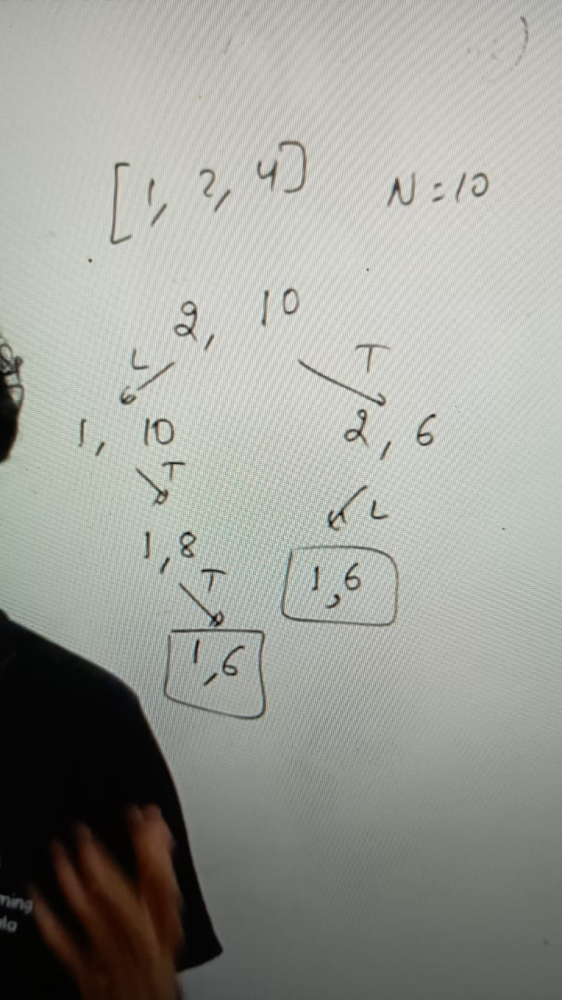

int dp[][] = new int[coins.length][N + 1] //fill with -1

if ( dp[i][amount] != -1) return ans[i][amount] // its solve

ans[i][amount] = numWays(i-1, amount, coins, dp) +
                numWays(i, amount - coins[i], coins, dp);

return p[i][amount];

TC: how many distinct problem we are solving
      o(m * amount), //[][]m x amount 

Bottom Top approach:
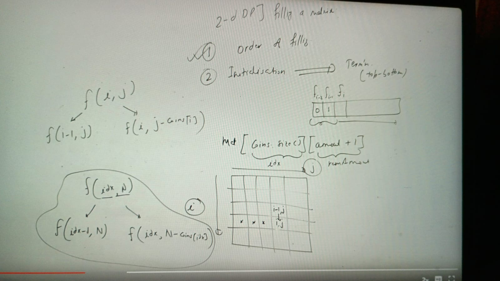

initialization is kind of same as termination condtition of Top-Bottom approach
1. condition was if (amount == 0) return 1 -> if makes you 0, no matter how much array you have there is one way to makes j, which is (i, 0)
2.  any row in 1st column is (i, 0) means we will get always 0 in 1st column so we can initialize 1st column as 1
3. other termination condition is if (i < 0) return 0. To achieve this condition we have to introduce one extra row because i >= 0 and i <= n-1
4. mat[i][j]
    i- no of ways to make 'j' if we have 1st 'i' element, if i = 0 this case barring same situation where my array is 0

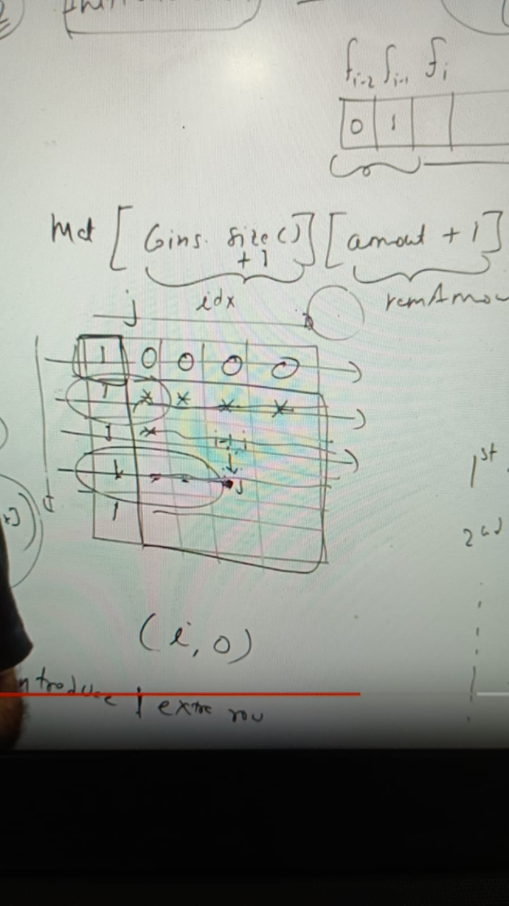

Explanation:

Ok before whatever the input is the state will remain from 0 to ith index. Because of adding an extra row we have changed 
the state from 0 to ith index to till ith index. Am I right or missing something ?

Suppose you have coin array = [1, 2, 3, 4, 5]
i = 3 and j = 5

you are making 5, and want to know with first 3 element which are [1,2,3], how many ways you make 5 you would have ways like.

[1,1,1,1,1]

[1,1,1,2]

[1,2,2]

[2,3]

[1,1,3]

There are 5 ways right...

As per definition:
The definition states for the matrix[i][j] = Number of ways to make j, if we have the first i elements.

For making the sum j, how many ways you have with conditions you can only use first i element of array coins.

### Proving Infeasibility for Large Values -> With Top down without DP
    Consider N = 10000 and coins = {1, 2, 5}
    Step-wise Execution of Your Original Recursive Function
    minCoins(10000)
    
    Calls minCoins(9999), minCoins(9998), minCoins(9995)
    minCoins(9999)
    
    Calls minCoins(9998), minCoins(9997), minCoins(9994)
    minCoins(9998)
    
    Calls minCoins(9997), minCoins(9996), minCoins(9993)
    Total Number of Calls
    Each call branches into 3 recursive calls (one for each coin).
    This results in a recursive tree of depth N.
    The total number of calls follows exponential growth, approximately O(3ⁿ).

### Estimation of Computation

    N	Approximate Number of Calls
    10	~59049 (3¹⁰)
    20	~3.49 × 10⁹ (3²⁰)
    50	~7.18 × 10²³ (3⁵⁰)
    100	Beyond computational limits

Even for N = 50, this is impossible to compute in a reasonable time. For N = 10000, the function will never finish.

### What is the Practical Limit?

Modern computers can perform 10⁹ operations per second (1 GHz CPU).

    N	Time Taken (Assuming 1 GHz CPU)
    20	~3 seconds
    25	~2 minutes
    30	~7 years
    35	Impossible in human lifetime

So, N ≈ 25 is the practical limit for your function. Beyond that, execution time becomes infeasible.

### Understanding CPU Performance: "10⁹ Operations per Second (1 GHz CPU)"

Modern processors are measured in GHz (gigahertz), which tells us how many clock cycles they can execute per second.

**What Does "1 GHz = 10⁹ Operations per Second" Mean?**

* A 1 GHz CPU performs 1 billion (10⁹) cycles per second. 
* However, not all cycles directly translate to method calls. Each operation (addition, multiplication, memory access) takes a few cycles.

### Example: How Many Recursive Calls in One Second?

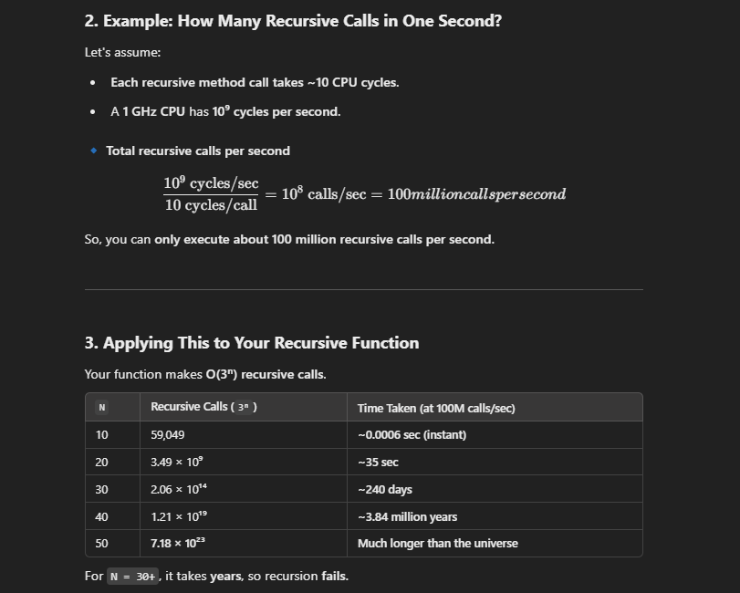