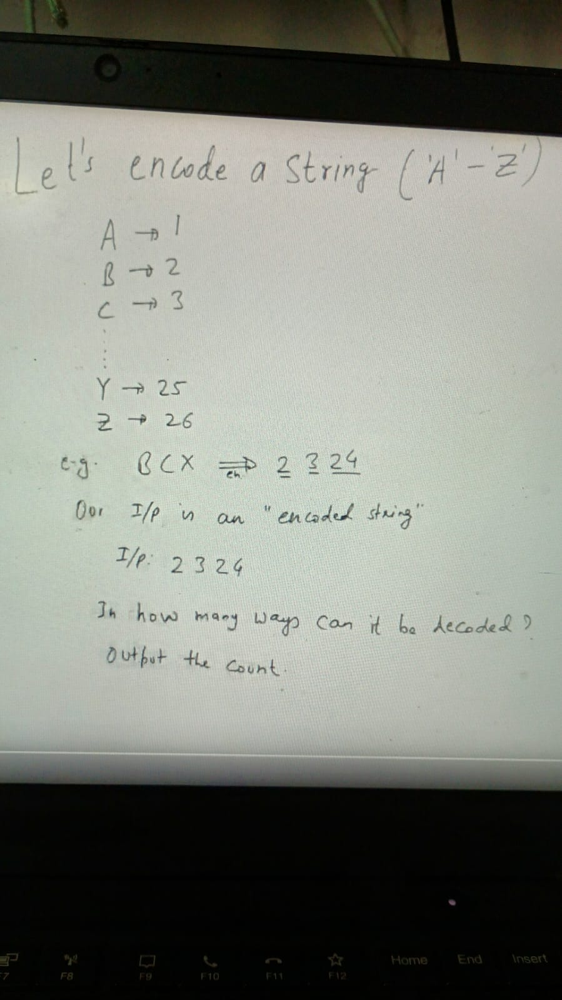
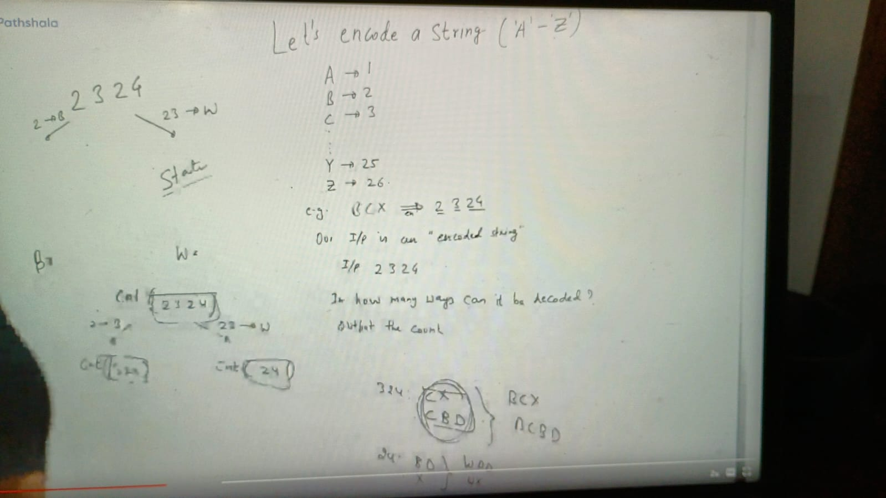
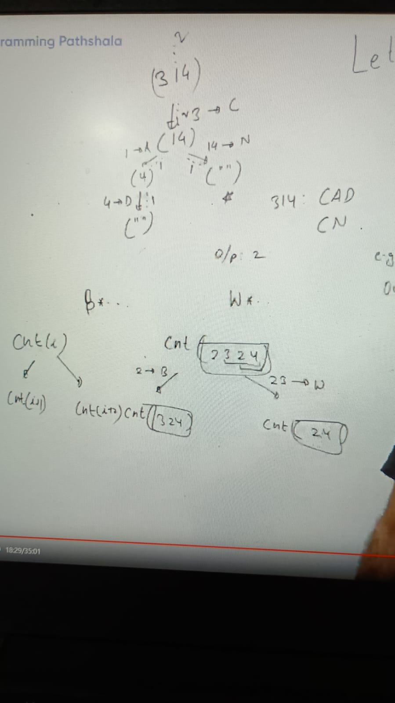
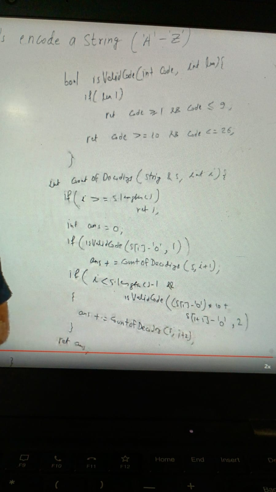
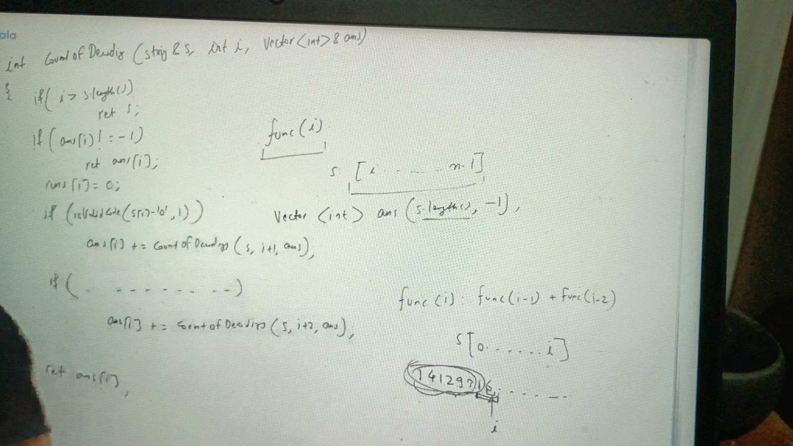
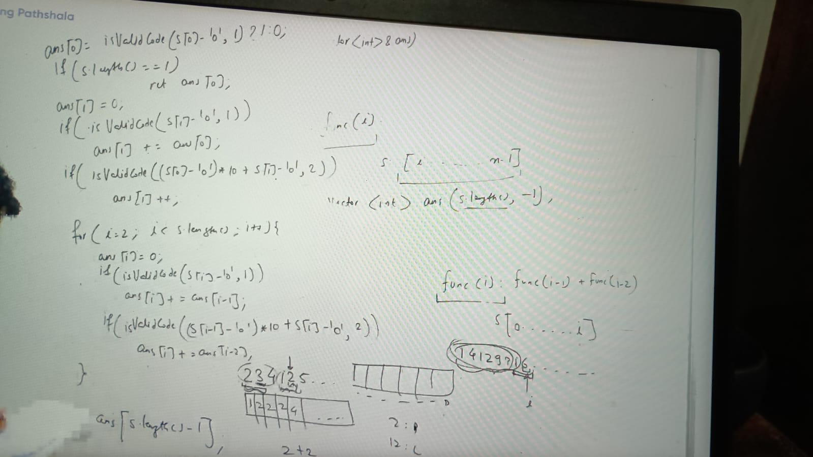

    2,3,(24): BCX
    2,3,2,4: BCBD
    (23),2,4: WBD
    (23),(24): WX
=> we have total 4 ways to decode it:

Here remaining string is our state, whatever remaining is a suffix and suffix is fixed for every state
          cnt(0)
            /  \
         cnt(1) cnt(2)
 
**Note:** Here one glitch is we wont have 2 choices in every cases e.g.

            314 -> 3 we cant take here 31 as second choices, because choices 1--26
             |
            (14)
         1- A/  \ 14 -> N
            4   ""

E.g -> 0425 : 0  because no chars start from 0
       4021 : 0

f(i) = f(i + 1) + f(i + 2)

whenever call n-1 then return empty string, because its last empty index

    ans = 0
    if(possi1) {
       ans += f(i+1)
    } 
    if (possi2) {
      ans += f(i+2)
    }
    
    return ans;
    
    possible1and2: S[i] - '0' 1<= num <= 26
    4810693
    
    i at 1
    (s[i]-'0') * 10 + s[i+1] - '0'
    
    bool isValid(int code, int len) {
      if (len1) ret code >= 1 && code <=9
      else code >=10 && code <=26
    }

implementation as:

s = [i ..... n-1], Here i is state and how many values for this state is = n, because legitimate indices is 0 to n -1

int [] ans = new int[s.length()] // filled -1

### Bottom-top approach:
in this approach we need to fill prefix array as below e.g:
234125 => ps = ps []
now for pos = 0 (2), possible choices of decode is 1 so ps = [1]
pos = 1 (23) => ps = [1, 2], because we can decode either 3 or 23
pos = 2 (234) => ps  = [1, 2, 2], because we can decode as 2, 3, 4 and 23, 4

ans[0] = isValidCode(s[0]-'0', 1) ? 1 : 0
if (s.length() == 1) return and[0]

can optimised space by taking 2 var for storing i-1 and i-2
o(n) & o(1) if you do above

Recursive Calls Breakdown
At each index i, the function has at most two choices:

Decode a single character (move i + 1).
Decode two characters together (move i + 2), only if they form a valid number (10-26).
Without memoization, this would lead to an exponential number of calls, i.e., O(2ⁿ) in the worst case.

Effect of Memoization
Memoization ensures that each index i is computed only once.
Since i goes from 0 to n (length of the string), there are at most n distinct states.
Each recursive call either moves i + 1 or i + 2, but since results are stored in memo, we never recompute the same state.
Thus, the number of recursive calls reduces to O(n), making the time complexity O(n).

Space Complexity
Recursive Stack Space: The recursion depth is at most O(n).
Memoization Storage: We store at most O(n) states in the memo map.
Total space complexity: O(n) + O(n) = O(n).