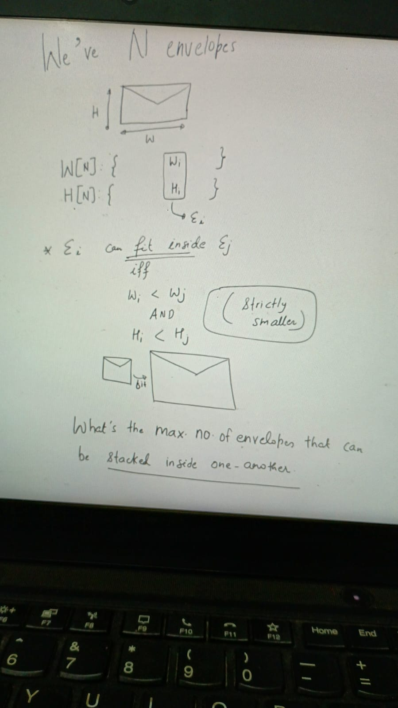
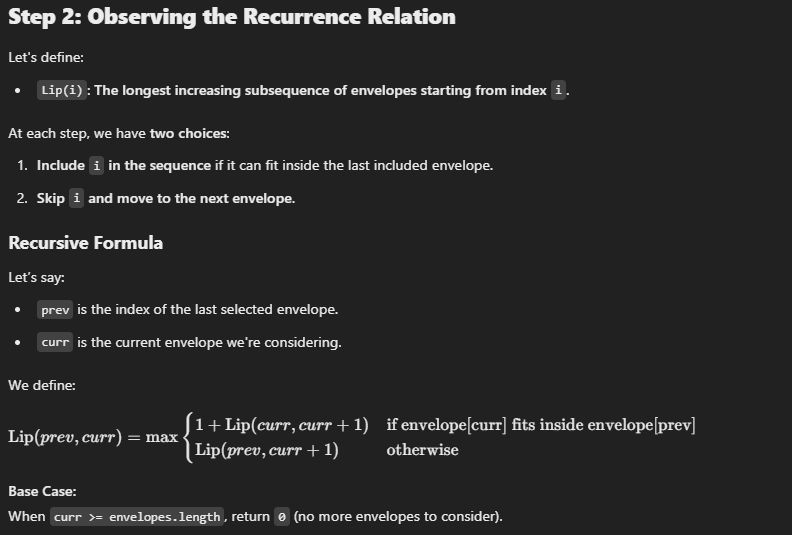
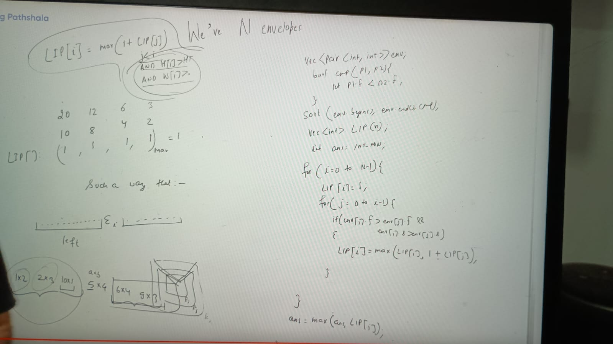
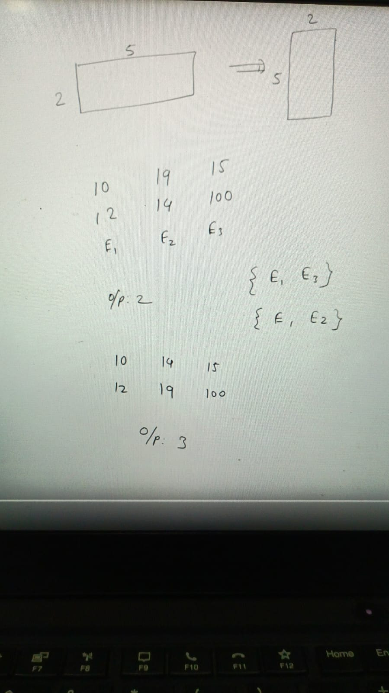
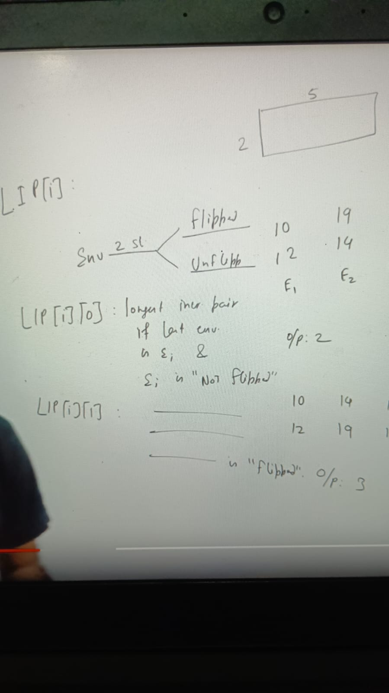
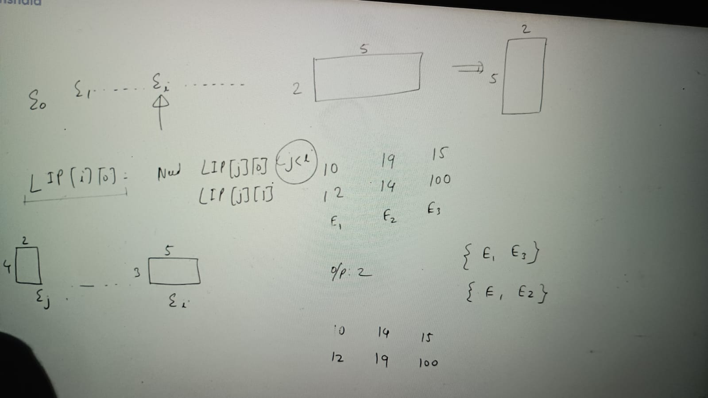
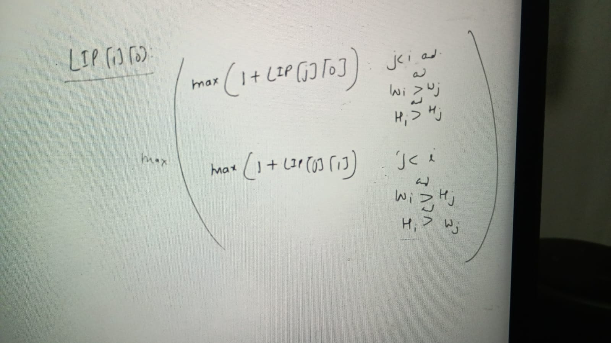
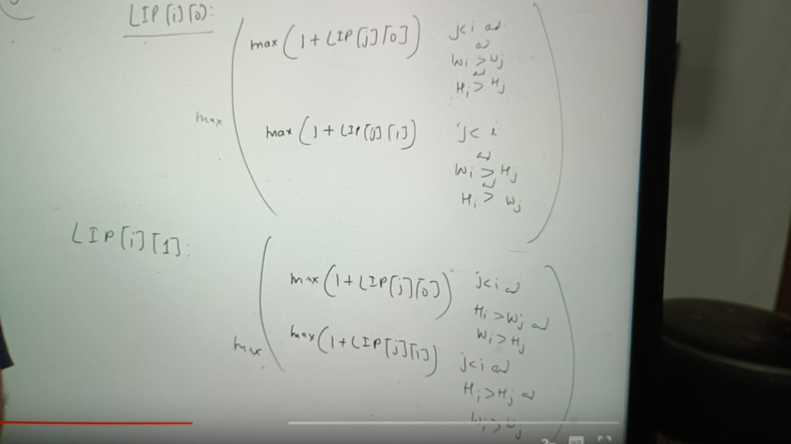
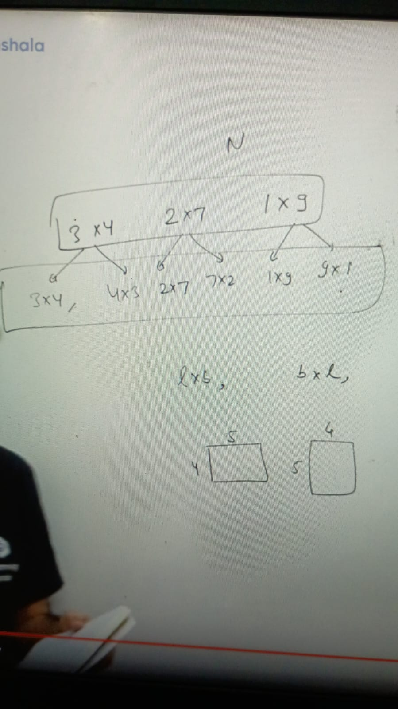

Example:

envelop width  : 10   2   9   5
envelop height : 4    7   13  8

Result       (2, 7) can fit inside (5, 8) and (5, 8) can fit inside (9, 13)
so output is: 3

its kind of same as LIS but here consider pair of elemenet rather that 1 element

LIP (Longest Increasing pair) = LIP[i]
                              = max(1 + LIP[j]) , j < i and H[i] > H[j], W[i] > W[j]

But here problem is reordering is allowed so might be give different output after reordering

to solve this can we reorder in such a way that all envelop comes left which fit in ith envelop

..left.... Ei.......

if we sort the envelop increasing order the all small area envelop will come left side:

TC = o(n^2)
SC = o(n)

But if flipping allowed to this envelop, means after flipping envelop can fit inside the envelop.

### Approach:

SO LIP can we calculate as below if not flipped:

LIP can we calculate as below if flipped:

Note: Here we cant sort on the basis of any one dimention as like when flipping is not allowed, here we have to sort 
on the basis of area only

Alternate elegant solution:

Assignments:

https://leetcode.com/problems/number-of-longest-increasing-subsequence/
https://dashboard.programmingpathshala.com/renaissance/topics/assignment?module=5&topic=22&assignment=83
https://www.geeksforgeeks.org/problems/box-stacking/1
https://leetcode.com/problems/russian-doll-envelopes/description/
https://www.geeksforgeeks.org/problems/longest-bitonic-subsequence0824/1
https://leetcode.com/problems/longest-increasing-subsequence/description/
