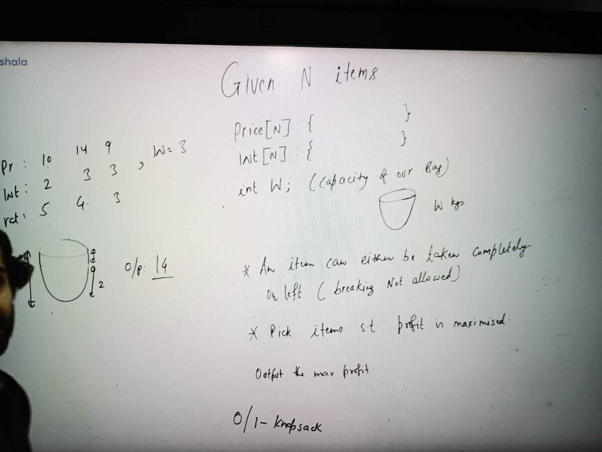
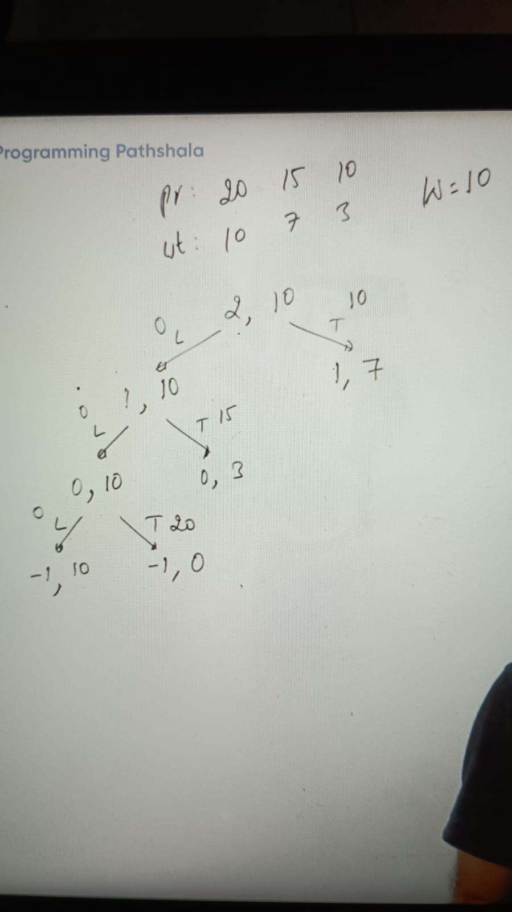
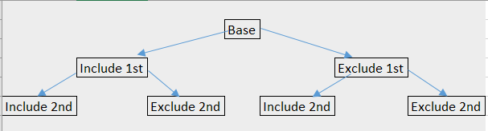
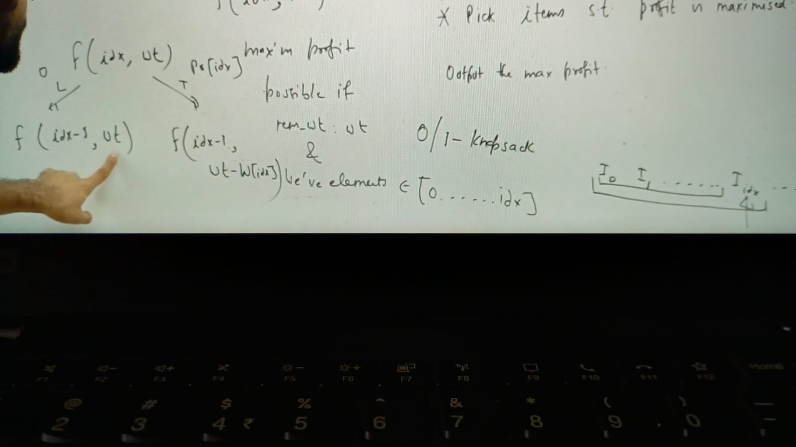
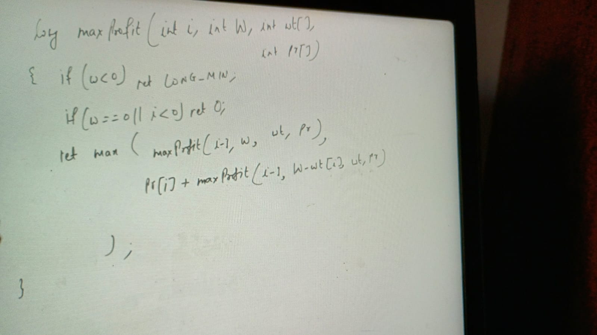
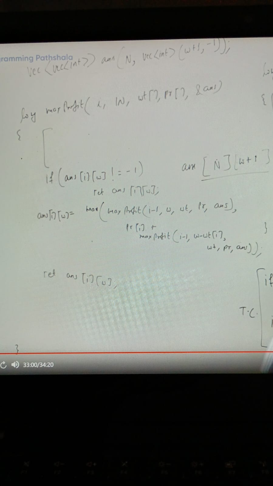
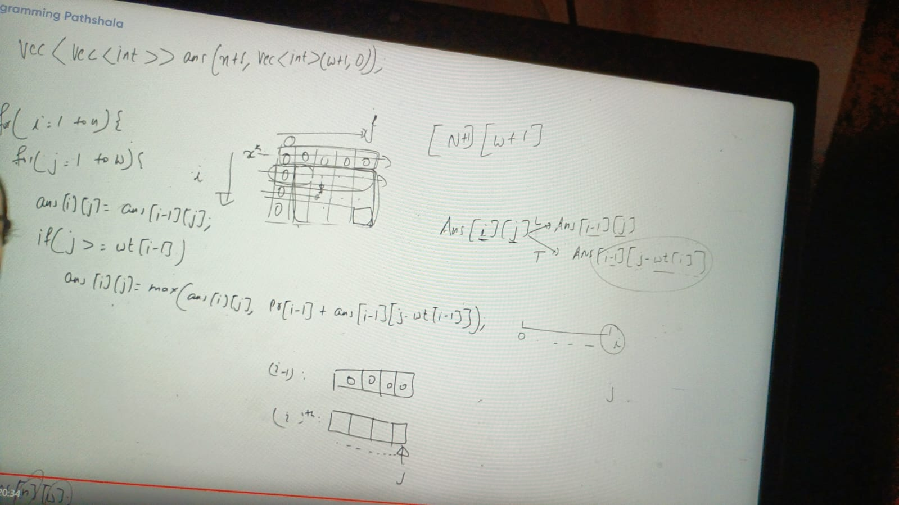
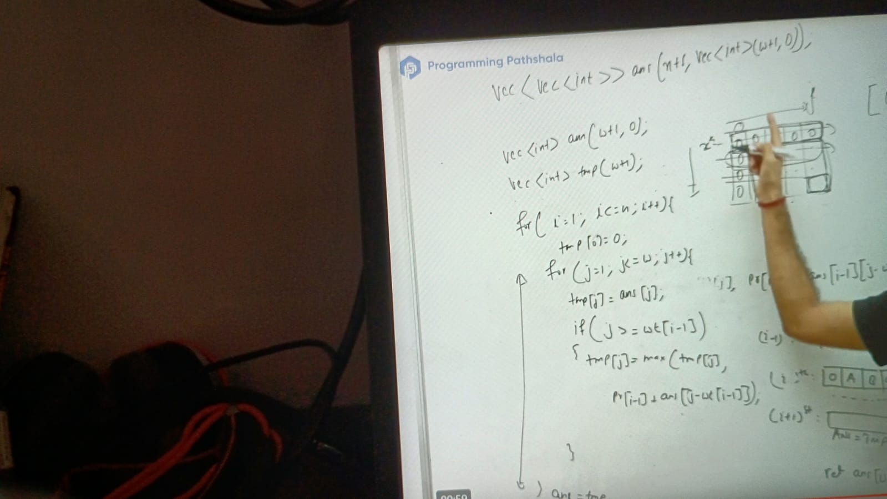

Each level d there are 2 ^ d choices, there are N items so complexity is 2 ^N.

Another way to consider each item as bit then we check for all possible combinations of setting and unsetting, and find maximum value obtained while satisifying weight constraint. It is clear we need to check (1 << n) or 2 ^ N iterations. So, naive solution is 2 ^ N.

we have 2 state here of function index and remaining weight;

f(idx, wt) =  max profit possible if remaining weight: wt & we have element belongs to [0, 1, ....idx  ]

reccurence relation :

    f(idx, wt) = max(f(idx-1, wt), profit[idx] + f(idx-1, wt - w[idx]))

termination condition:

-ve idx & -ve wt in that case we need to return Integer.MIN_VAL

if (wt < 0) return Integer.MIN_VAL
if (wt == 0) return 0 // if dont have space cant make any profit
and if i < 0 // means there is no element in array kind of empty array, 
so cant choose so return 0 , cant make profit as well

recursive code:

For momorization state of function is idex and wt so need 2 D array

int DP[][] = new int [n][w + 1] // index 0 .. n & sec state is wt = w + 1 because initial value of weight

Top Down approach:

TC = o (nxw)

SC = o (nxw)

Bottom Top Approach:

**Note: 
ans[i][j] means, if we consider items from  0 to  i & remaining capacity of bag is j, what is max profit we can make**

Now we are analysing what are the cells on which ans[i][j] depends -> we know we can write 

    ans[i][j] = ans[i-1][j] (loose) OR ans[i-1][j - w[i]] (take)

1. initialization:

       ( i, 0): 0 th column will coresponds all the cell whose value like (i, 0), which means for its from 
       0 to i, we are looking bag which capacity is 0 = which would be =, it means all 1st columns values to be 0
  
   ans[i][0] = 0

if (wt == 0) return 0
    
    i/j	0	1	2	3	4
    0	0	0	0	0	0
    1	0	-1	-1	-1	-1
    2	0	-1	-2	-2	-3
    3	0	-1	-2	-3	-4

if (i < 0) return 0 : 

here as know i means items from 0 to i, -ve i means dont have items. 
keeping here the ro w number cant be -ve, so we introduce 1 extra row here. 
that row will correspond the case of empty array(i <0)
then dimention would be; 

    int ans[][] = new int[n+1][w+1]

1. ith row will correspond the case when 1st i items considered -> (0, i -1)
  ans[i][j] = max profit if remaining wt = j, we have 1st 'i' items to consider

    knapSack(5, {6, 10, 12}, {1, 2, 3})
    ├── Include item 3: 12 + knapSack(2, {6, 10, 12}, {1, 2, 3})
    │   ├── Include item 2: 10 + knapSack(0, {6, 10, 12}, {1, 2, 3}) = 10
    │   ├── Exclude item 2: knapSack(2, {6, 10, 12}, {1, 2, 3}) = 6
    │   ├── Max(10, 6) = 10
    │   ├── 12 + 10 = 22
    │
    ├── Exclude item 3: knapSack(5, {6, 10, 12}, {1, 2, 3})
    │   ├── Include item 2: 10 + knapSack(3, {6, 10, 12}, {1, 2, 3}) = 16
    │   ├── Exclude item 2: knapSack(5, {6, 10, 12}, {1, 2, 3}) = 16
    │   ├── Max(16, 16) = 16
    │
    ├── Max(22, 16) = 22
    

Assignments:

https://www.geeksforgeeks.org/problems/0-1-knapsack-problem0945/1
https://www.geeksforgeeks.org/problems/0-1-knapsack-problem0945/1
https://www.geeksforgeeks.org/problems/knapsack-with-duplicate-items4201/1
https://www.geeksforgeeks.org/problems/knapsack-with-duplicate-items4201/1