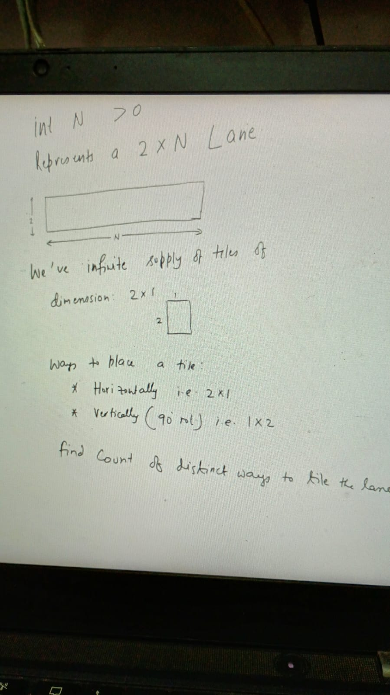
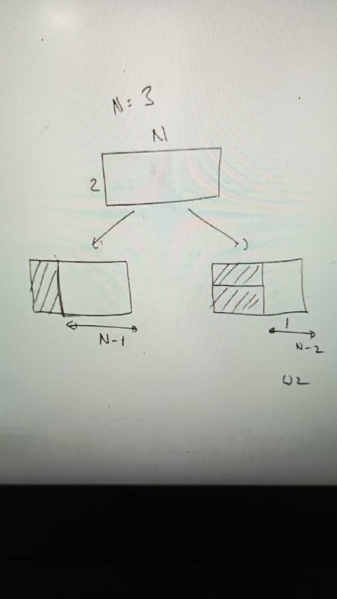
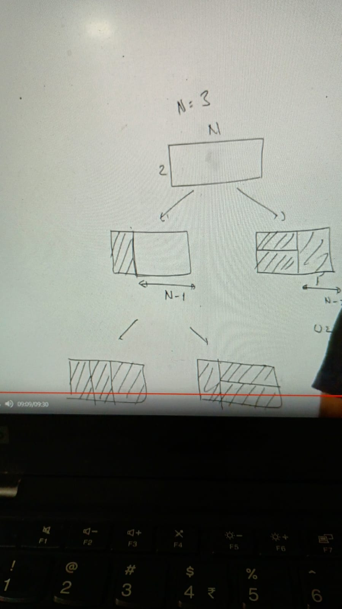
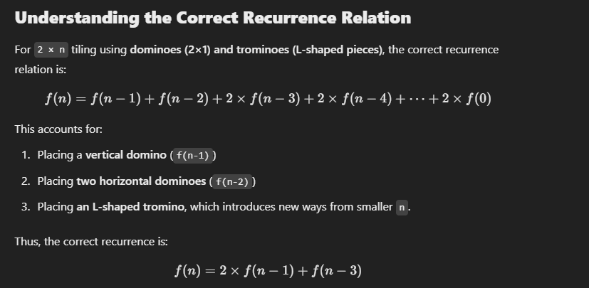
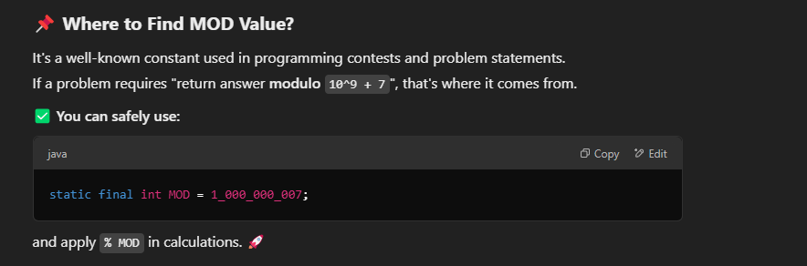
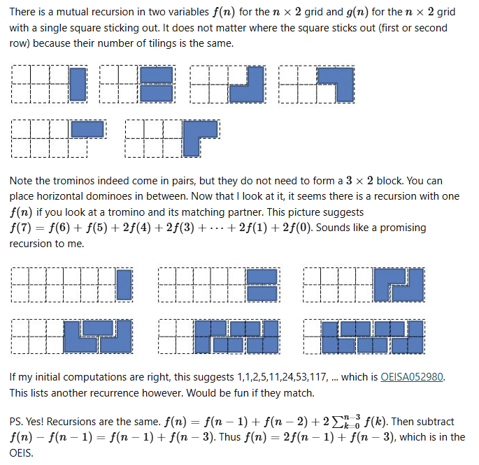

1. 1 X 2 vertical
2. 2 X 1 horizontal

numTilings(4)
├── numTilings(3)
│   ├── numTilings(2)
│   │   ├── numTilings(1)
│   │   │   ├── numTilings(0) → 1
│   │   │   ├── numTilings(-1) → 0
│   │   ├── numTilings(0) → 1
│   ├── numTilings(1) → 1
│   ├── numTilings(0) → 1
├── numTilings(2) → 2
├── numTilings(1) → 1

Ah, I see! Now it makes sense. You're working with two types of tiles:

2x1 dominoes (which can be placed either horizontally or vertically)
Trominoes (shaped like an L or a T or in some other way)
So, the problem you’re dealing with involves dominoes and trominoes.

Clarification on Tile Types
2 × 1 Dominoes:

Can be placed vertically or horizontally.
This is the first part of the recurrence relation.
Trominoes:

A tromino is a tile that covers three squares.
This is where the term T(n-3) comes from in your recurrence relation.
Why n-3?
If you use a tromino, it will cover 3 squares in the grid.
After placing it, you are left with a grid of size n - 3.

Updated Recurrence Relation Explanation
Given your clarification, the recurrence relation now works like this:

T(n)=2×T(n−1)+T(n−3)
Where:

2 * T(n-1): This comes from placing a 2 × 1 domino.

When you place a domino vertically, you reduce the problem to tiling a 2 × (n-1) grid.
Similarly, placing a domino horizontally reduces the problem to tiling a 2 × (n-1) grid as well.
Hence the factor of 2 here (because there are two ways to place a domino: horizontally and vertically).
T(n-3): This comes from placing a tromino.

A tromino covers 3 cells, so after placing one, you're left with a grid of size n - 3 to tile.

### Step-by-Step Example with Trominoes and Dominoes (n = 4)
Start with a 2x4 grid:

You need to tile a 2 × 4 grid with dominoes and trominoes.

Possibility 1: Place a vertical domino (1x2):

This reduces the grid to size 2 × 3.
The problem now becomes tiling a 2 × 3 grid, which is T(3).
Possibility 2: Place a horizontal domino (2x1):

This reduces the grid to size 2 × 3.
The problem now becomes tiling a 2 × 3 grid, which is T(3) again.
Possibility 3: Place a tromino (covers 3 cells in an "L" shape):

This reduces the grid to size 2 × 1.
The problem now becomes tiling a 2 × 1 grid, which is T(1).

### Updated Recurrence Relation Explanation
Given your clarification, the recurrence relation now works like this:

T(n)=2×T(n−1)+T(n−3)
Where:

2 * T(n-1): This comes from placing a 2 × 1 domino.

When you place a domino vertically, you reduce the problem to tiling a 2 × (n-1) grid.
Similarly, placing a domino horizontally reduces the problem to tiling a 2 × (n-1) grid as well.
Hence the factor of 2 here (because there are two ways to place a domino: horizontally and vertically).
T(n-3): This comes from placing a tromino.

A tromino covers 3 cells, so after placing one, you're left with a grid of size n - 3 to tile.

3. https://leetcode.com/problems/domino-and-tromino-tiling/description/
4. https://codeforces.com/contest/474/problem/D
5. https://leetcode.com/problems/min-cost-climbing-stairs/description/
6. https://www.geeksforgeeks.org/problems/reach-a-given-score-1587115621/1?page=1&category%5B%5D=Dynamic%2520Programming&query=page1category%5B%5DDynamic%2520Programming
7. https://www.geeksforgeeks.org/problems/ways-to-tile-a-floor5836/1
8. https://www.geeksforgeeks.org/problems/count-ways-to-reach-the-nth-stair-1587115620/1
9. https://www.geeksforgeeks.org/problems/count-ways-to-reach-the-nth-stair-1587115620/1