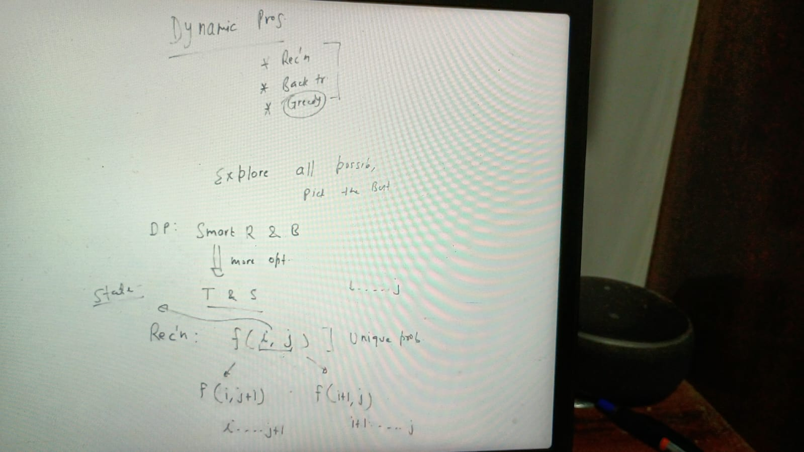
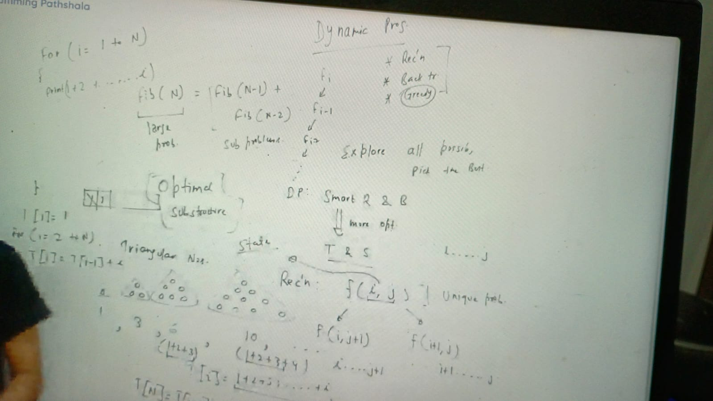
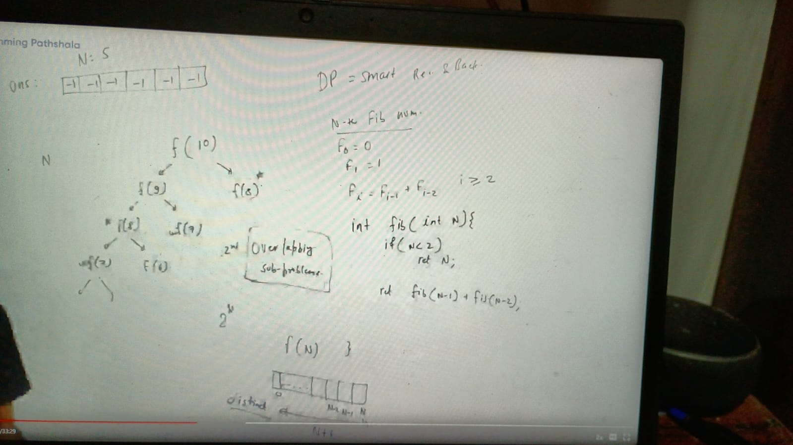
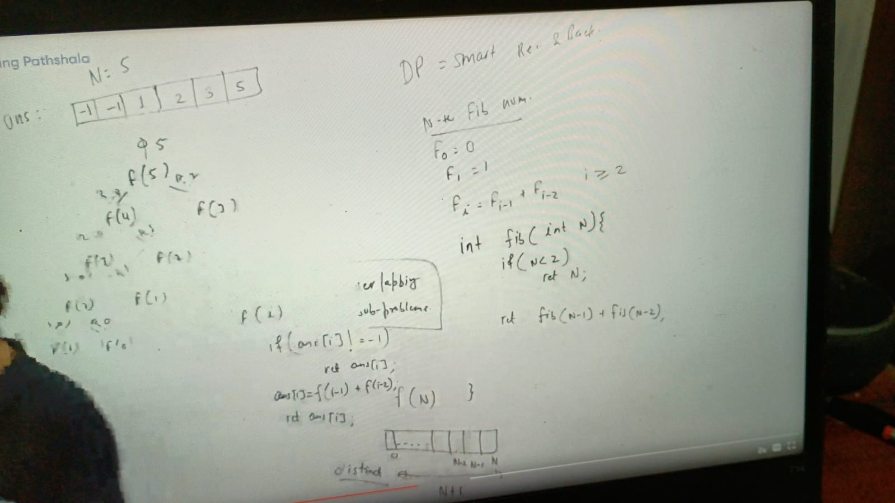

State is variable, which we passed in function:

fib(N) = fib(n-1) + fib(n-2)
large problem = subproblem

know as optimal substructure

### Triangular Number:

T[i] = 1 + 2 + 3... + i

brute force way :

for i = 1 to n {
  print (1 + 2.. i)

T[N] = T[N-1] + N

above solution is taking o(n) extra space can we do int more less space?
dependecy is on just last computed value so no need to take whole array

because T[N] = T[N-1] + N, we can store T[N-1] in a variable

loop is bottom top approach, recursion is top-bottom approach:

int prev = 1
print(prev)
for(i = 2 to N) {
 prev +=i
 print(prev)
}

if recurrence relation is something like below in such cases we have to store pre computed values in array

T[i] = T[i-1] + T[i-2] + T[i-3] + T[i-4] ....T[1]

DP = recursion + backtracking

find Nth fibanacci number:

f0 = 0
f1 = 1

fi = fi-1 + fi-2, i >= 2

int fib(int n) {
  if (n < 2)
    return n;

  return fib(N-1) + fib(n-2)
}

repetition of sub-problem kind of costly here we can reduce that:

overlapping sub-problem

