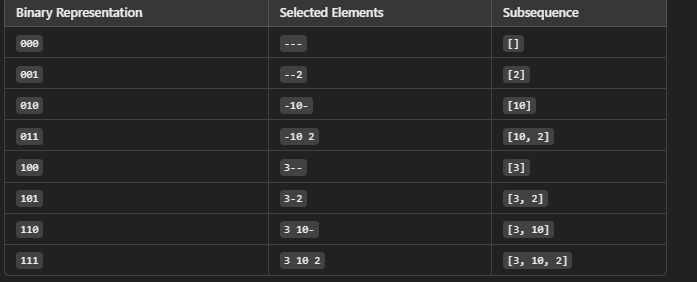
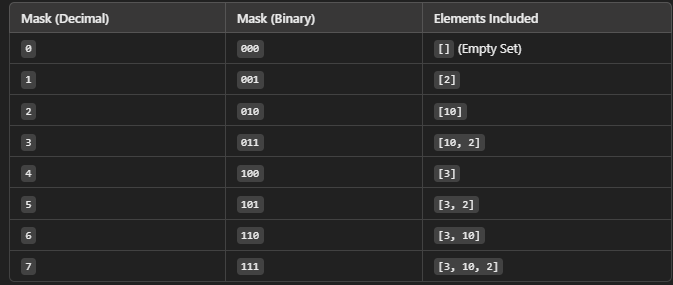
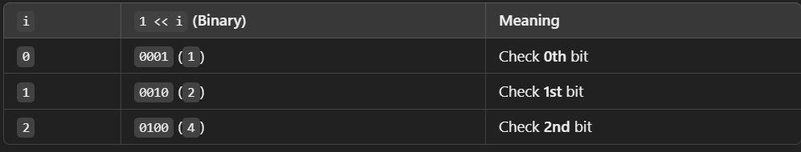
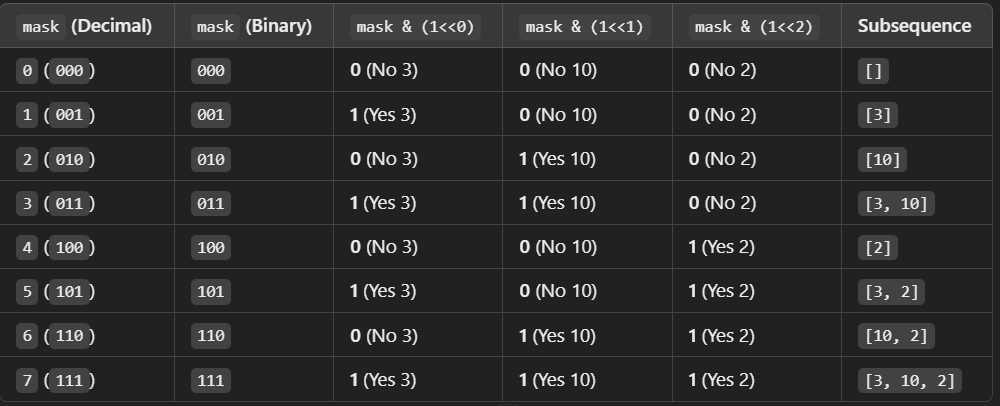
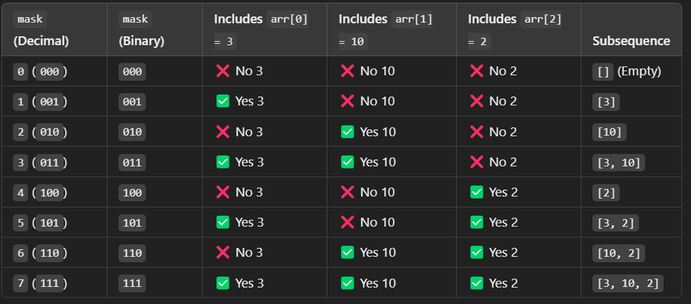

Approach
In an array of size n, there are 2^n subsequences (each element can either be included or excluded).
We can use bit manipulation to generate all subsequences.

### Iterative Approach
1. There are 2^n possible subsets.
2. Each subset corresponds to a binary number from 0 to 2^n - 1.
3. The binary representation of a number determines which elements are included.

### Example
Consider the array:
arr = [3, 10, 2]

The total number of subsequences =

    2^3 = 8.
  

    import java.util.*;

    public class SubsequenceGenerator {
    public static void generateSubsequencesIterative(int[] arr) {
    int n = arr.length;
    int totalSubsequences = (1 << n); // 2^n

        List<List<Integer>> result = new ArrayList<>();

        // Iterate from 0 to 2^n - 1
        for (int mask = 0; mask < totalSubsequences; mask++) {
            List<Integer> subsequence = new ArrayList<>();

            // Check which elements to include
            for (int i = 0; i < n; i++) {
                if ((mask & (1 << i)) != 0) {  // If the ith bit is set
                    subsequence.add(arr[i]);
                }
            }

            result.add(subsequence);
        }

        // Print the subsequences
        for (List<Integer> subseq : result) {
            System.out.println(subseq);
        }
    }

    public static void main(String[] args) {
        int[] arr = {3, 10, 2};
        generateSubsequencesIterative(arr);
    }
    }

### Explanation

1. Iterate over all numbers from 0 to 2^n - 1.
2. For each number (bitmask), check which bits are set:
     -> If the ith bit is set, include arr[i] in the subsequence.
3. Store and print the generated subsequence.

    []
    [3]
    [10]
    [3, 10]
    [2]
    [3, 2]
    [10, 2]
    [3, 10, 2]

### Time Complexity
    O(n * 2^n)

(Iterates 2^n times, and each iteration checks n elements)

This is the most efficient way to generate all subsequences iteratively.

### How Does (mask & (1 << i)) != 0 Work?

This expression is used to check if the i-th bit of mask is set to 1. If it is, we include arr[i] in the subsequence.

### Bit Manipulation Explanation
Each number (mask) from 0 to 2^n - 1 represents a subset using its binary representation.
Each bit in mask corresponds to whether an element in arr is included or not.

* 1 means "include" the element.
* 0 means "exclude" the element.

### Example with arr = {3, 10, 2}

* We need to generate all subsets (from 000 to 111 in binary).
* The total number of subsets = 2^3 = 8 (000 to 111).

### Breaking Down (mask & (1 << i)) != 0

**Step 1: (1 << i) – Create a Bitmask for Checking**

1 << i shifts 1 to the left by i positions.

### Step 2: (mask & (1 << i)) – Check If i-th Bit is Set

**Example 1: mask = 5 (101 in binary)**

We want to check if arr[1] (10) should be included.

* 1 << 1 (Shift 1 to position 1) → 0010
* mask = 5 (101)
* mask & (1 << 1) = 101 & 010 = 000 (0, so don't include 10)
* 
**Example 2: mask = 6 (110 in binary)**

### We check if arr[1] (10) should be included.

* 1 << 1 → 0010
* mask = 6 (110)
* mask & (1 << 1) = 110 & 010 = 010 (Non-zero, so include 10)

### Step-by-Step Execution

Let's consider arr = [3, 10, 2].

### Iterating Over mask Values

We iterate mask from 0 to 7 (2^n - 1).

### Example:

`arr = {3, 10, 2};`

There are 2^3 = 8 subsequences (since each element can either be included or excluded).

### Step-by-Step Bitwise Execution

Binary Representation of mask

Each number (mask) from 0 to 7 (2^n - 1) represents a subset using its binary format.

For each bit in mask,

* 1 means include that element.
* 0 means exclude that element.

How (mask & (1 << i)) != 0 Works
For each mask, we check which elements to include.

Example: mask = 5 (101 in binary)
1 << 0 → 0001 (Check if bit 0 is set)
101 & 0001 = 0001 ✅ → Include arr[0] = 3
1 << 1 → 0010 (Check if bit 1 is set)
101 & 0010 = 0000 ❌ → Exclude arr[1] = 10
1 << 2 → 0100 (Check if bit 2 is set)
101 & 0100 = 0100 ✅ → Include arr[2] = 2
Resulting Subsequence: [3, 2]

Recursion Tree Representation
Bitmasking iterates over all subsets, but we can also visualize it as a recursion tree.

                  []
         /        |        \
       [3]      [10]      [2]
      /   \     /   \     /   \
[3,10] [3,2] [10,2]  [3,10,2]

### Final Visualization

Here’s a visual breakdown of mask = 5 (101 in binary):

    Mask:   1  0  1   (Binary: 101, Decimal: 5)
    Array: [3, 10, 2]
    ----------------
    3   X   2   → Result: [3, 2]
