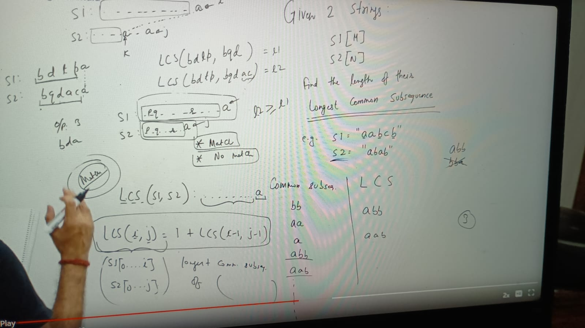
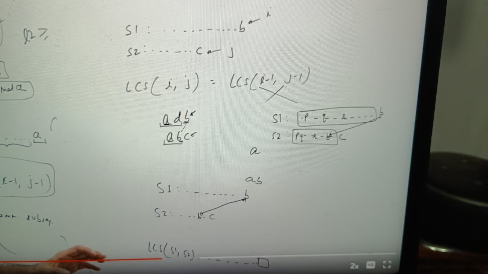
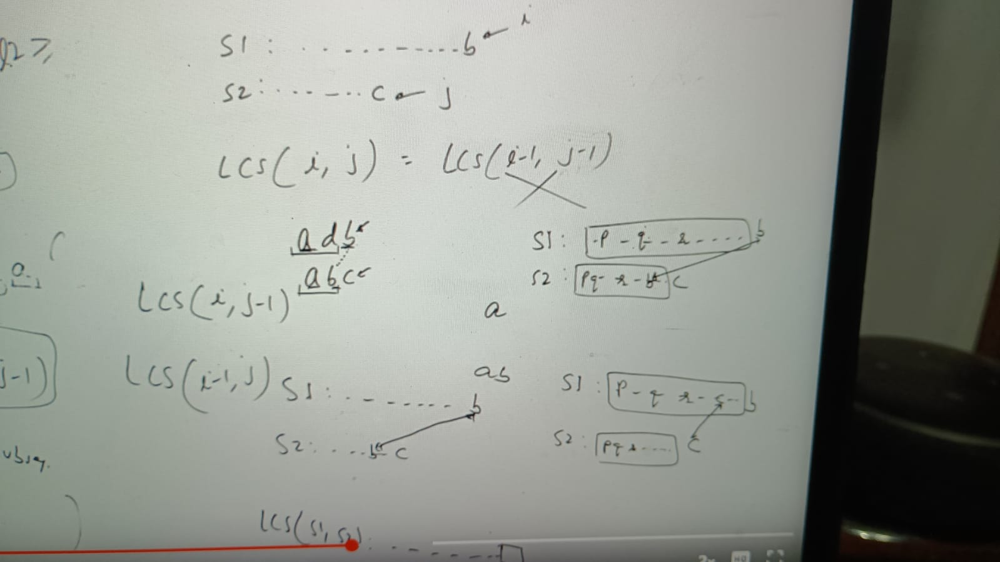
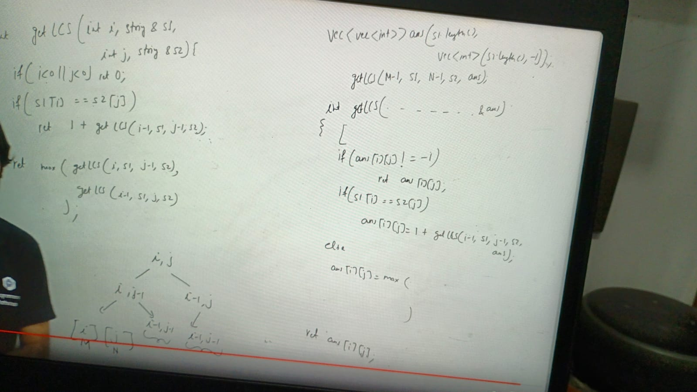
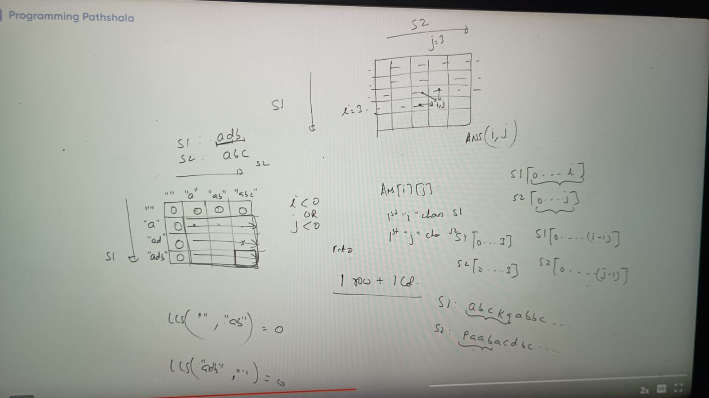
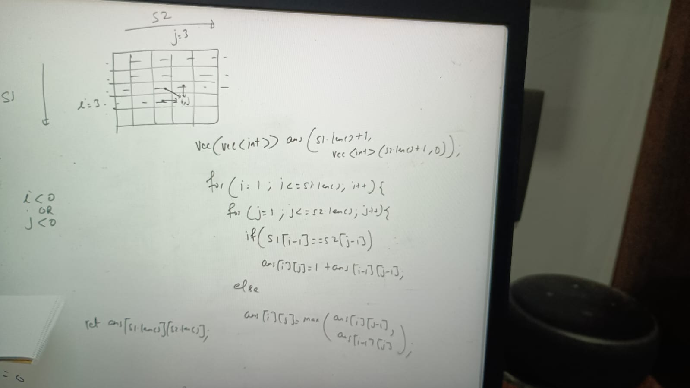
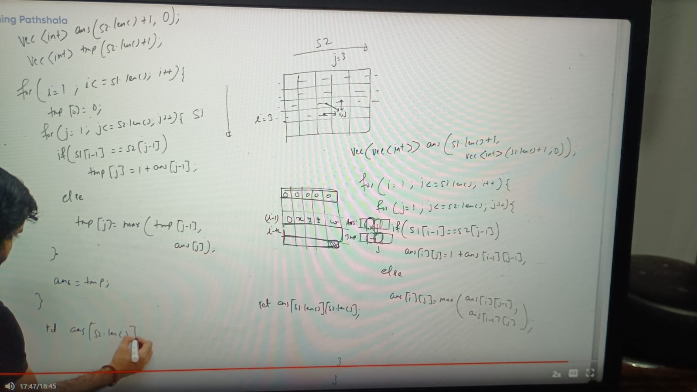
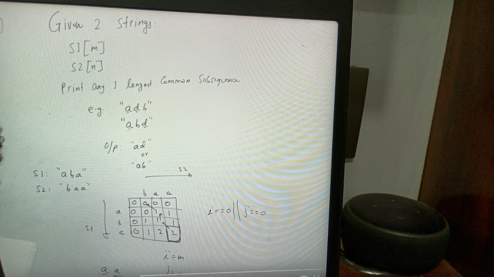
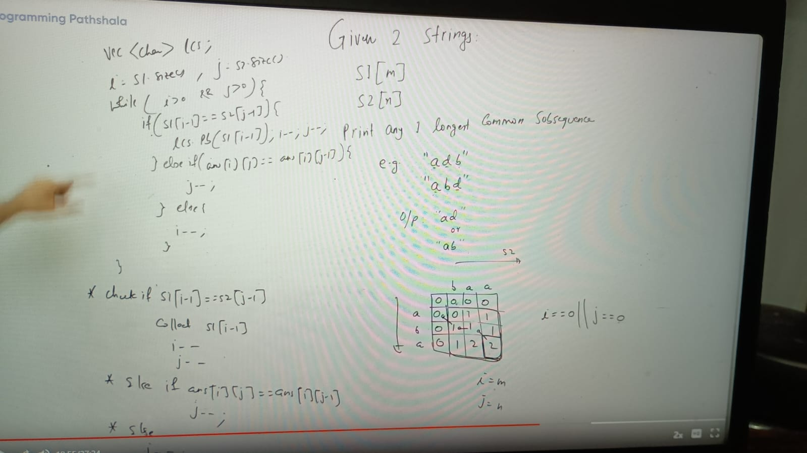

Given 2 STring
s[m] & s2[n], find the length of their longest common subsequence
Example
S1 = "aabcb"
S2 = "abab"
character placement can be anything in same order in subsequence

Here common subsequences = [bb, aa, a, abb, aab, ....]
Now LCS (longest common subsequence) = 3

2^m subsequences can be possible for S1, because we can select each chars has 2 choices (take it or not take it)
2^n for S2

Then total common subsequences can  be :

S1: ......... a (i)
s2: ......a(j)

Here 2 thing possible either last char of both string match or not match

**Case 1: Match**
In this case last character of LCS must be end with a because a is match, what about above left characters

    LCS(s1, s2) = ............a

With that left part made of the remaining part of s1 and s2, yes. think like this if we finds pqr longest subsequest in left part then we can easily appended 
as prefix of a to that pqr = pqra

LCS(i, j) depends on s1[0...i] &
           = s2[0...j]

    LCS(i, j) = 1 + LCS(i-1, j-1)

means longest common subsequence of(s1[0...i], s2[0...j]) is store in LCS(i, j)

**Note:** 

why we are match last char (a) of s1 with last char of s2(a), why we are not matching with other a comes previous in s2

**case 2:** No match 

    LCS(i, j) = max(LCS(i, j-1), LCS(i-1, j))

when we reducing out indices whicvh is from 0 to i keep srinking and at one point its -ve, negative means empty string means there is no
indices left between 0 i and which means it blank

S1 = "" no matter what s2 is LCS("", abc) = 0
S1 = "" no matter what s1 is LCS(xyz, "") = 0

implementation:

TC o(m*n)
SC = o(m*n)

### Bottom Top Approach:

Implementation:

ans array always point to i-1

### Printing any 1 longest common subsequence

implementation:

reverse the result **

TC = O(m+n)

Assignment:
https://leetcode.com/problems/longest-common-subsequence/description/
https://leetcode.com/problems/longest-common-subsequence/description/
https://www.hackerrank.com/challenges/dynamic-programming-classics-the-longest-common-subsequence/problem

