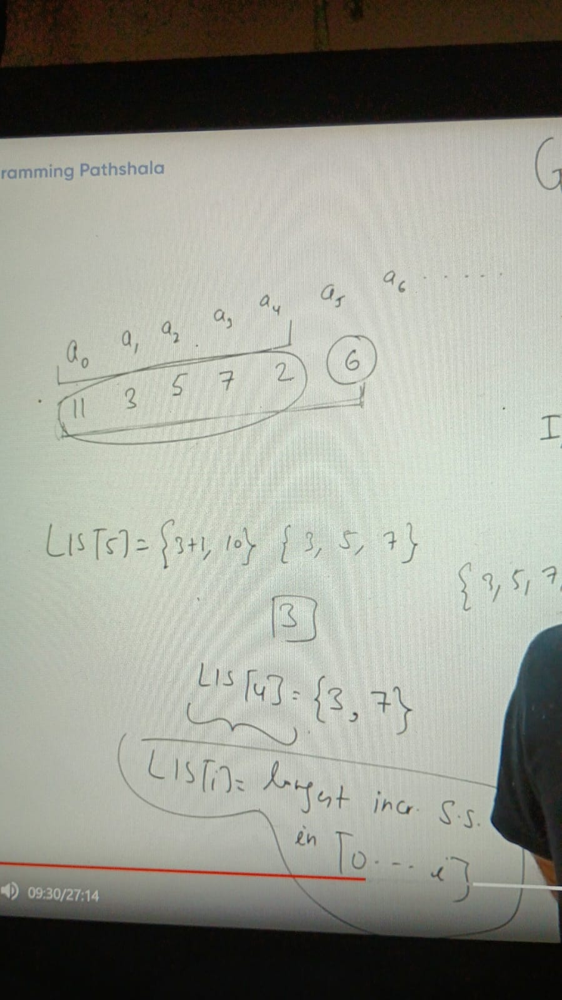
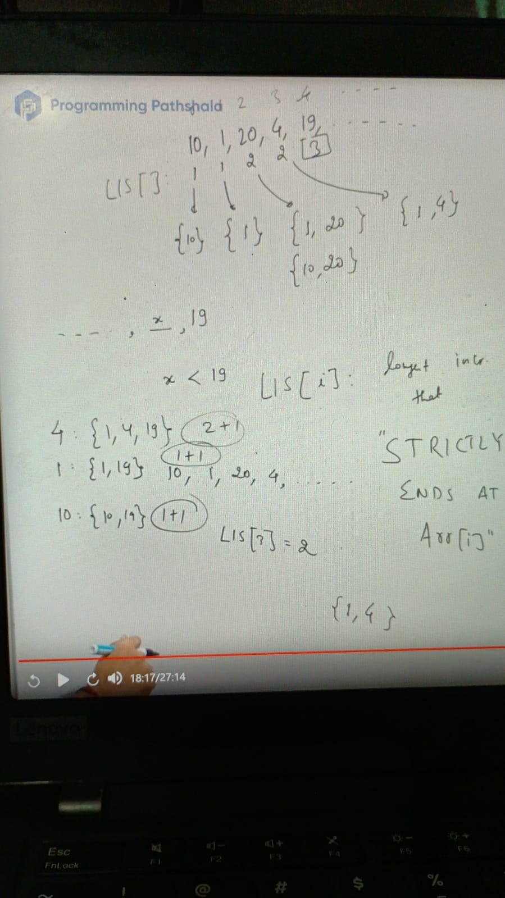
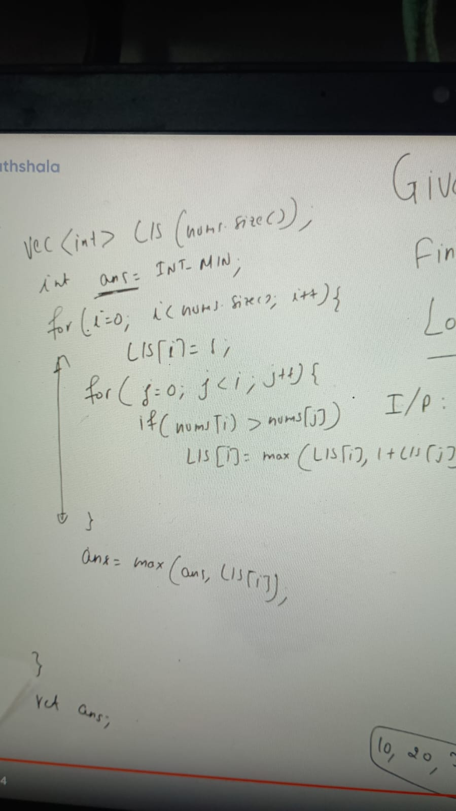
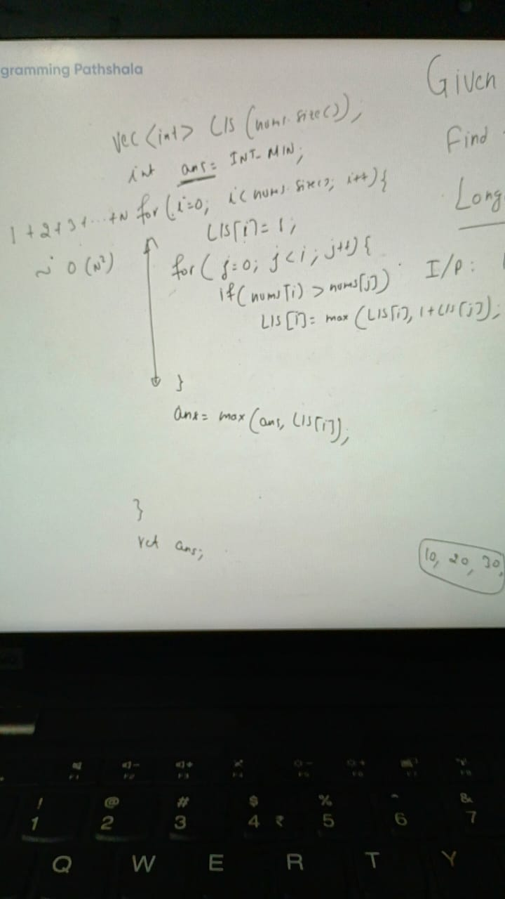

Given int a[n], find the length of longest increasing subsequence

I/P: 11, 0, 5, 3, 7, 9, 2

1. 0, 3, 9
2. 5, 7
3. 0, 5, 7, 9
4. 0, 3, 7, 9

output: length of longest subsequence = 4

Example:

a0, a1, a2, a3, a4, a5, .......an

Issue with LIS approach is if new coming elements is greater than last element of the previous part then this approach will work, else it wont work because
might be new LIS present

### Example

    index 0   1   2   3   4  
         10  30   3   4   6
    LIS[] = {2, 30}
          = {2, 30}  because 3 < 30
          = for index  3 {2, 30} because 4 < 30
          = for index 4  {2, 30} because 6 < 30

    so final LIST length is 2 which is {10, 30} which is not correct we have other greater LIS available in this array
    = {2, 3, 4}

LIS[i] = longest increasing subsequence such that "STRICTLY ENDS AT" arr[i]

............i

    LIS[i] = max(1 + Lis[j])
    where j < i && arr[j] < arr[i]

Example: 

    10, 20, 30, 0

what is longest integer ending at '0' -> {0}

imlementation:

 