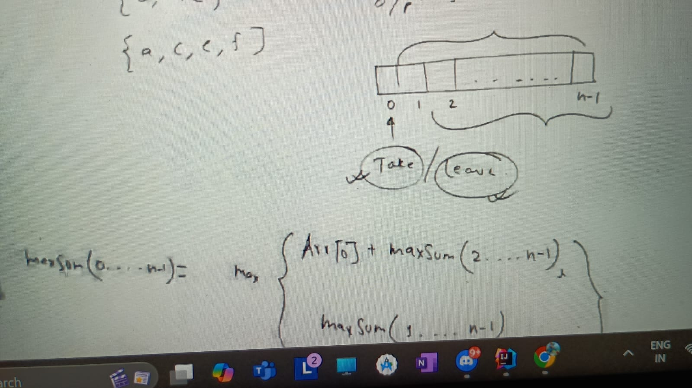
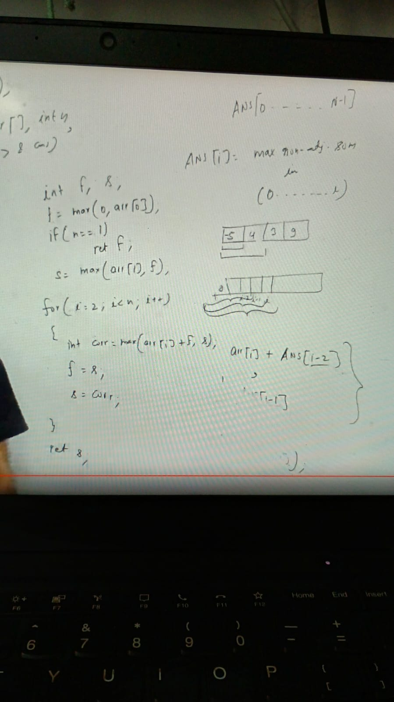
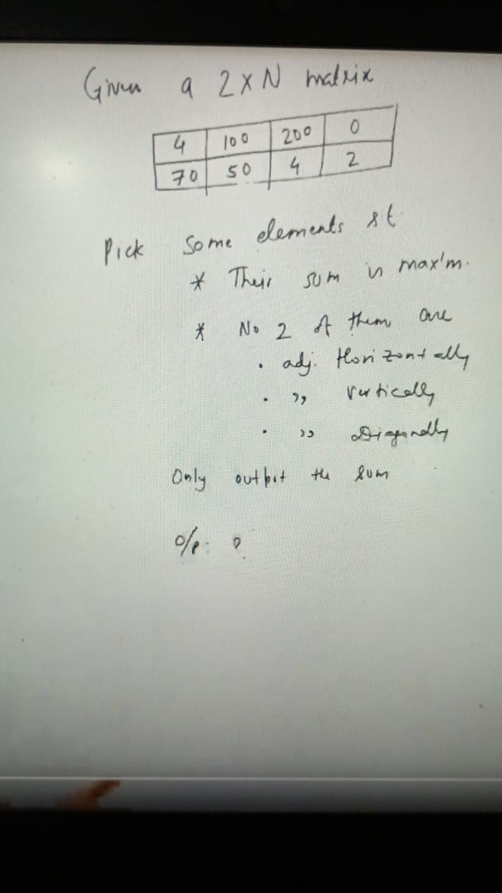
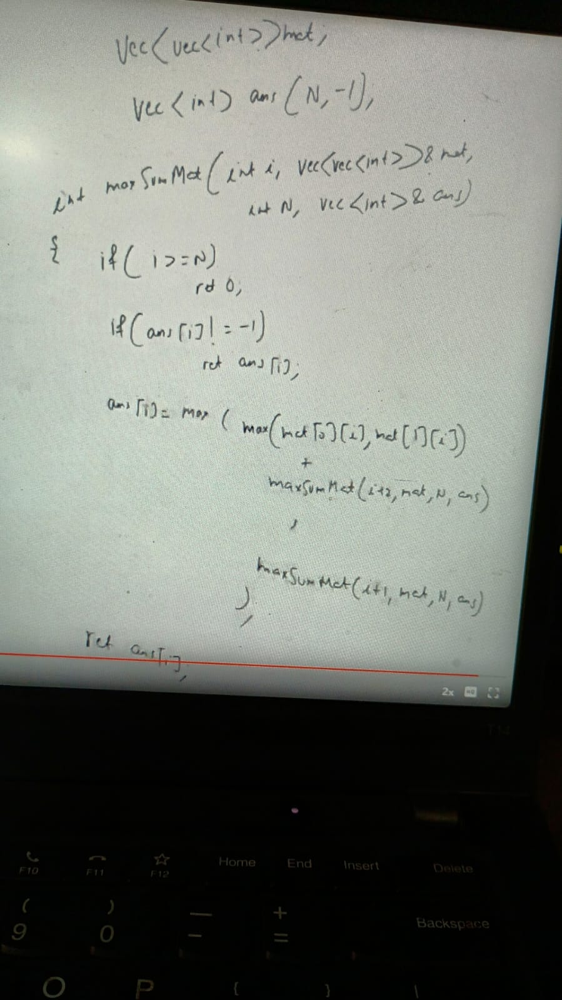

Given int arr[n], find the max sum of subsequence s.t. no 2 elements are adjacent.
arr = [1, 10, 100, 40, 20]
o/p = 121 (1, 100, 20)
arr1 = [a, b, c, d, e, f]
not valid = [a, b, c]
valid = [a, c, e, f]

### Note: 
This problem is a variation of the "House Robber Problem" or the "Maximum Sum of Non-Adjacent Elements" problem. Let's break it down step by step.

We have to think recursively: either take any element or just leave that element

any element can we choose or left

#### Observations

1. You have two choices for each element:
2. Include the current element: If you include arr[i], then you cannot include arr[i + 1].
3. Exclude the current element: If you exclude arr[i], then the best sum you can get is from i+1.

f(i) = max (arr[i] + f(i + 2), f(i + 1))

when we look at the part of any array last index any array

So we can write like below:

    maxSum(i) = arr[i] + maxSum(i + 2)

              = maxSum(i + 1)

                 f(i)
                 /   \
            f(i + 1) f(i + 2)
             /
           f(i + 2)

    rob(0)
    ├── rob(2)
    │   ├── rob(4)
    │   │   ├── rob(6) → Base case (0)
    │   │   ├── rob(5) → Base case (0)
    │   ├── rob(3)
    │       ├── rob(5) → Base case (0)
    │       ├── rob(4)
    │           ├── rob(6) → Base case (0)
    │           ├── rob(5) → Base case (0)
    └── rob(1)
    ├── rob(3) (same as above)
    ├── rob(2) (same as above)

Why did I check for i + 2 < nums.length but not i + 1 < nums.length?
Base Case Handles Out-of-Bounds:

The condition if (i >= nums.length) return 0; already ensures that if i goes out of bounds, we return 0.
This means we don't need to explicitly check i + 1 < nums.length because if i + 1 exceeds the array length, it will naturally return 0.
When Do We Need to Check i + 2?

nums[i] + rob(i + 2, nums) means:
We're including nums[i] and skipping one element (i+1).
However, if i + 2 >= nums.length, we must not call rob(i + 2, nums), or else we'd access an invalid index.
Hence, we check i + 2 < nums.length to ensure we don't call a function on an invalid index.

Here you can see repetition is occurs, so we would need to use memorization, implementation as below: in top-down

In bottom -top approach we solve f(1), f(2) ..

ans[0] = max(0, arr[0])
ans[1] = max(and[0], arr[1])

for (i = 2 to n) {

   ans[i] = max(arr[i] + arr[i-2], arr[i-1])
}
return and[n]
Since we need only 2 previous value so there is no sense to use array

Max subsequence in matrix:

o/p = 200 + 70 = 270

Here is above table, we noticed 1 thing {c,D} is common in both it means from column 1 either we select 1st or 2nd ele we cant pick anything from

next column any element so now we have 2 chices either we take max value from column 1 or just leave column 1 and move to column 2

        f(i) = 1. max( arr[0][i], arr[1][i]) + f(i + 2))    -> i is column number & f(i + 2) - it'll sum from i+2 to end 
               2. f(i+1)

Implementation:

Assignments:
https://codeforces.com/problemset/problem/698/A
https://codeforces.com/contest/456/problem/C
https://leetcode.com/problems/house-robber-ii/description/
https://www.geeksforgeeks.org/problems/adjacents-are-not-allowed3528/1
https://www.geeksforgeeks.org/problems/stickler-theif-1587115621/1
https://www.geeksforgeeks.org/problems/stickler-theif-1587115621/1