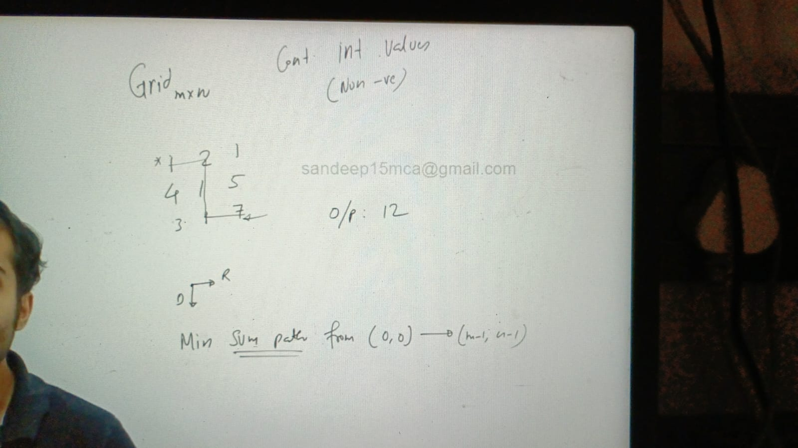
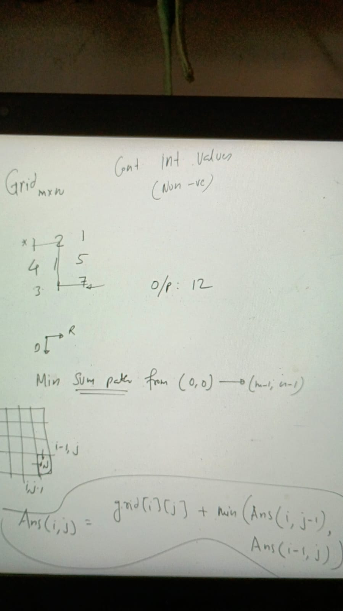

Q.
Values are non-negative, it is specifically mentioned. what if some or all values are negative. would there be any change in recurence relation. if yes please provide suitable example.

Recursive +  Memoization

class Solution {

public:

    int helper(int i,int j,vector<vector<int>> &grid, vector<vector<int>> &dp)

    {

        if(i==0 && j==0)

            return grid[i][j];

        

       if(dp[i][j]!=-1)

           return dp[i][j];

        if(i==0)

return dp[i][j] =    grid[i][j] + helper(i,j-1,grid,dp);

        if(j==0)

             return  dp[i][j] =  grid[i][j]+ helper(i-1,j,grid,dp);

        

        return dp[i][j] =  grid[i][j] + min(helper(i-1,j,grid,dp)  ,helper(i,j-1,grid,dp));

        

        

    }

    int minPathSum(vector<vector<int>>& grid) {

      int m = grid.size();

      int n = grid[0].size();

      vector<vector<int>>dp(m,vector<int>(n,-1));  

      return helper   (m-1,n-1,grid ,dp);

    }

};

Assignments:
https://leetcode.com/problems/unique-paths/description/
https://leetcode.com/problems/unique-paths/description/
https://leetcode.com/problems/unique-paths-ii/description/
https://leetcode.com/problems/unique-paths-ii/description/
https://leetcode.com/problems/minimum-path-sum/description/
https://leetcode.com/problems/minimum-path-sum/description/