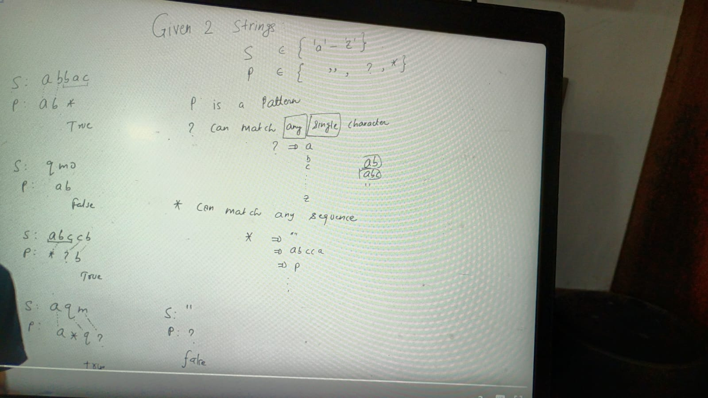
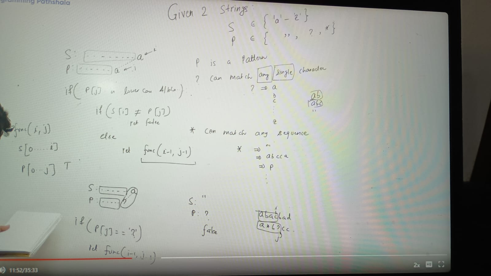
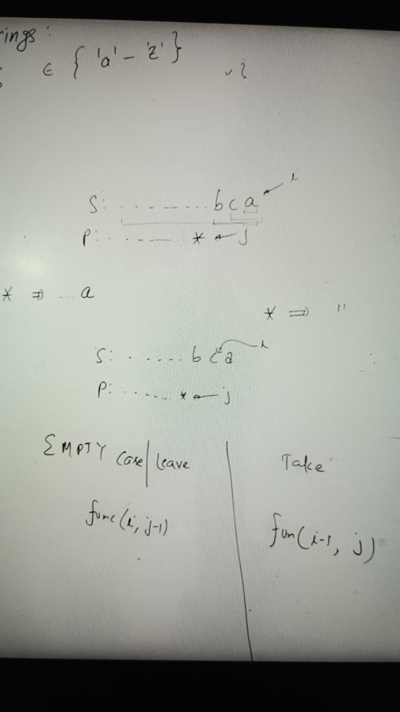
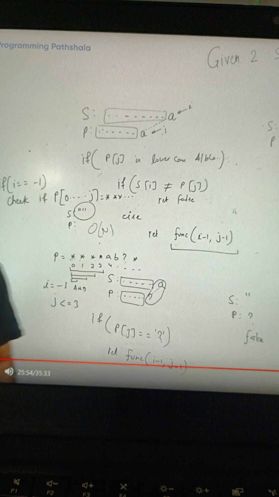
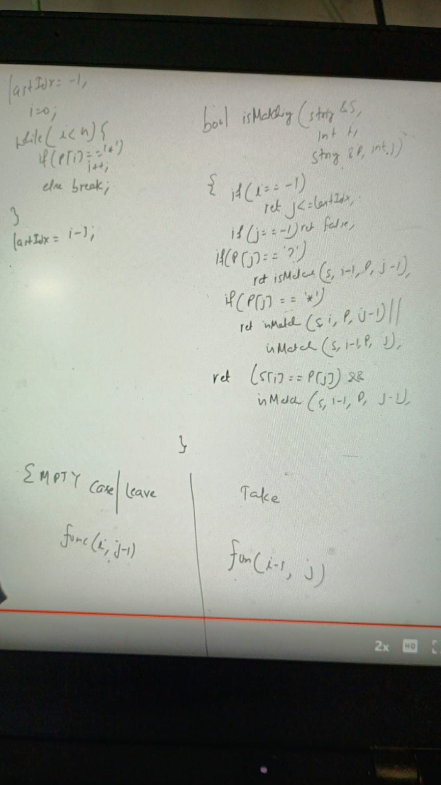
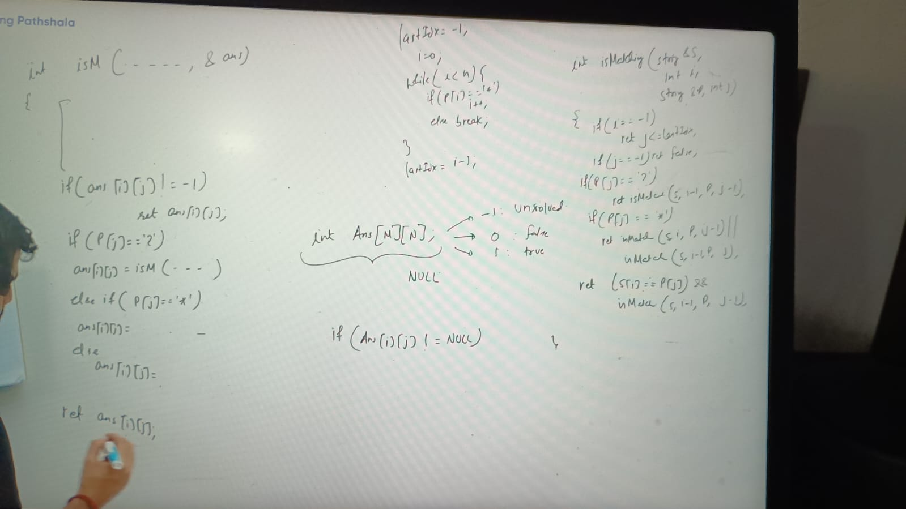
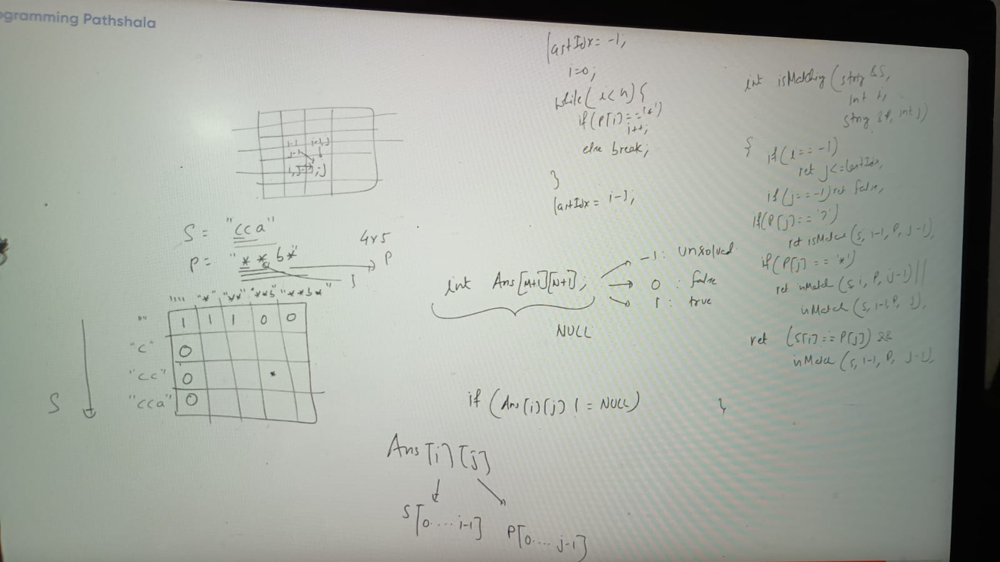

Given 2 String
S = {'a', ..."Z"}, small a to capital Z
P = {"", ?, *"}

P is a pattern
? can match any single character
* can match any sequence

    S: ........... a (i)
    P: ..........b (j)

I dont know which chars comes before a or before b in S and P respectively, and P[j] falling alphabetic chars

**if (p[j] is lower case alphabet): 2 things can happen**

      a) lower case alphabet which doesn't match with S[i]
    
      b) lower case alphabet which is match with S[i]
  
In this case pattern never match because last char didn't match so we can return "false"  in this case

    if (S[i] != P[j])  return false
    else if (S[i] == P[j])// In this case if last char match with pattern now we have to focus on S[i-1] & P[j-1]
    return fun(i-1, j-1)
    else if (P[j] == '?')
    return fun(i-1, j-1)
    else if (P[j] == '*')

If P is * we have elements of choices, either we can take and leave:

Example:

    S: ba
    P: ba*

    fun(1, 2) -> Here either we can leave * (left) or take * (right)
                   f(1, 2)
                  T/     \F
                f(1, 1)  f(0, 2) -> b & ba* doesn't match

What is meaning of f(1, 1) -> a prefix of S which is ending at 1 that is ba and a prefix of P which is ending at 1
which is ba 

No matter which condition is going to true i and j is reducing here so at a point its can we 0/-ve
    
     if(i < 0) // S : ""
     check if P[0...j] == ***.. return true else false

we have to travel P here from 0... j, can we make it o(1) rather that o (n)
Example:

    S: ""
    P: ****ab?*
    
    i == - and j <= 3

if there is continuous stretch or * from 0 then what is lastIndex of that *
lastIndex = 3
if(i == -1)
j<= lastIndex

if (j == -1) means prefix of pattern is empty
S: "asf"
P: ""
empty Pattern means, empty pattern matches non empty string, no
so we need to retrun false
if (j == -1)
  return false

### Implementation:

###  Memorization:

o(m*n)

### Bottom Top

array size increase with extra row& column

