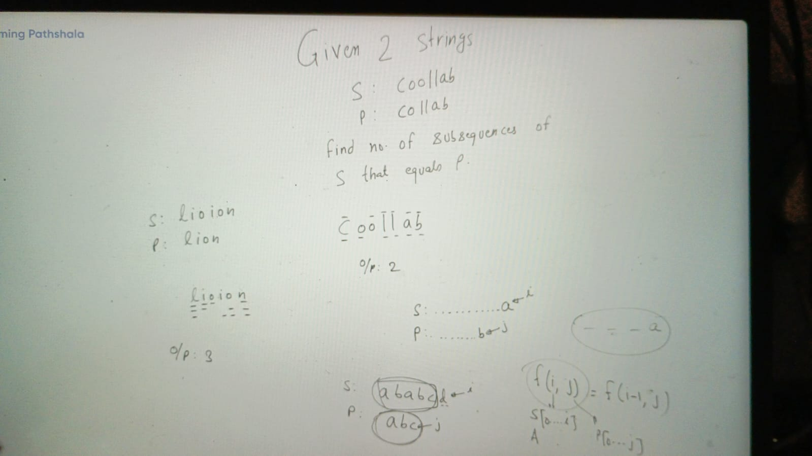
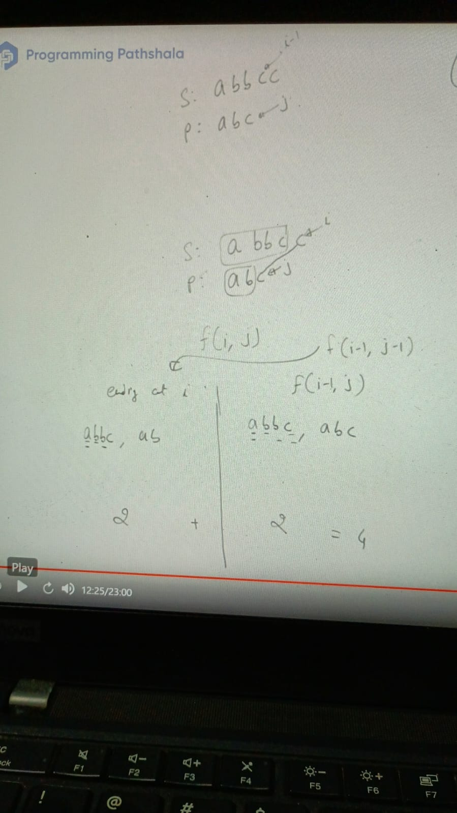
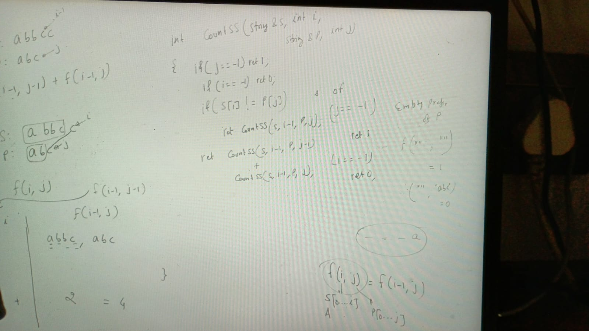
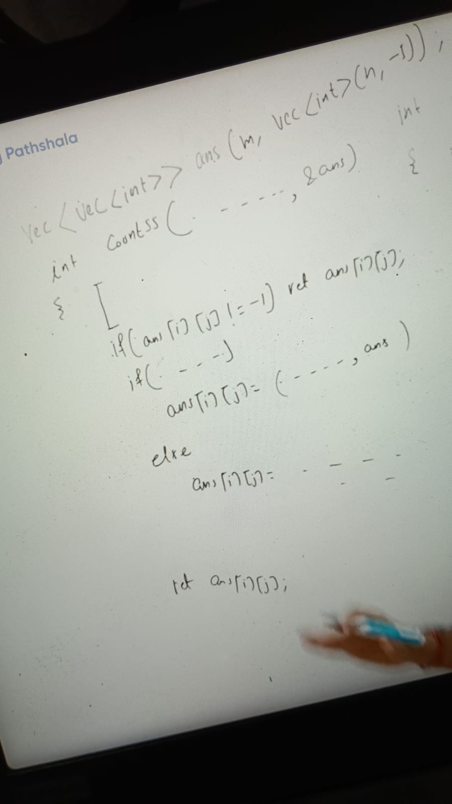
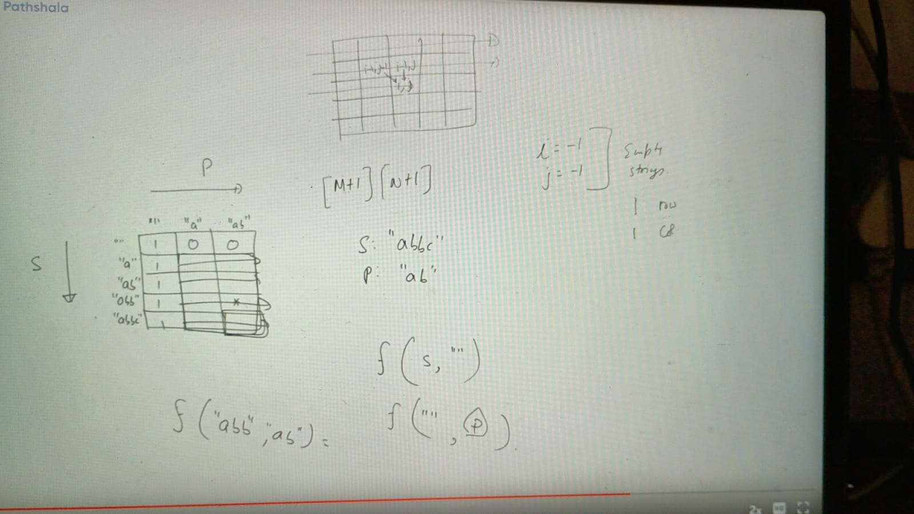

Given 2 strings
S: coollab
P: collab

Find no. of subsequences of S that equals P

Example:
from S by 2 ways we can build P
o/p: 2

Last chars not matched:

Last chars matched:

final recurance relation:

f(i, j) = f(i-1, j) //last chars doesnt match
        = f(i-1, j-1) + f(i-1, j) // last chars match and let fix i and not fix i

    f(i, j) = f(i-1, j-1) + f(i-1, j)

j == - 1 -> p = "" // empty prefix of P
if(j == - 1 && i == -1) return 1
f("xy", "") = return 1 // every string has 1 empty subsequence

if (j != - 1 && i == -1) f("", "abc")// not possible subsequence of empty is not empty so in this case we have to return 0
  return 0

### Implementation:

### Memoize:

TC: o(m*n)
SC: O(m*n)

### Bottom Top:

Assignments:
https://leetcode.com/problems/distinct-subsequences/description/
https://leetcode.com/problems/regular-expression-matching/description/
https://leetcode.com/problems/wildcard-matching/description/
https://leetcode.com/problems/wildcard-matching/description/