### Longest Common Polindromic subsequence

1. Using LCS(s1, s2)

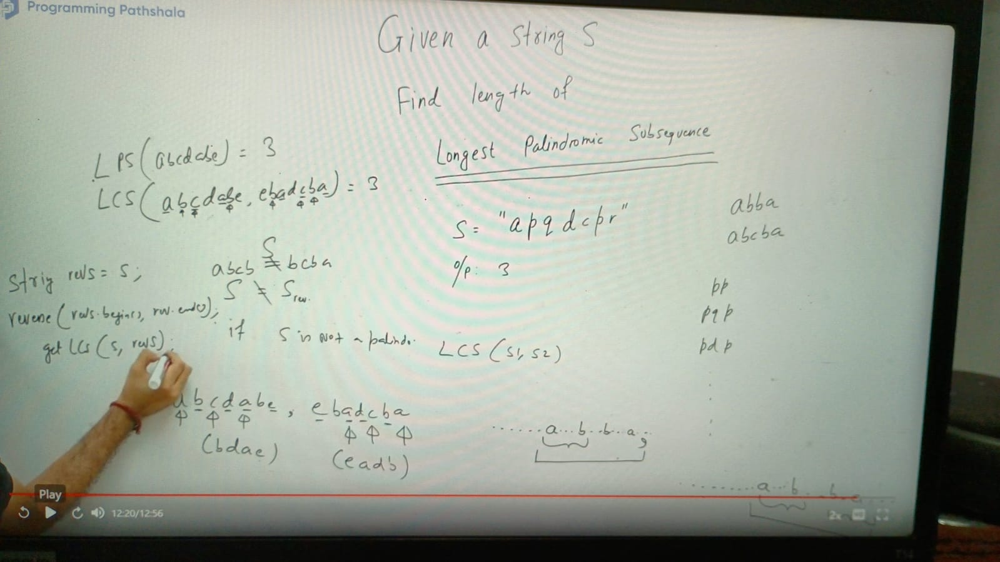

Case 1. When starting and ending chars match:
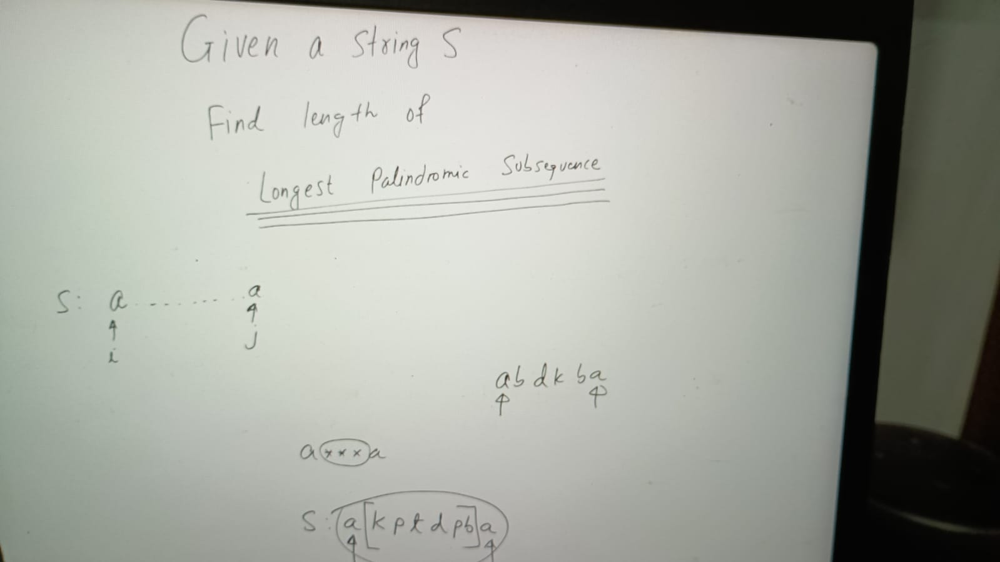

f(i, j) = LPS in S[i...j]
        = if(s[i] == s[j]) {
        2 + f(i + 1, j-1)
} else  //Case 2. When starting and ending chars doesn't match:
  return max ( f(i + 1, j), f(i, j-1))

**Note:** 
To denote the entire string to make a call for f(0, n-1), because when we call f(i, j), we call the part s[i] + s[j]

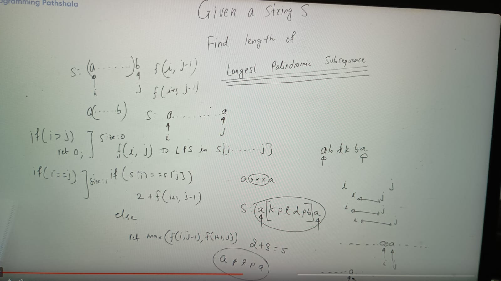
if (i == j) return 1

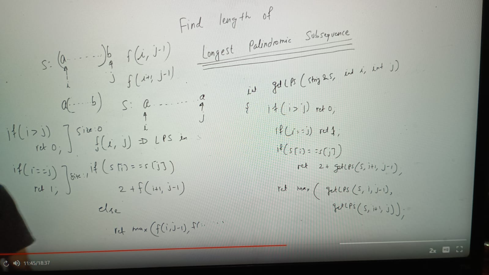

resolve overlapping problem:
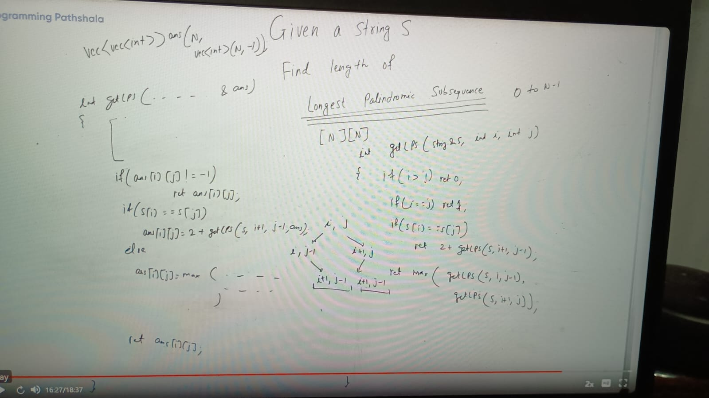

TC: o(n^2)
SC: O(n^2)

Bottom Top:

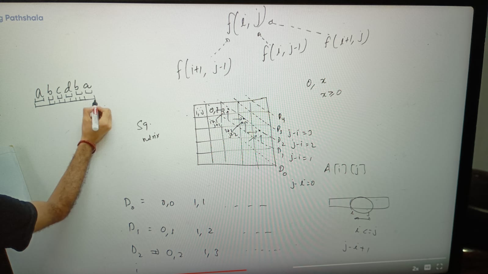

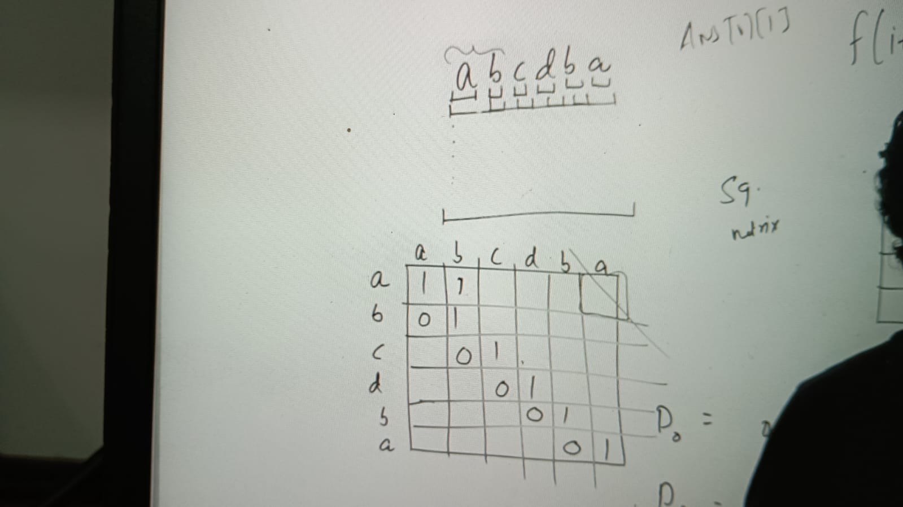

Implementation:
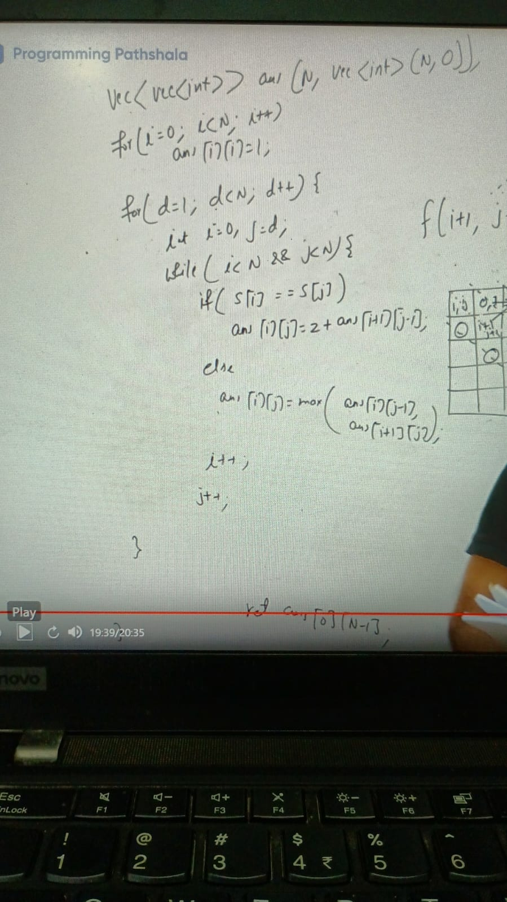

### Longest polindromic substring
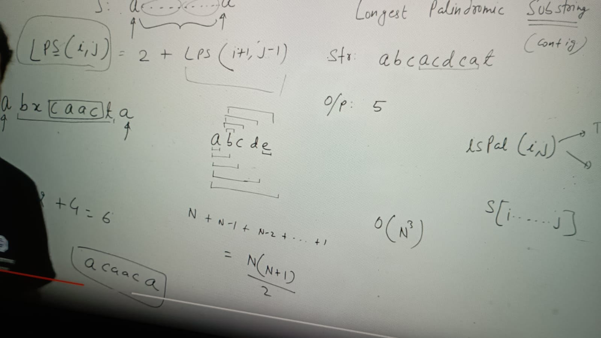

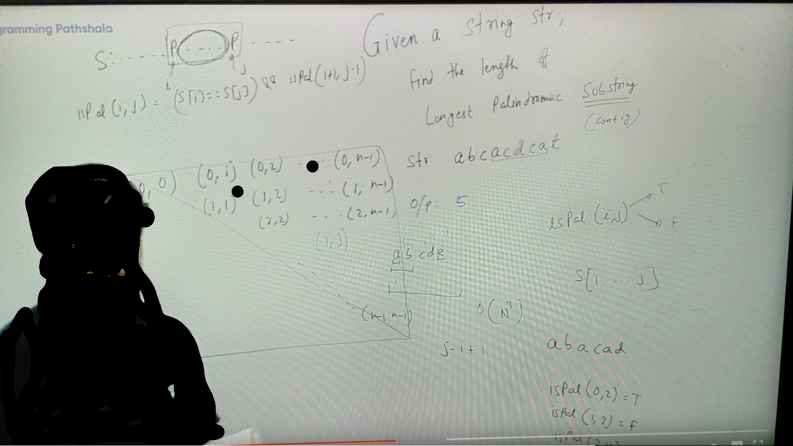

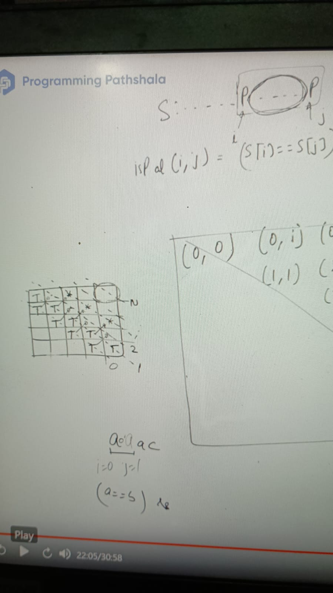

Implementation:

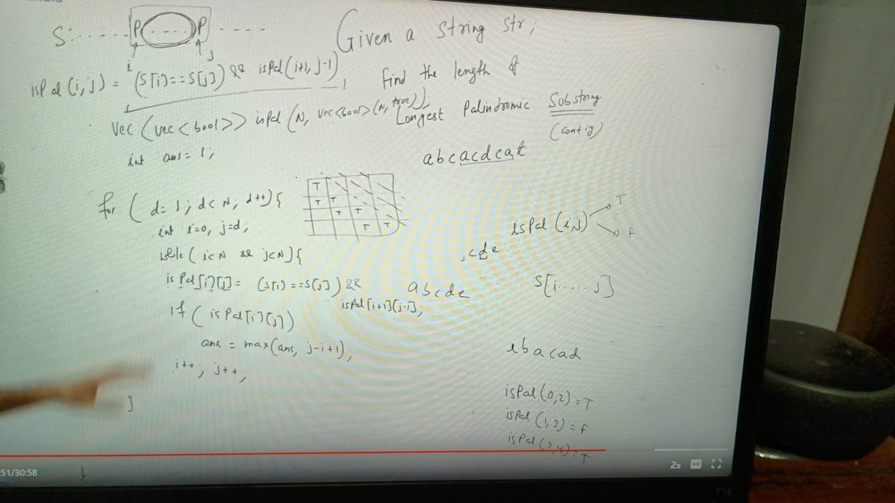

Assignments:
https://leetcode.com/problems/palindrome-partitioning-ii/description/
https://leetcode.com/problems/palindrome-partitioning-ii/description/
https://leetcode.com/problems/longest-palindromic-substring/description/
https://leetcode.com/problems/longest-palindromic-subsequence/description/
https://leetcode.com/problems/longest-palindromic-subsequence/description/