What is DP
Dynamic programming is a technique for solving a complex problem by breaking into a collection of simpler subproblems, solving each subproblem just once, and then storing their solutions to avoid repetitive computations. It is mainly an optimization over plain recursion. Wherever we see a recursive solution with repeated calls for the same inputs, we can optimize it using Dynamic Programming. This simple optimization reduces time complexities from exponential to polynomial.

For example:

Finding Fibonacci numbers-

Recursion:
int fib(n){

                if(n<=1) return n;

                return fib(n-1)+fib(n-2);

            }

    Time Complexity: O(2^N)

Dynamic Programming:
arr[0]=1;

        arr[1]=1;

        for(int i=2;i<=n;i++){

            arr[i]=arr[i-1]+arr[i-2];

        }

        return arr[n];

     Time Complexity: O(N)

Top Bottom vs Bottom Top
There are two approaches to dynamic programming:

Top-down approach
Bottom-up approach
Top-Down approach follows the memoization technique. Here memoization is equal to the sum of recursion and caching. Recursion means calling the function itself while caching means storing the intermediate results.

Advantage- It solves the subproblems only when it is required.
Disadvantage- It uses the recursion technique that occupies more memory in the call stack. Sometimes when the recursion is too deep, the stack overflow condition will occur.

        int fib(n, vector<int>& dp){

            if(n<=1) return n;

            if(dp[n]!=-1) return dp[n];

            dp[n]= fib(n-1,dp)+fib(n-2,dp);

            Return dp[n];

        }

Bottom-up approach uses the tabulation technique to implement the dynamic programming approach. It solves the same kind of problems, but it removes the recursion. In this tabulation technique, we solve the problems and store the results in a matrix, so it is also known as the tabulation or table filling method.

Advantage- Recursion is not involved; hence there is no stack overflow issue and no overhead of the recursive functions.
Disadvantage- It solves all the subproblems.

        arr[0]=1;

        arr[1]=1;

        for(int i=2;i<=n;i++){

            arr[i]=arr[i-1]+arr[i-2];

        }

        return arr[n];

Staircase Problem
We have been given a staircase of height ‘N’. We can climb 1 or 2 steps at a time. Find the total number of ways to reach the top.

Input: 5

Output: 8

Approach:

The person can reach to ith stair from (i-1)th stair by climbing 1 step or (i-2)th stair by climbing two steps. i.e.

ways(i) = ways(i-1) + ways(i-2)

Also, if you notice, it matches with the states of Fibonacci numbers.

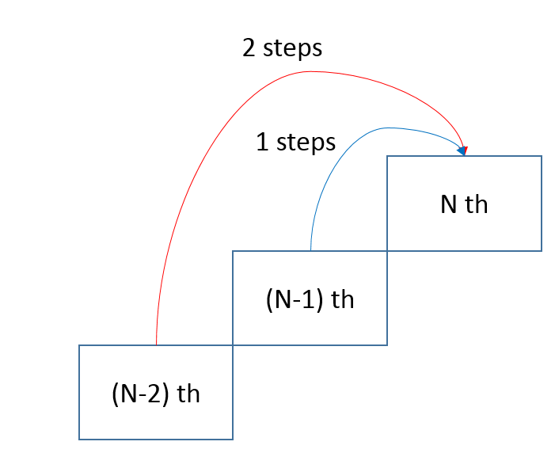

Brute Force - A simple method that is a direct recursive implementation.

Time complexity: O(2^N)

Auxiliary Space: O(1)

Memoization - We can use the bottom-up approach of DP to solve this problem as well. We can create an array ways[] and initialize it with -1. Whenever we see that a subproblem is not solved, we can call the recursive method; else, we stop the recursion if the subproblem is solved already.

Time complexity: O(N)

Auxiliary Space: O(N)

Tile the Lane
We have been given a lane of dimension ‘2x N’. We have to tile the lane with tiles of dimension 2x1. Find the total number of ways to tile the lane.

Input: 5

Output: 8

Approach:

Currently, we have a rectangle of dimension 2xN. If we put a tile vertically, we’ll be left with a rectangle of dimension 2x(N-1) and If we put two tiles horizontally, we’ll be left with a rectangle of dimension 2x(N-2).

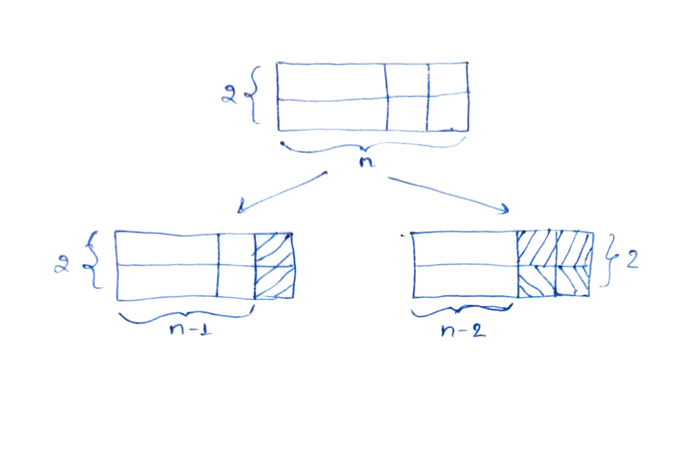

ways(i) = ways(i-1) + ways(i-2)

Also, if you notice, it matches with the states of Fibonacci numbers.

Brute Force - A simple method that is a direct recursive implementation.

Time complexity: O(2^N)

Auxiliary Space: O(1)

Memoization - We can use the bottom-up approach of DP to solve this problem as well. For this, we can create an array ways[] and initialize it with -1. Whenever we see that a subproblem is not solved, we can call the recursive method; else, we stop the recursion if the subproblem is solved already.

Time complexity: O(N)

Auxiliary Space: O(N)

Maximum Non Adjacent Sum - 1
We have been given an array of integers. We have to find the maximum sum subsequence such that no two elements in the sequence are adjacent to each other in the array.

Input: [1, 10, 100, 40, 20]

Output: 121

Approach:

Every element in the array has two choices, either to be in the subsequence or to be left out. So the answer would be whatever of the two choices gives the maximum sum.

Maxsum[0,1,.........,n-1] = max ( arr[0] + Maxsum[2,3,....,n-1] , Maxsum[1,2,....,n-1] )

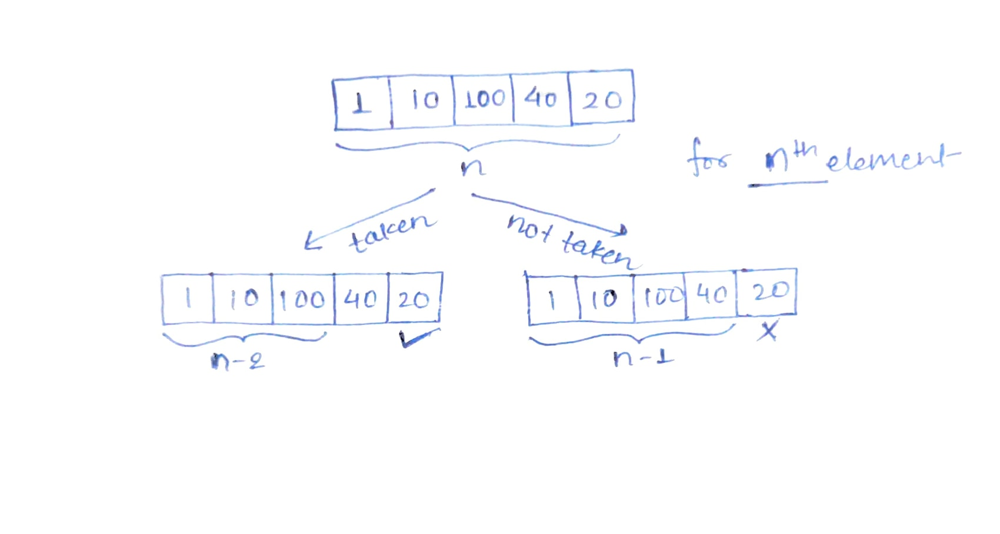

Brute Force - A simple method that is a direct recursive implementation.

Time complexity: O(2^N)

Auxiliary Space: O(1)

Memoization - We can use the Bottom-Up approach of DP to solve this problem as well.

We can create an array ans[] and initialize it with -1. If the subproblem is already solved, i.e., ans[i]!=-1, we’ll stop the recursion by returning ans[i] else, we’ll use the recursive approach i.e.

ans[i]= max(arr[i]+ maxsum(i+2,ans,arr), maxsum(i+1,ans,arr).

Time complexity: O(N)

Auxiliary Space: O(N)

Bottom-Top - We will create an array ans[] of size n. The state for ith index will be same here as well. i.e. ans[i]=max(arr[i]+ans[i-2], ans[i-1]). ans[i] is dependent on ans[i-1] ans ans[i-2] so we’ll have to initialize ans[0] and ans[1]. Clearly, ans[0]=max(0,arr[0]) and ans[1]=max(ans[0], arr[1]).

Time complexity: O(N)

Auxiliary Space: O(N)

Follow up: Can you come up with a solution that takes O(1) space?

Maximum Non Adjacent Sum - 2

We have been given a matrix of size 2*n. We have to find the maximum sum subsequence such that no two elements in the sequence are adjacent (horizontally/vertically/diagonally) to each other in the array.

Input: [[4,70], [100,50], [200,4], [0,2]]

Output: 270

Approach:

This question is a variation of ‘maximum adjacent subarray sum-1’. In this case, instead of ith position, we have ith column of 2 elements. Every column in the array has two choices, either to be in the subsequence or to be left out. If a particular column is selected, again we have 2 choices, we can take the first element or the second element. So the answer would be whatever of the two choices gives the maximum sum.

Maxsum[0,1,.........,n-1] = max ( max(arr[0][0],arr[0][1]) + Maxsum[2,3,....,n-1] , Maxsum[1,2,....,n-1] )

Brute Force - A simple method that is a direct recursive implementation.

Time complexity: O(2^N)

Auxiliary Space: O(1)

Memoization - We can use the Bottom-Up approach of DP to solve this problem as well. We can create an array ans[] and initialize it with -1. If the subproblem is already solved, i.e., ans[i]!=-1, we’ll stop the recursion by returning ans[i] else, we’ll use the recursive approach i.e.

ans[i]= max(max(arr[i][0],arr[i][1])+ maxsum(i+2,ans,arr), maxsum(i+1,ans,arr).

Time complexity: O(N)

Auxiliary Space: O(N)

Bottom-Top - We will create an array ans[] of size n. The state for ith index will be same here as well. i.e. ans[i]=max(max(arr[i][0],arr[i][1])+ans[i-2], ans[i-1]). ans[i] is dependent on ans[i-1] ans ans[i-2] so we’ll have to initialize ans[0] and ans[1]. Clearly, ans[0]=max(0,arr[0]) and ans[1]=max(ans[0], arr[1]).

Time complexity: O(N)

Auxiliary Space: O(N)

Count of Decodings - 1
A string containing letters from A-Z can be encoded into numbers using the following mapping:

'A' -> "1"

'B' -> "2"

...

'Z' -> "26"

We have been given an encoded string containing only digits, We have to find the number of ways to decode it.

Input: “121”

Output: 3

Approach:

Every time we encounter a new char c, we have two choices:

If we can decode it with the previous char p, if c=’2’ and p=’1’, we can consider it as ‘AB’ (taking them separately) or as ‘L’ (taking them as one). So we have two choices here.
If we can’t decode it with the previous char p, if c=’2’ and p=’3’, we can consider them collectively as 32 doesn’t represent any character. So in such cases, we have only choice to consider them independently and it would give ‘CB’.
What if we encounter ‘0’? It independently doesn’t represent any character, so the only choice is to consider it with the previous char p. We have only two valid possibilities of p 1 and 2. In other cases, we can’t find a valid string.

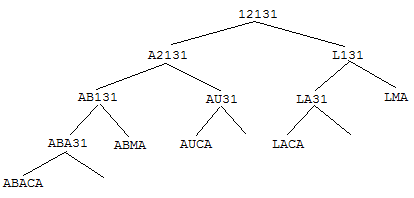

Brute Force - A simple method that is a direct recursive implementation.

Case 1: Pick single element

            if(s[idx]>’0’)

           -> ways = func(s, idx+1, n)  

Case 2: Pick couple

           if(idx+1 < n && ((s[idx] == '1' && s[idx+1] <= '9') || (s[idx]=='2' && s[idx+1] < '7')))

          => ways += func(s, idx+2, n)

Base condition:
Case 1: If the current element is 0, we simply return 0 as it is not possible to get a character using 0.

         Case 2: if(idx >= n) return 1;  i.e. we have encoded string.

Time complexity: O(2^N)

Auxiliary Space: O(1)

Memoization - We can use the Bottom-Up approach of DP to solve this problem as well. We can create an array ans[] and initialize it with -1. If the subproblem is already solved, i.e., ans[i]!=-1, we’ll stop the recursion by returning ans[i] else, we’ll use the recursive approach i.e.

Time complexity: O(N)

Auxiliary Space: O(N)

Count of Decodings - 2
Bottom-Top - We will create an array ans[] of size n. Clearly, ans[0]=1, because we have one way to represent a char except when the first char is ‘0’.

For ith index, we have 2 cases

Case 1: Pick single element (if it’s greater than 0)
ans[i]+=ans[i-1]

Case 2: Pick couple (if it’s valid case)
ans[i]+=ans[i-2]

Time complexity: O(N)

Auxiliary Space: O(N)

Follow up: Can you come up with a solution that takes O(1) space?

Rod Cutting Problem
We are given a rod of size ‘N’. It can be cut into pieces. Each length of a piece has a particular price given by the price array. We have to find the maximum revenue that can be generated by selling the rod after cutting( if required) into pieces.

Input: [2, 5, 9, 9, 10, 10, 11], N=7

Output: 20

Approach:

If the current length of the rod is ‘x’, then we have a choice of making a cut length of 1 to x. Suppose we make a cut of ‘y’ length, we can sell this y length for prices[y] and the remaining length is x-y. Again we have the choices to cut the remaining length. So we are generating all configurations of different pieces and finding the highest-priced configuration. The interesting thing to note is that If we cut the piece of length ‘y’, we can still cut another piece from the remaining length of size ‘y’ again.

rodcut(n) = max ( prices[i] + rodCut(n – i) ) where 1 <= i <= n

Brute Force - A simple method that is a direct recursive implementation.

Time complexity: O(N^N)

Auxiliary Space: O(1)

Memoization - We can use the Bottom-Up approach of DP to solve this problem as well.

We can create an array ans[] of size n+1 and initialize it with -1. If the subproblem is already solved, i.e., ans[i]!=-1, we’ll stop the recursion by returning ans[i] else, we’ll use the recursive approach i.e.

    ans[i]=max(ans[i], prices[j-1]+maxval( i-j, ans, prices)) where 1<=j<=i

Time complexity: O(N^2)

Auxiliary Space: O(N)

Bottom-Top - We will create an array ans[] of size n+1. The state for ith index will be the same here as well. For every ith index, we will run a loop from 1 to i length and find out which cut gives us the maximum answer.

           For i-> 1 to n

               For j-> 1 to i

                     ans[i]=max of (ans[i], prices[j-1]+ans[i-j])

Time complexity: O(N^2)

Auxiliary Space: O(N)

Coin Change - 1
We are given coins of several denominations and there is an infinite supply of each denomination. Find the minimum number of coins required to make an amount ‘N’.

Input: [1, 5, 7]  N=9

Output: 3

Approach:

If the current amount is ‘x’, then we have a choice of taking any denomination which is less than or equal to ‘x’. Suppose we take a coin of ‘y’ denomination, the count of taken coins increases by one and the remaining amount is x-y. Again we will have certain coins whose denomination will be less than the current amount and we’ll have the option of taking any. So we are generating all configurations of different coins and finding the configuration which takes the minimum number of coins.

ans(n) = min( 1 + ans(n – coins[i]) ) where 0 <= i < size(coins) and coins[i]<=n

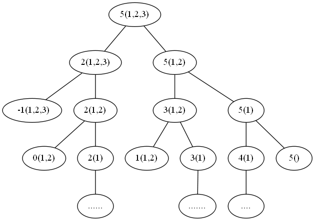

Brute Force - A simple method that is a direct recursive implementation.

Time complexity: O(N^N)

Auxiliary Space: O(1)

Memoization- We can use the Bottom-Up approach of DP to solve this problem as well. We can create an array ans[] of size n+1 and initialize it with -1. If the subproblem is already solved, i.e., ans[i]!=-1, we’ll stop the recursion by returning ans[i] else, we’ll use the recursive approach i.e.

    ans[i]=min(ans[i], 1+mincoin( i-coins[j], ans, coins)) where 0<=j< size(coins)

Base condition:

if(curr_amount==0) return 0
if(curr_amount<0 ) return INT_MAX
Time complexity: O(N^2)

Auxiliary Space: O(N)

Bottom-Top - We will create an array ans[] of size n+1. The state for ith index will be the same here as well. For every ith index, we will run a loop from 1 to i length and find out which cut gives us the minimum answer.

           For i-> 1 to n

               For j-> 1 to size(coins]

                     ans[i]=min of (ans[i], 1+ans[i-coins[j])

Time complexity: O(N^2)

Auxiliary Space: O(N)

Coin Change - 2
We are given coins of several denominations, and there is an infinite supply of each denomination. Find the total number of ways to make an amount ‘N’.

Input: [1, 2, 3]  N=4

Output: 4

Approach:

If the current amount is ‘x’, then we have a choice of taking any denomination which is less than or equal to ‘x’. We have the option of taking that coin in our configuration or not taking it. The summation of these possible two cases will give the total number of ways. Since the supply of each denomination is infinite, we can take it any number of times.

Brute Force - A simple method that is a direct recursive implementation.

-> ways = func(rem_amount-coin[i], i)  + func(rem_amount], i-1)

Base condition:
Case 1: If the rem_amount is 0, we return 1 as it is one of the possible configurations.
Case 2: if(i<0) return 0; no coin denomination left, so not possible.
Case 3: if(rem_amount<0) return 0; no way we can make a negative amount.
Time complexity: O(N^N)

Auxiliary Space: O(1)

Memoization- We can use the Bottom-Up approach of DP to solve this problem as well.

We can create an array matrix[size(coins)][N+1] and initialize it with -1. If the subproblem is already solved, i.e., ans[i][rem_amount]!=-1, we’ll stop the recursion by returning ans[i][rem_amount] else, we’ll use the recursive approach i.e.

Time complexity: O(N^2)

Auxiliary Space: O(N^2)

Bottom Top For Coin Change - 2
In the bottom-up approach, our state was dependent on two variables index of coins array and rem_amount. If we replace them with (i,j), then the state will be:

f(i,j)= f(i-1,j)+f(i,j-coins[i])

Suppose the size of the coins array is ‘m’ and the total amount is ‘n’

We will declare a matrix dp of size (m+1)*(n+1).

Initializations:

If the total amount is 0, then irrespective of the size of the coins array, the total ways will be 1.
So dp[0][i]=1 where 0<=i<=n

If the size of the coins array is 0, then it is impossible to make the total sum greater than 0.
So dp[i][0]=0 where 0<i<=m (notice that i > 0, because there is a way to make total sum equal to zero even if the array is empty)
So the final state will look like:

    For i-> 1 to m

         For j-> 1 to n

                dp[i][j]=dp[i-1][j]

                if(j>=coins[i-1]) 

                          Dp[i][j] += dp[i][j-coins[i-1]]

Time complexity: O(N^2)

Auxiliary Space: O(N^2)

Space Optimised Coin Change - 2
If we have to fill x-th row, then we need only x-th and (x-1)-th row. To make it more precise, if we have to fill cell (i,j), we need all the cells in i-th row that are less than j, and cell (i-1,j) in (i-1)th row. So instead of using a matrix, we can use an array.

Initializations:

To initialize the matrix, what we did was dp[0][0]=1 and dp[i][0]=0 where 0<i<=m.

If we relate it here, First element of the array will be 1, and the rest elements will be 0.

In normal bottom-top approach, the state was f(i,j)= f(i-1,j)+f(i,j-coins[i]). for f(i-1,j), we can use the same f(i,j). Why? If we are making changes in same array, effectively while changing f(i,j), we are in cell f(i-1,j). Hence, state in this case will be:

f(j)= f(j)+f(j-coins[i])

         for i-> 0 to coins.size()

                For j-> 1 to n

                      dp[j]=dp[j]+dp[j-coins[i]]   (if j>=coins[i])

    0/1 Bounded Knapsack - 1
We are given two arrays prices[n] and wt[n] which represent prices and weights associated with n items respectively. Also given an integer W which represents knapsack capacity, find out the maximum profit such that the total weight of items is smaller than or equal to W. You cannot break an item, either pick the complete item or don’t pick it (0-1 property).

Input: wt[]= {4,3,5},  prices[]={30,20,40}, W=7

Output: 50

Why a Greedy Solution doesn’t work?

The first approach that comes to our mind is greedy. A greedy solution will fail in this problem because there is no ‘uniformity’ in data. While selecting a local better choice we may choose an item that will in long term give less value.

Let us understand this with help of an example:

N=3, W=7

wt[]= {4,3,5}

prices[]={30,20,40}

A Greedy solution will be to take the most valuable item first, so we will take an item on index 2, with a value of 40, and put it in the knapsack. Now the remaining capacity of the knapsack will be 2. Therefore we cannot add any other item. So a greedy solution gives us the answer 40.

Now we can clearly see that a non-greedy solution of taking the first two items will give us the value of 50 (30+20) in the given capacity of the knapsack.

Approach:

Every item has two choices, To be taken in the knapsack, And Not to be taken in the knapsack. Therefore, the maximum value that can be obtained from ‘n’ items is the max of the following two values.

Maximum value obtained by n-1 items and W weight (excluding nth item).
Value of nth item plus maximum value obtained by n-1 items and W minus the weight of the nth item (including nth item).
Also, note that If the weight of ‘nth’ item is greater than ‘W’, then the nth item cannot be included and Case 1 is the only possibility.

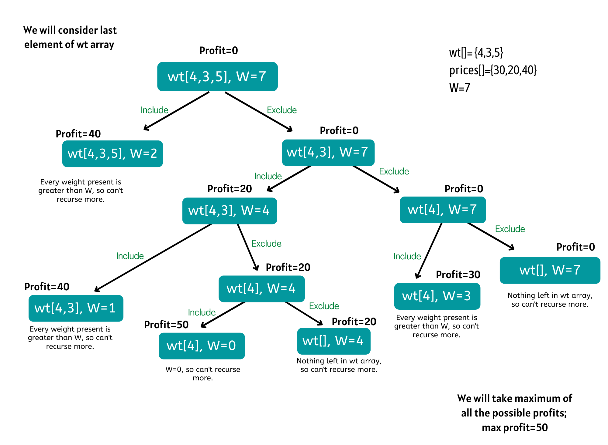

Brute Force - A simple method that is a direct recursive implementation. We will have two parameters here. We are given ‘n’ items. So clearly one parameter will be index up to which the array items are being considered. The second parameter is ‘W’. We need the capacity of the knapsack to decide whether we can pick an item or not in the knapsack.

maxprofit[n]=max( maxprofit(n-1,w) , prices[n] + maxprofit(n-1, w-wt[n]) )

Base condition:
Case 1 : If w<0, that means there is any invalid pick so return -inf to avoid considering this case in answer.
Case 2 : if(i<0 || w==0) return 0; this is a valid case.
Time complexity: O(2^N)

Auxiliary Space: O(1)

Memoization- We can use the Bottom-Up approach of DP to solve this problem as well.

We can create an array ans[N][W+1] and initialize it with -1. If the subproblem is already solved, i.e., ans[i][w]!=-1, we’ll stop the recursion by returning ans[i][rem_amount] else, we’ll use the recursive approach i.e.

Time complexity: O(N*W)

Auxiliary Space: O(N*W)

0/1 Bounded Knapsack - 2
Bottom-Top - We will create an array ans[N+1][W+1]. States will remain the same here as well.

ans[i][j]= max(taken, not_taken)

Where, taken is if the current item is picked, so taken=ans[i-1][j-wt[i-1]] + prices[i-1]

And, not_taken is if the current item is not taken, so not_taken= ans[i-1][j]

Initializations:

For 0th column, if the weight (i.e. W) is 0, then the maximum profit will be 0. Hence, ans[0][i]=0, where 0<=i<=N
For 0th row, if there is no item, then the maximum profit will be 0. Hence, ans[i][0]=0, where 0<=i<=W
Time complexity: O(N*W)

Auxiliary Space: O(N*W)

Space optimization for Bottom-top:

If we closely look at the relation,

ans[i][j] =  max(ans[i-1][j] ,ans[i-1][j-wt[i-1]]

We see that to calculate a value of a cell of the ansarray, we need only the previous row values. So, we don’t need to store an entire array. Hence we can space optimize it.

We’ll take two arrays here, ans[W+1] and temp[W+1]. Where ans array will store values for ith row and temp will store values of (i-1)th row. After calculating values for ith row, we’ll assign its values to temp array, so that for calculation of (i+1)th row it can be considered as ith row.

Time complexity: O(N*W)

Auxiliary Space: O(W)

Longest Increasing Subsequence
We are given an array of integers. We have to find the length of the longest increasing subsequence.

Input: 11, 0, 5, 3, 7, 9, 2

Output: 4
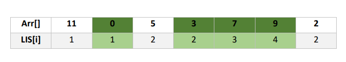

Brute Force - A simple method that is a direct recursive implementation. We will generate all the subsequences and whichever subsequence is longest and increasing will be the answer.

Time complexity: O(2^N)

Auxiliary Space: O(1)

Bottom-top - Suppose we have to find LIS ending up to index i, and we know LIS at every index which is smaller than i. We can iterate from 0 to i-1 and let's assume index varies in j. So if arr[j] is smaller than arr[i], we can say LIS up to i is equal to 1 + LIS up to j. We will take the max of all possible values of j and that will be LIS at index i.

We will take an array lis of size n, and initialize it with 1. Because at every index, the minimum length of an increasing subsequence is 1, i.e. that element itself.

    For i-> 0 to n

         For j-> 0 to i

             if(arr[j]<arr[i]) lis[i]=max(lis[i], 1+ lis[j])

Time complexity: O(N^2)

Auxiliary Space: O(N)

Longest Bitonic Subsequence
We are given an array of integers. We have to find the length of the longest bitonic subsequence. Bitonic sequence means a sequence that increases first and then decreases. A sequence, sorted in increasing order is considered Bitonic with the decreasing part as empty. Similarly, decreasing order sequence is considered Bitonic with the increasing part as empty.

Input: 11, 0, 5, 3, 7, 9, 2

Output: 5

Approach:

This problem is a variation of standard Longest Increasing Subsequence (LIS) problem. Let the input array be arr[] of length n. We need to construct two arrays lis[] and lds[] using Dynamic Programming solution of LIS problem. lis[i] stores the length of the Longest Increasing subsequence ending with arr[i]. lds[i] stores the length of the longest Decreasing subsequence starting from arr[i]. Finally, we need to return the max value of lis[i] + lds[i] – 1 where i is from 0 to n-1.

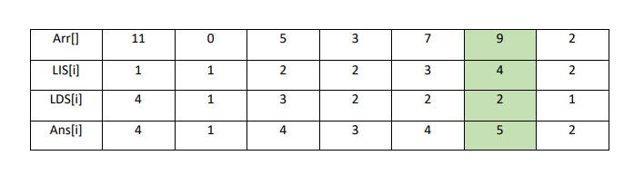

We already know how to calculate LIS. So let's move to calculate LDS.

Brute Force - A simple method that is a direct recursive implementation. We will generate all the subsequences and whichever subsequence is longest and decreasing will be the answer.

Time complexity: O(2^N)

Auxiliary Space: O(1)

Bottom-top - Suppose we have to find LDS starting at index i, and we know LDS at every index which is greater than i. We can iterate from i+1 to n and let's assume the index varies in j. So if arr[j] is smaller than arr[i], we can say LDS starting at i is equal to 1 + LDS starting at j. We will take the max of all possible values of j and that will be LDS starting at index i.

We will take an array lds of size n, and initialize it with 1. Because at every index, the minimum length of a decreasing subsequence is 1, i.e. that element itself.

    For i-> n to 1

         For j-> i+1 to n

             if(arr[j]<arr[i]) lds[i]=max(lds[i], 1+ lds[j])

Time complexity: O(N^2)

Auxiliary Space: O(N)

Overall Time complexity: O(N^2)

Overall Auxiliary Space: O(N)

Envelopes - 1
We are given N number of envelopes, as {W, H} pair, where W is the width and H is the height. One envelope can fit into another if and only if both the width and height of one envelope is greater than the width and height of the other envelope. Find the maximum number of envelopes that can be stacked inside each other. Flipping of envelope is not allowed.

Input: [[10,4], [2,7], [9,13], [5,8]]

Output: 3

Approach:

This problem is similar to the standard Longest Increasing Subsequence (LIS) problem. Instead of an array of integers, we are given an array of pairs of integers. Here, we will be finding the Longest increasing pair (LIP).

Also, we don't have to find a subsequence here, envelopes can be taken in any order. The idea is to sort the envelopes in non-decreasing order on the basis of their area (W*H) and for each envelope check the number of envelopes that can be put inside that envelope.

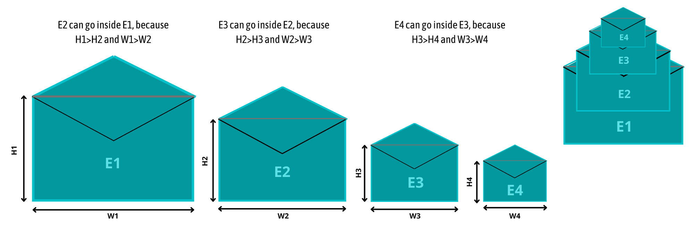

First we will sort the envelope array.

sort(arr.begin(), arr.end(),cmp)

where cmp is:

bool cmp(pair1, pair2){

      return  pair1.first < pair2.first

}

Bottom-top - Suppose we have to find LIP ending up to index i, and we know LIP at every index which is smaller than i. We can iterate from 0 to i-1 and let's assume the index varies in j. So if arr[j].first is smaller than arr[i].first and arr[j].second is smaller than arr[i].second, we can say LIP up to i is equal to 1 + LIP up to j. We will take the max of all possible values of j and that will be LIP at index i.

We will take an array lip of size n, and initialize it with 1. Because at every index, the minimum number of envelope stack is 1, i.e. that envelope itself.

    For i-> 0 to n

         For j-> 0 to i

             if(arr[j].first <arr[i].first and arr[j].second <arr[i].second) 

                      lip[i]=max(lip[i], 1+ lip[j])

Time complexity: O(N^2)

Auxiliary Space: O(N)

Envelopes - 2
We are given N number of envelopes, as {W, H} pair, where W is the width and H is the height. One envelope can fit into another if and only if both the width and height of one envelope is greater than the width and height of the other envelope. Find the maximum number of envelopes that can be stacked inside each other. Flipping of envelope is allowed.

Input: [[10,12], [19,14], [15,100]]

Output: 3

Approach:

This problem is variation of Envelops-1. Here also, we will be finding the Longest increasing pair (LIP). But while filling lip[i] we have 2 states, whether i-th envelope is flipped or not. So instead of creating an array, we will take a matrix of N*2. lip[i][0] will store the longest increasing pair up to i-th index if i-th envelope is not flipped and lip[i][0] will store the longest increasing pair up to i-th index if i-th envelope is flipped.

So LIP at i-th index can be given by:

If i-th envelope is not flipped
If we consider j-th envelope in its unflipped case
(j<i and w[i]>w[j] and h[i]>h[j])
If we consider j-th envelope in its flipped case
(j<i and w[i]>h[j] and h[i]>w[j])

lip[i][0]= max (case -a , case-b)

If i-th envelope is flipped
If we consider j-th envelope in its unflipped case
(j<i and h[i]>w[j] and w[i]>h[j])
If we consider j-th envelope in its flipped case
(j<i and h[i]>h[j] and w[i]>w[j])

lip[i][1]= max (case -a , case-b
Also, don’t forget to sort the envelopes in non-decreasing order on the basis of their area.

Bottom-top - We will create a matrix lip[n][2] and initialize it with 1. Because at every index, the minimum number of envelope stack is 1 in its flipped as well as unflipped form. Suppose we have to find LIP ending up to index i in both states, and we know LIP at every index which is smaller than i. We can iterate from 0 to i-1 and let's assume the index varies in j. We can fill lip[i][0] and lip[i][1] by above mentioned method.

    For i-> 0 to n

         For j-> 0 to i

             if(arr[j].first <arr[i].first and arr[j].second <arr[i].second) 

                      lip[i][0]=max(lip[i][0], 1+ lip[j][0])

    

             if(arr[j].second <arr[i].first and arr[j].first <arr[i].second) 

                      lip[i][0]=max(lip[i][0], 1+ lip[j][1])

    

             if(arr[j].first <arr[i].second and arr[j].second <arr[i].first) 

                      lip[i][1]=max(lip[i][1], 1+ lip[j][0])

    

             if(arr[j].first <arr[i].first and arr[j].second <arr[i].second) 

                      lip[i][1]=max(lip[i][1], 1+ lip[j][0])

Time complexity: O(N^2)

Auxiliary Space: O(N)

Longest Common Subsequence - 1
We are given 2 strings of length n and m. Find the length of their longest common subsequence (LCS).

Input: s1= “aabcb”, s2= “abab”

Output: 3

Brute Force - A simple method that is a direct recursive implementation. Two strings S1 and S2 (suppose of same length n) are given, the simplest approach will be to generate all the subsequences and store them, then manually find out the longest common subsequence.

Time complexity: O(2^N)

Auxiliary Space: O(1)

Approach for DP:

A single variable can’t express both the strings at the same time, so we will use two variables ind1 and ind2. They mean that we are considering string S1 from index 0 to ind1 and string S2 from index 0 to S2.

f(ind1,ind2) represents the LCS of s1[0….ind1] and s2[0….ind2].

In the function f(ind1,ind2), ind1 and ind2 are representing two characters from strings S1 and S2 respectively. Now, there can be two possibilities:

if(S1[ind1] == S2[ind2]): In this case, this common element will represent a unit length common subsequence, so we can say that we have found one character and we can shrink both the strings by 1 to find the longest common subsequence in the remaining pair of strings.

if(S1[ind1] != S2[ind2]): In this case, we know that the current characters represented by ind1 and ind2 will be different. So, we need to compare the ind1 character with shrunk S2 and ind2 with shrunk S1. But how do we make this comparison?  If we make a single recursive call as we did above to f(ind1-1,ind2-1), we may lose some characters of the subsequence. Therefore we make two recursive calls: one to f(ind1,ind2-1) (shrinking only S1) and one to f(ind1-1,ind2) (shrinking only S2). We will take the maximum of both choices.
Base case:

If (ind1<0 || ind2<0) return 0.
We will make a call to f(0-1,1), i.e f(-1,1) but a negative index simply means that there are no more indexes to be explored, so we simply return 0.

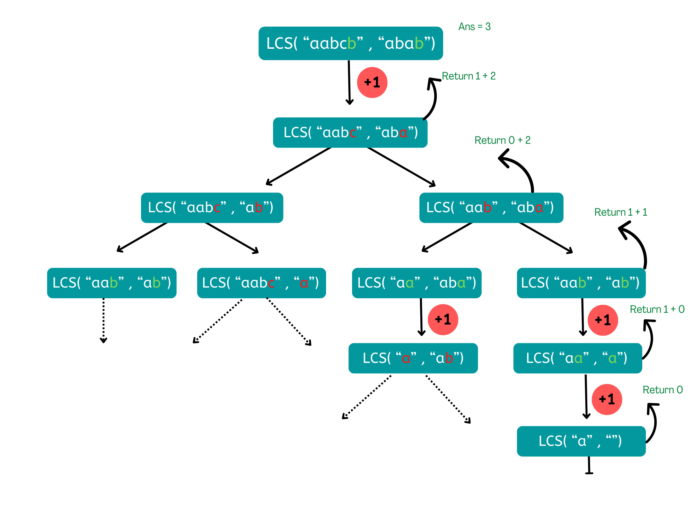

f(ind1, s1, ind2, s2){

        if(ind1<0 || ind2<0) return 0;

        if(s1[ind1]==s2[ind2]) return 1+f(ind1-1, s1, ind2-1, s2);

        return max(f(ind1-1, s1, ind2, s2), f(ind1, s1, ind2-1, s2));

    }

Memoization: We will create a ans matrix of size [N][M] where N and M are lengths of S1 and S2 respectively and initialize the matrix to -1. For findinf the answer of particular parameters (say f(ind1,ind2) ), we first check whether the answer is already calculated using the ans matrix(i.e ans[ind][ind2]!= -1 ). If yes, simply return the value of ans[ind][ind2]. If not, then we are finding the answer for the given value for the first time, we will use the recursive relation as usual.

Time complexity: O(N*M)

Auxiliary Space: O(N*M)

Longest Common Subsequence - 2

Bottom-Top: In the recursive logic, we set the base case to if(ind1<0 || ind2<0) but we can’t set the ans matrix’s index to -1. So instead of considering ans[ind1][ind2] ans longes common subsequence up to index ind1 and ind2, we will consider up to length of ind1 and ind2. While considering string s1 up to length ind1 and string s2 up to length ind2, we will have 2 possibilities:

if(S1[ind1-1] == S2[ind2-1]): In this case, this common element will represent a unit length common subsequence, so we can say that we have found one character and we can add this length to whatever LCS we found up to length ind1-1 and ind2-1. I.e.
ans[ind1][ind2]= 1+ ans[ind1-1][ind2-1]

if(S1[ind1-1] != S2[ind2-1]): In this case, we know that the current characters represented by ind1-1 and ind2-1 are different. So, we can take maximum of whatever LCS we found while considering length (ind1-1) of s1 and ind2 of s2, and while considering length ind1 of s1 and (ind2-1) of s2. I.e.
ans[ind1][ind2]= max( ans[ind1-1][ind2], ans[ind1][ind2-1])
Initializations:

If (ind1==0 || ind2==0): If length of s1 is 0 then we can’t have any subsequence, similarly if length of s2 is 0 then we can’t have any subsequence. So, dp[0][i]=0 where (0<= i <=m) and dp[i][0=0] where (0<= i <=n).
vector<vector<int>> ans(n+1,vector<int>(m+1));

    for i-> 0 to n

        dp[i][0] = 0;

     

    for i-> 0 to m

        dp[0][i] = 0;

     

    for ind1-> 1 to n

        for ind2-> 1 to m

            if(s1[ind1-1]==s2[ind2-1])

                ans[ind1][ind2] = 1 + ans[ind1-1][ind2-1];

            else

                ans[ind1][ind2] = max(ans[ind1-1][ind2],ans[ind1][ind2-1]);

     

    return ans[n][m];

Time complexity: O(N*M)

Auxiliary Space: O(N*M)

Space optimization for Bottom-top:

If we closely look at the relation,

ans[ind1][ind2] = 1 + ans[ind1-1][ind2-1];

ans[ind1][ind2] = max(ans[ind1-1][ind2],ans[ind1][ind2-1]);

We see that to calculate a value of a cell of the ans matrix, we need only the previous row values. So, we don’t need to store an entire array. Hence we can space optimize it. We’ll take two arrays here, ans[M+1] and temp[M+1]. Where ans array will store values for ith row and temp will store values of (ind1-1)th row. After calculating values for ind1-th row, we’ll assign its values to temp array, so that for calculation of (ind1+1)th row it can be considered as ind1-th row.

Time complexity: O(N*M)

Auxiliary Space: O(M)

Printing Longest Common Subsequence
We are given 2 strings of length n and m. Print any one of their longest common subsequence (LCS).

Input: s1= “CBDA”, s2= “ACADB”

Output: “CA”

Approach:

We will continue from where we left in the previous lecture. There in the Bottom-top approach, we declared a ans matrix and ans[n][m] will have the length of the longest common subsequence.

We will use the ans matrixto form the LCS string. For that, we need to think, about how did the ans array was originally filled. The tabulation approach used 1-based indexing.

Two conditions that we used while forming the dp array:

if(S1[i-1] == S2[j-1]), then ans[i][j]= 1+ ans[i-1][j-1]
if(S1[i-1] != S2[j-1]) , then ans[i][j]= max( ans[i-1][j], ans[i][j-1])
These two conditions along with the ans matrix give us all the required information required to print the LCS string.

We will take string str of whatever length our LCS was and fill from the last by maintaining a pointer.  We will start from the right-most cell of the ans matrix, initially i=n and j=m. At every cell, we will check

if (S1[i-1] == S2[j-1]), if it is then it means this character is a part of the longest common substring. So we will mark it in the string str. Then we will move to the diagonally top-left(↖)  cell by assigning i to i-1 and j to j-1.
if (S1[i-1] != S2[j-1]), this character is not a part of the longest common subsequence. It means that originally this cell got its value from its left cell (←) or from its top cell (↑). Whichever cell’s value will be more of the two, we will move to that cell.
We will continue till i>0 and j>0, failing it we will break from the loop. At last, we will get our LCS string in “str”.

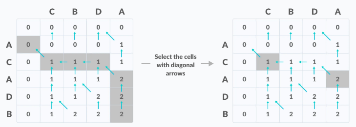

i=n;j=m;index=ans[n][m]-1;

    while (i > 0 && j > 0) {

        if (s1[i - 1] == s2[j - 1]) {

            str[index] = s1[i - 1];

            index--;

            i--;

            j--;

        } 

        else if (ans[i - 1][j] >= ans[i][j - 1]) {

          i--;

        } 

        else j--;

      }

      return str;

Longest Palindromic Subsequence - 1
We are given a sequence, find the length of the longest palindromic subsequence in it.

Input: s= “apqdcpr”

Output: 3

Approach:

We can use the approach discussed in Longest Common Subsequence, to find the Longest Palindromic Subsequence. Let us say that we are given a string, s= “apqdcpr”. The longest palindromic subsequence will be: “pdp”. Now let us write the reverse of str next to it.

        s= “apqdcpr”

rev(s)= “rpcdqpa”

If we look closely at the underlined characters, they are nothing but the longest common subsequence of the two strings. We are taking the reverse of the string and every time we are getting the correct answer for the following two reasons:

The longest palindromic subsequence being a palindrome will remain the same when the entire string is reversed.
The length of the palindromic subsequence will also remain the same when the entire string is reversed.
We can conclude that the longest palindromic subsequence of a string is the longest common subsequence of the given string and its reverse.

Longest Palindromic Subsequence - 2
The idea is to compare the last character of the string s[i…j] with its first character. There are two possibilities:

If the string’s last character is the same as the first character, include the first and last characters in palindrome and check for the remaining substring s[i+1, j-1].
If the last character of the string is different from the first character, return the maximum of the two values we get by
Removing the last character and checking for the remaining substring s[i, j-1].
Removing the first character and checking for the remaining substring s[i+1, j].
This gives the following recursive relation to finding the length of the longest repeated subsequence of a sequence X:

if (s[i] = s[j]) LPS[i…j] = 2+  LPS[i+1…j-1]
if (s[i] != s[j]) LPS[i…j] = max (LPS[i+1…j], LPS[i…j-1])    
Base case:

if(i>j) return 0. Because we are considering an empty string in this case.
if (i = j) return 1. Because any string of length 1 is a palindrome.

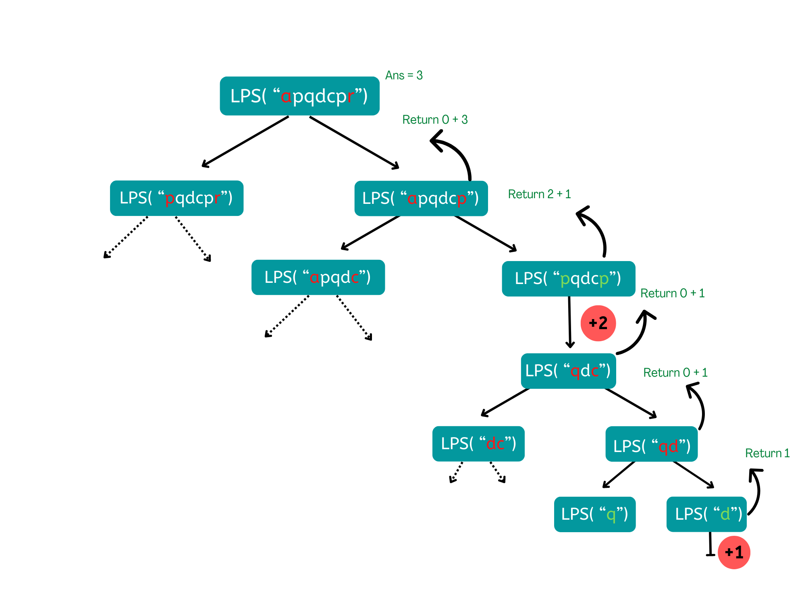

Recursive solution:

findLongestPalindrome(s, i, j)

    if i > j: return 0

    if i == j: return 1

    if s1[i] == s1[j]:

        return findLongestPalindrome(s, i + 1, j - 1) + 2

    else 

         return max(findLongestPalindrome(s, i, j - 1), findLongestPalindrome(s, i + 1, j))

Time complexity: O(2^N)

Auxiliary Space: O(1)

Memoization- We will use the Bottom-Up approach of DP to solve this problem. We can create an array ans[N][N] and initialize it with -1, where N is the size of string s. If the subproblem is already solved, i.e., ans[i][j]!=-1, we’ll stop the recursion by returning ans[i][j] else, we’ll use the recursive approach.

Time complexity: O(N*N)

Auxiliary Space: O(N*N)

Longest Palindromic Subsequence - 3
Bottom-Top: We will create an array table[n+1][n+1]. Suppose we want to calculate the length of the Longest Palindromic subsequent in substring s[i,....,j]. If we already know the length of LPS in substring s[i+1,......,j-1], then the length of LPS of the substring s[i,....,j] can be decided just by looking at char s[i] and char s[j].

if(s[i]==s[j]), we can add these two characters on both extremes of the LPS of substring s[i+1,......,j-1], which will result in increase of length by 2. I.e.
if(s[i-1]==s[j-1]) table[i][j] =  2+ table[i+1][j-1]
if(s[i]!=s[j]), Since these two characters are not same,  length of LPS  will not change and it will be same as that of substring s[i+1,......,j-1] I.e.
if(s[i-1]!=s[j-1]) table[i][j] =  table[i+1][j-1]

Initializations:

To find the value of table[i][j], we need the data of table[i+1][j-1]. Hence we have to fill table previously for the substring of length = 1 and length =2. So in the case of

length == 1 , lets say i=2 , j=2 and i+1,j-1 doesn’t lies between [i , j]
length == 2 ,lets say i=2 , j=3 and i+1,j-1 again doesn’t lies between [i , j].
When i==j, that is a single character, length of LPS will be 1. table[i][j]=1, where i==j. Rest other cells will be intialised with 0 to handle for length 2.

    for d-> 2 to n :

           i=0; j=d-1;

           while i < n and j<n:

                 if (st[i-1] == st[j-1]) :

                          table[i][j] = 2+ table[i+1][j-1]

                 else   table[i][j] = table[i+1][j-1]

    

     

                 if (table[i][j] >ans) :

                        ans=max(ans, table[i][j] );

    

                i ++;j++;

Time complexity: O(N*N)

Auxiliary Space: O(N*N)

Longest Palindromic Substring
We are given a sequence, find the length of the longest palindromic substring in it.

Input: s= “abcacdcat”

Output: 5

Brute Force -  The simple approach is to check each substring whether the substring is a palindrome or not. To do this first, run three nested loops, the outer two loops pick all substrings one by one by fixing the boundaries, and the inner loop checks whether the picked substring is palindrome or not.

Time complexity: O(N^3)

Auxiliary Space: O(1)

Bottom-Top: To improve over the brute force solution, we first observe how we can avoid unnecessary re-computation while validating palindromes. Consider the case "acdca". If we already knew that "cdc" is a palindrome, it is obvious that "acdca" must be a palindrome since the two left and right end letters are the same.

We will create a boolean table[n][n] that will be filled in bottom up manner. The value of table[i][j] is true if the substring is a palindrome, otherwise false. To calculate table[i][j] we will look at two things:

check the value of table[i+1][j-1],
Value of str[i] and str[j]
If table[i+1][j-1] is true (i.e substring[i+1,.....,j-1] is a palindrome) and str[i] is equal to str[j], we will mark table[i][j] as true, Otherwise, the value of table[i][j] is marked false.

Initializations:

To find the value of table[i][j], we need the data of table[i+1][j-1]. Hence we have to fill table previously for the substring of length = 1 and length =2. So in the case of

length == 1 , lets say i=2 , j=2 and i+1,j-1 doesn’t lies between [i , j]
length == 2 ,lets say i=2 , j=3 and i+1,j-1 again doesn’t lies between [i , j].
To avoid this, we can initialize the table as true. So by default, we will get true for length 1 and true for length 2 if str[i] is equal to str[j].

    for d-> 0 to n :

           i=0; j=d;

           while i < n and j<n:

                 if (table[i + 1][j - 1] and  st[i] == st[j]) :

                          table[i][j] = True

                 else   table[i][j] = False

    

     

                 if (table[i][j] == True) :

                        ans=max(ans, j-i+1);

    

                i ++;j++;

Time complexity: O(N*N)

Auxiliary Space: O(N*N)

Space optimization for Bottom-top:

If you can observe that a palindrome mirrors around its center. Therefore, a palindrome can be expanded from its center. So the idea is simple – for each character in the given string, consider it the midpoint of a palindrome and expand in both directions to find the maximum length palindrome. For an even-length palindrome, consider every adjacent pair of characters as the midpoint.

Time complexity: O(N*N)

Auxiliary Space: O(1)

Edit Distance - 1
We are given two strings w1 and w2, find the minimum number of operations required to convert w1 to w2. We are permitted to do the following three operations:

Insert a character
Delete a character
Replace a character

Input: w1= “folotbol”,  w2= “football”

Output: 3

Approach:

We will process all characters one by one starting from either from left or right sides of both strings. Suppose the length of w1 and w2 is m and n respectively.

Let us traverse from the right corner, there are two possibilities for every pair of characters being traversed.

If the last characters of two strings are same, nothing much to do. Ignore the last characters and get the count for the remaining strings. So we recur for lengths m-1 and n-1.
If the last characters are not same, we consider all operations on ‘w1’, consider all three operations on the last character of first string, recursively compute the minimum cost for all three operations, and take minimum of three values. Each of the given operations would cause 1 unit.
Now, Let's talk about the operations that we have to perform on w1. Consider w1 = "abc" , w2 = "bcd" , m = 3 , n = 3.

So, for the Insert operation, we will insert a character from right side in w1 and after inserting character string will be "abcd" and the m which was pointing to c in s1 will be at the same position but the n which was pointing to d in w2 now will point to c in w2 i.e. m, n-1 for the rest of the function calls.
Now, for the Delete operation, after deleting a character from w1, the m will be m-1, but the n will be same i.e. m-1, n for the rest of the function calls.
Now, for the Replace operation, Ultimately, the character at corresponding positions in strings will be the same after replacing the character in w1 with the character in w2, Now, call for the rest of the string, so here m will be m-1 and n will be n-1, i.e. m-1, n-1 for the rest of the function calls.
Base conditions:

if m = 0, we need to insert n characters from s2 in s1 to make s2.
if n = 0, we need to delete m characters in s1 to make s2.

Brute Force - A simple method that is a direct recursive implementation.

            if(m == 0) return n;

            if(n == 0) return m;

     

            if(w1[m-1] == w2[n-1]) 

                 return editDistance(w1, w2, m-1, n-1);

            else

                int insertChar = editDistance(w1, w2, m, n-1);

                int deleteChar = editDistance(w1, w2, m-1, n);

                int replaceChar = editDistance(w1, w2, m-1, n-1);

     

                return 1 + min({insertChar, deleteChar, replaceChar});

Time complexity: O(min((3^N, 3^M))

Auxiliary Space: O(1)

Memoization:

We will create a ans matrix of size [n][m] and initialize the matrix to -1. For finding the answer of particular parameters (say f(n,m) ), we first check whether the answer is already calculated using the ans matrix(i.e ans[i][j]!= -1 ). If yes, simply return the value of ans[ind][ind2]. If not, then we are finding the answer for the given value for the first time, we will use the recursive relation as usual.

Time complexity: O(N*M)

Auxiliary Space: O(N*M)

Edit Distance - 2
Bottom-Top: We will create a ans matrix of size [n+1][m+1] and we will consider up to length of i and j. While considering string w1 up to length i and string w2 up to length j, we will have 2 possibilities:

if(w1[i-1] == w2[j-1]): In this case, both the characters are same, which means we don’t need to do any operation. Hence, whatever cost was up to length (i-1,j-1), will be same for (i,j). I.e.
ans[i][j]= ans[i-1][j-1]
if(S1[ind1-1] != S2[ind2-1]): In this case, we need to perform any operation to make both strings same. Based on given operations we have 3 operations and we will take whichever costs us minimum. i.e
ans[i][j]= 1+ min( ans[i-1][j], ans[i][j-1], ans[i-1][j-1])
Initializations:

If (i==0): If length of w1 is 0 then we need to insert all the characters of w2. So, dp[0][i]=i where (0<= i <=m).
If (j==0): If length of w2 is 0 then we need to delete all the characters of w1. So, dp[i][0] where (0<= i <=n).
vector<vector<int>> ans(n+1,vector<int>(m+1));

        for i-> 0 to n

            dp[i][0] = i;

         

        for i-> 0 to m

            dp[0][i] = i;

         

        for ind1-> 1 to n

            for ind2-> 1 to m

                if(w1[i-1]==w2[j-1])

                    ans[i][j]= ans[i-1][j-1]

                else

                    ans[i][j]= 1+ min( ans[i-1][j], ans[i][j-1], ans[i-1][j-1])

         

        return ans[n][m];

Time complexity: O(N*M)

Auxiliary Space: O(N*M)

Pattern Matching - 1
We are given two strings S and P. S consists of only lower case alphabets and  P is a pattern that can include the characters ‘?’ and ‘*’ along with lower case alphabets. Where,

‘?’ – matches any single character

‘*’ – Matches any sequence of characters (including the empty sequence)

Find if both strings can match or not?

Input: S= “abbac”,  P= “ab*”

Output: True

Approach:

We will process all characters one by one from right to left. Suppose we have two strings S[0…n] and P[0…m]. We can have three different possibilities:

if(P[m]==’*’) Here two cases arise:
We can ignore ‘*’ character and move to next character in the Pattern.
‘*’ character matches with one or more characters. Here we will move to the next character in the string S.
if(P[m]==’?’):  ignore current characters of both strings and check if P[0…m-1] matches S[0…n-1].
If the current character in the pattern is not a special character, it should match the current character in the input string.
Base conditions:

if(n==-1 && m==-1) i.e both the strings S and P reach their end, return true.
if(m==-1) i.e. only string P reaches its end, return false.
if(n==-1) i.e. only the string S reaches its end, return true only if the remaining characters in string P are all ‘*’.
Brute Force - A simple method that is a direct recursive implementation.

if (n < 0 && m < 0)

        return 1;

    if (m < 0)

        return 0;

    if (n < 0){

        while (m >= 0) {

            if (P[m] != '*')

                return 0;

            m--;

        }

        return 1;

    }

    if (p[m] == '*'){

            return isvalid(s, p, n - 1, m) || isvalid(s, p, n, m - 1);

    }

    else if (p[m] == '?'){

           return isvalid(s, p, n - 1, m-1);

    }

    else{

            return P[m]==S[n] && isvalid(s, p, n - 1, m-1);

}

Time complexity: O(2^N)

Auxiliary Space: O(1)

Pattern Matching - 2
Memoization:

We will create a ans matrix of size [N][M] where N and M are lengths of S and P respectively and initialize the matrix to -1. For finding the answer of particular parameters (say f(n,m) ), we first check whether the answer is already calculated using the ans matrix(i.e ans[n][m]!= -1 ). If yes, simply return the value of ans[n][m]. If not, then we are finding the answer for the given value for the first time, we will use the recursive relation as usual.

        if (n < 0 && m < 0)

            return 1;

        if (m < 0)

            return 0;

        if (n < 0)

        {

            while (m >= 0)

            {

                if (P[m] != '*')

                    return 0;

                m--;

            }

    

            return 1;

        }

    

        if (ans[n][m] != -1) return ans[n][m];

    

        if (P[m] == '*')

        {

            ans[n][m] =

                return isvalid(s, p, n - 1, m) || isvalid(s, p, n, m - 1);

        }

        else if (p[m] == '?')

        {

            ans[n][m] =

                return isvalid(s, p, n - 1, m - 1);

        }

        else

        {

            ans[n][m] =

                return P[m] == S[n] && isvalid(s, p, n - 1, m - 1);

        }

Time complexity: O(N*M)

Auxiliary Space: O(N*M)

Bottom-Top: We will create a boolean matrix of size [N+1][M+1] where N and M are lengths of S and P respectively. States will remain same here as well, if we are considering strings upto length (i,j), we will have three possibilities:

If current characters match, result is same as result for lengths minus one. Characters match in two cases:
If pattern character is '?' then it matches with any character of text.
If current characters in both match
if( P[j – 1] == ‘?’) || (P[j – 1] == S[i - 1])  ans[i][j] = ans[i-1][j-1]   
If we encounter ‘*’, two choices are possible-
We ignore ‘*’ character and move to next character in the pattern, i.e., ‘*’ indicates an empty sequence.
'*' character matches with ith character in S
if (pattern[j – 1] == ‘*’)  ans[i][j] = ans[i][j-1] ||  ans[i][j-1] ;
If characters don't match, then we will mark ans[i][j]= False;

Initializations:

If both P and S are empty, then both match, i.e. ans[0][0] = true;
If pattern P is empty , we can’t match with a non empty string S, i.e ans[i][0] = false; where 0<i<=m
If string S is empty and pattern P is non empty, it will match only if all the characters upto j are ‘*’.
bool ans[n + 1][m + 1];

    memset(ans, false, sizeof(ans));

    ans[0][0] = true;

    

    for (int j = 1; j <= m; j++)

        if (P[j - 1] == '*')

            ans[0][j] = ans[0][j - 1];

    

    for (int i = 1; i <= n; i++)

    {

        for (int j = 1; j <= m; j++)

        {

            if (P[j - 1] == '*')

                ans[i][j] = ans[i][j - 1] || ans[i - 1][j];

    

            else if (P[j - 1] == '?' || S[i - 1] == P[j - 1])

                ans[i][j] = ans[i - 1][j - 1];

    

            else

                ans[i][j] = false;

        }

    }

    

    return ans[n][m];

Time complexity: O(N*M)

Auxiliary Space: O(N*M)

Counting Subsequences - 1
We are given two strings, find the number of subsequences of the first string that matches with the second string.

Input: S= “coollab”,  P= “collab”

Output: 2

Approach:

The idea is to process all characters of both strings one by one starting from either from left or right side. Let m be the length of S and n  be the length of P.  We will traverse from the right corner, there are two possibilities for every pair of characters being traversed.

If the last characters of two strings are same,
We consider last characters and get count for remaining strings. So we recur for lengths m-1 and n-1.
We can ignore last character of first string and recurse for lengths m-1 and n.
If last characters are not same, We ignore last character of first string and recurse for lengths m-1 and n.

Base conditions:

If m==0: return 1, because we have found a subsequence of the second string, that's why it has become empty now.
If n==0: return 0, if the first string becomes empty, we can’t find a valid subsequence.
Brute Force - A simple method that is a direct recursive implementation.

    if (m == 0) 

            return 1;

    if (n ==0) 

            return 0;

    if(S[n - 1] == P[m - 1]) 

            return count(S, P, n - 1, m - 1)  + count(S, P, n - 1, m);

    else

             return count(S, P, n - 1, m);

Time complexity: O(2^N)

Auxiliary Space: O(1)

Memoization:

We will create a ans matrix of size [N+1][M+1] where N and M are lengths of S and P respectively and initialize the matrix to -1. For finding the answer of particular parameters (say f(ind1,ind2) ), we first check whether the answer is already calculated using the ans matrix(i.e ans[ind][ind2]!= -1 ). If yes, simply return the value of ans[ind][ind2]. If not, then we are finding the answer for the given value for the first time, we will use the recursive relation as usual.

Time complexity: O(N*M)

Auxiliary Space: O(N*M)

Counting Subsequences - 2
Bottom-Top: We will create a ans matrix of size [N+1][M+1] where N and M are lengths of S and P respectively. States will remain same here as well, if we are considering strings upto length (i,j), we will have two possibilities:

if(S[i-1] == P[j-1]): we have two choice here, either we want to consider i-1 th character of S or not. I.e.
ans[i][j]= ans[i-1][j-1]+ ans[i][j-1]
if(S[i-1] != P[j-1]):We dont have any choice here, whatever we got upto (i-1,j-1) will be same here as well. I.e.
ans[i][j]= ans[i-1][j-1]
Initializations:

If (j==0) -If length of P is 0 then we will always have 1 pattern that is empty subsequence. So, dp[j][0]=1 where (0<= j <=n).
If (i==0) -If the length of S is 0 then we can’t make any pattern for any length of except when P is also empty. So, dp[i][0]=0 where (1<= i <=m).
vector<vector<int>> ans(n+1,vector<int>(m+1));

    for i-> 1 to n

        dp[i][0] = 0;

     

    for i-> 0 to m

        dp[i][0] = m;

     

    for i-> 1 to n

        for j-> 1 to m

            if(s1[i-1]==s2[j-1])

                ans[i][j] = ans[i-1][j-1] + ans[i][j-1] ;

            else

                ans[i][j] = ans[i-1][j-1];

     

    return ans[n][m];

Time complexity: O(N*M)

Auxiliary Space: O(N*M)

Matrix Chain Multiplication - 1
We are given the dimensions of N matrices in two arrays, row[n] and col[n], where dimension on ith matrix is represented by row[i]*col[i]. Find the minimum number of operations required to multiply all the matrices.

Input: row[]={10,30,5}, col[]={30,5,60}

Output: 4500

Before going to the main problem first remember some basics:

We know that to multiply two matrices it is a condition that the number of columns in the first matrix should be equal to the number of rows in the second matrix. Let's say there are two matrices A and B with dimensions A (2 x 3) and B (3 x 2).

Above we can see the resultant matrix is a (2 x 2) matrix i.e. it contains a total of 4 elements. To calculate each element we did 3 multiplications (which is equal to the number of columns in the first matrix and the number of rows in the second matrix). So totally for 4 elements, 4*3 = 12 multiplications are required. In a generalized way matrices, A (P x Q) and B(Q x R) will result in the matrix (P x R) which contains P * R elements. To calculate each element need “Q” number of multiplications. Total multiplications needed are P * Q * R.

Let’s try to multiply more than two matrices. For 3 matrices A, B, and C we can find the final result in two ways (AB)C or A(BC). We get the same result in any way since matrix multiplication satisfies the associativity property.

For example: A (10 x 30 ), B (30 x 5 ), C ( 5 x 60 ).

If we follow first way, i.e. (AB)C way: To calculate (AB) we need 10*30*5 = 1500 multiplications. Now resultant AB get dimensions 100 x 5 this multiplied with C need 10*5*60 = 3000 multiplications. Total 1500 +3000 = 4500 multiplications needed.
If we follow second way, i.e. A(BC) way: To calculate (BC) we need 30*5*60 = 9000 multiplications. Now resultant BC get dimensions 30 x 60. A multiplied with this result need 10*30*60 = 18000. Total 18000+9000 = 27000 multiplications needed.
Here we can observe that based on the way we parenthesize the matrices total number of multiplications is changing.

Approach:

The idea is to place parenthesis at all possible places, calculate the cost for each placement and return the minimum value. In a chain of matrices of size n, we can place the first set of parenthesis in n-1 ways. For example, if the given chain is of 4 matrices. let the chain be ABCD, then there are 3 ways to place the first set of parenthesis outer side: (A)(BCD), (AB)(CD), and (ABC)(D). So when we place a set of parenthesis, we divide the problem into subproblems of smaller size. The minimum number of multiplication needed to multiply a chain of size n = Minimum of all n-1 placements. Also, these placements create subproblems of smaller sizes. We will do the same for all subproblems and take the minimum over all of them.

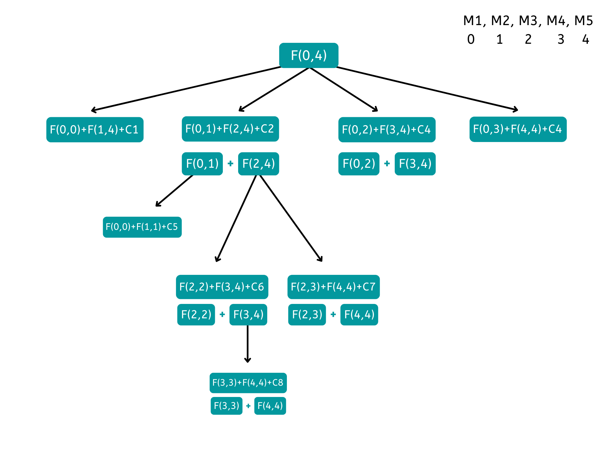

So here is the state we will be used for solving our problem:

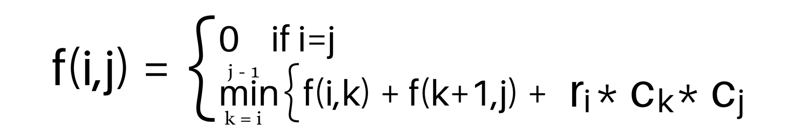

Brute Force - A simple method that is a direct recursive implementation.

    int mincost (int i, int j, vector<int>row, vector<int>col){

        if (i == j)

            return 0;

        int ans = INT_MAX;

        for (k = i; k < j; k++){

            ans=min( ans, mincost( i, k, row, col ) + mincost( k+1, j, row, col ) + row[i] * col[k] * col[j] );

        }

        return ans;

    }

Time complexity: O(N^N)

Auxiliary Space: O(N)

Matrix Chain Multiplication - 2
Memoization:

We will create a ans array of size [N][N] where N is the number of matrices and initialize the array to -1. For finding the answer of particular parameters (say f(ind1,ind2) ), we first check whether the answer is already calculated using the ans matrix(i.e ans[ind][ind2]!= -1 ). If yes, simply return the value of ans[ind][ind2]. If not, then we are finding the answer for the given value for the first time, we will use the recursive relation as usual.

        int mincost (int i, int j, vector<int>&row, vector<int>&col, vector<vector<int>>&ans){

            if (i == j)

                return 0;

            if(ans[i][j] != -1) return ans[i][j];

            ans[i][j] = INT_MAX;

            for (k = i; k < j; k++){

                ans[i][j]=min( ans[i][j], mincost( i, k, row, col ) + mincost( k+1, j, row, col ) + row[i] * col[k] * col[j] );

            }

            return ans[i][j];

        }

Time complexity: O(N*N*N)

Auxiliary Space: O(N*N)

Bottom-Top: We will create a ans array of size [N][N] where N is the number of matrices. States will remain same here as well i.e. for matrices [i…j] we will be checking all possible cases and take a minimum of all. We will be populating the ans array for each 1 <= d < n, the minimum costs of all subsequences of length d, using the costs of smaller subsequences already computed.

ans[i][j]= min( ans[i][k] + ans[k+1][j] + row[i] * col[k] * col[j] ) where i <= k < j

Initializations:

If (i==j) it means we have only one matrix, obviously there is no cost as we can not multiply only one matrix. So, ans[i][j]=0 where (0<= i <n).
int ans[n][n];

        for (int i=0; i <n; i++) {

            ans[i][i] = 0;

        }

        for (int d=1; d< n; d++) {

            i=0;j=d;

            while(i<n && j<n){

                c[i][j] = INT_MAX;

                for (int k=i; k<j; k++){

                    ans[i][j] = min( ans[i][j], ans[i][k] + ans[k+1][j] + row[i] * col[k] * col[j] );

                }

                i++; j++; 

            }

        }

        return ans[0][n - 1];

Time complexity: O(N*N*N)

Auxiliary Space: O(N*N)

Counting Paths - 1
We are given a M x N grid. Count all the possible paths from the top left to the bottom right with the constraints that from each cell you can either move only to right or down.

Input: m=3, n=2

Output: 3

Approach: For a path to be unique, at least 1 move must differ at some cell within that path. To reach a cell (i,j) we have two options:

Move down from (i-1, j)
Move right from (i, j-1)
So the total number of ways to reach (i,j) is the summation of both possible cases.

i.e. f(i, j) = f(i-1, j) + f(i, j-1)

But in case we are in the first row or column, we are left with only one option. I.e. in the case of the first row, we can reach (i, j) by moving down from (i-1, j), and in the case of the first column, we can reach (i,j) by moving right from (i, j-1).

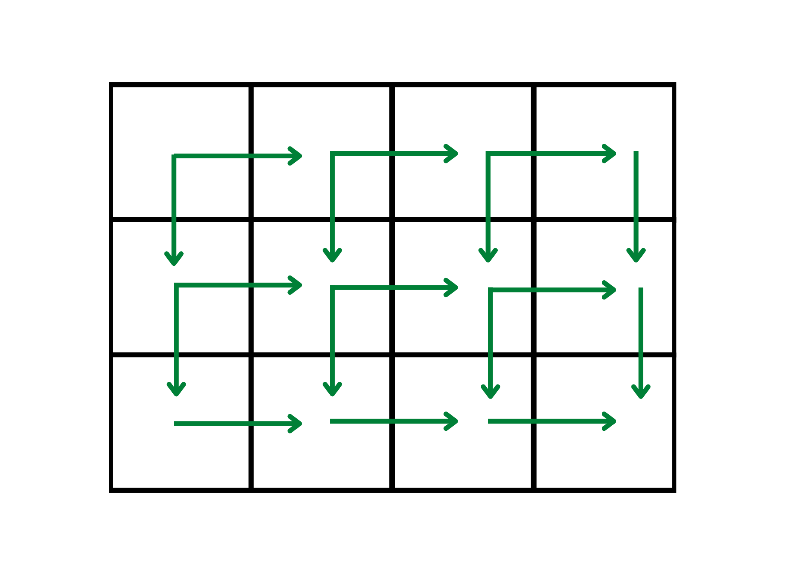

Brute Force - A simple method that is a direct recursive implementation.

Base case: if(i==0 || j==0) return 1. As we have only one path in case of first row or column.

int path(int i, int j){

    if(i==0 || j==0) return 1;

    return path(i-1, j) + path(i, j-1);

}

Time complexity: O(2^N)

Auxiliary Space: O(1)

Memoization:

We will create a ans array of size [M][N] where M and N are dimensions of the grid and initialize the array to -1. For finding the answer of particular parameters (say f(ind1,ind2) ), we first check whether the answer is already calculated using the ans matrix(i.e ans[ind][ind2]!= -1 ). If yes, simply return the value of ans[ind][ind2]. If not, then we are finding the answer for the given value for the first time, we will use the recursive relation as usual.

int path(int i,int j,vector<vector<int>> &ans){

    if(i==0 || j==0) return 1;

    if(ans[i][j]!=-1) return ans[i][j];

    return ans[i][j]=path(i-1,j,ans) + path(i,j-1,ans);

}

Time complexity: O(M*N)

Auxiliary Space: O(M*N)

Bottom-Top: We will create a ans array of size [M][N] where M and N are dimensions of the grid. States will remain same here as well i.e. we have two paths to reach cell (i,j), i.e. from (i-1, j) and (i, j-1). i.e.

ans[i][j] = ans[i-1][j] + ans[i][j-1]

Initialization: For the first row and column we need to initialize the array with 1, as we have only one path to reach cells in these two cases.

Time complexity: O(M*N)

Auxiliary Space: O(M*N)

Space optimization for Bottom-top:

If we closely look at the relation,

ans[i][j] = ans[i-1][j] + ans[i][j-1]

We see that to calculate a value of a cell of the ans array, we need only the previous row values. So, we don’t need to store an entire array. Hence we can space optimize it.

We’ll take two arrays here, ans[M] and temp[M]. Where ans array will store values for ith row and temp will store values of (i-1) th row. After calculating values for ith row, we’ll assign its values to temp array, so that for calculation of (i+1)th row it can be considered as ith row.

Time complexity: O(M)Auxiliary Space: O(M*N)

Counting Paths - 2
We are given a M x N grid. But some cells are unsafe. We cant visit unsafe cells. Count all the possible paths from the top left to the bottom right with the constraints that from each cell you can either move only to right or down. Unsafe and safe are marked as 1 or 0 respectively in grid.

Input: [[0,0,0], [0,1,0], [0,0,0]]

Output: 2

Approach: It will be same here as well. But we have two types of cells and that gives two possible cases:

If cell (i,j) is safe to visit:
Move down from (i-1, j)
Move right from (i, j-1)
So the total number of ways to reach (i,j) in this case remains same. i.e. f(i, j) = f(i-1, j) + f(i, j-1)
If cell (i,j) is unsafe to visit: The total number of ways to reach (i,j) is 0.
But in case we are in the first row or column, we are left with only one option. I.e. in the case of the first row, we can reach (i, j) by moving down from (i-1, j), and in the case of the first column, we can reach (i,j) by moving right from (i, j-1). Unlike in previous case, we dont have 1 way in every case. We need to check if there exists a path to visit that cell or not.

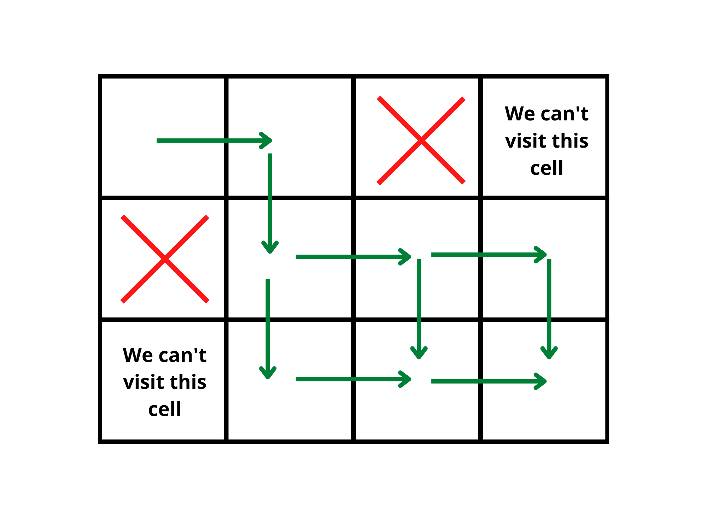

Brute Force - A simple method that is a direct recursive implementation.

Base case:

if(i==0 && j==0) return 1.
if(i==0) we won’t return 1. Instead we will check for (0,j-1)
if(j==0) we won’t return 1. Instead we will check for (i-1,0)
if(grid[i][j]==1) return 0. As there exists no path to that cell.

int path(int i, int j, vector<vector<int> >& grid){

    if(grid[i][j]) return 0;

    if(i==0 && j==0) return 1;

    if(i==0) return path(i,j-1,grid);

    if(j==0) return path(i-1,j,grid)

    return path(i-1, j, grid) + path(i, j-1, grid);

}

Time complexity: O(2^N)

Auxiliary Space: O(1)

Memoization:

We will create a ans array of size [M][N] where M and N are dimensions of the grid and initialize the array to -1. For finding the answer of particular parameters (say f(ind1,ind2) ), we first check whether the answer is already calculated using the ans matrix(i.e ans[ind][ind2]!= -1 ). If yes, simply return the value of ans[ind][ind2]. If not, then we are finding the answer for the given value for the first time, we will use the recursive relation as usual.

Time complexity: O(M*N)

Auxiliary Space: O(M*N)

Bottom-Top: We will create a ans array of size [M][N] where M and N are dimensions of the grid. States will remain same here as well i.e. if a cell is unsafe , total number of ways to visit that cell is zero else we have two paths to reach cell (i,j), i.e. from (i-1, j) and (i, j-1). i.e.

ans[i][j] = ans[i-1][j] + ans[i][j-1]

Initialization: For the first row and column we need to initialize the array with 1 upto the cells that can be visited rest will be intialize with zero.

For example, if first row of grid is [0,0,0,1,0,0], first row of ans array will be initialized as [1,1,1,0,0,0]. As one unsafe cell is in present in first row and all the cells which are after that cell, can’t be visited.

vector<vector<int>>ans(m,vector<int>(n,0));

for(int i=0;i<m;i++){

    if(grid[0][i]==1) break;

    else ans[0][i]=1;

}

for(int i=0;i<n;i++){

    if(grid[i][0]==1) break;

    else ans[i][0]=1;

}

for(int i=1;i<m;i++){

    for(int j=1;j<n;j++){

        if(grid[i][j]==0){

            dp[i][j]=dp[i-1][j]+dp[i][j-1];

        }

    }

}

return ans[m-1][n-1];

Time complexity: O(M*N)

Auxiliary Space: O(M*N)

Min Sum Path
We are given a M x N grid filled with non-negative numbers. We have to find a path from top left to bottom right, which minimizes the sum of all numbers along its path. Count all the possible paths from the top left to the bottom right with the constraints that from each cell you can either move only to right or down.

Input:  [[1,3,1], [1,5,1], [4,2,1]]

Output: 3

Approach: Again to reach a cell (i,j) we have two options:

Move down from (i-1, j)
Move right from (i, j-1)
If we already know the path sum upto cell (i-1, j) and (i, j-1), we can take the path which gives minimum path sum. State will look like MinSum(i,j) = grid[i][j] + min( MinSum(i, j-1), MinSum(i-1, j))

But in case we are in the first row or column, we are left with only one option. I.e. in the case of the first row, we can reach (i, j) by moving down from (i-1, j), and in the case of the first column, we can reach (i,j) by moving right from (i, j-1). So in case of first row MinSum(i,j) = grid[i][j] + MinSum(i, j-1) and in case of first column MinSum(i,j) = grid[i][j] + MinSum(i-1, j).