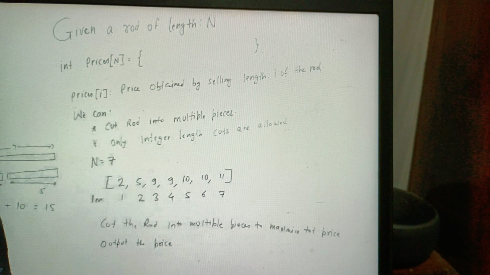
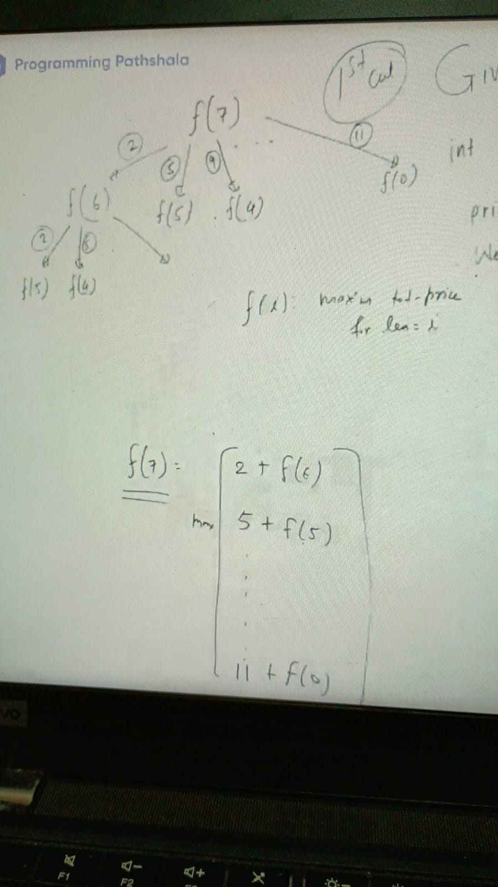
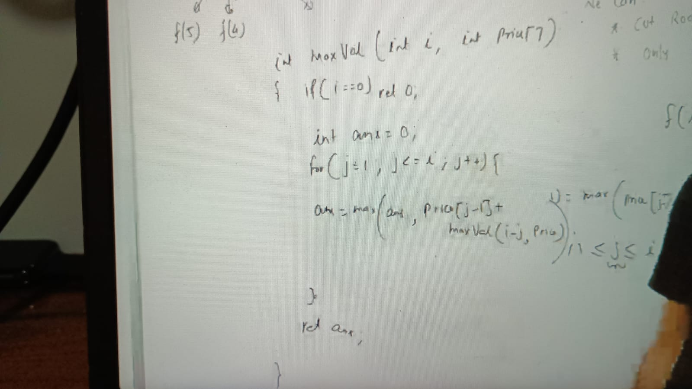
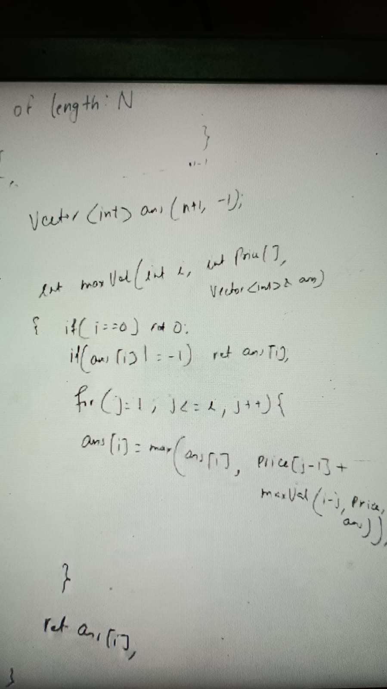

Since problem is not fit in greedy approach because we cant choose option like cut with max price like 11 and min
so we need to thing recursively which means figuring out element of choices

e.g:  How many option do we have to make my first cut, it can be 1, 2, ..n means to cut first cut we have n ways

n= 7
a = [2, 5, 9, 9, 10, 10, 11]
he f(7) depends on f(1), f(2) ..f(n)  means larger problem depends on smaller 1 like

choices:

    f(7) = 2 + f(6)
    f(7) = 5 + f(5)
    f(7) = 9 + f(4)

as below:

means f(7) = max of any one of choices because above are different choices for cutting the rod:
our terminal case when rod dont have nay length (=0)
    
    f(i) = max(price[1]  + f(i-1),
    f(i) = price[2]  + f(i-2),
    f(i) = price[3]  + f(i-3),
    f(i) = price[4]  + f(i-5),
    f(i) = price[5]  + f(i-5),
    f(i) = price[6]  + f(i-6))
    ...
    f(i) = max(price[i] + f(0))

1 <= j <= i
f(i) = max(price[j-1]  + f(i-j)) // index of price start from 0

**imlementation is as:**

since there is overriding function so we can use memoization, before that we need to think state of function, state of function can  identified by remaining length
which is never be greater that n. Then problem can we identified by any value between 0 to n

Here we have to take array size n + 1 because we have to store nth index value as well

SC = o(n)
TC = o(n^2)

Rod Cutting Problem - Time Complexity Analysis & Fixes
The given implementation has several issues:

Incorrect Base Case:
The method should check if i is less than or equal to 0, not just i == 0.
Incorrect Indexing in price Array:
price[j-1] should be replaced with price[j], as price is typically 1-based indexed.
Exponential Time Complexity:
The function recursively calls itself multiple times for the same value of i, leading to an exponential time complexity (O(2ⁿ)).
Missing Memoization:
Without memoization, it recomputes subproblems, which is inefficient.
Loop Should Start from 1 but be Bounded by i Instead of price.length:
If j > i, i - j becomes negative, which is incorrect.

Bottom top:

i depends on i -1 , i-2 .. 0. Here we have to store all previous answer because i is depends on everything previous prices

ans[0] = 0

for (i =1, i <= n; i++) {
   for( j = 1; j <= i; j++) {
   ans[i] = max(ans[i], price[j-1] + ans[i-j])
 }
}

return ans[n]

Assignments:
https://www.geeksforgeeks.org/problems/cutted-segments1642/1
https://www.geeksforgeeks.org/problems/cutted-segments1642/1
https://www.geeksforgeeks.org/problems/rod-cutting0840/1
https://www.geeksforgeeks.org/problems/rod-cutting0840/1
https://leetcode.com/problems/decode-ways/description/
https://leetcode.com/problems/decode-ways/description/
https://www.geeksforgeeks.org/count-derangements-permutation-such-that-no-element-appears-in-its-original-position/
https://www.geeksforgeeks.org/problems/cutted-segments1642/1
https://leetcode.com/problems/best-team-with-no-conflicts/description/
https://leetcode.com/problems/decode-ways-ii/description/

### Sum of Product of All Subsets:

Given an array of n non-negative integers. The task is to find the sum of the product of elements of all the possible subsets. Answer may be large, print answer modulo
10
9
+
7
.

Input Format

First line contains
1
≤
n
≤
10
5
. Second line contains
n
elements
0
≤
a
r
r
i
≤
1000
.

Output Format

Print product of every subset modulo
10
9
+
7
.

Example 1

Input

3
1 2 3

Output

23

Explanation

Possible Subset are: 1, 2, 3, {1, 2}, {1, 3}, {2, 3}, {1, 2, 3}
Products of elements in above subsets : 1, 2, 3, 2, 3, 6, 6

Sum of all products = 1 + 2 + 3 + 2 + 3 + 6 + 6 = 23

Example
Input
3
1 2 3
Output
23
https://www.geeksforgeeks.org/sum-products-possible-subsets/
