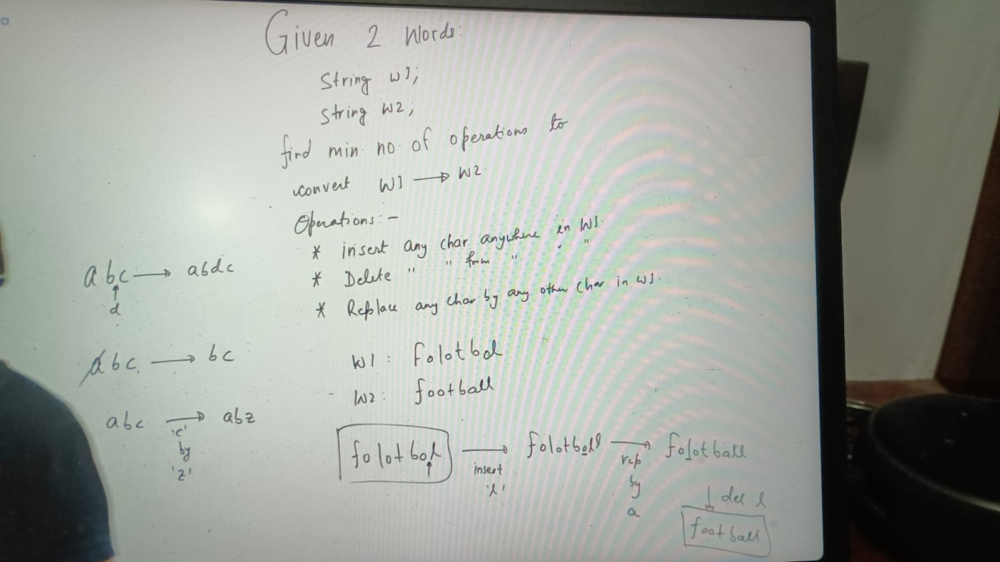
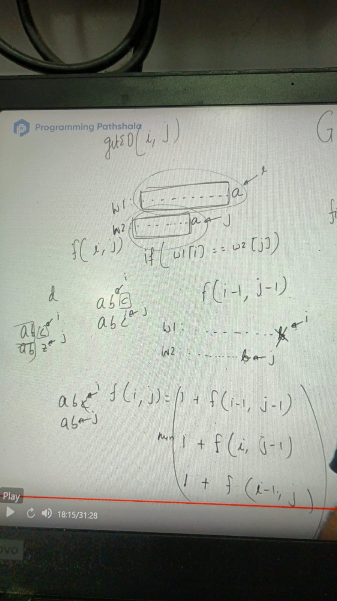
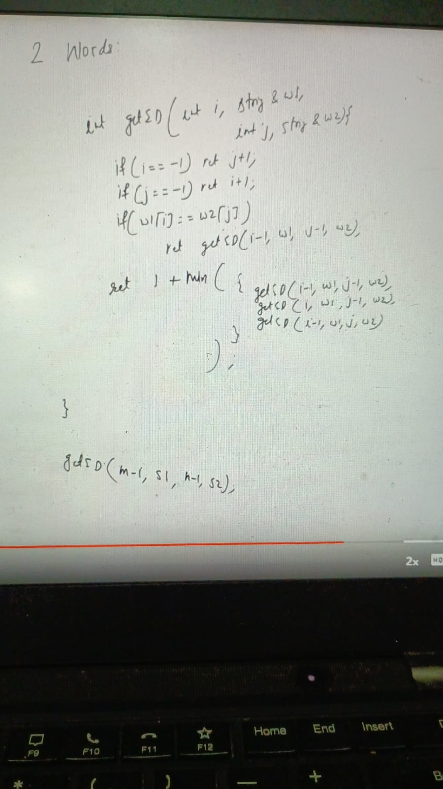
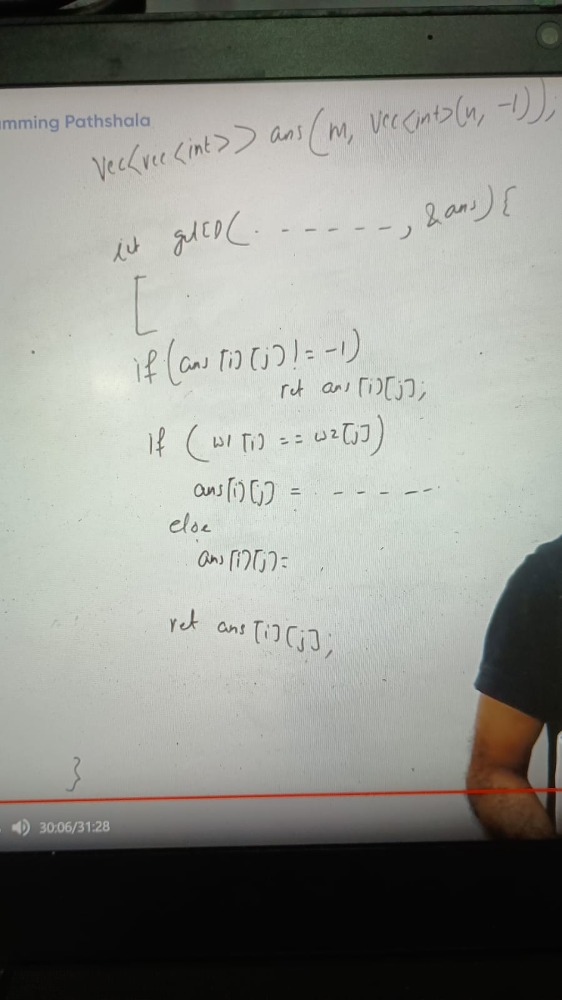
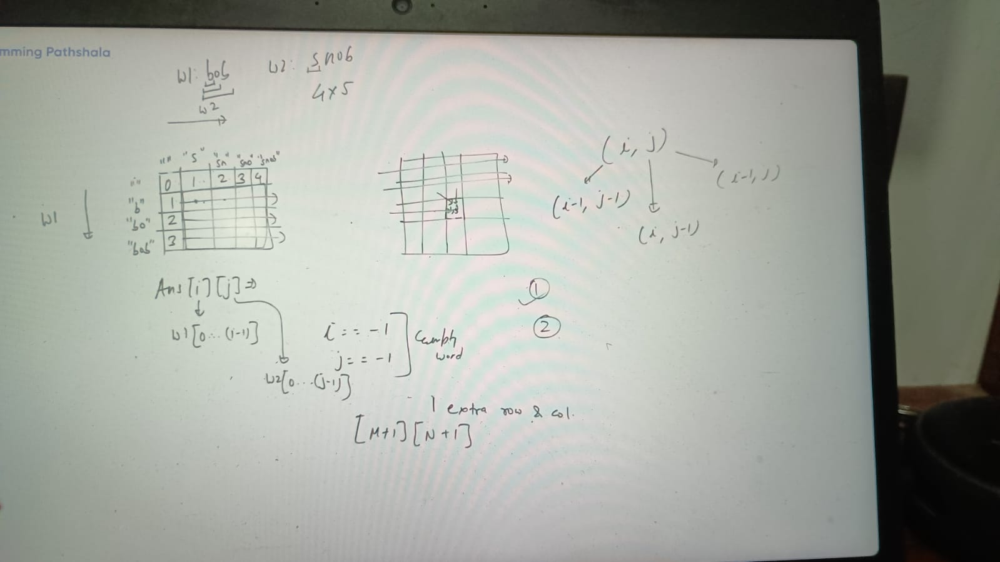
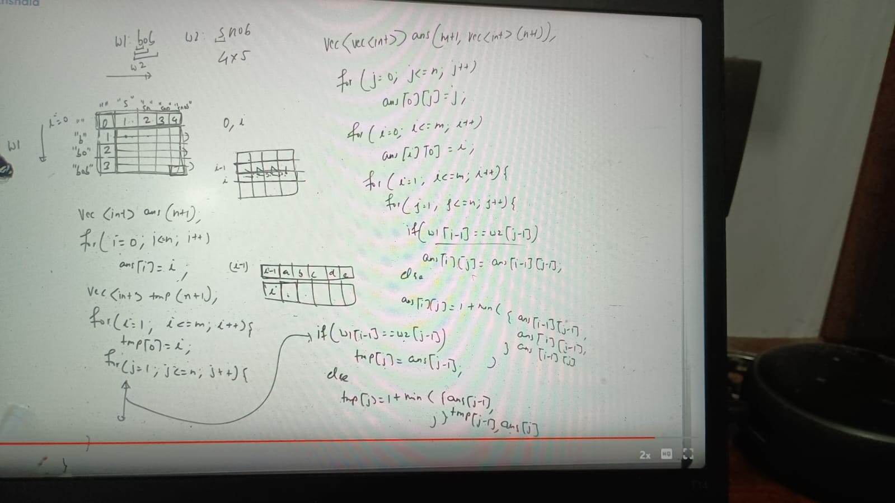

Edit distance means here degree of similarity between 2 words

Application: 1 spell correction

We have to think recursively,

W1: ...............a(i)
W2: ...........a(j)

start journey from last character, what is different possibility to match last chars?

2 either match/not match

if (w1[i] == w2[j]) // if its match we cant replace these 2 chars

in this case we just recurse remaining part: f(i-1, j-1)

Case 2: if last chars doesn't match?

    w1: ............... a(i)
    w2: ...........b(j)

1. applied replace operation:

    `f(i, j) = 1 + f(i-1, j-1)`

2. insert b after a in w1 string, i position wont change whereas

    `f(i, j) = 1 + f(i, j-1)`

3. Delete operation: delete a from W1

    `f(i, j) = 1 + f(i-1, j)`

SO final:

    f(i, j) = min(1 + f(i-1, j-1), 1 + f(i, j-1), 1 + f(i-1, j))

getEditD(i, j) = x ( Edit distance between w1 to w2)

Here i represents: w1[0...i] && j represents w2[0...j]

1. Matched:
   `getEditD(i, j) = get(i-1, j-1)`                 
2. not matched
   `getEditD(i, j) = 1 + min( f(i-1, j-1), f(i, j-1), f(i-1, j))`

i < 0 : empty w1
j == -1: w2 is empty

(i == -1 && j == 1) : w1-> "", "bc" only 1 way to which is insertion

if (i == -1) 
  ret j + 1 // because we have to perform j + 1 insertions since indexing start from 0
            // w1: '', w2: "(0)abc(j)" -> we need here start from 0 to go j and insert one-by-one chars

if (j == -1) //
 return i + 1

memorization:

TC: o(m*N)
SC: o(m*n)

### Bottom Top Approach:

optimize space:

return ans = tmp

https://leetcode.com/problems/edit-distance/

https://leetcode.com/problems/edit-distance/description/

