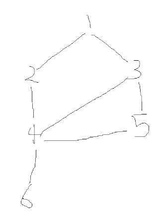
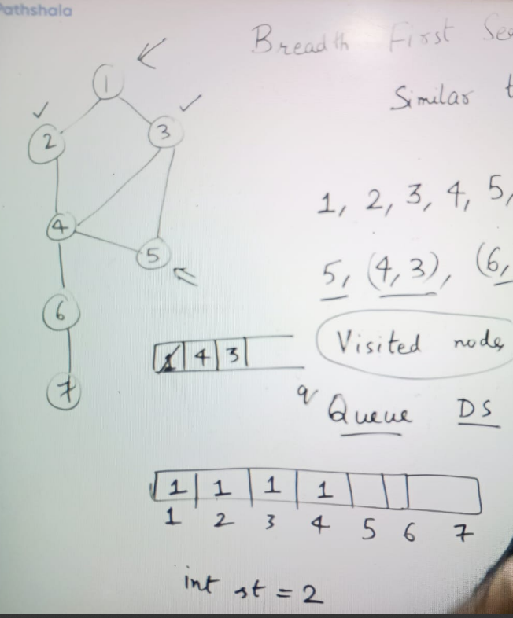

**Breadth First Search( BFS):**

Similar to level order traversal:

1, 2, 3, 4, 5, 6

for node 5 ( BFS)
4, ( 4, 3), ( 6, 2, 1)

Visited Node, because we can go back (cycle) as well so need to store path to remove duplicate node

-> need to use Queue (FIFO) for BFS & visited array

