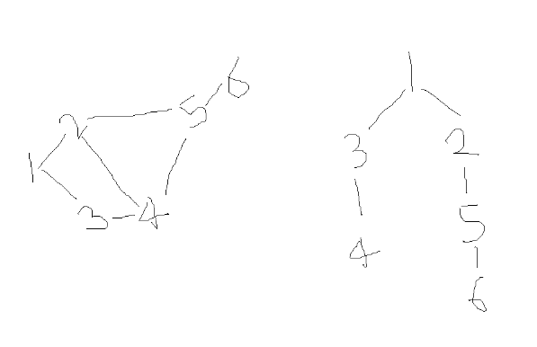
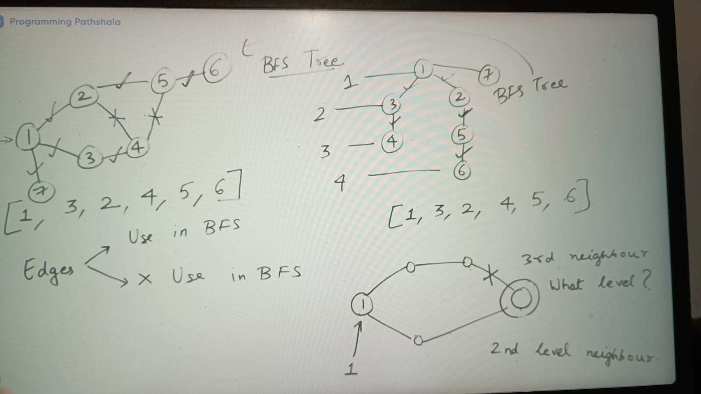

**BFS Tree:**

BFS Tree which BFS is equal to that

Example:

[1, 3, 2, 4, 5, 6]

if we do Level order traversal of this  tree it gives same result as above

**Note:** The node which is prompting us to put new node into queue, that would be part of BFS Tree

Benefit of BFS Tree:

3rd neighbour ignored because its visited at second level via 2nd neighbour

1. **Every node in BFS tree is at as low level as possible**
2. **node shortest path to other nodes**

