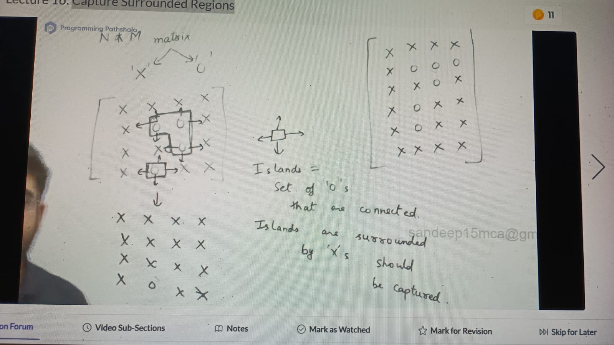
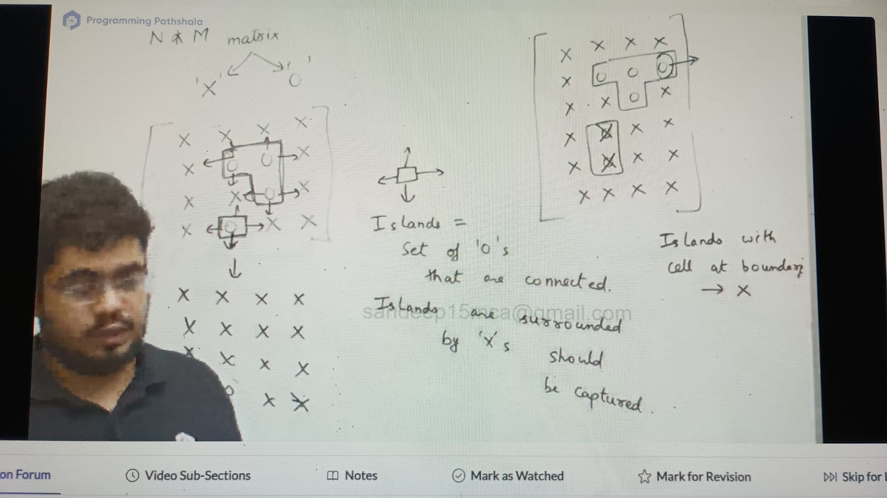
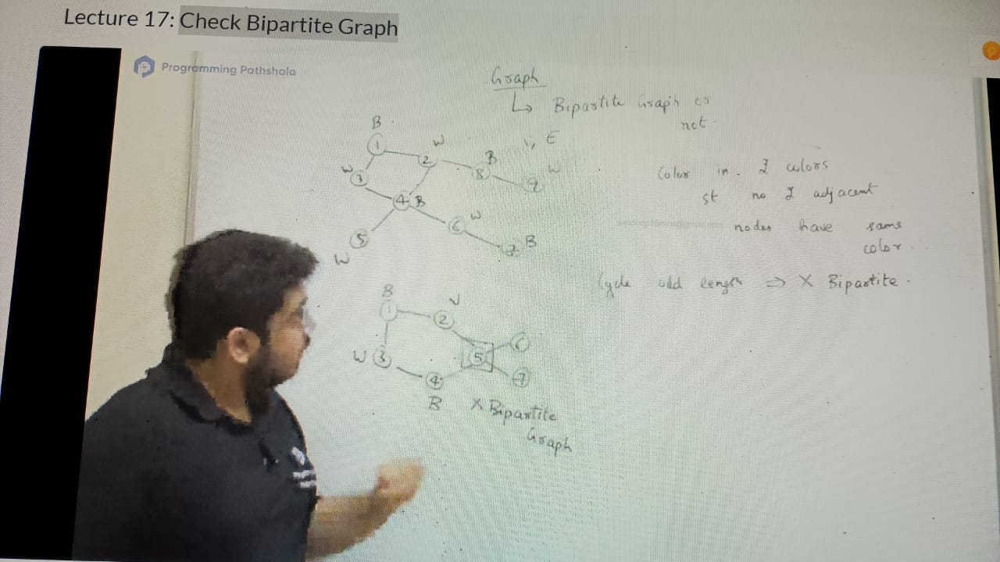

island with no cell at boundary will be captured

Check graph is bipartite or not? ( can color with 2 color st no 2 adjacent nodes have same color)

 

Divide all te nodes into 2 sets 
Set1: Node (B)
Set 2: Nodes (W)

    Set1          Set2
    1              3
    8              2
    4              9
    7              5
                   6

    bool bipartite = true
    int visisted[n+1] = {0}
    List adjacent
    color[n+1] = {-1}
    
    void dsf(int node, int color) {
        if(visited[node]) {
        if(color != color[node]) {
             bipartite = false
             return
      }
      visited[node] = true
      color[node] = color
    
      int adjColor = color == 0 ? 1 : 0
    
      for( i to adj[node].size) {
        dfs(ads[node][i], adjColor)
      }
      
     
    }

we have to check bipirtite for all component in for loop if any of them is not bipirtite,
whole graph is not bipirtite
for(i to N) 
 if ( !visited[i]) 
  dfs(i, j)

Problems:
https://leetcode.com/problems/is-graph-bipartite/
https://leetcode.com/problems/surrounded-regions/description/
https://leetcode.com/problems/number-of-islands/description/
https://www.hackerearth.com/problem/algorithm/connected-components-in-a-graph/
https://www.geeksforgeeks.org/problems/depth-first-traversal-for-a-graph/1

https://leetcode.com/problems/evaluate-division/
https://leetcode.com/problems/minesweeper/description/
https://leetcode.com/problems/minesweeper/description/
https://leetcode.com/problems/pacific-atlantic-water-flow/description/
https://www.spoj.com/problems/MAKEMAZE/
https://codeforces.com/contest/60/problem/B
https://www.geeksforgeeks.org/problems/flood-fill-algorithm1856/1?page=1&category%5B%5D=DFS&query=page1category%5B%5DDFS
https://www.spoj.com/problems/CHUNK2/