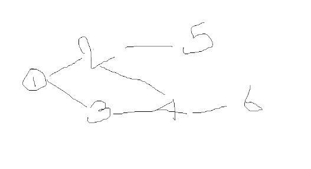
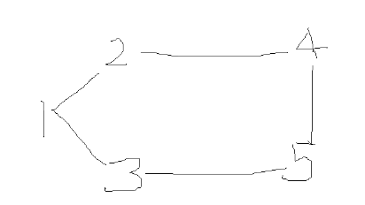

vector < node > adjusent

we need to create adjasency list:

Example:

Map<Integer, List[]> adjasentByVertex = new HashMap<>()

adjasentByVertex.put(1, List.of(2, 3))

adjasentByVertex.put(2, List.of(1, 4, 5))

adjasentByVertex.put(3, List.of(1, 4))

adjasentByVertex.put(4, List.of(2, 3, 6))

adjasentByVertex.put(5, List.of(2))

adjasentByVertex.put(6, List.of(4))

`degree of node = adjasentByVertex.get(4).size() // except self loop and parallel edges`

total space = 2 * no. of edges

total of space = o ( v + 2 + e)// where v is empty list

worst case in complete graph = e = v ( v - 1) / 2 = o( v + v2) = o (v2)

**Adjacency Matrix:**

adj[i][j] = binary matrix if edges connected then 1 else 0

Example:

        edges->
        |

              1    2    3    4     5   
         1    0    1    1    0     0

         2    1     0    1   1     0

         3    1     1    0    0     1

         4     0    1    0    0     1

         5    0    0    1     1     0

Degree = sum of the row
degree(i) = sum of ith row

**SC = o (v2)** // always connected 2

**Note:** in directed graph we consider imerging direction for source here 
for 1 -> 2 ( if its directed) the 1 would have only 2 in list

1-> also for weigted grapgh we store weight in adjaceny matrix

and also in adjacency List 
  1 --4(weight)--> 2
  = 1: [Pair(2, 4)]
    2: [Pair(1, 4)]   

