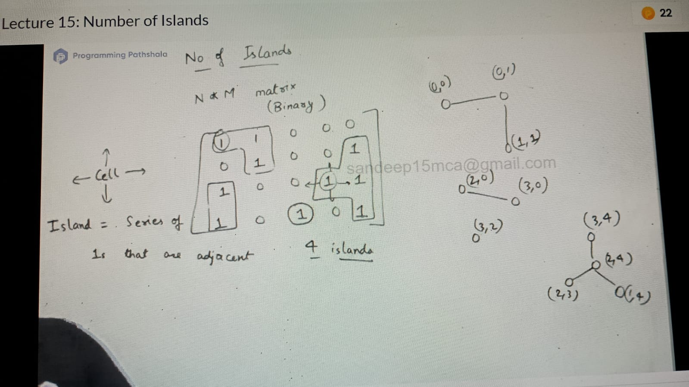

Map<Pair(x, y), Int(Node)>

We know from which i, j connected 

(i, j) -> (i+- 1, j), (i, j+-1)

    List<Pair> directions = List.of(
      Pair(-1, 0). Pair(1, 0),
     Pair(0, -1). Pair(0, 1)
    )
    
    int visited[n][n]
    
    void dfs(int row, int col) {
        if(!isValid(r, c)) return;
        if (visted[r][c]) return;
    
        visited[r][c] = true; // matrix[r][c] = 0 -> delete the island comletly
    
       for(i 0, i < directions.size; i++) {
          dfs(r + direction.get(i).row(), c + direction.get(i).col())
     }
     
    }
    
    boolean isValid(row, col) {
      return row >= 0 && row < n && col >= 0 && col < m
    && matrix[row][col] == 1;
    }
    
    main() {
       int compo = 0;
       for(i to n) {
       for (j to m) {
         if(!visited[i][j] && matrix[i][j] == 1) {
           dfs(i, j);
           compo++;
        }
      }
    }
    TC => o(V + E) = o(nm + 2 * nm) = o (3nm) = o(3nm)
    SC => o (nm + nm) = o(nm)
