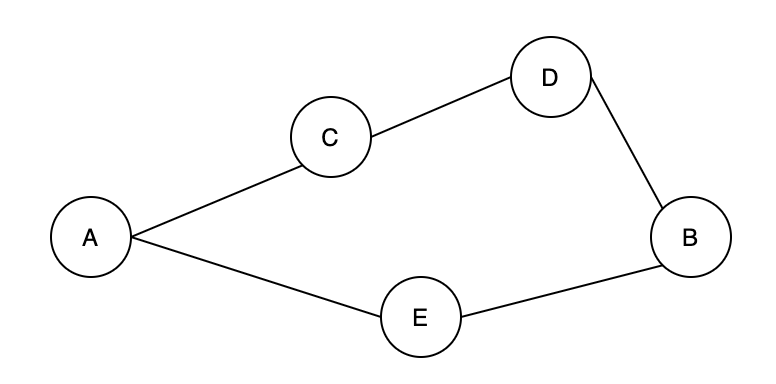
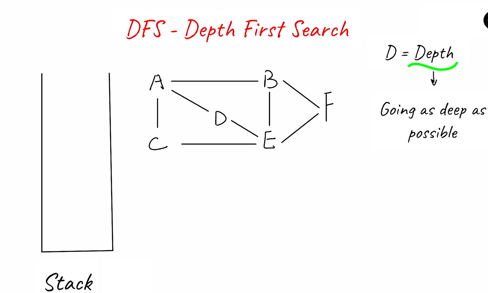
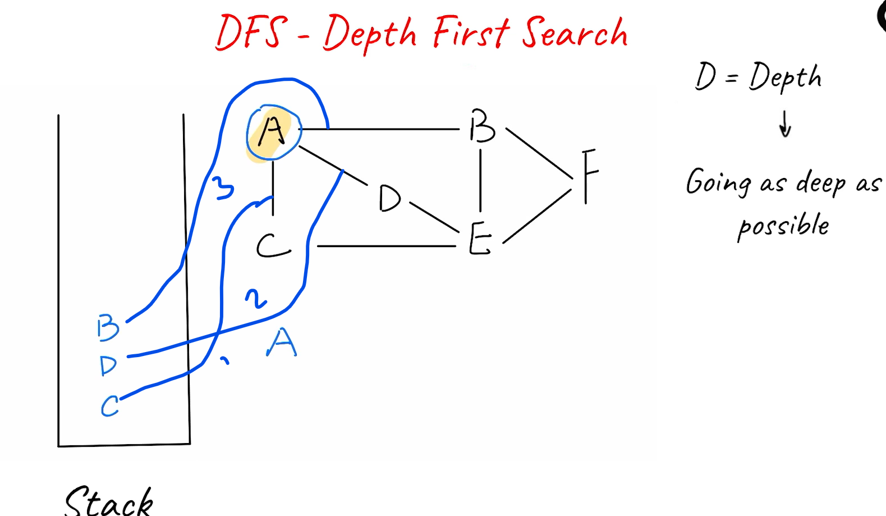
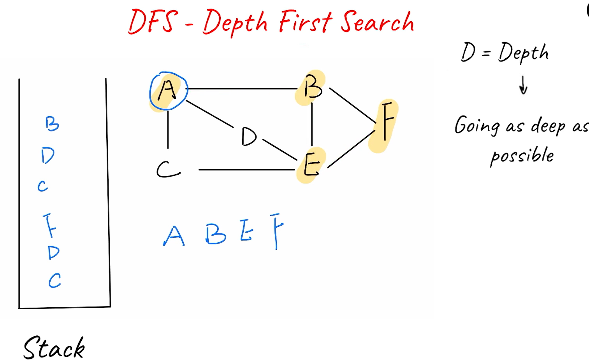
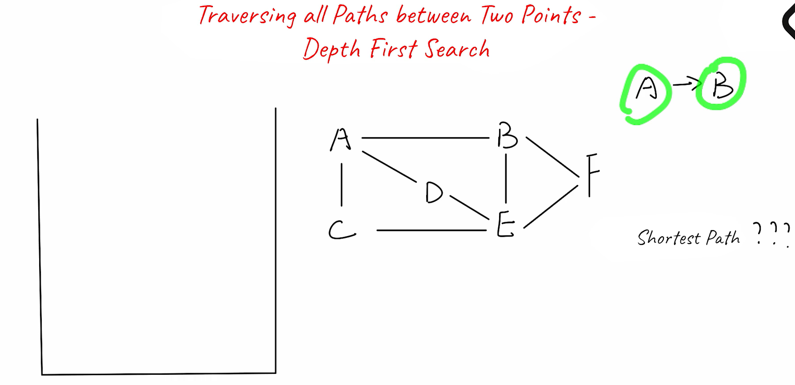

### DFS: 

recursion base traversal

Previously, we learned how to check the connectivity between two vertices with the “disjoint set” data structure. Now, let's switch gears and consider: Given a graph, how can we find all of its vertices, and how can we find all paths between two vertices?

The depth-first search algorithm is ideal in solving these kinds of problems because it can explore all paths from the start vertex to all other vertices. Let's start by considering an example. In Figure 7, there are five vertices [A, C, D, B, E]. Given two vertices A and B, there are two paths between them. One path is [A, C, D, B], and the other is [A, E, B].

Figure 7. An undirected graph

In Graph theory, the depth-first search algorithm (abbreviated as DFS) is mainly used to:

1. Traverse all vertices in a “graph”;
2. Traverse all paths between any two vertices in a “graph”.

### Traversing all Vertices – Depth-First Search Algorithm

 

Complexity Analysis
Time Complexity:

O(V+E). Here,
V
V represents the number of vertices, and

E represents the number of edges. We need to check every vertex and traverse through every edge in the graph.

Space Complexity:

O(V). The space complexity of DFS depends on the maximum depth of recursion. In the worst case, if the graph is a straight line or a long path, the DFS recursion can go as deep as the number of vertices. Therefore, the space complexity of DFS is

O(V).

### Traversing all paths between two vertices – Depth-First Search Algorithm

 