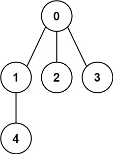
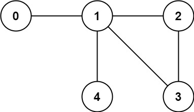

You have a graph of n nodes labeled from 0 to n - 1. You are given an integer n and a list of edges where edges[i] = [ai, bi] indicates that there is an undirected edge between nodes ai and bi in the graph.

Return true if the edges of the given graph make up a valid tree, and false otherwise.

    Input: n = 5, edges = [[0,1],[0,2],[0,3],[1,4]]
    Output: true

    Input: n = 5, edges = [[0,1],[1,2],[2,3],[1,3],[1,4]]
    Output: false

    Constraints:
    
    1 <= n <= 2000
    0 <= edges.length <= 5000
    edges[i].length == 2
    0 <= ai, bi < n
    ai != bi
    There are no self-loops or repeated edges.

**Understanding a Tree (Graph Theory):**

A tree is a connected and acyclic graph.

**Connected:** There is a path between any two nodes.

**Acyclic:** The graph contains no cycles.

**Tree Properties (Key Rules):**
For a graph with n nodes to be a valid tree, it must satisfy these conditions:

**Exactly n - 1 edges:**

If there are fewer than n - 1 edges → the graph is disconnected.

If there are more than n - 1 edges → the graph contains a cycle.
Fully Connected:

All nodes should be part of one single connected component.

Example Breakdown:
✅ Example 1 (Valid Tree):

    n = 5  
    edges = [[0,1], [0,2], [0,3], [1,4]]

Edges count = 4 (n - 1) → ✅
No cycles, and all nodes are connected → ✅
Result: This is a valid tree.

**Solution Visualization:**

Let's break down Union-Find with a graphical explanation to help you visualize how cycles form.

🏗️ 1. Union-Find Basics Recap:

* Find(x): Returns the "parent" or "root" of node x.
* Union(x, y): Connects two nodes by updating their parent.
* Cycle Detection:
Before performing a union, if Find(x) == Find(y), 
  * a cycle is detected.

**Example:**

Given n = 5 and edges:

    [[0, 1], [1, 2], [2, 3], [3, 4], [4, 1]]

🎨 Step-by-Step Visualization:
Edge 1 → [0, 1]:

* Find(0) = 0 (initially, each node is its own parent)
* Find(1) = 1
* Different roots → Union(0, 1)

`0 - 1`

Edge 2 → [1, 2]:

* Find(1) → 0 (after previous union, 1's root is now 0)
* Find(2) = 2
* Different roots → Union(0, 2)

`0 - 1 - 2`

Edge 3 → [2, 3]:

* Find(2) → 0
* Find(3) = 3
* Different roots → Union(0, 3)

`0 - 1 - 2 - 3`

Edge 4 → [3, 4]:

* Find(3) → 0
* Find(4) = 4
* Different roots → Union(0, 4)

`0 - 1 - 2 - 3 - 4`

Edge 5 → [4, 1] (Cycle Forming):

* Find(4) → 0
* Find(1) → 0
* Both nodes have the same root! 🚨
  * This means they’re already connected.
  * Adding [4, 1] would create a cycle.

**3. Why Does Same Root Mean a Cycle?**

*    In Union-Find, if Find(x) == Find(y), it means there’s already a path between x and y.
*    Adding another edge between them would close a loop → Cycle Detected.

