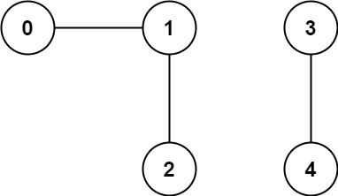
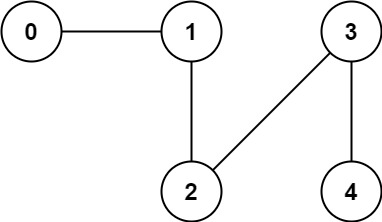

You have a graph of n nodes. You are given an integer n and an array edges where edges[i] = [ai, bi] indicates that there is an edge between ai and bi in the graph.

Return the number of connected components in the graph.

    Input: n = 5, edges = [[0,1],[1,2],[3,4]]
    Output: 2

    Input: n = 5, edges = [[0,1],[1,2],[2,3],[3,4]]
    Output: 1

Constraints:

    1 <= n <= 2000
    1 <= edges.length <= 5000
    edges[i].length == 2
    0 <= ai <= bi < n
    ai != bi
    There are no repeated edges.