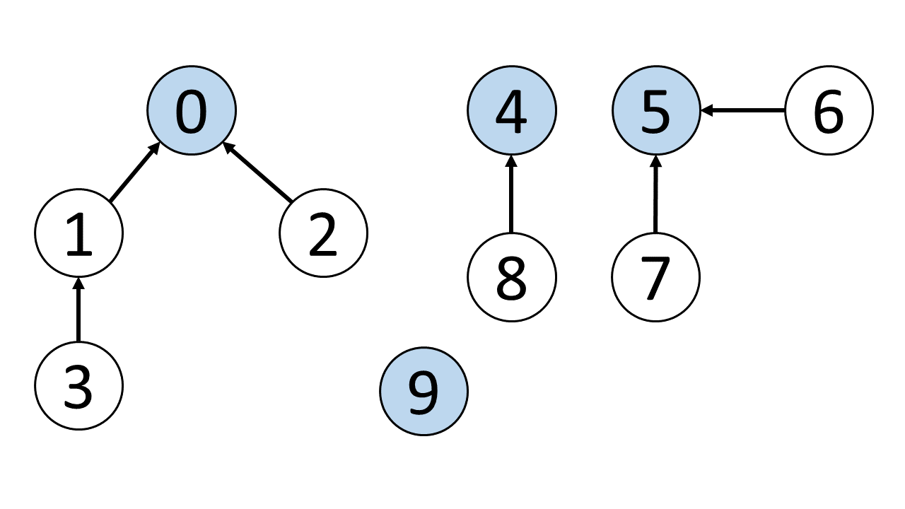
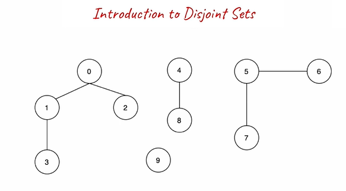
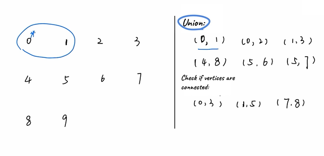
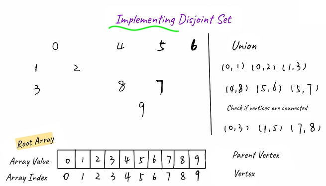
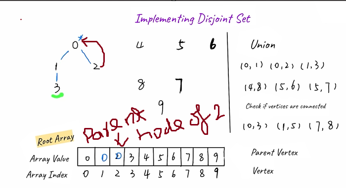
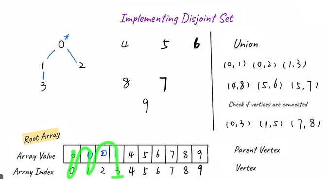
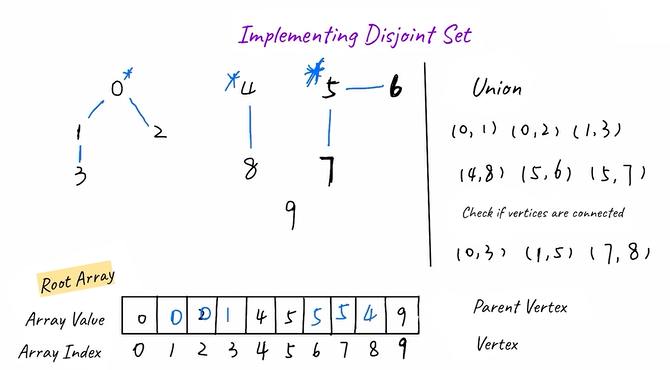
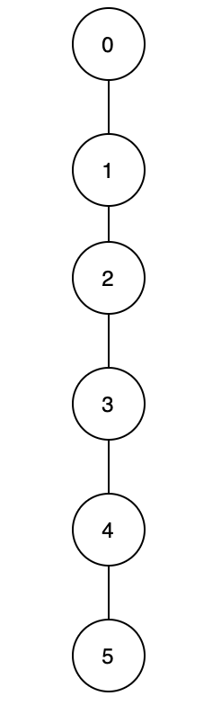

Given the vertices and edges between them, how could we quickly check whether two vertices are connected? For example, Figure 5 shows the edges between vertices, so how can we efficiently check if 0 is connected to 3, 1 is connected to 5, or 7 is connected to 8? We can do so by using the “disjoint set” data structure, also known as the “union-find” data structure. Note that others might refer to it as an algorithm. In this Explore Card, the term “disjoint set” refers to a data structure.

Each graph consists of vertices and edges. The root vertices are in blue.

The primary use of disjoint sets is to address the connectivity between the components of a network. The “network“ here can be a computer network or a social network. For instance, we can use a disjoint set to determine if two people share a common ancestor.

### Terminologies

* Parent node: the direct parent node of a vertex. For example, in Figure 5, the parent node of vertex 3 is 1, the parent node of vertex 2 is 0, and the parent node of vertex 9 is 9.
* Root node: a node without a parent node; it can be viewed as the parent node of itself. For example, in Figure 5, the root node of vertices 3 and 2 is 0. As for 0, it is its own root node and parent node. Likewise, the root node and parent node of vertex 9 is 9 itself. Sometimes the root node is referred to as the head node.

### Introduction to Disjoint Sets:

### The two important functions of a “disjoint set.”

Implementation with Quick Find: in this case, the time complexity of the find function will be

O(1). However, the union function will take more time with the time complexity of

O(N).
Implementation with Quick Union: compared with the Quick Find implementation, the time complexity of the union function is better. Meanwhile, the find function will take more time in this case.

### Disjoint Set - Union by Rank

We have implemented two kinds of “disjoint sets” so far, and they both have a concerning inefficiency. Specifically, the quick find implementation will always spend O(n) time on the union operation and in the quick union implementation, as shown in Figure 6, it is possible for all the vertices to form a line after connecting them using union, which results in the worst-case scenario for the find function. Is there any way to optimize these implementations?

Of course, there is; it is to union by rank. The word “rank” means ordering by specific criteria. Previously, for the union function, we always chose the root node of x and set it as the new root node for the other vertex. However, by choosing the parent node based on certain criteria (by rank), we can limit the maximum height of each vertex.

To be specific, the “rank” refers to the height of each vertex. When we union two vertices, instead of always picking the root of x (or y, it doesn't matter as long as we're consistent) as the new root node, we choose the root node of the vertex with a larger “rank”. We will merge the shorter tree under the taller tree and assign the root node of the taller tree as the root node for both vertices. In this way, we effectively avoid the possibility of connecting all vertices into a straight line. This optimization is called the “disjoint set” with union by rank

