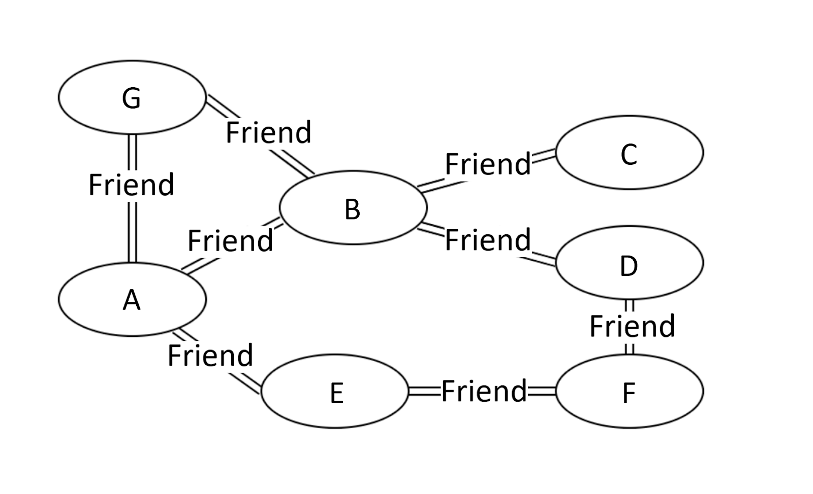
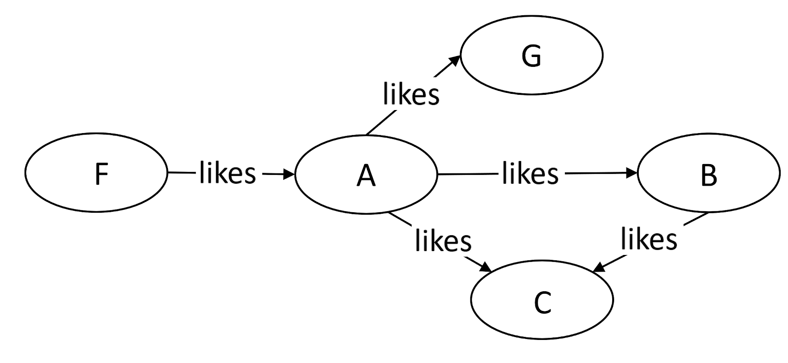
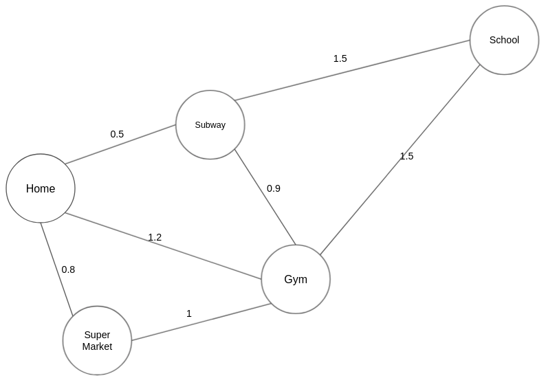
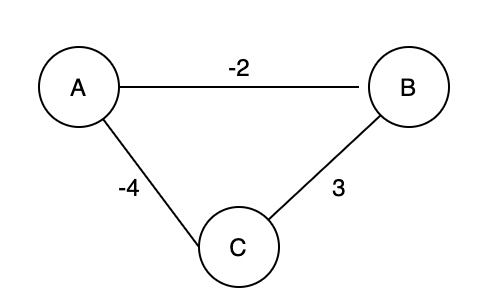

### Graph:

Types of “graphs”
**There are many types of “graphs”**. In this Explore Card, 

**we will introduce three types of graphs:** 

`undirected graphs, directed graphs, and weighted graphs.`

**Undirected graphs**
The edges between any two vertices in an “undirected graph” do not have a direction, indicating a two-way relationship.

Figure 1 is an example of an undirected graph.

**Directed graphs**

The edges between any two vertices in a “directed graph” graph are directional.

above figure is an example of a directed graph.

**Weighted graphs**
Each edge in a “weighted graph” has an associated weight. The weight can be of any metric, such as time, distance, size, etc. The most commonly seen “weighted map” in our daily life might be a city map. In Figure 3, each edge is marked with the distance, 
which can be regarded as the weight of that edge.

**The Definition of “graph” and Terminologies**

“Graph” is a non-linear data structure consisting of vertices and edges. 
There are a lot of terminologies to describe a graph. If you encounter an unfamiliar term in the following 
Explore Card, you may look up the definition below.

* Vertex: In Figure 1, nodes such as A, B, and C are called vertices of the graph.

* Edge: The connection between two vertices are the edges of the graph. In Figure 1, the connection between person A and B is an edge of the graph.

* Path: the sequence of vertices to go through from one vertex to another. In Figure 1, a path from A to C is [A, B, C], or [A, G, B, C], or [A, E, F, D, B, C].

* **Note**: there can be multiple paths between two vertices.

**Path Length:** the number of edges in a path. In Figure 1, the path lengths from person A to C are 2, 3, and 5, respectively.

**Cycle:** a path where the starting point and endpoint are the same vertex. In Figure 1, [A, B, D, F, E] forms a cycle. Similarly, [A, G, B] forms another cycle.

**Negative Weight Cycle:** In a “weighted graph”, if the sum of the weights of all edges of a cycle is a negative value, it is a negative weight cycle. In Figure 4, the sum of weights is -3.

**Connectivity:** if there exists at least one path between two vertices, these two vertices are connected. In Figure 1, A and C are connected because there is at least one path connecting them.

**Degree of a Vertex:** the term “degree” applies to unweighted graphs. The degree of a vertex is the number of edges connecting the vertex. In Figure 1, the degree of vertex A is 3 because three edges are connecting it.

**In-Degree:** “in-degree” is a concept in directed graphs. If the in-degree of a vertex is d, there are d directional edges incident to the vertex. In Figure 2, A’s indegree is 1, i.e., the edge from F to A.

**Out-Degree:** “out-degree” is a concept in directed graphs. If the out-degree of a vertex is d, there are d edges incident from the vertex. In Figure 2, A’s outdegree is 3, i,e, the edges A to B, A to C, and A to G.

and algorithms related to “graph”.

Disjoint Set
Overview of Disjoint Set  Quick Find - Disjoint Set  Quick Union - Disjoint Set  Union by Rank - Disjoint Set  Path Compression Optimization - Disjoint Set  Optimized “disjoint set” with Path Compression and Union by Rank  Summary of the “disjoint set” data structure  Number of Provinces  LeetCode 547 - Number of Provinces - Disjoint Sets  Graph Valid Tree  Number of Connected Components in an Undirected Graph  The Earliest Moment When Everyone Become Friends  Smallest String With Swaps  Evaluate Division  Optimize Water Distribution in a Village
The Depth First Search Algorithm in Graph
Overview of Depth-First Search Algorithm  Traversing all Vertices – Depth-First Search Algorithm  Traversing all paths between two vertices – Depth-First Search Algorithm  Find if Path Exists in Graph  LeetCode 1971 - Find if Path Exists in Graph - DFS  All Paths From Source to Target  LeetCode 797 - All Paths From Source to Target - DFS  Clone Graph  Reconstruct Itinerary  All Paths from Source Lead to Destination
The Breadth First Search Algorithm in Graph
Overview of Breadth-First Search Algorithm  Traversing all Vertices - Breadth-First Search  Shortest Path Between Two Vertices - Breadth-First Search  Find if Path Exists in Graph  LeetCode 1971 - Find if Path Exists in Graph - BFS  All Paths From Source to Target  LeetCode 797 - All Paths From Source to Target - BFS  Populating Next Right Pointers in Each Node  Shortest Path in Binary Matrix  N-ary Tree Level Order Traversal  Rotting Oranges
Algorithms to Construct Minimum Spanning Tree
Overview of Minimum Spanning Tree  Cut Property  Kruskal’s Algorithm  Min Cost to Connect All Points  LeetCode 1584 - Min Cost to Connect All Points - Kruskal's Algorithm  Prim’s Algorithm  Min Cost to Connect All Points  LeetCode 1584 - Min Cost to Connect All Points - Prim's Algorithm
Single Source Shortest Path Algorithm
Overview of Single Source Shortest Path  Dijkstra's Algorithm  Network Delay Time  Bellman Ford Algorithm  Improved Bellman-Ford Algorithm with Queue — SPFA Algorithm  Cheapest Flights Within K Stops  LeetCode 787 - Cheapest Flights Within K Stops - Bellman Ford  Path With Minimum Effort
Kahn's Algorithm for Topological Sorting
Overview of Kahn's Algorithm  Course Schedule II  LeetCode 210 - Course Schedule II - Topological Sorting - Kahn's Algorithm  Alien Dictionary  Minimum Height Trees  Parallel Courses

Tree has no cycle, where graph may have cycle
- Every tree is a special graph which doesn't has cycle
- Node and edges form graph
- geographical Map is graph
-  city1 ----- city2
      \        /
         city2
- The edges are undirected know as Undirected Graph (node1 --- Node2) bi-direction in nature
- If there is direction from node to other node A ----> B
- A------->B
   <------

Mean undirected graph can represented using 2 directed graph

- Where edges and some extra attributes(like small/greater) know as wighted graph
- Completed Graph: every node is directly connected with every other node
  no of node in graph = N
  out of N if I select any 2 nodes, They would have an edge so number of edges = nC2 = n * (n-2) / 2
- 
## Directed Complete Graph :
   no of edges = 2 * NC2

### Adjacent/ Neighbours: 
    A------B

### reachable Node:
  If there ia a path(sequences of edges) between node then Node is reachable
  
### Disconnected Nodes:

### Self loop and parallel edges

    1---->2---
              |
           2<---
connected with themself is self loop where as more than 1 edges connected between same vertces e.g more that 1 path from 1 -> 2

### Cycle in a graph:

If I am able to reach back to source node from any other node means there is cycle.

  A---2
  |    |
  C--- B
Here you can see source A and we can come back from C

### Bipartite Graph:

Graph can be colored using ONLY 2 colos such that no 2 adjacent node have same color:

e.g.
c1   c2
A---2
|    |
C--- B c1
c2

all node has diff colored
c1     c2
1 ----> 2
         \
          3 c1 // not Bipartite, if cycle of odd length, then graph would not be bipartite
         /
5-----4 c2

No color left for node 5, So its non Bipartite Graph

### Degree of node in a graph: no of adjacent edges on node
if selef loop then 2 edges, means self loop contributes 2 degree

Note : every edge contributes +2 in total degree of all the node

degrees  (v) = 2 * ( edges)

