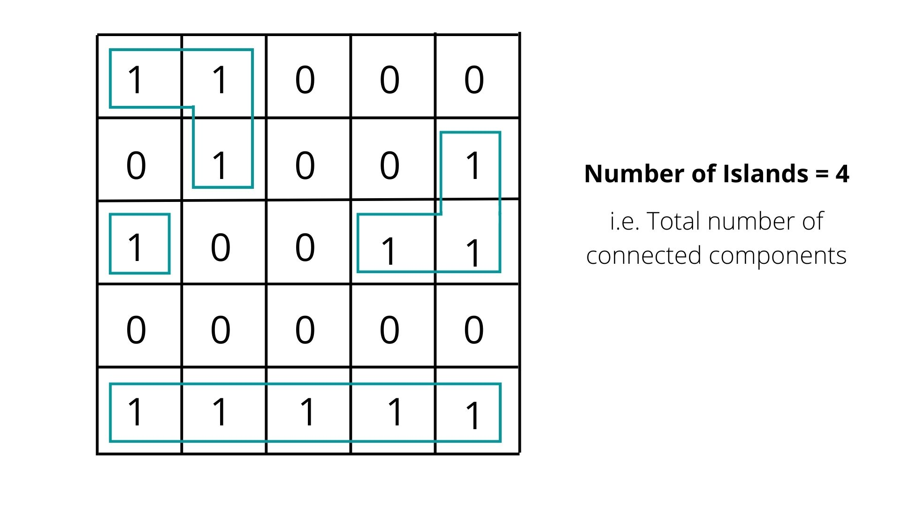
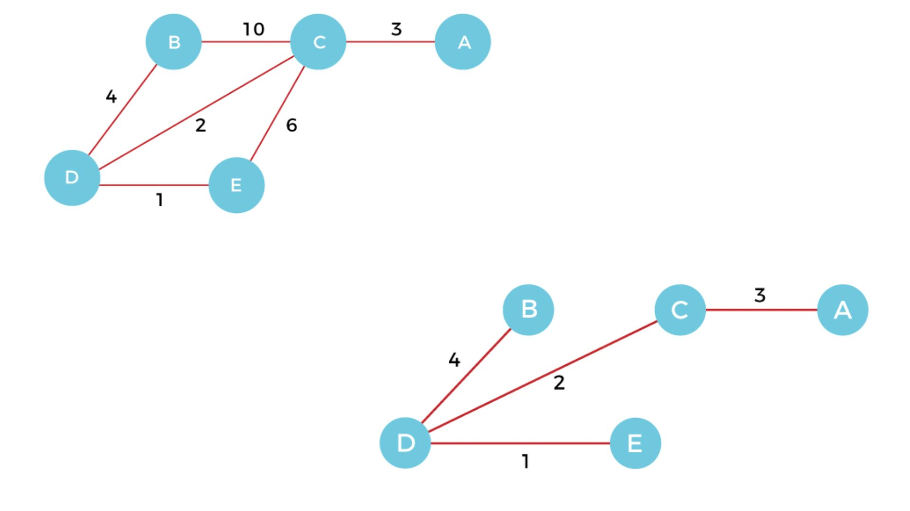

What is a Graph
A Graph is a non-linear data structure consisting of nodes and edges. The nodes are sometimes also referred to as vertices and the edges are lines or arcs that connect any two nodes in the graph. A graph can be seen as a cyclic tree, where the vertices (Nodes) maintain any complex relationship among them instead of having a parent-child relationship.


Let's try to understand this through an example. On Facebook, everything is a node. That includes User, Photo, Album, Event, Group, Page, Comment, Story, Video, Link, Note...anything that has data is a node. Every relationship is an edge from one node to another. Whether you post a photo, join a group, like a page, etc., a new edge is created for that relationship. All of Facebook is then a collection of these nodes and edges. This is because Facebook uses a graph data structure to store its data.

Important Terms for Graph
Nodes- They are similar to nodes of tree, i.e. one single data unit of data structure graph is a node.
Edges- They are connections between given nodes.
Undirected graph- In an undirected graph the edges are bidirectional, with no direction associated with them. Hence, the graph can be traversed in either direction.
Directed graph- In an undirected graph the edges are unidirectional. Edges are usually represented by arrows pointing in the direction the graph can be traversed.
Unweighted Graphs- If we care only if two nodes are connected or not, we call such a graph unweighted. Edges do not have any weights associated with them.
Weighted Graphs- If edges in a graph have some weights or value associated with them then graph is said to be a weighted graph.
Complete Graph-  A graph in which every pair of distinct nodes is connected by a unique edge. Total number of nodes in a complete graph is equal to nC2, where n is number of nodes.
Adjacent nodes- A node is said to be adjacent to another node if there is an edge connecting them. They are also called neighbours.
Reachable nodes- If there exists a path between two nodes, they are called reachable nodes. Path is simply sequence of edges.
Self loop- A loop (also called a self-loop or a buckle) is an edge that connects a vertex to itself.
Parallel edges- Two or more edges that are incident to the same two vertices.
Cycle in graph- If a simple path starts from a particular node and ends at the some node without repeating any node, then a cycle exists in graph.
Bipartite graph- If a graph can be coloured with only two colours such that no two adjacent nodes have same colour. Graphs having a cycle of odd length are not bipartite, rest all graphs are bipartite. 

Degree of a Node
The degree of a node can be considered under two cases of graphs −

Undirected Graph
The degree of a node is the number of edges connecting it. The total degree of all nodes is equal to 2*(Number of edges) because one edge adds 2 to the total degree.
Directed Graph
In a directed graph, each vertex has an indegree and an outdegree.
Indegree- Indegree of node V is the number of edges that are coming into node V.
Outdegree- Outdegree of node V is the number of edges that are going out from node V. 

Graph Representation
There are mainly two ways to represent a graph −

Adjacency Matrix
Adjacency List
Adjacency Matrix

For a graph with |V| vertices, an adjacency matrix is a ∣V∣×∣V∣ matrix of 0s and 1s, where the entry in row i and column j is 1 if and only if the edge (i,j) is in the graph. Whereas 0 indicates an absent edge.


With an adjacency matrix, we can find out whether an edge is present in constant time, by just looking up the corresponding entry in the matrix. For example, if the adjacency matrix is named graph, then we can query whether edge (i,j) is in the graph by looking at graph[i][j]. For an undirected graph, the adjacency matrix is symmetric. For a directed graph, the adjacency matrix need not be symmetric.


Space complexity: O(V*V)


Adjacency List

The other way to represent a graph is by using an adjacency list. An adjacency list is an array A of separate lists. Each element of the array Ai is a list, which contains all the vertices that are adjacent to vertex i.


The space complexity of the adjacency list is O(V + E) because in an adjacency list information is stored only for those edges that actually exist in the graph. In a lot of cases, where a matrix is sparse using an adjacency matrix may not be very useful. This is because using an adjacency matrix will take up a lot of space where most of the elements will be 0, anyway. In such cases, using an adjacency list is better.


Space complexity: O(V+E)

Breadth First Search
Breadth-First Traversal (or Search) for a graph is similar to the Level order Traversal of a tree. It starts traversing the graph from the root node and explores all the neighboring nodes. Then, it selects the nearest node and explores all the unexplored nodes. While using BFS for traversal, any node in the graph can be considered as the root node. The only catch here is, that, unlike trees, graphs may contain cycles, so we may come to the same node again. To avoid processing the same node again, use a boolean array that marks the node after it is processed. While visiting the nodes in the layer of a graph, store them in a manner such that you can traverse the corresponding child nodes in a similar order.

To make this process easy, use a queue to store the node and mark it as 'visited' until all its neighbors (vertices that are directly connected to it) are marked. The queue follows the First In First Out (FIFO) queuing method, and therefore, the neighbors of the node will be visited in the order in which they were inserted in the node i.e. the node that was inserted first will be visited first, and so on.

```angular2html
BFS (G, s)

    let Q be a queue.

    Q.enqueue( s )

    mark s as visited.

    while ( Q is not empty)

        v  =  Q.dequeue( ) 

        for all neighbours w of v in Graph G

            if w is not visited 

                Q.enqueue( w )

                mark w as visited.


Time complexity: O(V+E)

Space complexity: O(V)
```
BFS Tree
The BFS tree is the corresponding tree whose level order traversal is the same as the breadth-first search of a given graph.


Creating a BFS tree:
There are two types of edges present in the graph, one that we use in BFS and others that we don’t use. Those edges which are prompting us to add a new node to the queue are the nodes we are using. So the edges we are using will also be part of the BFS tree and others that are not being used will be ignored in the BFS tree. Consider the graph given in the above figure: We are using edges (1,2) and (1,3), that’s why they are present in the tree but we have not used edge (2,4) so it is not present.

If a node in the graph can be put at different levels in its corresponding BFS tree, then it will always be put on the minimum level. This will be used in finding the shortest path between two nodes.

Shortest Path in an Undirected Graph
We are given an array of edges and a source. All edges are bidirectional and unweighted. we need to find the length of the shortest path from the source to all other nodes.

Input: [[1,2], [1,3], [2,4], [3,4], [4,5]], s=1

Output: [0,1,1,2,2,3]

Approach:

The simplest way to solve this problem is using the property of BFS. We visit all those nodes which are adjacent to the current node i.e. distance between two nodes should be 1. Basically in we need to find the level of each node, nodes at the first level are at distance one, nodes at the second level are at distance two, and so on. We will take a queue of pairs that will store the node as well as its distance from the source. Rest everything will remain the same, as we did in the case of normal BFS. Also, we will keep updating dist array as we encounter new unvisited nodes.

queue<int> BFS(int V, int src, vector<int> adj[]){

    vector<bool> vis(V+1, 0);

    queue<pair<int,int>> q;

    vector<int> dist(V+1,INT_MAX);

    q.push({src,0});

    vis[src] = 1;

    dist[src] = 0;

    while (!q.empty()){

        int q_size = q.size();

        while (q_size--){

            pair<int,int> p = q.front();

            int node=p.first;

            int d=p.second;

            q.pop();

            for (auto adjNode:adj[node]){

                if (!vis[adjNode]){

                    vis[adjNode] = 1;

                    dist[adjNode] = d + 1;

                    q.push({adjNode,d+1});

                }

            }

        }

    }

}

Time complexity: O(V+E)
Space complexity: O(V)

Knight Tour
Given a chess board of size n x n, initial position of knight and final position of knight. We need to find the minimum number of steps required to reach the final position, If it is impossible to reach the final position then return -1.

Input: N = 8, Source = (7, 0), Destination = (0, 7)

Output: 6

Approach:

A knight can move to 8 positions from (x,y).

(x, y) ->

    (x + 2, y + 1)  

    (x + 2, y - 1)

    (x - 2, y + 1)

    (x - 2, y - 1)

    (x + 1, y + 2)

    (x + 1, y - 2)

    (x - 1, y + 2)

    (x - 1, y - 2)

We can visualize this situation as a graph where the edges will represent possible moves and the vertices will represent possible positions of the knight. This reduces the problem to the standard problem of the shortest path in an unweighted graph. Hence we will be using Breadth-First Search (BFS) to solve this problem.

We can find all the possible locations the knight can move to from the given location by using the array that stores the relative position of knight movement from any location. For example, if the current location is (x, y), we can move to (x + row[k], y + col[k]) for 0 <= k <= 7 using the following array:


dx[] = [ 2, 2, -2, -2, 1, 1, -1, -1 ]

dy[] = [ -1, 1, 1, -1, 2, -2, 2, -2 ]

We will start with the initial position of the knight and will push it into a queue. We will then iterate until our queue is empty. At each iteration, we will pop out the front element of the queue and will then generate all the possible moves from this position. If the generated move is valid and we have not traversed it previously, then we will insert it into our queue. Also if the current position is the desired destination then we will just return the desired value. If we have iterated all the possible positions and still not reached the final position then we will return -1.

struct cell {

    int x, y;

    int dis;

    cell() {}

    cell(int x, int y, int dis): x(x), y(y), dis(dis){}

};


bool isInside(int x, int y, int N){

    if (x >= 1 && x <= N && y >= 1 && y <= N)

        return true;

    return false;

}


int minStepToReachTarget(int knightPos[], int targetPos[],int N){

    int dx[] = { 2, 2, -2, -2, 1, 1, -1, -1 };

    int dy[] = { -1, 1, 1, -1, 2, -2, 2, -2 };


    queue<cell> q;

    q.push(cell(knightPos[0], knightPos[1], 0));

    cell t;

    int x, y;

    vector<vector<bool>> vis(N+1,vector<bool>(N+1,0));

    vis[knightPos[0]][knightPos[1]] = true;

    while (!q.empty()) {

        t = q.front();

        q.pop();

        if (t.x == targetPos[0] && t.y == targetPos[1]) return t.dis;

        for (int i = 0; i < 8; i++) {

            x = t.x + dx[i];

            y = t.y + dy[i];

            if (isInside(x, y, N) && !vis[x][y]) {

                vis[x][y] = true;

                q.push(cell(x, y, t.dis + 1));

            }

        }

    }

    return -1;

}

Time complexity: O(N*N)

Space complexity: O(N*N)

Closest Zero
We are given a binary matrix of N x M. The task is to find the distance of the nearest 0 in the matrix for each cell. The distance is calculated as |i1 – i2| + |j1 – j2|, where i1, j1 are the row number and column number of the current cell, and i2, j2 are the row number and column number of the nearest cell having value 0.

Input: mat[][] = [[0, 0, 0, 1], [0, 0, 1, 1], [0, 1, 1, 0]]

Output: [[0, 0, 0, 1], [0, 0, 1, 1], [0, 1, 1, 0]]

Naive Approach:

For every element of the matrix, traverse the whole matrix and find the cell with the least distance having 0 in the matrix.

Time Complexity: O(n*n*m*m)

Space Complexity: O(n*m)

Optimal Approach:

The idea is to use multisource Breadth-First Search. Consider each cell as a node and each boundary between any two adjacent cells be an edge. Number each cell from 1 to N*M. Now, push all the nodes whose corresponding cell value is 0 in the matrix in the queue. Apply BFS using this queue to find the minimum distance of the adjacent node.

Create an empty queue.

Traverse all matrix elements and insert positions of all 0s in the queue. Now do a BFS traversal of the graph using the queue. Run a loop till the size of the queue is greater than 0 then extract the front node of the queue and remove it and insert all its adjacent and unmarked elements. Update the minimum distance as the distance of the current node +1 and insert the element in the queue.

struct cell {

    int x, y;

    int dis;

    cell() {}

    cell(int x, int y, int dis): x(x), y(y), dis(dis){}

};

bool isInside(int x, int y, int N, int M){

    if (x >= 0 && x < N && y >= 0 && y < M)

        return true;

    return false;

}


vector<vector<int>> dist BFS(vector<vector<int>> matrix){

    int dx[] = { 1, -1, 0, 0 };

    int dy[] = { 0, 0, 1, -1 };

    int N=matrix.size(), M=matrix[0].size();

    queue<cell> q;

    vector<vector<int>> dist(n,vector<int>(m,-1));

    for(int i=0;i<n;i++){

        for(int j=0;j<m;j++){

            if(matrix[i][j]==0){

                q.push(cell(i,j,0));

                dist[i][j]=0;

            }

        }

    }

    while (!q.empty()) {

        t = q.front();

        q.pop();

        for (int i = 0; i < 4; i++) {

            x = t.x + dx[i];

            y = t.y + dy[i];

            if (isInside(x, y, N,M) && dist[x][y]==-1) {

                dist[x][y] = t.dis+1;

                q.push(cell(x, y, t.dis + 1));

            }

        }

    }

    return dist;

}

Time Complexity: O(n*m)

Space Complexity: O(n*m)

Rotten Oranges
Given a matrix of dimension m*n where each cell in the matrix can have values 0, 1, or 2 which has the following meaning:

0: Empty cell

1: Cells have fresh oranges

2: Cells have rotten oranges

Determine what is the minimum time required so that all the oranges become rotten. A rotten orange at index [i,j] can rot other fresh orange at indexes [i-1,j], [i+1,j], [i,j-1], [i,j+1] (up, down, left and right). If it is impossible to rot every orange then simply return -1.

Input: arr[][] = [[2,1,1], [1,1,0], [0,1,1]]

Output: 4

Approach:

This problem is very similar to the previous one. We were finding the minimum distance of each 1, from any 0. So replace distance with time, and we need to find the minimum distance(time) for each 1(fresh oranges) from any 2(rotten oranges).

We put all rotten orange coordinates in our queue, so we are going to start from all of them. Also, we count the number of fresh oranges. Now, we traverse our grid, using BFS, so the time taken for every new neighbor is 1 greater than its parent. And every time we visit a fresh orange we will increase the count of visited fresh oranges(i.e. They will surely rot). Also, we will keep a ans integer that will record the maximum time among all fresh oranges.

Finally, we check if we visited all fresh oranges, if no, return -1. If yes, we will return ans.


struct cell {

    int x, y;

    int dis;

    cell() {}

    cell(int x, int y, int dis): x(x), y(y), dis(dis){}

};

bool isInside(int x, int y, int N, int M){

    if (x >= 0 && x < N && y >= 0 && y < M)

        return true;

    return false;

}


int dist BFS(vector<vector<int>> arr){

    int dx[] = { 1, -1, 0, 0 };

    int dy[] = { 0, 0, 1, -1 };

    int N=arr.size(), M=arr[0].size();

    queue<cell> q;

    vector<vector<int>> vis(n,vector<int>(m,0));

    int total_fresh=0;

    for(int i=0;i<n;i++){

        for(int j=0;j<m;j++){

            if(arr[i][j]==1){

                q.push(cell(i,j,0));

                vis[i][j]=1;

            }

            else if(arr[i][j]==1) total_fresh++;

        }

    }

    int ans=0,vis_fresh=0;

    while (!q.empty()) {

        t = q.front();

        q.pop();

        for (int i = 0; i < 4; i++) {

            x = t.x + dx[i];

            y = t.y + dy[i];

            if (isInside(x, y, N,M) && vis[x][y]==0 && arr[x][y]==1) {

                vis[x][y]=1;

                q.push(cell(x, y, t.dis + 1));

                ans=max(ans,t.dist+1);

                vis_fresh++;

            }

        }

    }

    if(total_fresh!=vis_fresh) return -1;

    else return ans;

}


Time Complexity: O(n*m)

Space Complexity: O(n*m)

Word Ladder
Given a dictionary, and two words ‘start’ and ‘target’ (both of the same length). Find the length of the smallest chain from ‘start’ to ‘target’ if it exists, such that adjacent words in the chain only differ by one character, and each word in the chain is a valid word i.e., it exists in the dictionary.

Input: start= "hit", target= "cog", words= ["hot","dot","dog","lot","log","cog"]

Output: 5 (Explanation: One shortest transformation sequence is "hit" -> "hot" -> "dot" -> "dog" -> cog", which is 5 words long.)

Approach:

We have to find the shortest sequence so we will use some shortest path algorithms like Breadth-First-Search. Words will behave as nodes and if there exist two words that differ at only one position then there exists an edge between them. We can create an adjacency list that will store all possible edges for every word. Once edges are created, we can apply simple BFS, if the target is found, we will return the shortest length else we will return -1. We will use map<string, int> for making nodes, where words will be key are their indices will be used as nodes.

bool oneStep(string &a, string &b){

    if(a.size()!=b.size()) return 0;

    int cnt=0;

    for(int i=0;i<a.size();i++){

        if(a[i]!=b[i]) cnt++;

    }

    return cnt==1;

}


map<string,int> nodes;

int n=words.size();

for(int i=0;i<n;i++) nodes[words[i]]=i;

vector<int>adj[n];

for(int i=0;i<n;i++){

    for(int j=0;j<n;j++){

        if(oneStep(words[i],words[j])){

            adj[nodes[words[i]]].push_back(nodes[words[j]]);

            adj[nodes[words[j]]].push_back(nodes[words[i]]);

        }

    }

}

Time Complexity: O(n*n*m)

Space Complexity: O(n*m)

Where n is the size of the words array and m is the size of a word.

Word Ladder - Alternate Approach
Optimal Approach:

For any word, we have a limited number of words that we can move to, i.e. having only one different character. For example: for the word “hit”, if the difference is at the first position, edges can be formed with words like “ait”, “bit”,....., and “zit”. Similarly for all other positions. In total, we can have 25*M different possibilities for each word depending upon how many of them are present in the given words array.

We will use the normal BFS approach again, for every node we will find out all possible nodes where we can move. We can store all words in a set to check if any word is present or not. Also, we will use a map to mark visited to avoid the repetition of nodes.

set<string> st;

for(int i=0;i<words.size();i++){

    st.insert(words[i]);

}

int c=1;

queue<pair<string,int>>q;

q.push(A);

map<string,int> vis;

vis[start]=1;

q.push({start,0})''

while(!q.empty()){

    pair<string,int>p=q.front();

    q.pop();

    string s=p.first;

    int dis=p.second;

    if(s==target) return dis;

    for(int i=0;i<s.size();i++){

        char temp=s[i];

        for(char cr='a'; cr<='z';cr++){

            s[i]=cr;

            if(st.find(s)!=st.end() && vis[s]==0){

                q.push({s,dis+1});

                vis[s]=1;

            }

        }

        s[i]=temp;

    }

}

return -1;

Time Complexity: O(n*m*m)

Space Complexity: O(n*m)

Where n is the size of the words array and m is the size of a word.

Depth First Search
Depth First Traversal (or Search) for a graph is similar to Depth First Traversal of a tree. It is an algorithm for traversing or searching tree or graph data structures. The algorithm starts at the root node (selecting some arbitrary node as the root node in the case of a graph) and explores as far as possible along each branch before backtracking. So the basic idea is to start from the root or any arbitrary node and mark the node and move to the adjacent unmarked node and continue this loop until there is no unmarked adjacent node. Then backtrack and check for other unmarked nodes and traverse them. Again to avoid processing the same node again, use a boolean array that marks the node after it is processed.

DFS(G, u)

    if(u.visited == true) return

    u.visited = true

    print u

    for each v ∈ Adj[u]

        if v.visited == false

            DFS(G,v)


Number of Connected Components
Given n, i.e. total number of nodes in an undirected graph numbered from 1 to n, and an integer e, i.e. total number of edges in the graph. Calculate the total number of connected components in the graph.

Input: edges= [[1,2], [2,3], [2,4], [3,5], [6,7]]
Output: 3


A connected component of an undirected graph is a subgraph in which every two vertices are connected to each other by a path(s), and which is connected to no other vertices outside the subgraph. A graph where all vertices are connected with each other has exactly one connected component, consisting of the whole graph. Such a graph with only one connected component is called a Strongly Connected Graph.

Approach:
DFS visits all the connected vertices of the given vertex. When iterating over all vertices, whenever we see an unvisited node, it is because it was not visited by DFS done on vertices so far. That means it is not connected to any previous nodes visited so far i.e it was not part of previous components. Hence this node belongs to a new component.

The idea is to use a variable count to store the number of connected components and initialize all vertices as unvisited. For all the vertices check if a vertex has not been visited, then perform DFS on that vertex and increment the variable count by 1.

void dfs(int node, vector<int>adj[], vector<int>&vis){

    vis[node]=1;

    for(int i=0;i<adj[node].size();i++){

        if(!vis[adj[node][i]]){

            dfs(adj[node][i],adj,vis);

        }

    }

}

for(i=1;i<=n;i++){

    if(!vis[i]){

        count++;

        dfs(i,adj,vis);

    }

}

Time complexity: O(V+E)
Space complexity: O(V)

Number of Islands
Given a boolean 2D matrix, find the number of islands. A group of connected 1s forms an island. Two 1s are connected if they are adjacent. For (x,y), adjacent cells are (x+1,y), (x,y+1), (x-1, y) and (x,y-1).

Input: [[1, 1, 0, 0, 0], [0, 1, 0, 0, 1], [1, 0, 0, 1, 1], [0, 0, 0, 0, 0], [1, 1, 1, 1, 1]]
Output: 4



Approach:
This is a variation of the standard problem: “Counting the number of connected components in an undirected graph”. The problem can be easily solved by applying DFS on each component. In each DFS call, a component or a sub-graph is visited. We will call DFS on the next un-visited component. The number of calls to DFS() gives the number of connected components. A cell in a 2D matrix can be connected to 4 neighbors. So, unlike standard DFS, where we recursively call for all adjacent vertices, here we can recursively call for 4 neighbors only. We keep track of the visited 1s so that they are not visited again.

    int xx[4]={1,-1,0,0}, yy[4]={0,0,1,-1};

    void dfs(vector<vector<char>>& grid, vector<vector<bool>> &v,int i,int j,int &n, int &m){

        for(int k=0;k<4;k++){

            if(i+xx[k]<0 || i+xx[k]>=n || j+yy[k]<0 || j+yy[k]>=m) continue;

            if(grid[i+xx[k]][j+yy[k]]==0 || v[i+xx[k]][j+yy[k]]==true) continue;

            v[i+xx[k]][j+yy[k]]=true;

            dfs(grid,v,i+xx[k],j+yy[k],n,m);

        }

    }

    int numIslands(vector<vector<int>>& grid) {

        int n,m,ans=0;

        n=grid.size();m=grid[0].size();

        vector<vector<bool>> v(n,vector<bool>(m,0));

        for(int i=0;i<n;i++){

            for(int j=0;j<m;j++){

                if(grid[i][j]==1 && !v[i][j]){

                    v[i][j]=true;

                    ans++;

                    dfs(grid,v,i,j,n,m);

                }

            }

        }

        return ans;

    }

Time complexity: O(N*M)
Space complexity: O(N*M)

Capture Surrounded Regions
Given an m x n matrix board containing 'X' and 'O', capture all regions that are 4-directionally surrounded by 'X'. A region is captured by flipping all 'O's into 'X's in that surrounded region.

Input: board = [["X","X","X","X"],["X","O","O","X"],["X","X","O","X"],["X","O","X","X"]]

Output: [["X","X","X","X"],["X","X","X","X"],["X","X","X","X"],["X","O","X","X"]]


Approach:

Let's analyze when an 'O' cannot be flipped, if it has at least one 'O' in its adjacent, and ultimately this chain of adjacent 'O's is connected to some 'O' which lies on the boundary of the board. We will use boundary DFS to solve this problem.

Move over the boundary of the board, and find O's. Every time we find an O, perform DFS from its position and convert all 'O' to '#' (why? So that we can differentiate which 'O' can be flipped and which cannot be). After processing every boundary element, the board contains three elements #, O, and X. 'O' are leftover elements that are not connected to any boundary O, so flip them to 'X'and '#' are elements that cannot be flipped to 'X', so flip them back to 'O'.

    void DFS(vector<vector < char>> &board, int i, int j, int m, int n){

        if (i < 0 or j < 0 or i >= m or j >= n or board[i][j] != 'O') return;

        board[i][j] = '#';

        DFS(board, i - 1, j, m, n);

        DFS(board, i + 1, j, m, n);

        DFS(board, i, j - 1, m, n);

        DFS(board, i, j + 1, m, n);

    }


    void solve(vector<vector < char>> &board){

        int m = board.size();

        int n = board[0].size();  

        for (int i = 0; i < m; i++){

            if (board[i][0] == 'O') DFS(board, i, 0, m, n);

            if (board[i][n - 1] == 'O') DFS(board, i, n - 1, m, n);

        }   

        for (int j = 0; j < n; j++){

            if (board[0][j] == 'O') DFS(board, 0, j, m, n);

            if (board[m - 1][j] == 'O') DFS(board, m - 1, j, m, n);

        }


        for (int i = 0; i < m; i++){

            for (int j = 0; j < n; j++){

                if (board[i][j] == 'O') board[i][j] = 'X';

                if (board[i][j] == '#') board[i][j] = 'O';

            }

        }     

    }

Time complexity: O(N*M)

Space complexity: O(N*M)


Check Bipartite Graph
There is an undirected graph with n nodes, where each node is numbered between 0 and n - 1. You are given a 2D array graph, where graph[u] is an array of nodes that node u is adjacent to. Check if the given graph is bipartite or not.

Input: graph = [[1,2,3],[0,2],[0,1,3],[0,2]]

Output: false

A graph is bipartite if the nodes can be partitioned into two independent sets A and B such that every edge in the graph connects a node in set A and a node in set B. i.e. If a graph can be colored with only two colors such that no two adjacent nodes have the same color.

Approach:

Our goal is to try to use two colors to color the graph and see if there are any adjacent nodes having the same color. We will initialize a color array for each node. And there will be three states for the color array:

-1: Haven't been colored yet.

0: Blue.

1: Red.

For each node, we will have two

If it hasn't been colored, use any of the two colors to color it. Then use the other color to color all its adjacent nodes (DFS).
If it has been colored, check if the current color is the same as the color that is going to be used to color it. If it is the same color, that means the given graph is not bipartite.
bool valid(vector<vector<int>>& graph, vector<int>& colors, int node, int color) {

        if (colors[node]) {

            return colors[node] == color;

        }

        colors[node] = color;

        for (int neigh : graph[node]) {

            if (!valid(graph, colors, neigh, (color+1)%2)) {

                return false;

            }

        }

        return true;

    }


    bool isBipartite(vector<vector<int>>& graph) {

        int n = graph.size();

        vector<int> colors(n, 0);

        for (int i = 0; i < n; i++) {

            if (!colors[i] && !valid(graph, colors, i, 1)) {

                return false;

            }

        }

        return true;

    }


Time complexity: O(V+E)

Space complexity: O(V)

Detect Cycle in Undirected Graph
Given an undirected graph, check if there is a cycle in the graph?

Approach:

When we do a Depth-first search (DFS) from any vertex v in an undirected graph, we may encounter a back-edge that points to one of the ancestors of the current vertex v in the DFS tree. Each “back edge” defines a cycle in an undirected graph. If the back edge is x —> y, then since y is the ancestor of node x, we have a path from y to x. So, we can say that we have a path y ~~ x ~ y that forms a cycle. (Here, ~~ represents one more edge in the path, and ~ represents a direct edge).

Create a recursive function that has the current index or vertex, visited array, and parent node. Mark the current node as visited. Find all the vertices which are not visited and are adjacent to the current node. Recursively call the function for those vertices. If any adjacent node is visited and it is not the parent that means the graph contains a cycle.

    bool dfs(int u, int par, vector<int>adj[], vector<bool>&vis){

        vis[u] = true;

 

        for(auto v: adj[u]){

            if(v == par) continue;

            if(vis[v]) return true;

            if(dfs(v, u, adj, vis)) return true;

        }

        return false;

    }

    bool isCycle(int V, vector<int> adj[]){

        vector<bool>visited(V, false);

        for(int i = 0; i < V; i++){

            if(!visited[i]){

                bool cycle = dfs(i, -1, adj, visited);

                if(cycle) return true;

            }

        }

        return false;

    }

Time complexity: O(V+E)

Space complexity: O(V)

Detect Cycle in Directed Graph
Given a directed graph, check if there is a cycle in the graph?

Approach:

While checking for the cycle in an undirected graph, we were not bothered with the direction of edges. But in a directed graph, reaching a certain position twice is not enough condition for the cycle. Let’s consider this simple example:


To reach node three there exist two paths from 1 i.e. 1->3 and 1->2->4->3. But it can’t be called a cycle. So, just checking if a node is already visited doesn't ensure the existence of a cycle. So we need to make sure if a node is already visited in the current path. We need three flags for each node:

0- Node is unvisited.

1- Node is visited in the current path.

2- Node is visited in another path.

Create a recursive function that has the current index or vertex and visited array. Mark the current node as visited in the current path. Find all the vertices which are not visited and are adjacent to the current node. Recursively call the function for those vertices. If any adjacent node is visited and it is in the current path that means the graph contains a cycle. While backtracking we will mark visited nodes as 2 i.e. node is visited in another path.

    bool dfs(int u, vector<int>adj[], vector<int>&vis){

        vis[u] = 1;

 

        for(auto v: adj[u]){

            if(vis[v]==2) continue;

            if(vis[v]==1) return true;

            if(dfs(v, adj, vis)) return true;

        }

        vis[u]=2;

        return false;

    }

    bool isCycle(int V, vector<int> adj[]){

        vector<int>visited(V, 0);

        for(int i = 0; i < V; i++){

            if(visited[i]==0){

                bool cycle = dfs(i, adj, visited);

                if(cycle) return true;

            }

        }

        return false;

    }


Time complexity: O(V+E)

Space complexity: O(V)

Topological Sorting
Given a DAG( Directed Acyclic Graph ), print all the vertex of the graph in a topologically sorted order. If there are multiple solutions, print any.

Topological sorting for Directed Acyclic Graph (DAG) is a linear ordering of vertices such that for every directed edge u->v, vertex u comes before v in the ordering. Topological Sorting for a graph is not possible if the graph is not a DAG.


For example, a topological sorting of the given graph is “5 4 2 1 3 0”. There can be more than one topological sorting for a graph. For example, another topological sorting of the following graph is “4 5 2 1 3 0”. The first vertex in topological sorting is always a vertex with an in-degree of 0 (a vertex with no incoming edges).

Kahn's algorithm:

The first and one of the most popular algorithms that can be used to return the topological sorting of a graph is Kahn's algorithm. The approach is based on the fact, That a DAG G has at least one vertex with in-degree 0 and one vertex with out-degree 0. Kahn's algorithm basically looks for the nodes that do not have any incoming edges, or have indegree = 0, and then removes its outgoing edges, making its outdegree also equal to 0.

We will compute in-degree for each of the vertex present in the DAG and initialize the count of visited nodes as 0. Then we will pick all the vertices with in-degree as 0 and add them into a queue (Enqueue operation). Every time we encounter a node with in-degree 0, we will

Decrease in-degree by 1 for all its neighboring nodes.
If the in-degree of a neighboring node is reduced to zero, then add it to the queue.
We will keep repeating the same until the queue is not empty.

vector<int> topologicalSort(vector<int> adj[], int V) {

    vector<int> in_degree(V, 0); 

    for (int u = 0; u < V; u++) { 

        for (int x:adj[u]) in_degree[x]++; 

    } 

    queue<int> q;

    for (int i = 0; i < V; i++){

        if (in_degree[i] == 0) q.push(i); 

    }

    vector<int> topo;

    while (!q.empty()) { 

        int u = q.front(); 

        q.pop(); 

        topo.push_back(u);

        for (int x: adj[u]){

            in_degree[x]--;

            if (in_degree[x] == 0) q.push(x); 

        }

    }

    return topo;

}


Time complexity: O(V+E)

Space complexity: O(V)

If the number of nodes in the topo_sorted array is not equal to the number of nodes in the graph then the topological sort is not possible for the given graph. This property can be used to find the cycle in a directed graph.

Course Schedule
There are a total of N courses you have to take, labeled from 0 to N-1. You are given an array prerequisites where prerequisites[i] = [x, y]. It indicates that you must take course y first if you want to take course x. For example, the pair [0, 1], indicates that to take course 0 you have to first take course 1. Check if it is possible to finish all courses.

Input: n= 4, prerequisites = [[1,0], [2,0], [3,1], [3,2]]

Output: true

Brute Force:

We can generate all possible permutations of n courses. And check if any of them is a valid combination.

Time complexity: O(M*N!)

Space complexity: O(N)


Optimal Approach:

We can consider this problem as a graph (related to topological sorting) problem. All tasks are nodes of the graph and if task u is a prerequisite of task v, we will add a directed edge from node u to node v. Now, this problem is equivalent to detecting a cycle in the graph represented by prerequisites. If there is a cycle in the graph, then it is not possible to finish all tasks (because in that case there is no topological order of tasks). The correct sequence to take courses will be a topological order of the nodes. We can simply apply Khan’s algorithm to find topological sorting. Topological ordering doesn’t exist if the graph has a cycle. If the number of nodes in the topo_sorted array is not equal to the number of nodes in the graph then the topological sort is not possible for the given graph which means we can’t take all courses.

Time complexity: O(V+E)
Space complexity: O(V)

Order of Characters
Given a lexicographically sorted dictionary (array of words) of an alien language, find the order of characters in the language.

Input: ["baa", "abcd", "abca", "cab", "cad"]

Output: 'b', 'd', 'a', 'c'

Approach: A lexicographically sorted dictionary gives us some information about the order of characters in the alphabet. In other words, from the dictionary, we can figure out that certain characters precede certain other characters in the alphabet.

In a dictionary, between two adjacent words, one of the following is true:

There is at least one character different. E.g., between "abcx" and "abcyz," the fourth characters are different — "x" and "y"
The first word is a prefix of the second one. E.g., "abc" and "abcd"
If the first case, we know from the dictionary property that the character at the mismatch index in the left word appears before its counterpart in the right word in the alphabet.

So, to solve our problem, we can start by comparing two adjacent words and try to find a mismatch. The first mismatch denotes that the letter in the first word will come before the respective letter in the second word in the alien language. So we can use a directed graph to combine the information collected by comparing words. Add a directed edge between the first mismatched characters. Our directed graph will be a directed acyclic graph. Now, we can use topological sort on the DAG to get the order of characters.

Time complexity: O(N*L)

Space complexity: O(N*L)

Where N is the number of words in the dictionary and L is the length of a word.

Disjoint Set Union
It is given that there are N people partitioned in different sets. We will apply two operations:

Find(X): Determine which subset a person X is in.
Union(X, Y): Join two subsets in which person X and person Y are present.
For example:

S1=[1, 3], S2=[5], S3=[2], S4=[4, 7, 9], S5=[8, 6, 10]

Find(7)=S4

Union(9, 3)= S1[1, 3, 4, 7, 9], S2=[5], S3=[2], S5=[8, 6, 10]

We can consider each subset as a connected component of a graph. Find(X) function checks in which component given number (node) is present. And Union(X, Y) will connect two components of the graph by adding an edge between any nodes of these two components. Suppose (X, Y) are present in the same component, then adding an edge between these nodes will result in cycle creation in that component. Thus this Union-Find Algorithm can be used to check whether an undirected graph contains a cycle or not.

Naive Approach: Initially we can store the set number of each person using a hashmap or a vector. Find operation can be easily done just by checking which set any person is present in. This operation will take O(1) time. But for Union operation, we will first find the set of both people. If they belong to different subsets, we will decide in which subset we want to merge, suppose we want to merge in the subset of person X, then we will find all people belonging to the set of person Y and change their set number to that of X. This operation will take O(N) time.

Optimised Union
We can consider a root element of each subset, which is a only special element in that subset having itself as the parent. Let’s say R is a root element, then Arr[ R ] = R.

To make it more clear,let’s take a subset S = {0, 1, 2, 3, 4, 5}. Initially each element is the root of itself in all subsets, as Arr[ i ] = i, where i is element in the set, therefore root(i) = i. Performing Union(1, 0) will connect 1 to 0 and will set root(0) as the parent of root(1). As root(1) = 1, and root(0) = 0, therefore value of Arr[ 1 ] will be changed from 1 to 0. It will make 0 as a root of subset containing elements {0, 1}. Now performing Union(0, 2), will indirectly connect 0 to 2, by setting root(2) as the parent of root(0). As root(0) is 0 and root(2) is 2, therefore it will change value Arr[ 0 ] from 0 to 2. Now 2 will be the root of subset containing elements {2, 0, 1}.

Now how to calculate the root of an element?

As we know that Arr[ i ] is the parent of i (where i is the element of the set), then the root of i is Arr[ Arr[ Arr[ …...Arr[ i ]...... ] ] ] until Arr[ i ] is not equal to i. Simply we can run a loop until we get an element that is a parent of itself.

Now as you can see, in the worst case, this idea will also take linear time in connecting 2 elements, and even in finding that if two elements are connected or not, it will take linear time. Another disadvantage is that while connecting two elements, we do not check which subset has more elements than the other, and sometimes it creates a big problem as in the worst case we have to perform approximately linear time operations. We can avoid this, by keeping the track of the size of each subset, and then while connecting two elements, we can connect the root of the subset having a smaller number of elements to the root of the subset having a larger number of elements.

void union(int Arr[], int size[], int A, int B){

    int root_A = root(A);

    int root_B = root(B);

    if(root_A==root_B) return;

    if (size[root_A] < size[root_B]){

        Arr[root_A] = Arr[root_B];

        size[root_B] += size[root_A];

    }

    else{

        Arr[root_B] = Arr[root_A];

        size[root_A] += size[root_B];

    }

}

int root(int Arr[], int i){

    while (Arr[i] != i){

        i = Arr[i];

    }

    return i;

}

Time complexity: O(log(V))

Space complexity: O(V)

Min Spanning Tree - Kruskal Algorithm
There are n cities and there are roads in between some of the cities. We have to construct roads to connect all the cities. There is a fixed cost to construct a particular road. Find out the minimum cost to connect all the cities by constructing roads.

Approach:

To connect all cities, the minimum number of roads required is n-1. That is basically converting it into a tree. These kinds of trees are called Minimum spanning trees. A minimum spanning tree is a subset of a graph with the same number of vertices as the graph and edges equal to the number of vertices -1. It also has a minimal cost for the sum of all edge weights in a spanning tree.

We will use Kruskal’s algorithm to generate a minimum spanning tree for a given graph. Kruskal’s algorithm sorts all the edges in increasing order of their edge weights and keeps adding nodes to the tree only if the chosen edge does not form any cycle. Also, it picks the edge with a minimum cost at first and the edge with a maximum cost at last. Hence, you can say that the Kruskal algorithm makes a locally optimal choice, intending to find the global optimal solution. That is why it is called a Greedy Algorithm.

We will sort all edges in increasing order of their edge weights and pick the edges starting from smallest to largest. For every edge, check if this new edge creates a cycle or loop in a spanning tree. If it doesn’t form the cycle, then include that edge in MST. Otherwise, discard it.

Strongly Connected Component
A directed graph is strongly connected if there is a path between all pairs of vertices. A strongly connected component (SCC) of a directed graph is a maximal strongly connected subgraph.


These components can be found using Kosaraju's Algorithm. We will create an empty stack ‘S’ and do a DFS traversal of the graph. In DFS traversal, after calling recursive DFS for adjacent vertices of a vertex, push the vertex to stack. In the above graph, if we start DFS from vertex 0, we get vertices in the stack as 1, 2, 4, 3, and 0. Now reverse directions of all edges to obtain the transpose graph. One by one pop a vertex from S while S is not empty. Let the popped vertex be ‘v’. Take v as a source and do DFS. The DFS starting from v prints strongly connected components of v. In the above example, we process vertices in order 0, 3, 4, 2, and 1 (One by one popped from stack).

How does this work?

The above algorithm is DFS based. It does DFS two times. DFS of a graph produces a single tree if all vertices are reachable from the DFS starting point. Otherwise, DFS produces a forest. So DFS of a graph with only one SCC always produces a tree. The important point to note is that DFS may produce a tree or a forest when there are more than one SCCs depending upon the chosen starting point. For example, in the above diagram, if we start DFS from vertices 0 or 1, or 2, we get a tree as output. And if we start from 3 or 4, we get a forest. To find and print all SCCs, we would want to start DFS from vertex 4 (which is a sink vertex), then move to 3 which is a sink in the remaining set (set excluding 4), and finally any of the remaining vertices (0, 1, 2). So how do we find this sequence of picking vertices as starting points of DFS? Unfortunately, there is no direct way for getting this sequence.

However, if we do a DFS of the graph and store vertices according to their finish times, we make sure that the finish time of a vertex that connects to other SCCs (other than its own SCC), will always be greater than the finish time of vertices in the other SCC. For example, in the DFS of the above example graph, the finish time of 0 is always greater than 3 and 4 (irrespective of the sequence of vertices considered for DFS). And the finish time of 3 is always greater than 4. DFS doesn’t guarantee other vertices, for example, finish times of 1 and 2 may be smaller or greater than 3 and 4 depending upon the sequence of vertices considered for DFS. So to use this property, we do a DFS traversal of the complete graph and push every finished vertex to a stack. In stack, 3 always appears after 4, and 0 appears after both 3 and 4.

In the next step, we reverse the graph. Consider the graph of SCCs. In the reversed graph, the edges that connect two components are reversed. So the SCC {0, 1, 2} becomes sink and the SCC {4} becomes source. As discussed above, in the stack, we always have 0 before 3 and 4. So if we do a DFS of the reversed graph using a sequence of vertices in the stack, we process vertices from the sink to the source (in the reversed graph). That is what we wanted to achieve and that is all needed to print SCCs one by one.

Articulation Points
An articulation point (or cut vertex) is defined as a vertex that, when removed along with associated edges, makes the graph disconnected (or more precisely, increases the number of connected components in the graph).

Naive Approach:

A simple approach is to one by one remove all vertices and see if the removal of a vertex causes a disconnected graph.

Time complexity: O(V*(V+E))

Space complexity: O(V)

Efficient Approach (Using DFS):

The idea is to use DFS (Depth First Search). In DFS, we follow vertices in a tree form called the DFS tree. In the DFS tree, a vertex u is a parent of another vertex v, if v is discovered by u (obviously v is adjacent of u in the graph).

In the DFS tree, a vertex u is an articulation point if one of the following two conditions is true.

u is the root of the DFS tree and it has at least two children.
u is not the root of the DFS tree and it has a child v such that no vertex in the subtree rooted with v has a back edge to one of the ancestors (in the DFS tree) of u.
We do a DFS traversal of the given graph with additional code to find out Articulation Points (APs). In DFS traversal, we maintain a parent variable, it will store the parent of vertex u. Among the above-mentioned two cases, the first case is simple to detect. For every vertex, count children. If currently visited vertex u is root (parent is NULL) and has more than two children, it will be an articulation point. The second case is trickier. We maintain an array time[] to store the discovery time of vertices. For every node u, we need to find out the earliest visited vertex (the vertex with minimum discovery time) that can be reached from the subtree rooted with u. So we maintain an additional array low[] which is defined as follows.

low[u] = min(time[u], time[w])

where w is an ancestor of u and there is a back edge from some descendant of u to w.

int n;

vector<vector<int>> adj;

vector<bool> visited;

vector<int> time, low;

int timer;

void dfs(int v, int p = -1) {

    visited[v] = true;

    time[v] = low[v] = timer++;

    int children=0;

    for (int to : adj[v]) {

        if (to == p) continue;

        if (visited[to]) {

            low[v] = min(low[v], time[to]);

        } else {

            dfs(to, v);

            low[v] = min(low[v], low[to]);

            if (low[to] >= time[v] && p!=-1)

                IS_CUTPOINT(v);

            ++children;

        }

    }

    if(p == -1 && children > 1)

        IS_CUTPOINT(v);

}

void find_cutpoints() {

    timer = 0;

    visited.assign(n, false);

    time.assign(n, -1);

    low.assign(n, -1);

    for (int i = 0; i < n; ++i) {

        if (!visited[i])

            dfs (i);

    }

}

Time complexity: O(V+E)

Space complexity: O(V)

Topological Sort in Alternate way
There are a total of N courses you have to take, labeled from 0 to N-1. You are given an array prerequisites where prerequisites[i] = [x, y]. It indicates that you must take course y first if you want to take course x. For example, the pair [0, 1], indicates that to take course 0 you have to first take course 1. Return the ordering of courses you should take to finish all courses. If there are many valid answers, return any of them. If it is impossible to finish all courses, return an empty array.

Input: n= 4, prerequisites = [[1,0], [2,0], [3,1], [3,2]]

Output: [0,2,1,3]

In the previous lecture, we solved it using BFS. Here we are going to use the DFS approach for topological sorting.

Approach:

Suppose we are at a node in our graph during the depth-first traversal. Let's call this node A. The way DFS would work is that we would consider all possible paths stemming from A before finishing up the recursion for A and moving onto other nodes. All the nodes in the paths stemming from node A would have A as an ancestor. The way this fits in our problem is, that all the courses in the paths stemming from course A would have A as a prerequisite. Now we know how to get all the courses that have a particular course as a prerequisite. If a valid ordering of courses is possible, course A would come before all the other sets of courses that have it as a prerequisite. This idea for solving the problem can be explored using a depth-first search.

We will Initialize a stack S that will contain the topologically sorted order of the courses in our graph and construct the adjacency list using the edge pairs given in the input. An important thing to note about the input for the problem is that a pair such as [a, b] represents that course b needs to be taken in order to do course a. This implies an edge of the form b ➔ a. For each of the nodes in our graph, we will run a depth-first search if that node was not already visited in some other node's DFS traversal. Suppose we are executing the depth-first search for a node N. We will recursively traverse all of the neighbors of node N which have not been processed before. Once the processing of all the neighbors is done, we will add node N to the stack. We are making use of a stack to simulate the ordering we need. When we add the node N to the stack, all the nodes that require the node N as a prerequisite (among others) will already be in the stack. Once all the nodes have been processed, we will simply return the nodes as they are present in the stack from top to bottom.

Time complexity: O(V+E)

Space complexity: O(V)

Prim Algorithm - 1
Prim's Algorithm is a greedy algorithm that is used to find the minimum spanning tree from a graph. Prim's algorithm finds the subset of edges that includes every vertex of the graph such that the sum of the weights of the edges can be minimized. It starts with the single node and explores all the adjacent nodes with all the connecting edges at every step. The edges with the minimal weights causing no cycles in the graph got selected.



Approach:

We will store all the edges along with their weight in a vector and two sets. The first set will contain all the vertices which we have already included in MST and another set will contain the remaining vertices. We will iterate through the all edges and find the next vertex that can be added to MST. For finding that vertex, there must exist an edge that joins it with any of the already included vertices in MST and it has minimum possible weight among all possible edges. We will add that edge to the set which contains included vertices and remove it from another set. We will keep on doing this until the set containing not included vertices contains any vertex.

vector<pair<pair<int,int>>,int>edges;

set<int>s1,s2;

s1 contains 0;

s2 contains 1,2,3...n;

vector<pair<int,int>> ans;

while(s2 is not empty){

    pair<int,int> final_edge;

    for(auto edge:edges){

        count=0;

        if(edge.first.first is in s1) count++;

        if(edge.first.second is in s1) count++;

        if(count == 1) it is possible edge.

    }

    final_edge has min weight among all possible edges.

    if(s1 contains final_edge.first){

        remove final_edge.second from s2 and insert in s1.

    }

    else {

        remove final_edge.first from s2 and insert in s1.

    }

}

Time complexity: O(V*E)

Space complexity: O(V)

Prim Algorithm - 2
Optimal Approach:

We are considering all possible edges to find the next edge and taking one with minimum weight. Instead, we can use a priority queue to store all possible next edges and sort them on the basis of weight. So we can just take out the top element and include that in MST. Once we include a vertex in MST, we need to push all connecting vertices of this vertex. But every time we take out an edge from the priority queue, we need to make sure that if both vertices(that this edge is connecting) are already included in MST, then we need to skip that edge as it will lead to a cycle formation. We will keep doing this until all the edges are not included in MST.

vector<vector<pair<int,int>>>adj;

priority_queue<pair<pair<int,int>,int>, vector<pair<pair<int,int>,int>>, cmp>p;

set<int>s1;

s1 contains 0;

for(auto it:adj[0]) push all edges adjacent to zero along with their weight

vector<pair<int,int>> ans;

while(s1 is less than n){

    pair<pair<int,int>,int> final_edge;

    final_edge=pq.top();

    pq.pop();

    int extra1=final_edge.first.first, extra2=final_edge.first.second;

    if(s1 contains both, i.e. extra1 and extra2) continue;

    int extra;

    if(s1 contains extra2){

        extra=extra1

        insert extra1 in s1.

    }

    else {

        extra=extra2

        insert extra1 in s2.

    }

    for(auto it:adj[extra]) push all edges adjacent to extra along with their weight

}

Time complexity: O((V+E)*logE)

Space complexity: O(V+E)


Dijkstra Algorithm
You are given a directed or undirected weighted graph with V vertices and E edges. The weights of all edges are non-negative. You are also given a starting vertex. We have to find the lengths of the shortest paths from a starting vertex to all other vertices.

This problem is also called the single-source shortest paths problem.

Approach:

This problem seems familiar to finding the shortest distance in the case of unit edge weights for undirected graphs. Hence, our first guess could be a BFS kind of approach. The only thing that we need to take care of is that of all the paths possible between a pair of nodes, we need to store the minimum distance between them. That is, say we have a node that has been reached by two paths, one with a cost of 5 and another with a cost of 10. It is obvious that the path with a cost of 5 would continue to give optimal distance for its adjacent node as opposed to the path with a cost of 10. This problem can be solved by the Dijkstra algorithm.

We would use a min-heap and a distance array of size N initialized with infinity (indicating that none of the nodes are reachable from the source node) and initialize the distance to the source node as 0. We push the source node to the queue. For every node at the top of the queue, we pop that element out and look out for its adjacent nodes. If the current reachable distance is better than the previous distance indicated by the distance array, we update the distance and push it into the queue. A node with a lower distance would be at the top of the priority queue as opposed to a node with a higher distance. By following step 3, until our queue becomes empty, we would get the minimum distance from the source node to all other nodes.

    priority_queue<pair<int,int>,vector<pair<int,int> >,greater<pair<int,int>>> pq;

    vector<int> distTo(n+1,INT_MAX);

    distTo[source] = 0;

    pq.push(make_pair(0,source));

    while( !pq.empty() ){

        int dist = pq.top().first;

        int prev = pq.top().second;

        pq.pop();

        vector<pair<int,int> >::iterator it;

        for( it = g[prev].begin() ; it != g[prev].end() ; it++){

            int next = it->first;

            int nextDist = it->second;

            if( distTo[next] > distTo[prev] + nextDist){

                distTo[next] = distTo[prev] + nextDist;

                pq.push(make_pair(distTo[next], next));

            }

        }

    }

Time complexity: O((V+E)*logE)

Space complexity: O(V+E)

Problems:
https://leetcode.com/problems/network-delay-time/description/
https://leetcode.com/problems/critical-connections-in-a-network/description/
https://www.geeksforgeeks.org/problems/minimum-spanning-tree/1
https://www.geeksforgeeks.org/problems/minimum-spanning-tree/1
https://www.hackerrank.com/challenges/ctci-bfs-shortest-reach/problem
https://leetcode.com/problems/word-ladder/description/
https://leetcode.com/problems/rotting-oranges/description/
https://leetcode.com/problems/01-matrix/description/
https://www.geeksforgeeks.org/problems/knight-walk4521/1
https://www.hackerrank.com/challenges/ctci-bfs-shortest-reach/problem