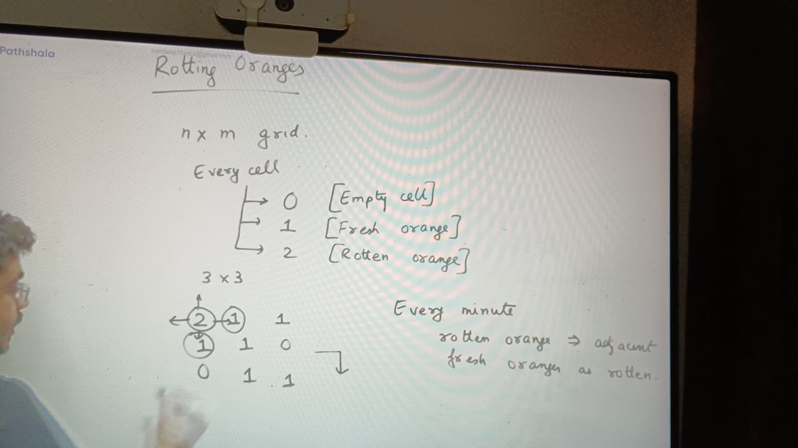
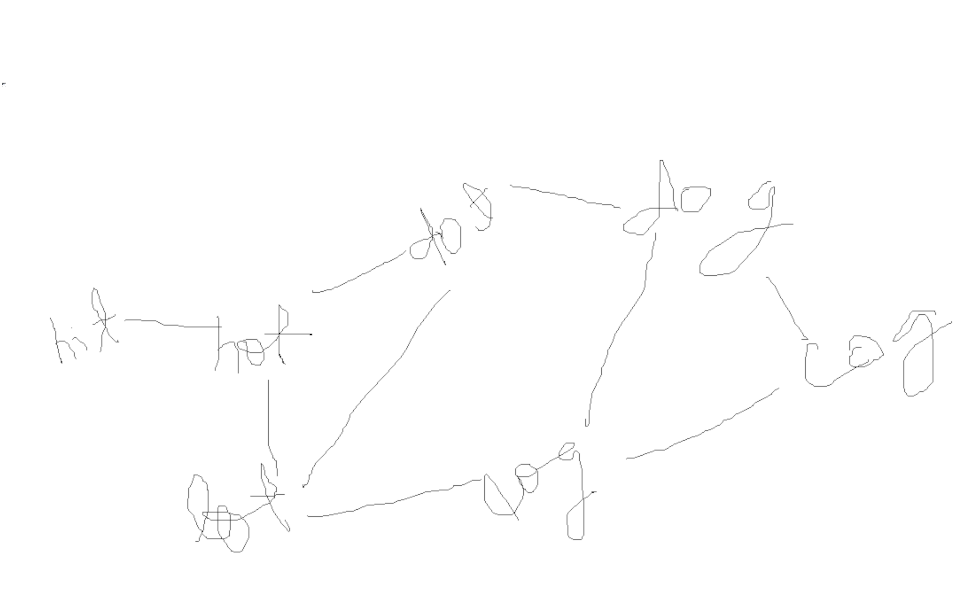

time to rot = distance to nearest rotten orange

**Word Ladder:**

words = ["hot", "hit", "dog", "dot", "lot", "log", "cog"]

transformation = converting a single letter from string to another letter, and also result word must be in words list
example:

hit -> cit ( not valid) because cit is not in words list

que. "hit" -----> "cog"
and  "hit" -> "hot" -> "lot" -> "log" -> "cog"

