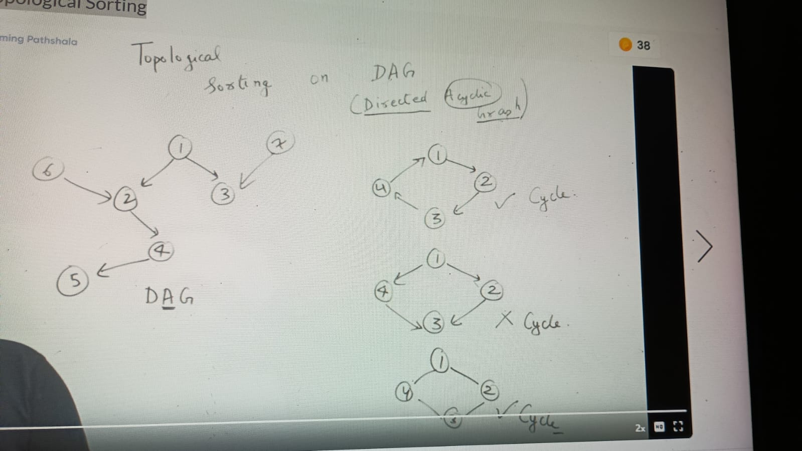
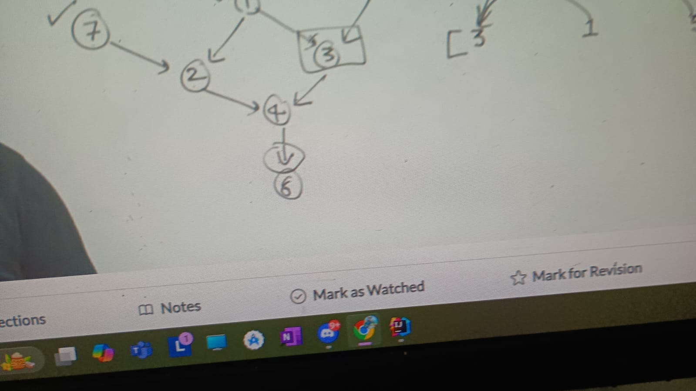
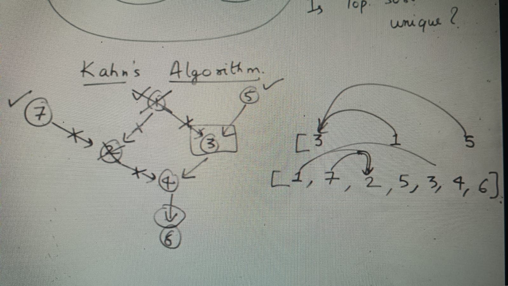
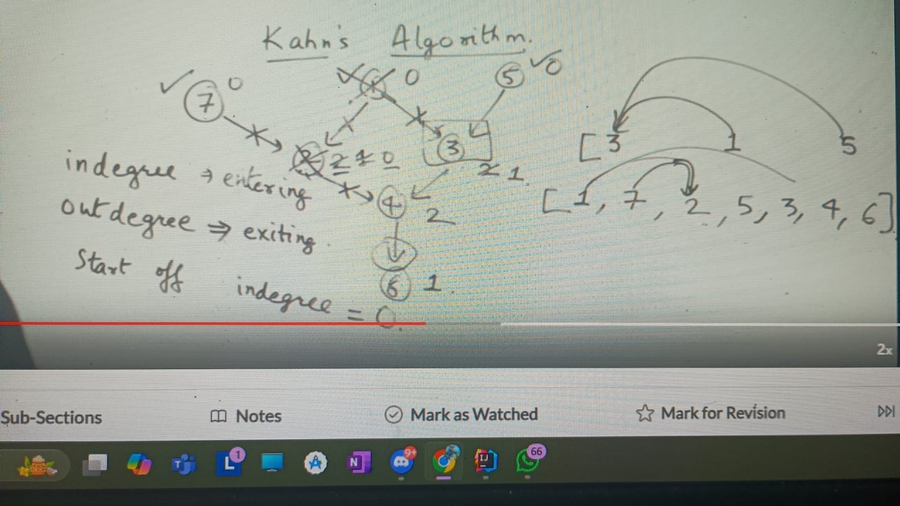
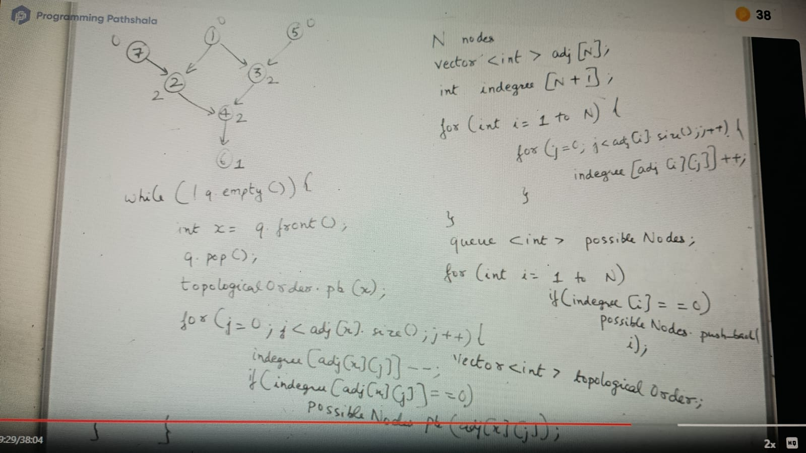
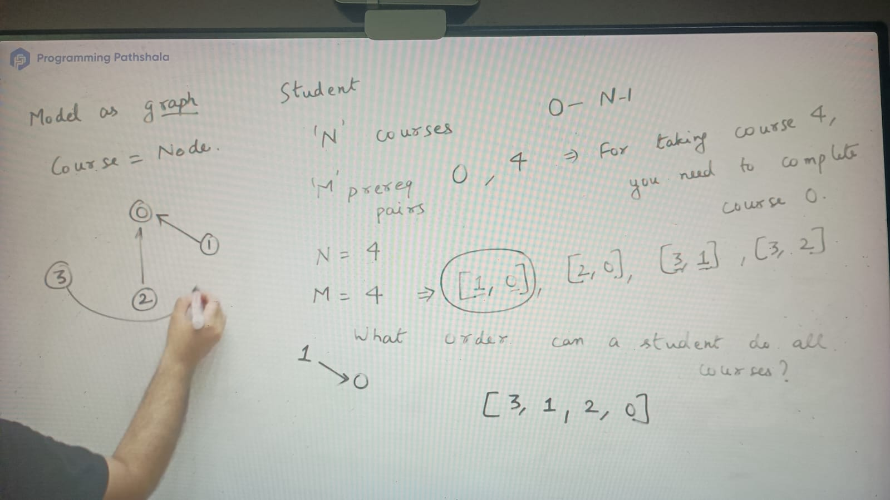
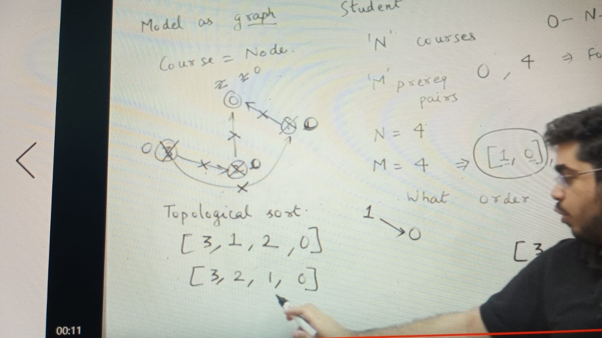
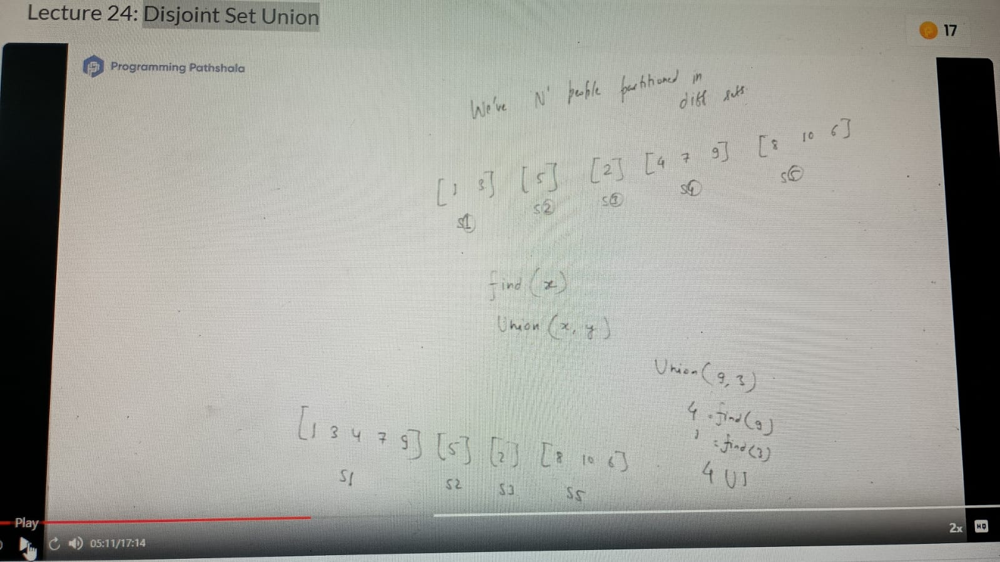

Order N nodes of graph s.t arr[i] -> arr[j]
 => i < j
i - there could be multiple topological sort is possible in a grapgh
ii- kahn's algorithm is used for topological sort

-> ALl the edges should direct forward, any node acn we serve as beginning of node iff no other edge ending at it

[1, ] -> all edges going forward from 1. we can also eliminate edges 1-2 and 1-3 because 1 is beginning node
[1, 7] -> we can choose 7 or 5, 7-2 can remove from consideration
[1, 7, 2, 5, 3, 4, 6] -> this topological sorting for above graph

in-degree -> no of edges entering to node
out-degree -> no of edges exiting from the node

Implementation:

1st loop = TC = o(n+E)
2nd loop o(n)
3rd = o(n + E)
TC = o(N+E)
SC = o(V)

if we run int in cyclic grapgh then, then topological sort always incomplete, it means that other nodes stuck in cycle by that way we can check cycle as well in cyclic grapgh

Applications:-

course scheduling:

if there would be cyclic dependencies between these 4 courses
[1, 2], [2, 3], [3, 4], [4, 1] -> there wont be any answer in this case and return empty array

if (ans.size() != n) ans.clear(); return ans;

Practices:
https://leetcode.com/problems/course-schedule-ii/description/
https://www.geeksforgeeks.org/problems/topological-sort/1
https://www.geeksforgeeks.org/problems/detect-cycle-in-a-directed-graph/1
https://www.geeksforgeeks.org/problems/detect-cycle-in-an-undirected-graph/1
https://www.geeksforgeeks.org/problems/alien-dictionary/1
https://leetcode.com/problems/sort-items-by-groups-respecting-dependencies/description/
https://leetcode.com/problems/course-schedule-iv/description/
https://codeforces.com/problemset/problem/510/B
https://leetcode.com/problems/course-schedule/description/
https://leetcode.com/problems/detect-cycles-in-2d-grid/description/

### Topological Sort in Alternate way::

(0, 1), once you complete the 0th subject then only can move to 1
(0, 2)
(3, 5)
(5, 4)
(5, 3)

deadlock occurs when cycle in course completion(DAG -> Directed Acyclic Grapgh mandatory)

tell me order in which course would be complete: -

 0 1 2 5 3 4
         4 3

This is topological sorting order

 0 <---> 1 ( a deadlock here)

Steps:
1. DFS(node)
2. isVisited[node] = true
3. call for adj unvisited node
4. push node into stack
5. main function call this DFS again and again

### Order of Characters:

Given different words in lexicographic order now based on that word we have to tell order of characters:

Example: appbqr, appmkt
 here first diff chars is : b < m, we always check first different char in 2 word if those are lexicographically ordered

### Disjoint Set Union

https://www.geeksforgeeks.org/problems/minimum-spanning-tree/1
https://www.geeksforgeeks.org/problems/minimum-spanning-tree/1
https://leetcode.com/problems/critical-connections-in-a-network/description/
https://leetcode.com/problems/network-delay-time/description/