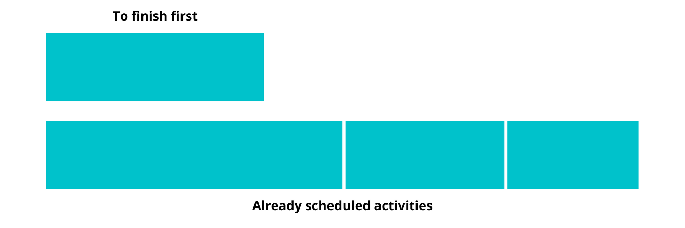
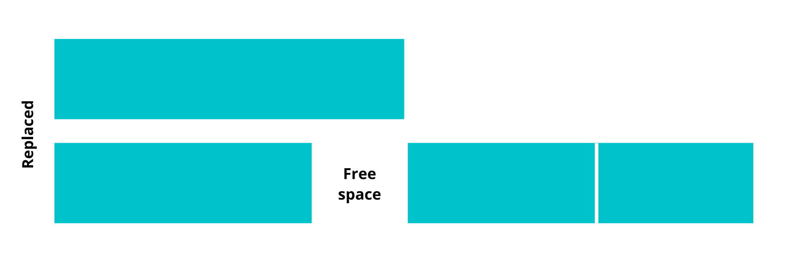
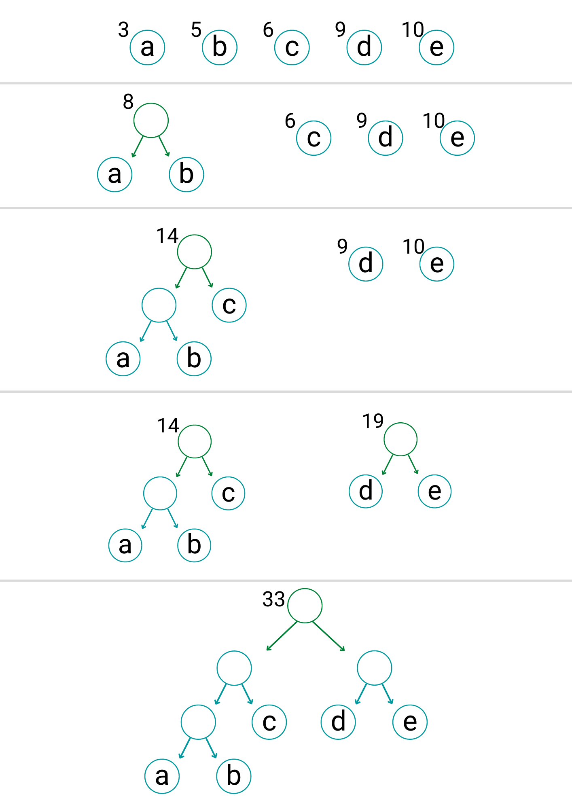
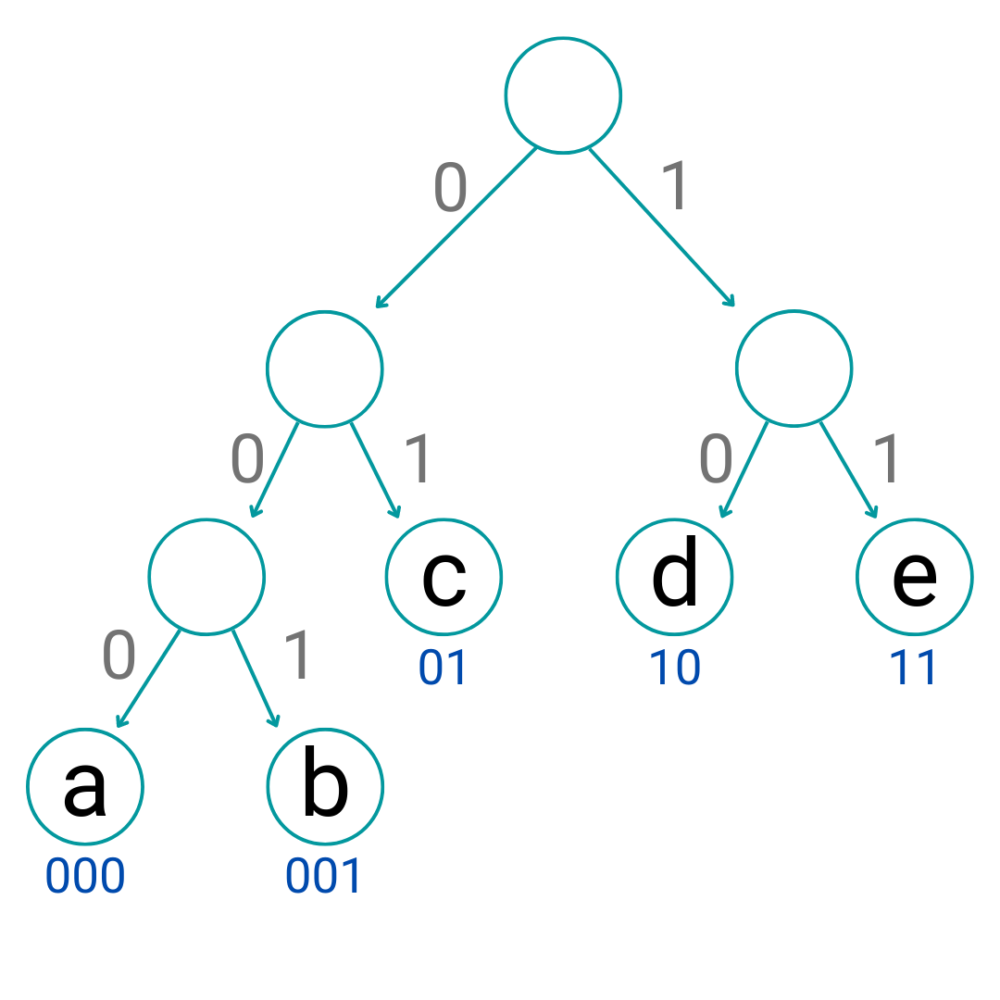

What is Greedy Algorithm
A greedy algorithm is a simple and efficient algorithmic approach for solving any given problem by selecting the best available option at that moment of time, without bothering about the future results. In simple words, here, it is believed that the locally best choices made would be leading to globally best results.

Advantages of Greedy Approach:

It is easier to describe.
It can perform better in most of the scenarios than other algorithms.
This approach doesn’t always produce correct results due to the nature of not reversing the decision made. This is why we opt for a Dynamic Programming strategy in such scenarios.

Activity Selection - 1
We have been given ‘N’ activities. The start time and end time of all activities are given by two arrays start[N] and end[N]. Find the maximum number of activities that can be performed with a constraint that only one activity can be performed at a time.

Input: start [ ] ={3,0,1,5,5,8}, end [ ] ={4,6,2,7,9,9}

Output: 4

Brute force- we will consider all possible combinations of activities. Since activities can be performed in any sequence, we need to consider all the permutations of every possible combination. Maximum among the valid combinations will be our answer.

Time complexity: O((2^N)*N!)

Auxiliary Space: O(1)

Greedy- The greedy choice is to always pick the next activity whose finish time is least among the remaining activities and the start time is more than or equal to the finish time of the previously selected activity. We can sort the activities according to their finishing time so that we always consider the next activity as the minimum finishing time activity.

How does Greedy Choice work for Activities sorted according to finish time?

Suppose, we have adjusted some activities in the given time slot and claim that this solution is the optimal solution and the element first to be finished is not in this solution.

Now we can replace the first activity in the slot with the element with the first finish time without any consequences. As we are only concerned with the number of activities and by replacing the activity, the number of activities will be the same.

This is even going to give us some free time in the slot which can be used to further optimize the problem. So, we need the element of least finish time in our optimal solution and thus we just theoretically verified that making a greedy choice will lead us to the optimal solution.

Time complexity: O(Nlog(N))

Auxiliary Space: O(1) 

Activity Selection - 2
We have been given ‘N’ activities. The start time and end time of all activities are given by two arrays start[N] and end[N]. Find the maximum number of activities that can be performed with a constraint that two activities can be performed at a time.

Input: start [ ] ={1,6,3,15,10}, end [ ] ={4,9,12,20,25}

Output: 5

Greedy- Since we can perform two activities at a time, we need to keep track of two things, the end time of the activity being performed by person-1 and the end time of the activity being performed by person-2. So every time we will encounter a new activity, we may have 3 possible cases:

Can be assigned to both of them: In this case, we will assign this activity to the person whose end time is greater. Because there may be any activity ahead whose start time may be less than the current activity. If we assign this activity to the person finishing early, this may spoil the chance of any event whose start time is less than the current activity.
Can be assigned to only one of them: We don’t have an option so we’ll assign it to the person whose activity is already over.
Can’t be assigned to any one of them: Simply we will ignore and check for the next activity.
We will initialize end_time_of_P1 and end_time_of_P2 to zero.

Time complexity: O(Nlog(N))

Auxiliary Space: O(1)

Activity Selection - 3
We have been given ‘N’ activities. The start time and end time of all activities are given by two arrays start[N] and end[N]. Find the maximum number of activities that can be performed with a constraint that k activities can be performed at a time.

Input: start [ ] ={1,6,3,15,10}, end [ ] ={4,9,12,20,25}, k=2

Output: 5

Greedy- This problem is an extension of the previous problem. Instead of 2 persons, we have k persons. Since we can perform k activities at a time, we need to keep track of the end time of all the activities being performed by k persons in an array of size k. So every time we will encounter a new activity, we need to check the end times of all k activities being performed by different persons and find out if this activity can be assigned to any one of them. If there are multiple possibilities, we will consider the one whose end time is maximum.

Time complexity: O(N*K)

Auxiliary Space: O(1)

Improving Time Complexity:

Instead of using an array to store the end times of activities, we can use a map to store the frequency of persons whose activity will end at a particular time. So every time we encounter a new activity we can find the best possible person to do the task. We can find the upper bound of starting time of the current activity, which will point to the person whose end time is just greater than the starting time of the current activity. We can simply reduce our pointer by one and that person can be assigned this current activity. But what if the pointer points to the first index of the map? That means no one is free to do this activity. Hence we will ignore this activity and check for the next.

map<int,int> endTime; //map stores <end_time, frequency>

endime[0]=k; //k persons are currenty not doing any work so we will intialise it with <0,k>

for(int i=0;i<n;i++){

    auto itr= endTime.upper_bound(start[i]);

    if(itr!= endTime.begin()){

        itr--;

        endTime[itr->first]--;

 

        if(!endTime[itr->first]){ //deleting this key if frequency becomes zero.

            endTime.erase(itr);

        }

 

        endTime[end[i]]++;

        ans++;

    }

}

Time complexity: O(Nlog(K))

Auxiliary Space: O(K)

Minimum no of platforms - 1
We have been given the arrival time and departure time of ‘N’ trains by two arrays arrival[N] and departure[N]. Find the minimum number of platforms such that no train has to wait for the other.

Input: start [ ] ={7,10}, end [ ] ={9,12}

Output: 2

Brute force- We can take an array and mark the duration for which any train remains on the platform. We now know the number of trains standing on the platform for every instance. Simply whatever the maximum number of trains at any instance will be the minimum number of platforms required. We can implement this by Maintaining a suffix_sum[] which will store the number of trains standing at any instance of time t. For any train with timings between [a, d], do suffix_sum[d]++ and suffix_sum[a- 1]--.

Time complexity: O(max(Arr))

Auxiliary Space: O(max(Arr))

Binary Search- Relate this with the activity selection problem. One platform can accommodate only one train, so what if sort the array on the basis of departure time and check how many platforms will be required to accommodate all trains? The minimum number of platforms required will be 1 and the maximum number of platforms will be N. we can perform a binary search between max and min and check the exact number of platforms required.

Time complexity: O(Nlog(N))

Auxiliary Space: O(N)

Greedy- This problem can be treated same as the previous problem. In the previous problem, k persons were fixed for doing activities but here we don’t have a fixed number of platforms. Suppose k platforms are occupied at the moment, we need to keep track of the departure time of all the trains standing on the platform. So every time we will encounter a new train, we need to check if any platform is already empty or not. If there are multiple possibilities, we will consider the one whose departure time is maximum. In case none of the platforms are empty, we can increase the number of platforms by one and assign it to the current train.

Time complexity: O(N*N)

Auxiliary Space: O(1)

Minimum no of platforms - 2
Greedy- When a platform is taken, it can not be used to accommodate another train until the current train departs. As soon as the current train departs, it can be used for another train. We can sort both the arrays, i.e. arrival time array, and departure time array, and sequentially assign each train a platform. Each time when we assign a platform to a train, we check if any platform is already vacant so it can be reused.

sort(arrival.begin(),arrival.end());

sort(departure.begin(),departure.end());

    int i=0,j=0;

    int maxPlatforms=0,currPlatforms=0;

    while(i<n){

        if(arrival[i]<departure[j]){

            currPlatforms++;

            i++;

        }

        else{

            currPlatforms--;

            j++;

        }

        maxPlatforms=max(maxPlatforms, currPlatforms);

    }

    return maxPlatforms;

Time complexity: O(Nlog(N))

Auxiliary Space: O(1) 

Job Sequencing - 1
We have been given an array of jobs where every job has a deadline and associated profit if the job is finished before the deadline. It is also given that every job takes 1 day to complete. Maximize total profit if only one job can be scheduled at a time.

Input: deadline[ ] ={5,1,1,1}, end [ ] ={25,30,45,15}

Output: 70

Greedy- The strategy to maximize profit should be to pick up jobs that offer higher profits. Hence we should sort the jobs in descending order of profit. Now say if a job has a deadline of d we can perform it anytime between day 1-d, but it is preferable to perform the job on its last day. This leaves enough empty slots on the previous days to perform other jobs. So we will find a time slot d, such that the slot is empty and d < deadline and d is greatest. Put the job in this slot and mark this slot filled. If no such d exists, then ignore the job.

        sort(arr, arr + n, comparison);

        vector<bool> slot(n+1,false); 

        int ans=0;

        for (int i = 0; i < n; i++) {

            for (int j = min(n, arr[i].deadline) - 1; j >= 0; j--){

                if (slot[j] == false) {

                    slot[j] = true;

                    ans+=arr[i].profit;

                    break;

                }

            }

        }

Time complexity: O(N*N)

Auxiliary Space: O(N)

Job Sequencing - 2
Improving Time Complexity:

Instead of using an array to check for the available slots, we can use a map to store all the available slots. So every time we encounter a new job we can find the best possible slot for it. We can find the upper bound of the deadline of the current job, which will point to the slot which is just greater than the deadline of the current job. We can simply reduce our pointer by one and that slot can be assigned to this current job. But what if the pointer points to the first index of the map? That means no slot is available for this job. Hence we will ignore this job and check for the next.

map<int,bool> slots;

    for(int i=1;i<=n;i++) slots[i]= false;

    

    for(int i=0;i<n;i++){

        auto itr= slots.upper_bound(arr[i].deadline);

        if(itr!= slots.begin()){

            itr--;

            ans+=arr[i].profit;

            slots.erase(itr);

        }

    }

Time complexity: O(Nlog(N))

Auxiliary Space: O(N)

Fractional Knapsack Problem
We have been given the weights and prices of n items, we need to put these items in a bag of capacity W to get the maximum total price in the bag. Here, Items can be divided into parts.

Input: price[ ] ={4,25,12}, weight[ ] ={2,5,4}, W=9

Output: 37

Greedy- The basic idea is to calculate the ratio of price/weight for each item and sort the items on basis of this ratio in decreasing order. Then take the item with the highest ratio and add them until we can’t add the next item as a whole. When the whole item cannot be added as the remaining capacity of the bag is less than the weight of the items remaining. We will break it into parts and fill the remaining weight of the bag.

Time complexity: O(Nlog(N))

Auxiliary Space: O(N)

Space complexity will depend on input. If input is given in the form of pair, then it will reduce to O(1).

K Max in Running Stream
We have been given an infinite stream of integers. Find the k largest element at any point of time.

Input: k=2; Integers: 1, 4, 3, 10, 9…….

Output: {1}, {1, 4}, {3, 4}, {4, 10}, {9, 10}…..

Brute Force- Whenever a new integer comes, we can store it in an array and sort this array. And can easily find k largest integers. But what if an infinite number of integers come? This will require huge space and time.

Greedy- An efficient Solution is to use a Min Heap of size k to store k largest elements of the stream. Whenever a new integer comes, compare the new element with the top element of the heap. If the new element is smaller, then ignore it. Otherwise, pop the top element and insert the new integer.

Time complexity: O(Klog(K))

Auxiliary Space: O(K)

Median in Running Stream - 1
We have been given an infinite stream of integers. Find the median at any point of time.

Input: 1, 4, 3, 10, 9……

Output: 1, 2.5, 3, 3.5, 4…...

Greedy- When the input size is odd, we take the middle element of sorted data. If the input size is even, we pick the average of the middle two elements in the sorted stream. So idea is to maintain two halves separately so that we can easily find the middle elements. If we can keep track of the maximum element of the left half and the minimum element of the right half, it will be easy to find the median. we can use a max heap on the left side to represent elements that are less than the effective median, and a min-heap on the right side to represent elements that are greater than the effective median.

After processing an incoming element, the number of elements in heaps differs utmost by 1 element. When both heaps contain the same number of elements, we pick the average of heaps root data as the effective median. When the heaps are not balanced, we select the effective median from the root of the heap containing more elements.

Whenever a new integer comes, we need to decide where it will be inserted. Let’s look at the possibilities. Assume new incoming integer is ‘x’.

If x is greater than the current median: it will be surely inserted inside the max-heap.
If x is smaller than the current median: it will be surely inserted inside the min-heap.
Let’s look at the possibilities depending on the sizes of heaps:

If both heaps are of the same size: we can simply insert it wherever needs to be inserted.
If both heaps are of different sizes:
If we are inserting it in the minimum-sized heap, we can simply insert it.
If we are inserting in a heap whose size is greater, we first need to transfer the root element to other heap so that difference in sizes of both heaps doesn't exceed 1.
Time complexity: O(Nlog(N))

Auxiliary Space: O(N)

Median in Running Stream - 2
Implementation:

        priority_queue<int> maxHeap;

        priority_queue<int, vector<int>, greater<int>> minHeap;

        double currMedian;

        

        medianInstraem(){

            currMedian = 0.0;

        }

        void insert(int num){

            if(num < currMedian){

                if(maxHeap.size() <= minHeap.size()){

                    maxHeap.push(num);

                }

                else{

                    minHeap.push(maxHeap.top());

                    maxHeap.pop();

                    maxHeap.push(num);

                }

            } 

            else{

                if(maxHeap.size() >= minHeap.size()){

                    minHeap.push(num);

                }

                else{

                    maxHeap.push(minHeap.top());

                    minHeap.pop();

                    minHeap.push(num);

                }

            } 

            

            //updating currMedian

            if(maxHeap.size() == minHeap.size()){

                currMedian= (maxHeap.top() + minHeap.top()) / 2.0;

            }

            else if(maxHeap.size() > minHeap.size()){

                currMedian= maxHeap.top();

            }

            else{

                currMedian= minHeap.top();

            }

        }

        

        double getMedian(){

            return currMedian;

        }

Data Compression
Data compression is a reduction in the number of bits needed to represent data. The goal of data compression is to reduce the time to transmit large files and to reduce the space to store them.

Example: “aaaabcccdd” can be represented as “a4b1c3b2”.

In compressed form, it represents the number of times a character is repeated. Here we can see, that the number of letters has decreased from 10 in its original form to 8 in its compressed form.

This type of compression is called lossless compression. It enables the restoration of a file to its original state, without the loss of a single bit of data when the file is uncompressed.

Huffman Encoding - 1
Huffman encoding is a lossless data compression algorithm. We encode by assigning a byte code to a character.

How does Huffman Coding work?

Suppose the string “apple” is to be sent over a network. Each character occupies 8 bits. There are a total of 5 characters in the string. Thus, a total of 8 * 5 = 40 bits are required to send this string. Using the Huffman Coding technique, we can compress the string to a smaller size. Suppose we assign

a: 10

p: 01

l: 00

e: 11

Then this string can be encoded in “1001010011”, which takes 10 bits.

Given a sequence of bits, how to decode it uniquely?

Let’s consider the string “aabacdab”. Let’s assign some code to each character:

a: 0

b: 11

c: 100

d: 011

So, the string “aabacdab” will be encoded to 00110100011011 (0|0|11|0|100|011|0|11) using the above codes. But the real problem lies in decoding. If we try to decode the string 00110100011011, it will lead to ambiguity as it can be decoded to,

0|011|0|100|011|0|11    adacdab

0|0|11|0|100|0|11|011   aabacabd

0|011|0|100|0|11|0|11   adacabab

…

and so on

To prevent ambiguities in decoding, we will ensure that our encoding satisfies the prefix rule, which will result in “uniquely decodable codes”. The prefix rule states that no code is a prefix of another code. By code, we mean the bits used for a particular character. In the above example, 0 is the prefix of 011, which violates the prefix rule. If our codes satisfy the prefix rule, the decoding will be unambiguous (and vice versa).

Let’s consider the above example again. This time we assign codes that satisfy the prefix rule to characters 'a', 'b', 'c', and 'd'.

a: 0

b: 10

c: 110

d: 111

Using the above codes, the string “aabacdab” will be encoded to 00100110111010 (0|0|10|0|110|111|0|10). Now we can uniquely decode 00100110111010 back to our original string “aabacdab”.

Also, we can’t assign codes randomly. That may end up increasing the size of the encoded string. The idea is to assign variable-length codes to input characters, lengths of the assigned codes are based on the frequencies of corresponding characters. The most frequent character gets the smallest code and the least frequent character gets the largest code.  If we note, the frequency of characters a, b, c and d are 4, 2, 1, 1, respectively. Let’s try to represent “aabacdab” using a lesser number of bits by using the fact that ‘a’ occurs more frequently than ‘b’, and ‘b’ occurs more frequently than ‘c’ and ‘d’.

Huffman Encoding - 2
We will use a priority queue for building Huffman Tree, where the node with the lowest frequency has the highest priority.

Create a leaf node for each character and add them to the priority queue.
While there is more than one node in the queue: Remove the two nodes of the highest priority (the lowest frequency) from the queue. Create a new internal node with these two nodes as children and a frequency equal to the sum of both nodes’ frequencies. Add the new node to the priority queue.
The remaining node is the root node and the tree is complete.

Consider some text consisting of only 'a', 'b', 'c', 'd', and 'e' characters, and their frequencies are 3, 5, 6, 9, 10, respectively. The following figures illustrate the steps followed by the algorithm:

The path from the root to any leaf node stores the optimal prefix code (also called Huffman code) corresponding to the character associated with that leaf node.

The path from the root to any leaf node stores the optimal prefix code (also called Huffman code) corresponding to the character associated with that leaf node.

