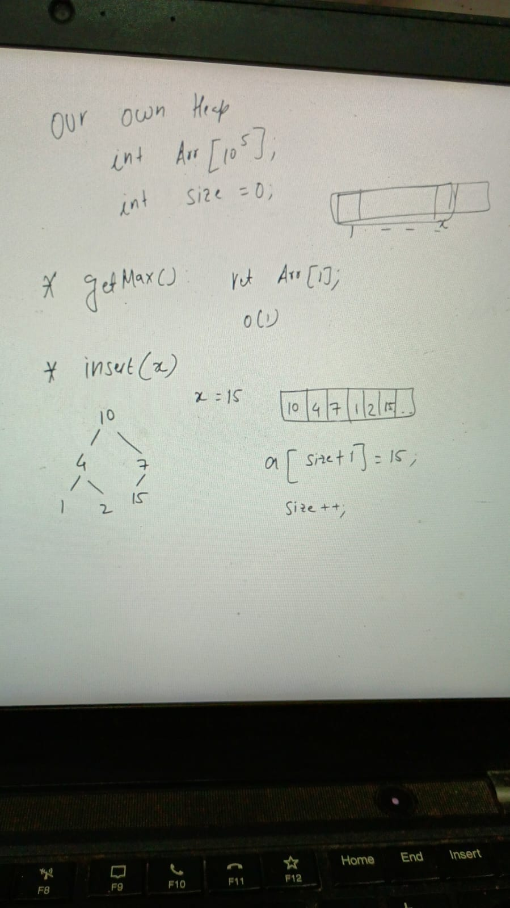
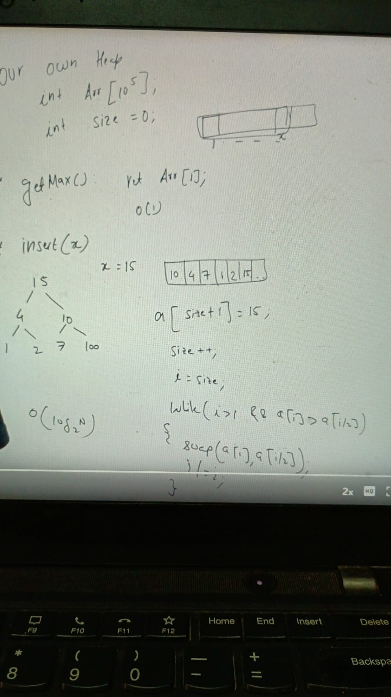
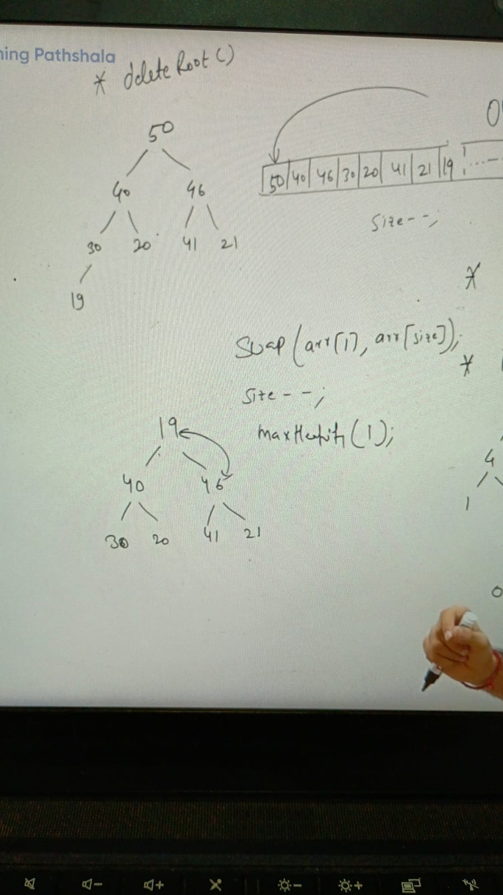
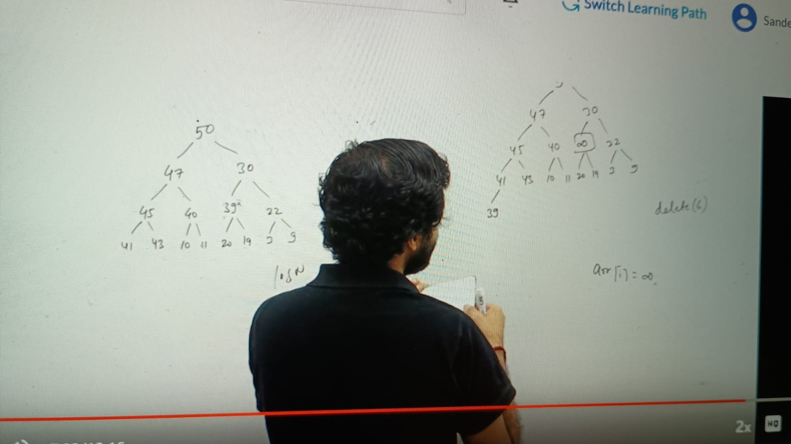
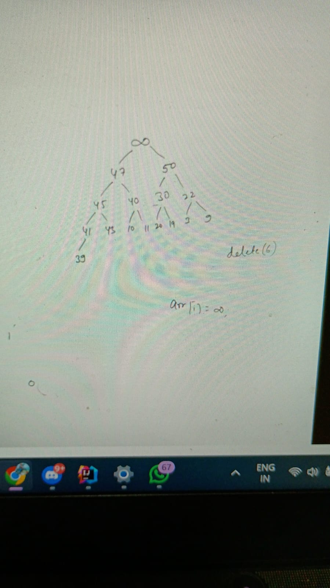

Create own Heap: int Arr[10^5], int size = 0: 

**  operations:
        
        getMax():
        return arr[i]  o (n)

        intsert(x):

deleteRoot():
 In order to delete root we just need to swap from 1st element to last rather than shifting 1 by 1 and after swap from 1st to last   decrease size by size--
 
 swap(arr[1], arr[size]) 
 size--
 invoke maxHeapify for node 1 // o(logn)
 
 

deleteAtIndex(i): 

make index node as infinity and  swap with root node 

arr[i] = infinity
bubble up-- long n
deleteRoot --- logN