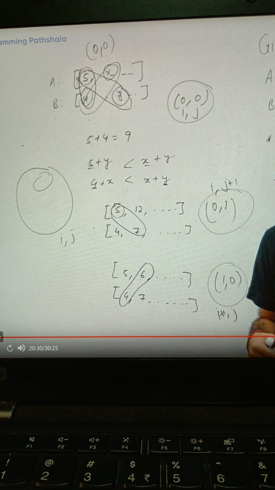
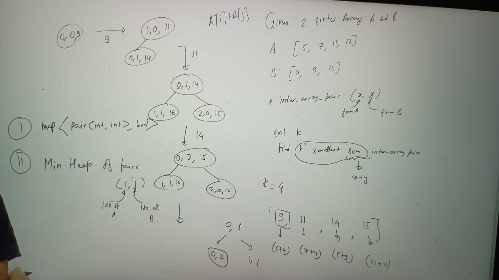

Given 2 sorted array A and B
A = [5, 7, 11, 12]
B [4, 9, 10]

interArrayPair = (x(from-A), y(from-B))
int k, 
find k smallest sum (x + y) in interArrayPair

k = 4

[ 9(5 + 4), 11(7 + 4), 14(5 + 9), 15(11 + 4)]

if 1st array contains m elements and second array contains n elements 
total number of pair would be = m * n

for(i= 0 to m-1) {
  for(j=0 to n-1) {
   //take array of size m * n and store some of each pair into this array and sort them and pick k element from sorted array
}
}

SC = o(m*n)
TC = o((m*n) long(m*n))

implementation:

At any occasion before increament i to i + 1 or j to j + 1 we need to put safety check