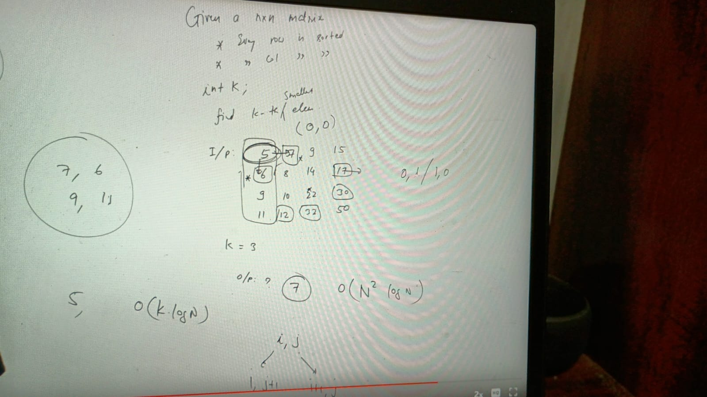

 
 log k! = klogk

https://leetcode.com/problems/kth-smallest-element-in-a-sorted-matrix/description/
https://leetcode.com/problems/find-k-pairs-with-smallest-sums/description/
https://www.geeksforgeeks.org/problems/merge-k-sorted-arrays/1
https://www.geeksforgeeks.org/problems/minimum-cost-of-ropes-1587115620/1