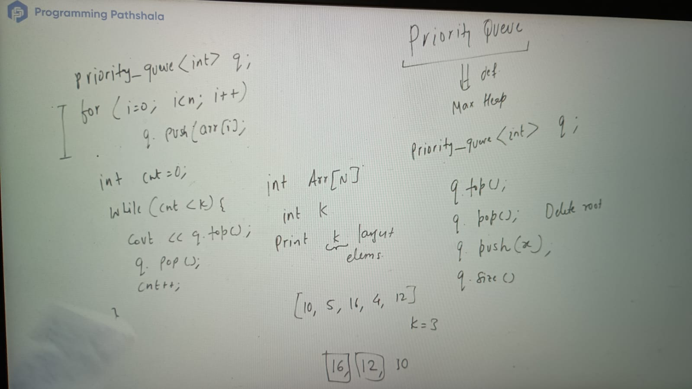
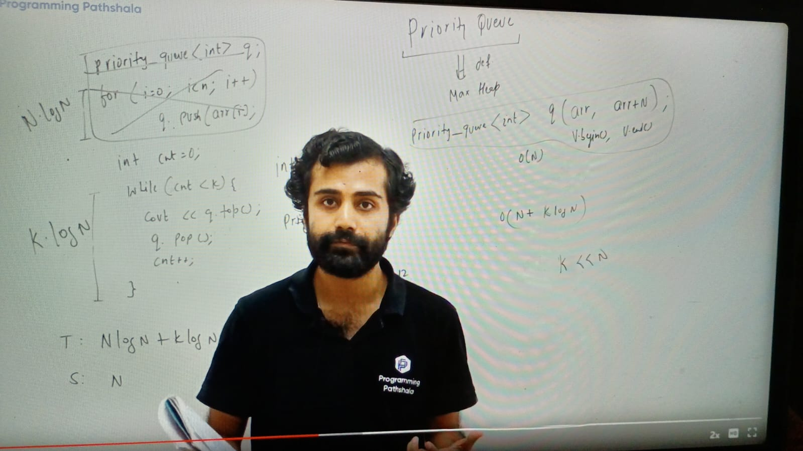
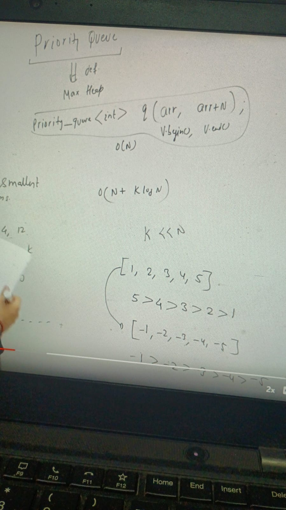
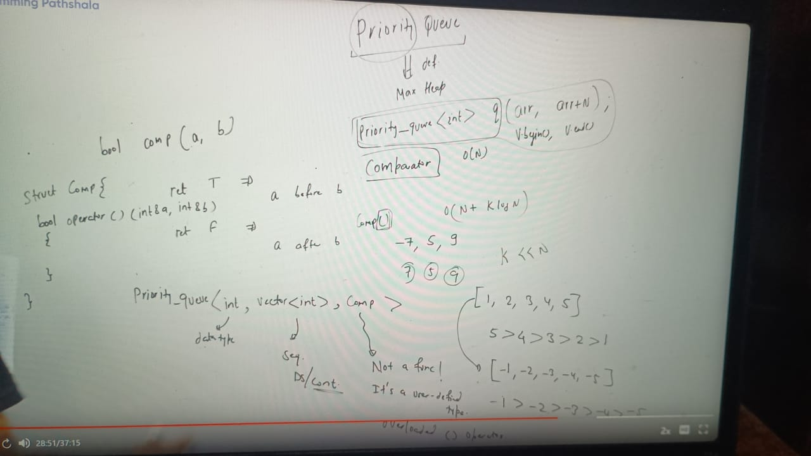
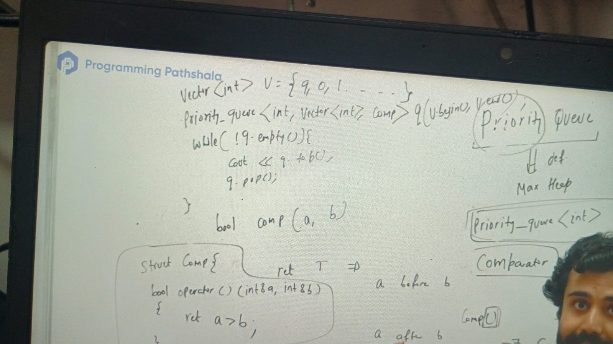
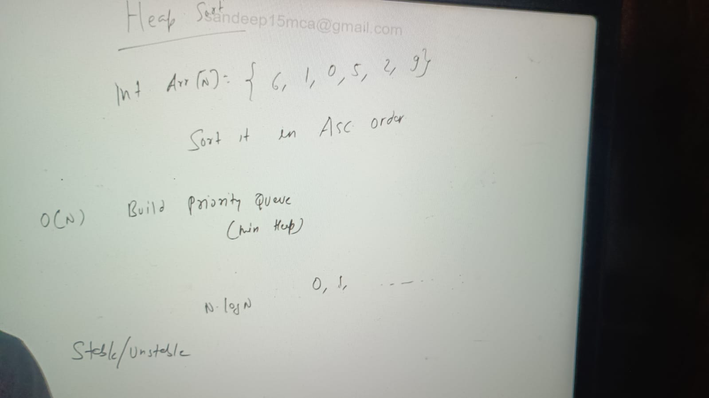
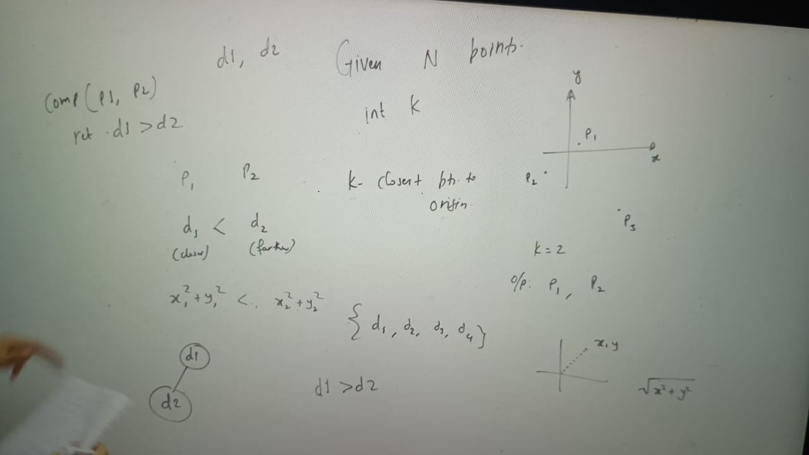
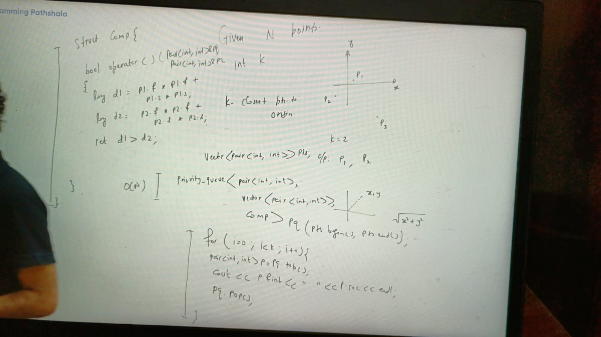

By default is max heap

priorityQueue<Integer> q

     q.top()
     q.pop() -- log n
     q.push()
     q.size()
 

for getting largest k element from arr, in that case we can use priority queue first we pop ele
and print thats it.

SC = o(n)
TC: part 1-> pushing ele in priority Queue
    o(i) = log 1 + log 2 + log 3------ log N
         = log ( 1 * 2 * 3 * 4 ....N) = log (n!) = n log n
part 2:
  k times performing nlogn time because running while loop k time and q .pop take log n time complexity
 = k log(n)

In case of k smallest element:

if priority queue element is not primitive values then we have to use comperator to compare as:

bool comp(a, b)
return T => a comes before b
return F => a comes after b

 
HeapSort:

K closest points in a xy-plane:

We need to find k closest points from origin

parent distance is greater than child's distance(swap applicable if min heap need to build)

 o(klogn) last loop and  whole approach will take o(n + klog n) =

Questions:
https://leetcode.com/problems/k-closest-points-to-origin/description/
https://www.geeksforgeeks.org/problems/k-largest-elements4206/1
  