Heap: 

Introduce 1 DS which can:

1. insert(k) insert int k in DS
2. delete(pos): delete the int at given position
3. getMa()

insert(5): [5, ]
insert(4): [5, 4]
insert(4): [5, 4, 7]
insert(4): [5, 4, 7, 3]

getMax() = 7

delete create problem in case store max in variable and return on getMax()

** we can optimize delete functionality in such way that we will calculate max element as well and assign same maxVar but it can introduce: o(n) 
we mark deleted ele as NUll which left many blank space for that we can pull all element after Null 1 space back which is again o(n)

1. Perceive an array as a Binary Tree

index 1 of array would have 2 child index 2(l), 3 (r).. so far. imp: we have to discart index 1

      i --> i is index of array
    /  \
 2 * i   2 * i + 1

How to find parent of Jth node, parent would be always half of child, in above case i - (2*i) / 2

parent of Jth node = floor| j / 2|

Any array, we can model this type of array example:

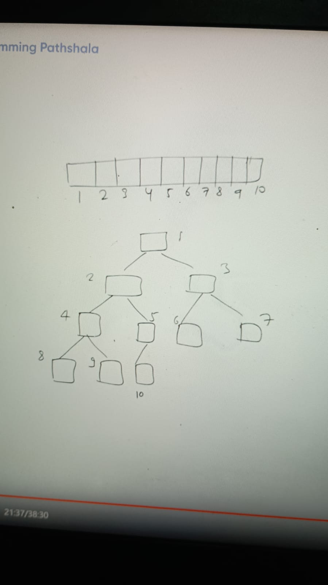

This is BT tree, all levels full a-part of last level. last non-leaf node contain atleast one child and tht woul dbe left, because without previous index next index not possible. That is complete BT

Key Node:
1. all non leaf node have exactly 2 children except 1 and that node would have left child

Q. we have array with N size, how to calculate index of last non leaf node
  
    -> if we perform level order traversal, till one index we will get non leaf node at that point if we will calculate 
       Parent of last node, that would be N/2, because N is size of array, that node would be last non leaf node

non leafe node = (1...N/2)

Hieght of Tree = log of n base 2( because its hieght balanced tree)

### Heap:
 i - Min Heap: Every parent <= both its direct children
 Example:
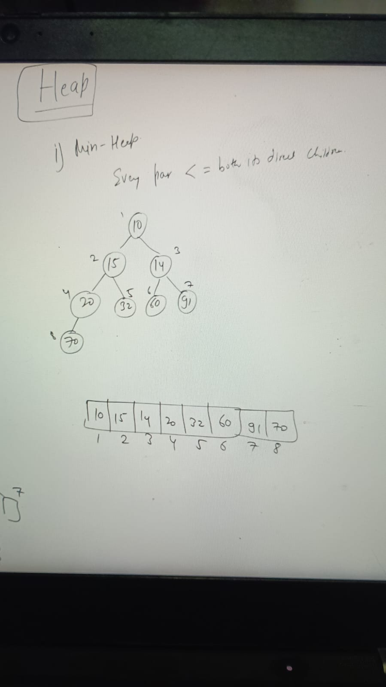
 
Smallest value would be always arr[1] ( root), How?
  Direct children always greater than to parent and direct to direct children even more greater. every node abide this rule

2nd Min: Example: we would have choices from direct children:

so its not good for kth element

 ii - MaxHeap: : Every parent > both its direct children
 
Build Max Heap: 
  E.g: [ 20, 1, 4, 30, 16, 9, 7, 15, 41, 5, 11, 3, 29, 25, 40]

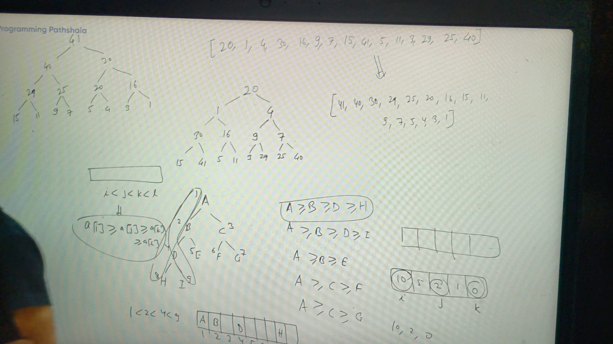

Without descending sorting can we achieve same:

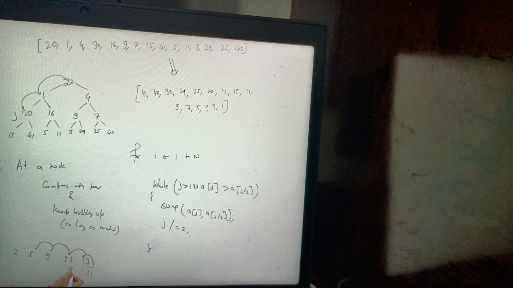

After swapping loops over Tree would looks like this:
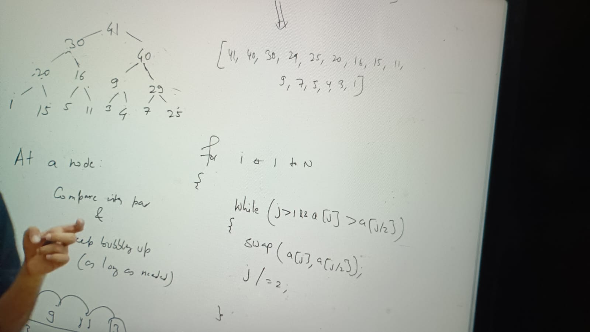

n / 2 * log n = o(nlogn)

No of leaf node if total node is n = n/2 ( which can bubble up till the top)

### How to build max heap in o(n):

If given a max give there will be a left subtree and a right subtree, and both subtree would be max heap (left and right separatly)

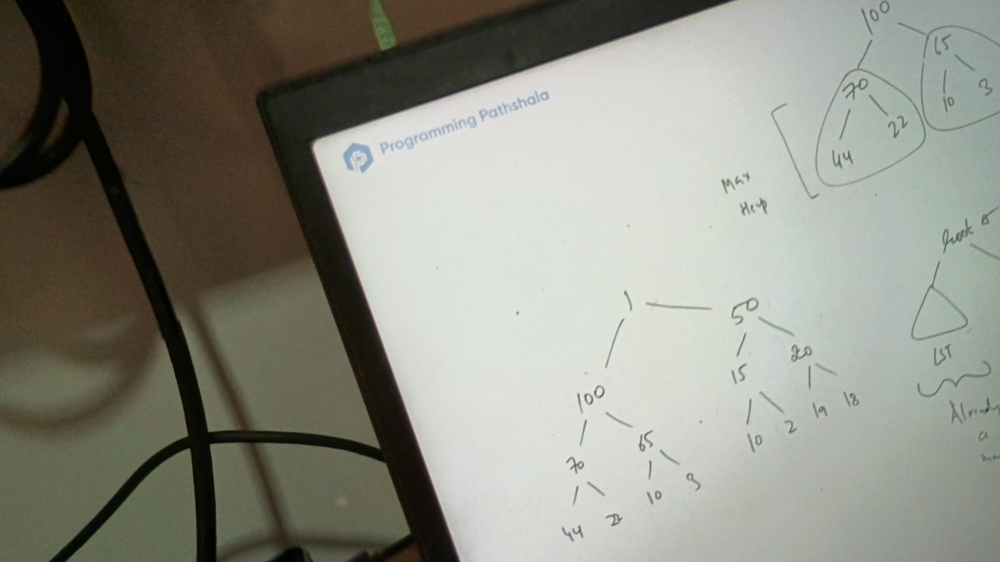

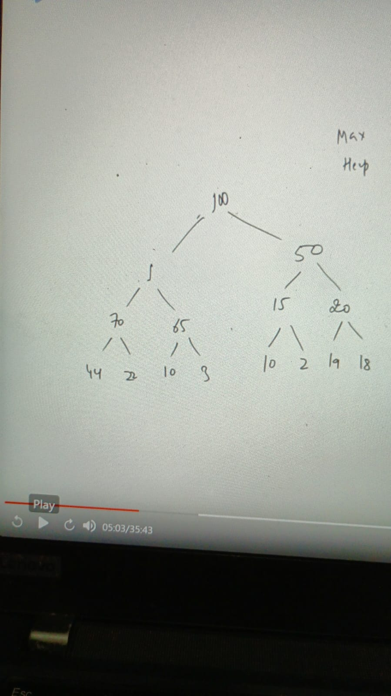

finally its max heap again:
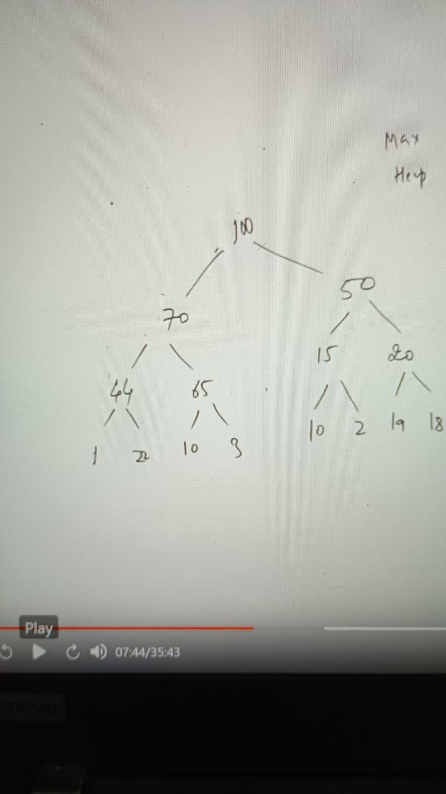

Steps:

Lets say we have array from 1-10, so heap would be below, can we start from root no because both subtree at this point is not max heap
So we wil start from last non leaf node, we can already seen that how can we calculate last non leaf node:

= N/2 = len(arr)/2
if (i < n/2) will do swapping

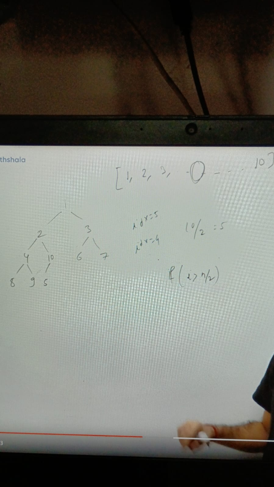

How we can code it, its know as max heapify:

    private void maxHeapify(int i) {
        if (i > n/2) // terminated at leaf
        
        int max = i // initialize max with i and compare with its left and right child
        if (arr[max] < arr[2 * i]) { 
            max = 2 * i;
        } else if (2 * i + 1 <= n && a[max] < arr[2 * i + 1]) { 
            max = 2 * i + 1;
        }
       if(max != i) {
         swap(arr[i], arr(max))

        // again call maxHeapify method on swapped node max
        maxHeapify(max)
       }
    
    }

    void buildMaxHeapify() {
    for ( i = n/2 to 1) {
      maxHeapify(i)
    }
    }

TC = log n base 2
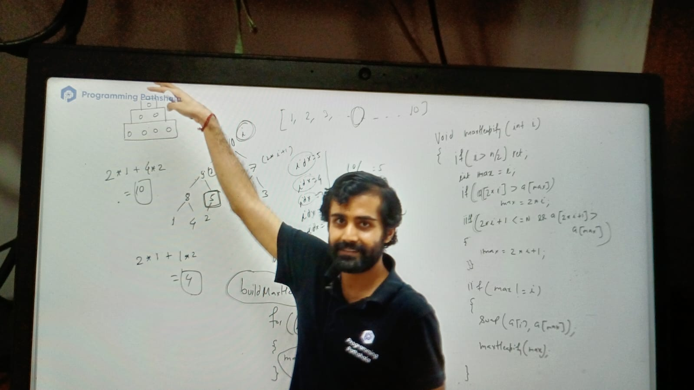
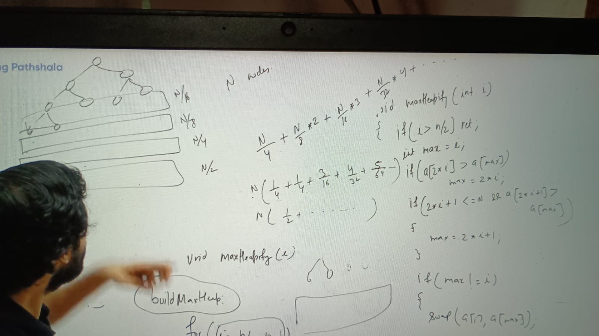

at the time of value of fraction is decreasing so sum would be negligible

and time complexity = o(n)

