What is Heap
Heap is the tree representation of an Array. It is a complete binary tree.

Every non-leaf should have two children and at most one non-leaf can have one child. That child will always be left.

Need of Heap?

Consider a problem and design a data structure in which the below operation can be supported:

Insert into data structures.

Delete from the data structures.

Get max elements from the data structures.

The brute force method can take sufficient size vectors:

For insert operation, insert the element into it.

For the delete operation, Delete the element from the vector.

For finding the max element, scan the whole vector, and then find the maximum element in it.

Time complexity -> insert O(1)

                                Delete O(n) 

                                 GetMax O(n)  

Can we do better?

We are spending time in the deletion and getting Max O(n) due to the linear nature of an array. So for avoiding linear nature we can prefer hierarchical data structures which will reduce the overall height.

For building a heap, the best-suited Data Structure is a Binary tree.

How will we build the tree data structures?

For building the tree data structures, we will take the help of an array. We will represent the tree in the form of an array.

Let’s see this example:

 

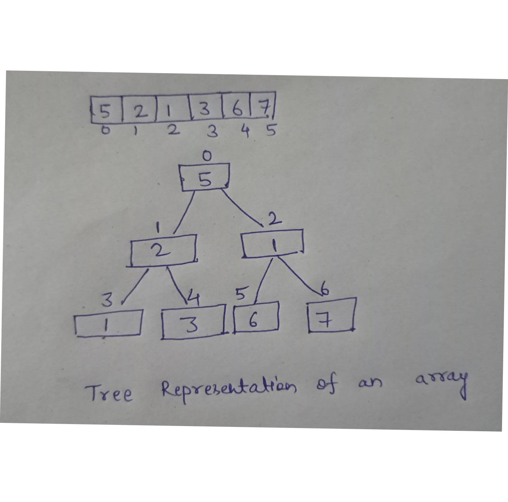

For a particular indices I, if we consider array as 0 based indexing the left child  of I will be (2 * I + 1)th index , right child will be (2 * I + 2)th index (eg. 0th left child will be 2 * 0 + 1 = 1 , right will be 2 * 0 + 2 = 2) .

For 1 -based indexing of an array, the left child and right child will 2 * I th index, (2 * I + 1)th index for Ith index respectively.

There are two types of Heaps -

Min Heap

Max Heap

Min Heap:- In the min heap, the minimum element will be the root of the tree.

    For every     Root <= min(left Child , right Child) .  

Max Heap:- in max heap, the maximum element will be the root of the tree.

    For every    Root >= max(left Child , right Child). 

Now in our problem,

We can insert and delete the element in heap data structures in O(log2N) time for the balanced binary tree because the maximum height of the balanced binary tree can be log2N only. We can get max elements in heap at O(1) time which is an efficient solution than brute force.

Building a Max Heap - 1
For max heap, every root value should be greater than or equal to its left and right child.

Consider an array [A,B,C,D,E,F,G,H,I]

The tree representation of an array will be: 

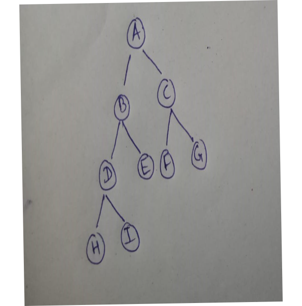

The above tree will work as max heap if and only if:

A >= B >= D >= H

A >= B >= E

A >= B >= D >= I

A >= C >= F

A >= C >= G

All conditions should be satisfied.

Method of building max heap:-

For satisfying the above condition, we can sort the given array. The array will become a max heap.

Time complexity -> O(NlogN) .

Do we need to sort the whole array?

Definitely not. If somehow we are able to build the subsequences such that every above condition is satisfied, our task here will be done!

We can avoid sorting by simply traversing the whole array, checking the condition, if its parent value is lesser than this and then simply swap the child and parent value.

Do the same for the above parent as well.

Let's consider an example

[2 , 4 , 9 , 5 , 4, 7 , 3]

Tree representation of the above array will be:  

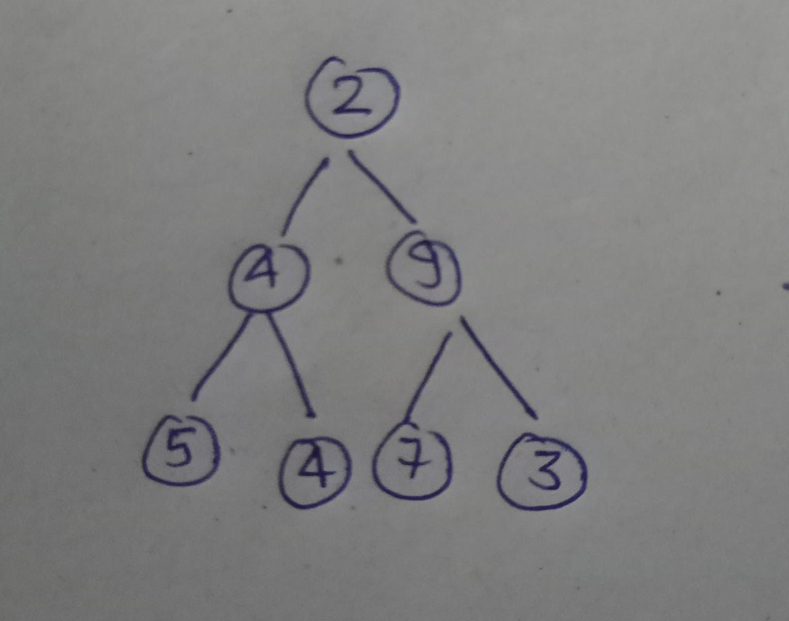

The above tree will work as max heap if and only the max heap condition will be satisfied.

So by building a max heap we can run a loop from 0 to n-1 and for every node, check its parent. If the parent value is lesser than the current node then do a swap and do the same for its parents as well.

Algorithms:-

Void swapPr(int ind , vector<Int> &arr ){

While(ind  > 1 and arr[ind] > arr[ind/2]){

Swap(arr[ind] , arr[ind/2]); // for 1 based indexing

// for 0 based indexing  , swap(arr[ind] , arr[(ind – 1)/2])

Ind = ind / 2 ;

}

}

In the main function

For(int I = 0; I < n; I++){

swapPr(i,arr);

Time complexity -> O(NlogN)  , swapPr operation takes

logN time in the worst case for a balanced binary tree.  

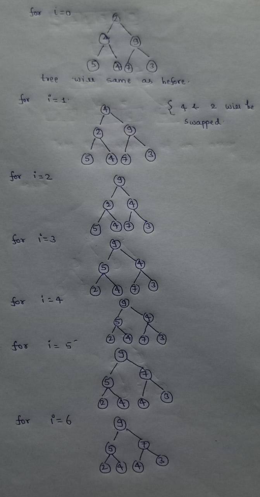

Building a Max Heap - 2
In the previous approach, we took O(NlogN) time to build a max heap.

Can we do better?

Let’s suppose an array [1 , 70 , 65 , 44 , 22 , 10, 3].

Tree representation of the given array will be

 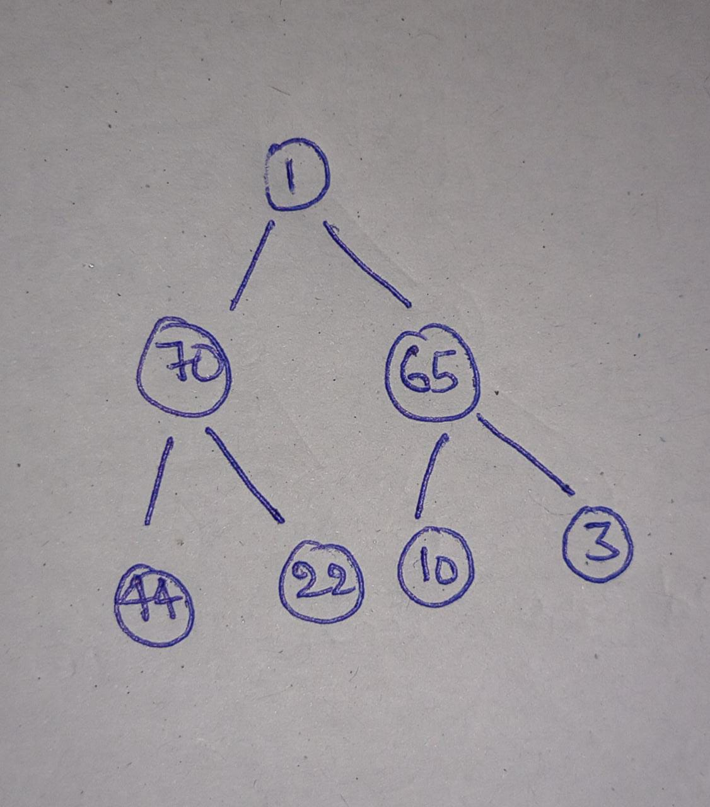

In the figure, If we look carefully, we will find that the left and right subtree of root 1 is already a max heap.

Only 1 is not in its correct position in the max heap.

So we can bring the correct root by swapping the max value from the left and right child of root 1.

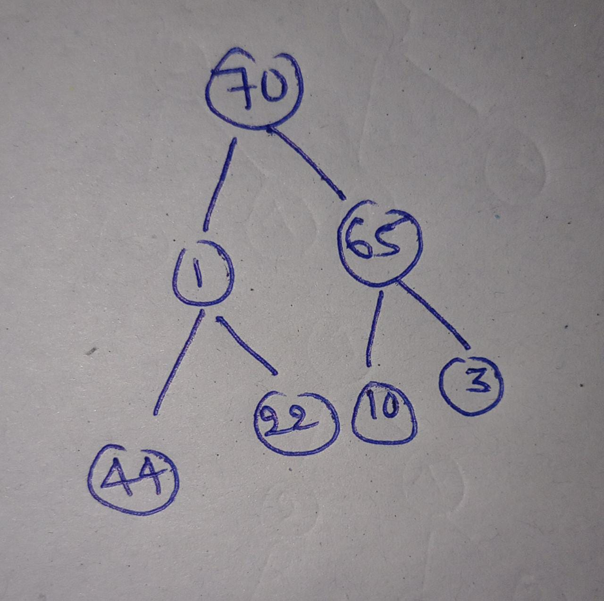

After swapping the max value from the left and the right child, we get the above tree.

In the above tree, a root with value 1 subtree is disturbing the property of max heap for the whole tree. so we can do the same swap operation for this tree as well.

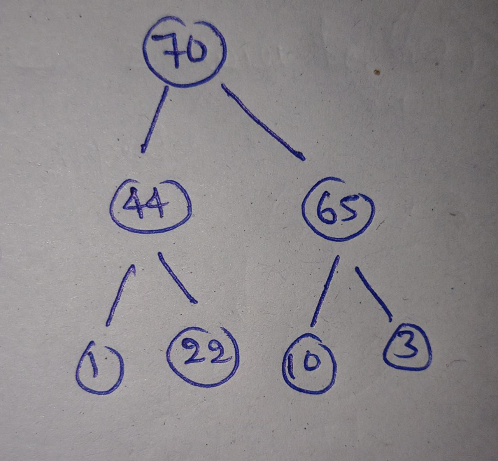

Now this tree is a max heap.

By the above mentioned example, we can conclude for any root if its left and the right child is a max heap by doing a swap operation and we can change the given tree into a max heap. This swapping operation is known as the Heapify operation in heap.

While implementing this algorithm, one should take care that the left and right child should already be a max heap.

Algorithm:-

If we are using this algorithm, we will have to ensure that for any root, its left and right child should be already a max heap. That’s why we need to build the heap from the leaf node of the tree. So the leaf node of the binary tree is already a max heap. Hence, we can start our iteration from the last non-leaf node itself.

In a complete binary tree, the number of leaf nodes is n/2, so we can start our loop from n/2 to 1 and do heapify operations for all the non-leaf nodes.

Code :-

    Void MaxHeapify(int ind,int arr[]){

     if(ind > n/2)return;

    Int maxi = ind;

    if(arr[2*ind] > arr[maxi]){

    Maxi = 2 * ind;

}

if(arr[2*ind + 1] > arr[maxi]){

    Maxi = 2 * ind+1;

}

if(maxi ! = ind){

    swap(arr[maxi] , arr[ind]);

    maxHeapify(maxi , arr);

}

}

In the main function

     for(int i = n / 2 to 1 ){

      maxHeapify(i,arr)

    }

Time complexity -> O(N) (refer video for proof)

Dry Run:-

Let’s consider an array [ 2, 4 , 3, 6, 7, 9 ] 

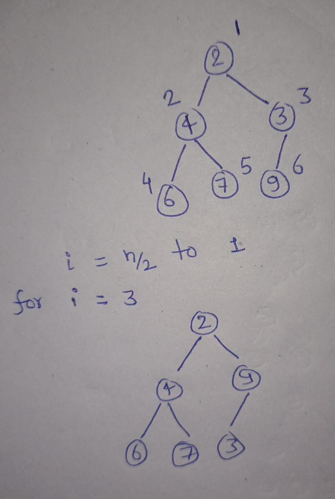

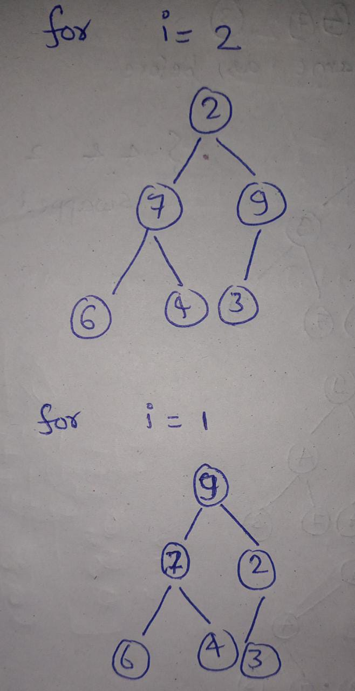

This last tree for i = 1  will be the final max heap.

Heap Operations
1.GetMax :- for finding the max value in max heap , return the root element of the tree, means arr[1] { 1 based indexing or arr[0] -> 0 based indexing }

Time complexity -> O(1)

2. Insert:-  Insert the element at the last position in the array, this can be done by O(1). After inserting the element at the last position, do a bubbling up operation or swap operation for making this tree as max heap.

Let’s consider a max heap array [10 ,4, 7,1 ,2 , 5] 

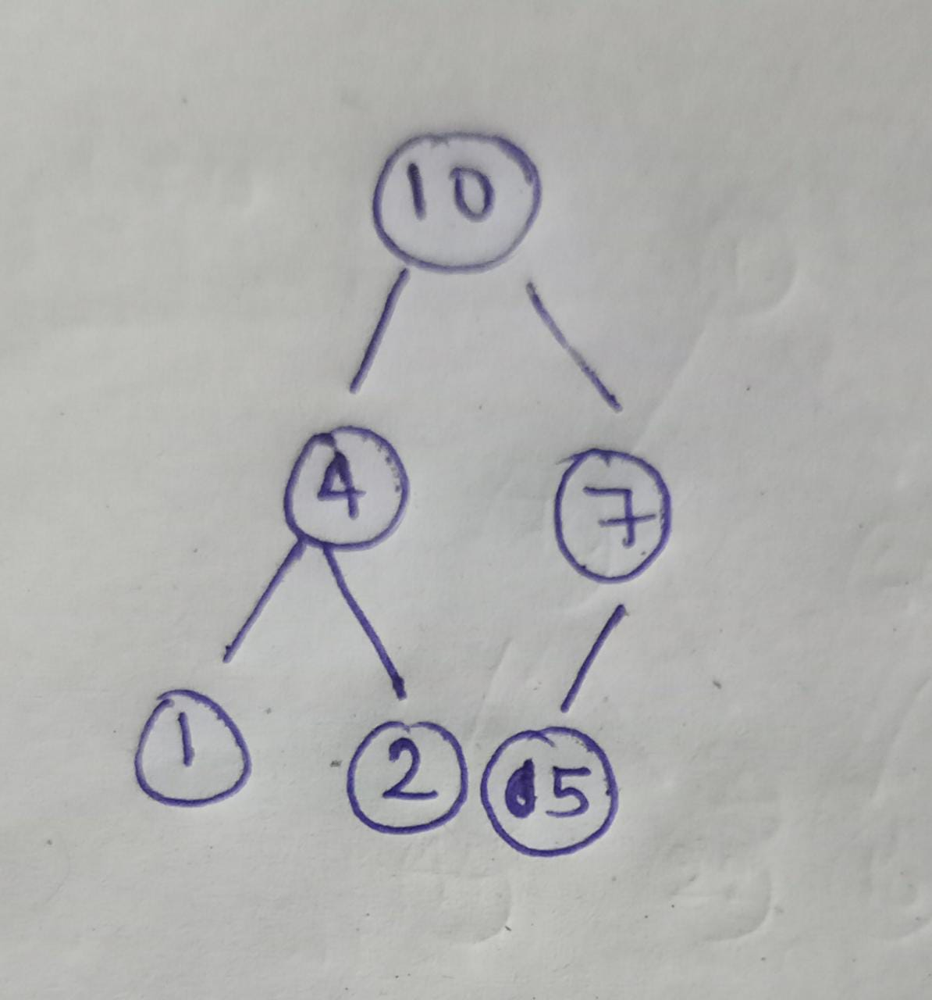

Now, we have to insert x = 15 into the max heap. 

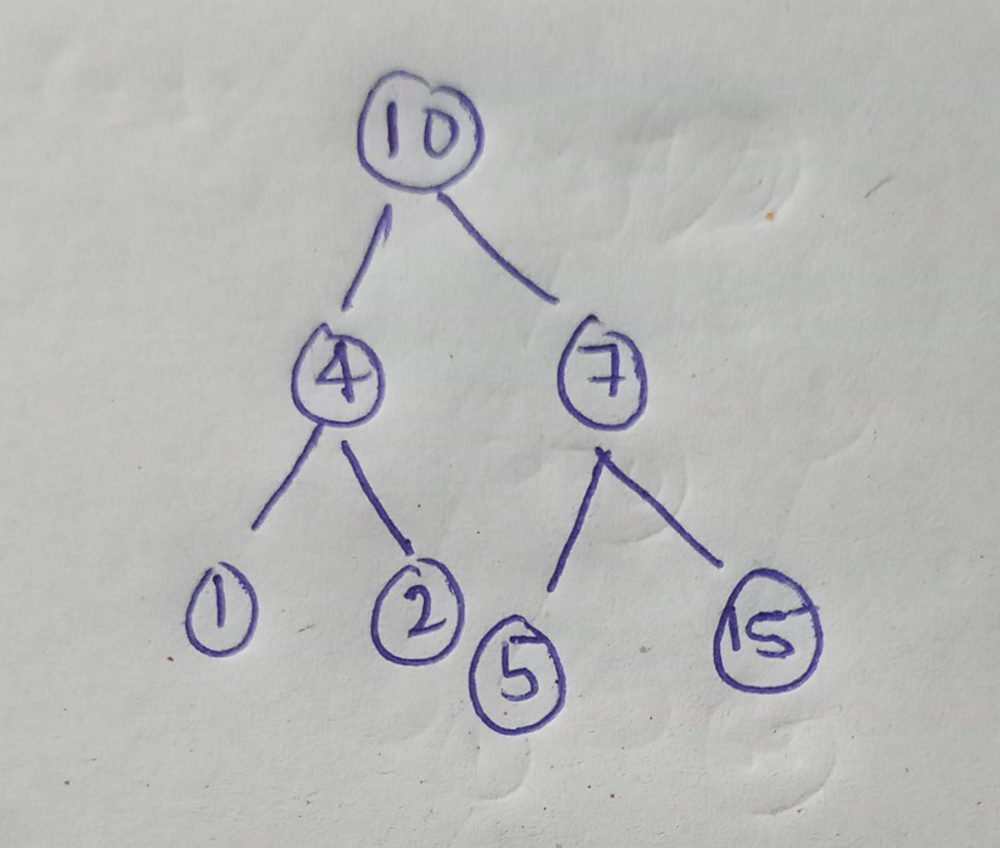

After the addition of 15, the max heap property has gotten violated here.

To make this as the max heap again, we can do a bubbling operation or swapping operation.

Now, this is a max heap after insertion.

3. Deletion:-

Under  the max heap delete operation, deleting the root of the heap means max element of the array. Hence, for deleting the first element of the array, we can do a swap operation between first and the last element.

After this, our max heap will be disturbed and we will do the maxHeapify operation for making this tree as a max heap and will also decrease the size of the max heap.

Let's consider this max heap

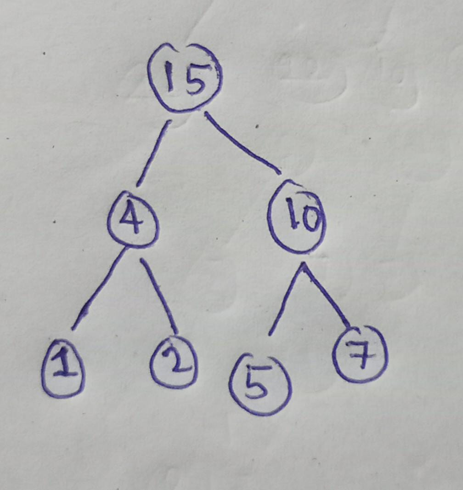

We will delete element 15, so swap 15 and 7.

Now reduce the size of the array and perform maxHeapify Operation.

After swap, the heap will be like this. 

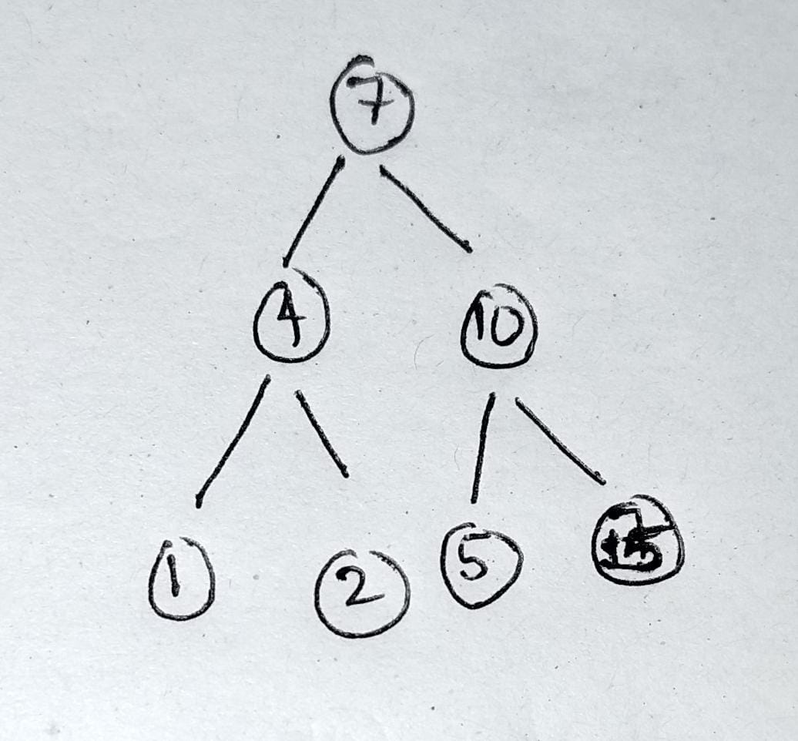

After maxHeapify, our maxHeap will not contain the deleted element and follow the max heap properties.

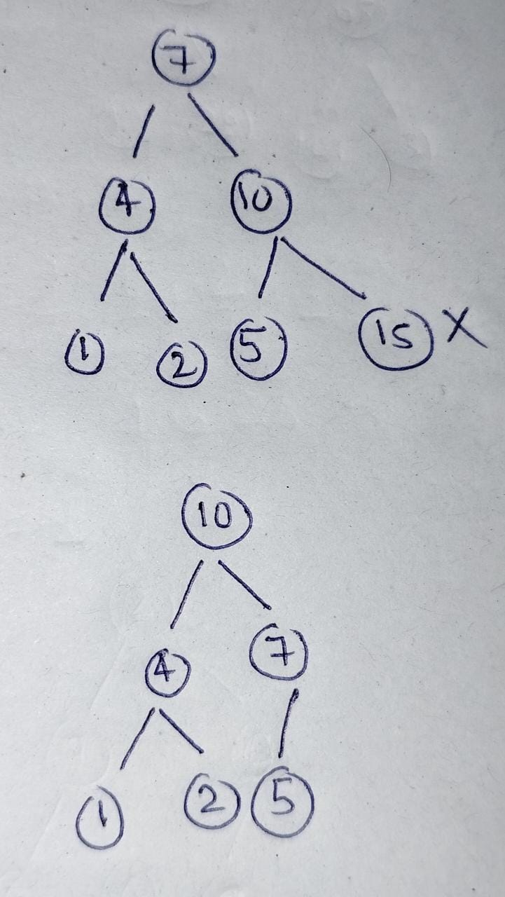

Delete at particular Index:-

Let’s suppose we want to delete 10. For deleting 10, make this 10 as infinity.

After making this infinity do a bubbling-up operation so that 10 can reach the root and we can easily delete this root by the method above.

Algorithm:-

Make the element as infinity, so it can reach the root.

Now apply the above root deletion method.

We can also use another method for deletion at a particular root, by swapping the element at a particular index with the last element. Perform bubbling up and maxHeapify operation for this index. This shall be able to delete the node at particular indices.

Priority Queue
A priority queue is an inbuilt heap in programming languages. It is by default a max heap.

Functionality :-

top() :- top function will return the top element or root element of the heap.

      (priority_queue_name).top() 

Pop():- this will delete the root element of the heap. It will delete the max element if max heap or min element if min heap.

      (priority_queue_name).pop() 

Push(x) :- push or insert element x into heap .

      (priority_queue_name).push(x)

size():-  return the number of elements into the heap.

Here are some basic functionalities provided by the priority queue:

Some Problem:- 

Print k largest element:-

Eg. [10,12,6,7,9] k = 3

The output should be 12 10 9

Sorting is one way we can solve this problem.

Now for solving this problem, better than O(NlogN) complexity we can use a priority queue. Push all the elements into the priority queue, this can be done in O(N) time without using the push function in C++. After building the heap, pop the top k element from the heap. All these k elements are the k largest elements.

Algorithm:-

Build a max heap with all elements.

Pop top k element.

Time complexity -> O(N) + O(k * log(N))

      3. Print k smallest element. 

Max heap can not be used directly.

Hence, one change can be done i.e. multiply the element of arr with -1 and push all the elements in the heap. (As we know that the smallest element * -1 = largest element). Now we can print k, the largest element from the max heap and while printing we can multiply the element by -1.

Algorithm:-

Multiply -1 with all the arr elements.
Build the max heap.

Pop k element from the heap.

Print the element -1 * element.

The second approach can be used as a custom heap. We can use a priority queue of custom data types and will have to write our own comparators for the priority queue.

Let’s revise the concept of custom comparators function in sorting algorithms.

comp(a,b) {

Return true if  you want a before b 

Return false if you want a after b in the sorted output.

The same idea can be used here also.

We can define a priority queue like this for a custom priority queue.

Priority_queue <data types , sequential data structures , comparators> priority_queue_name.

In c++ we can define custom priority queue as

priority_queue<int,vector<Int>,comp>pq;

Comp is not a function like it was in sorting algorithm. It is a user-defined type.

It is an overloaded () operator. Struct or class can be used as user-defined data types.

Now comp can be defined as

Struct comp{

Bool  operator()(int &a, int &b){

// return true if you want a after b.

// return false if you want a before b.

}

}

So if you want a custom priority queue as min heap, we can write our own custom comparator as:

Struct comp{

Bool operator()(int &a, int &b){

Return a > b;
}

}

Heap Sort
There is an obvious way to do sorting with priority queues: Take the items that you want to sort and insert them into the priority queue (using the item itself as its own priority). Then remove items from the priority queue until it is empty. The items will come off the queue in order from largest to smallest. We can use custom comparators to sort according to our choice. Like, for sorting in ascending order we can use min-heap.

Time complexity: O(Nlog(N))

K Closest Points on X-Y plane
We are given a list of points on the 2-D plane and an integer K. Find K closest points to the origin.

Input: point = [[3, 3], [5, -1], [-2, 4]], K = 2

Output: [[3, 3], [-2, 4]]

Brute Force: We will calculate the Euclidean distance from the origin for every given point and sort the array according to the Euclidean distance found. The first k closest points from the array will be the closest points.

Time Complexity: O(nlogn)

Space Complexity: O(1)

Using Priority Queue: The idea is to store the coordinates of the point in a priority queue of pairs, according to the distance of the point from the origin. For assigning the maximum priority to the least distant point from the origin, we use the Comparator class in Priority Queue. Then print the first K elements of the priority queue.

struct comp {

    bool operator()(pair<int, int> a, pair<int, int> b){

        int d1 = a.first * a.first + a.second * a.second;

        int d2 = b.first * b.first + b.second * b.second;

        return d1 > d2;

    }

};

priority_queue<pair<int, int>, vector<pair<int, int> >, comp> pq (points.begin(), points.end());

Time Complexity: O(N + K * log(N))

Auxiliary Space: O(N)

Tying Ropes
We are given n ropes of different lengths, we need to connect these ropes into one rope. The cost to connect two ropes is equal to the sum of their lengths. Find the minimum cost to tie all the ropes together.

Input: [5,2,7]

Output: 21

Approach: The idea is to connect the two lowest-cost ropes first. The resultant rope has a cost equal to the sum of the connected ropes. Repeat the process (with resultant rope included) until we are left with a single rope. At each iteration of the loop, we will be left with one less rope and the optimal cost is added to the total cost. The final cost for connecting n ropes will be minimal among all possible combinations.

Why does this approach work?

Suppose we have four ropes [a,b,c,d], and we add them in the following order:

[a+b,c,d] cost= a+b
[a+b+c,d] cost=a+b+c
[a+b+c+d] cost=a+b+c+d
Total cost= (a+b) + (a+b+c) + (a+b+c+d) = 3*(a+b) + 2*c +d

So if we want to minimize our total cost, we need to ensure that a and b are the smallest lengths and d is the longest.

Brute Force: We can sort the array and remove the two smallest lengths and add them and again put them back in the array and we will ensure its correct position such that the array remains sorted.

Time Complexity: O(n*n)

Space Complexity: O(1)

Using Priority Queue: We can use a min-heap to implement this optimally. We can take out the top two elements and add them and again insert them back into the heap until we are left with a single rope.

priority_queue<int, vector<int>, greater<int>> pq(ropes.begin(), ropes.end());

int cost = 0;

while (pq.size() > 1){

    int x = pq.top();

    pq.pop();

    int y = pq.top();

    pq.pop();

    int sum = x + y;

    pq.push(sum);

    cost += sum;

}

return cost;

Time Complexity: O(nlogn)

Space Complexity: O(n)

Merge K sorted Arrays
We are given k sorted arrays of size k each, we have to merge them into a single array.

Input: point = [[10,15,21], [14,16,25], [9,9,30]]

Output: [9,9,10,14,15,16,21,25,30]

Brute Force: The very naive method is to create an output array of size k * k. Copy all the elements into the output array and sort it.

Time Complexity: O(k*k*log(k*k))

Space Complexity: O(k*k)

Merge sort: We will begin with merging arrays into groups of two. We will first merge two arrays, then the resultant array will be merged with the third array, and so on. This is similar to the merge sort algorithm.

Time Complexity: O(k*k*k)

Space Complexity: O(k*k)

Efficient Approach: We are familiar with the problem to merge two sorted arrays into a single sorted array. The approach to merging them involves using two pointers to find the next largest element between the two arrays and adding that to the final result. Instead of two arrays, we have k arrays here. So we can use k pointers here to merge all the arrays.

When you have two arrays, you’ll only ever have to perform one comparison per iteration to find the smaller of the two elements. However, this is just a special case and that constant-time comparison doesn’t scale. With k arrays, we need to find the minimum of k elements, which will take O(k) time. Though it’s more efficient, time-complexity will be the same as that of the merge sort algorithm.

Improving Time Complexity

If somehow, we know the current smallest element in all the arrays, we can improve the time complexity. This is where heaps come into the equation. The process starts with creating a MinHeap and inserting the first element of all the k arrays. Remove the root element of Minheap and put it in the output array and insert the next element from the array of removed element. If the next element is not available, i.e. we already reached the end of the array, we will skip that array. We will keep doing this until there is no element in the heap.

struct comp {

    bool operator()(pair<int, int> a, pair<int, int> b){

        int val1 = vec[a.first][a.second];

        int val1 = vec[b.first][b.second];

        return val1 > val2;

    }

};

priority_queue<pair<int, int>, vector<pair<int, int> >, comp> pq;

Time Complexity: O(k*k*log(k))

Space Complexity: O(k*k)

K smallest sum pairs
Given two integer arrays, arr1[] and arr2[] sorted in ascending order and an integer k. Find k smallest sums such that one element of a pair belongs to arr1 and another element belongs to arr2.
Input: arr1[] = {1, 7, 11}, arr2[] = {2, 4, 6}, k = 3

Output: [3, 5, 7]

Brute Force: There will be total m*n pairs, where m and n are the sizes of both arrays. we can store the sum of all pairs and then sort the array.

Time Complexity: O(n*m*log(n*m))

Space Complexity: O(n*m)

Using Priority Queue: Instead of brute-forcing through all the possible sum combinations, we should find a way to limit our search space to possible candidate sum combinations. Suppose our current minimum sum is (arr1[i],arr2[j]) then the possible next sum would be either (arr1[i+1],arr2[j]) or (arr1[i],arr2[j+1]). This is because both arrays are sorted and the sum (arr1[i+1],arr2[j+1]) would always be greater (or equal) to sum (arr1[i],arr2[j+1]) and sum (arr1[i+1],arr2[j]).

We will create a min-heap to store the sum combinations along with the indices of elements from both arrays. Heap will be ordered by the sum. Initialize the heap with the minimum possible sum combination i.e (arr1[0],arr2[0]) and with the indices of elements from both arrays (0, 0). Pop the heap to get the indices of the element that make up the smallest sum. Let the pair be (i, j). Next insert (i + 1, j) and (i, j + 1) into the min-heap but make sure that the pair of indices i.e (i + 1, j) and (i, j + 1) are not already present in the min-heap. To check this we can use a hash map.

K smallest sum pairs - Implementation
Implementation:

struct cmp{

    bool operator()(pair<int,int>p1, pair<int,int> p2){

        return arr1[p1.first]+arr2[p1.second] > arr1[p2.first]+arr2[p2.second];

    }

};

priority_queue<pair<int,int>, vector<pair<int,int>>, cmp> q;

q.push({0,0});

map<pair<int,int>, bool> m;

m[{0,0}]=true;

while(k--){

    pair<int,int> p= q.top();

    q.pop();

    cout<<arr1[p.first]+arr2[p.second]<<" ";

    if(p.first+1<arr1.size() && m[{p.first+1, p.second}]==0){

        m[{p.first+1, p.second}]=1;

        q.push({p.first+1, p.second});

    }

    if(p.second+1<arr2.size() && m[{p.first, p.second+1}]==0){

        m[{p.first, p.second+1}]=1;

        q.push({p.first, p.second+1});

    }

}

Time Complexity: O(k*log(k))

Space Complexity: O(k)

K-th smallest in special Matrix
Given an n x n matrix, where every row and column is sorted in non-decreasing order. Find the kth smallest element in the given matrix.

Input: [[1,5,12], [4,6,15], [9,12,30]] k = 3

Output: 5

Brute Force: Collect all the elements of the matrix into an array of size n*n and sort it.

Time Complexity: O(n*n*log(n*n))

Space Complexity: O(n*n)

Binary Search over the Range: This approach uses binary search to iterate over possible solutions. We know that

answer >= mat[0][0]
answer <= mat[N-1][N-1]
So we do a binary search on this range and in each iteration determine the no of elements greater than or equal to our current middle element. The elements greater than or equal to the current element can be found in O(nlogn) time using binary search.

Time Complexity: O(y*n*log(n)) where y= mat[N-1][N-1]- mat[0][0]

Space Complexity: O(n*n)

Using Priority Queue: So the idea is to find the kth minimum element. Each row and each column are sorted. So it can be thought of as n sorted arrays and the arrays have to be merged into a single array, the kth element of the list has to be found out. So the approach is similar, the only difference is when the kth element is found the loop ends.

Time Complexity: O(k*log(n))

Space Complexity: O(n)

Improving Time Complexity

Suppose our current minimum element is mat[i][j] then the possible next minimum element would be either mat[i+1][j] or mat[i][j+1]. This is because the matrix is sorted row-wise as well as column-wise. So this problem resembles with the previous problem.

Time Complexity: O(k*log(k))

Space Complexity: O(k)

Task Scheduling
Given a character array of m tasks, where each letter represents a different task. Tasks could be done in any order. Each task is done in one unit of time. For each unit of time, we can complete either one task or just be idle. However, there is a non-negative integer n that represents the cooldown period between two same tasks (the same letter in the array), that is that there must be at least n units of time between any two same tasks. Return the least number of units of times that are needed to finish all the given tasks.

Input: tasks = ["A","A","A","B","B","B"], n = 2

Output: 8

Approach: we have a cooling period of n unit time, so in an interval of n days, either we can perform n different tasks or stay idle. The idea here is to greedily select the most repeated task available to schedule every time. In order to find the most repeated task, we use a priority queue to get the max repeated task efficiently. We have to make sure only tasks available for scheduling in that period are in the priority queue. For this, we add any scheduled task to a separate cool-down vector. When tasks in this vector are available to schedule (i.e period of n unit time is over) we add them back to the priority queue.

        vector<int> hash(26,0);

        for(int i = 0; i<tasks.size(); i++) hash[tasks[i]-'A']++;

        priority_queue<int> pq;

        for(auto it : hash){

            if(it>0){

                pq.push(it);

            }

        };

        int timer = 0;

        while(!pq.empty()) {

            vector<int> temp;

            for(int i = 0; i<=k; i++) {

                if(!pq.empty()) {

                    temp.pb(pq.top());

                    pq.pop();

                }

            }

            for(int i = 0; i<temp.size(); i++) {

                if(--temp[i] > 0) pq.push(temp[i]);

            }

            

            timer += pq.empty() ? temp.size() : k+1;

        }

        return timer;

Time Complexity: O(m*log(n))

Space Complexity: O(n)

Numbers with Limited Prime Factors - 1
Consider a family of natural numbers whose prime factors are 2, 3, or 5. From 1 to 15, there are 11 such numbers 1, 2, 3, 4, 5, 6, 8, 9, 10, 12, 15. We have to find the nth number.

Input: n = 10

Output: 12

Brute Force: we will check for every natural number until we find the nth number. But time complexity of this naive algorithm will be very high.

Using Priority Queue: Instead of brute-forcing through all natural numbers, we should find a way to limit our search space to possible numbers only. Suppose our current number is x then we can have three possible candidates who can be our next number and that will be 2*x, 3*x, and 5*x.

We will create a min-heap to store the possible candidates. Heap will be ordered by the number itself. Initialize the heap with the minimum possible number i.e 1. Pop the heap to get the next number. And insert all 3 possible candidates into the heap but make sure that the numbers are not already present in the min-heap.To check this we can use a hash map.

struct cmp{

    bool operator()(int n1, int n2){

        return n1>n2;

    }

};

priority_queue<int, vector<int>, cmp> q;

q.push(1);

unordered_map<int, bool> m;

m[1]=true;

while(n--){

    int x= q.top();

    ans=x;

    q.pop();

    cout<<x<<" ";

    if(m[x*2]==0){

        m[x*2]=1;

        q.push(x*2);

    }

    if(m[x*3]==0){

        m[x*3]=1;

        q.push(x*3);

    }

    if(m[x*5]==0){

        m[x*5]=1;

        q.push(x*5);

    }

}

return ans;

Time Complexity: O(log(product of 1st n odd numbers))

Space Complexity: O(n)

Numbers with Limited Prime Factors - 2
We are given a primes array, which contains prime numbers. Consider a family of natural numbers whose prime factors are prime numbers from given array. We have to find the nth number.

Input: primes[]={3,5,7,11}, n=7

Output: 165

Brute Force: we will check for every natural number until we find the nth number. Again time complexity of this naive algorithm will be very high.

Using Priority Queue: Instead of brute-forcing through all natural numbers, we should find a way to limit our search space to possible numbers only. Suppose our current number is x then we can have three possible candidates who can be our next number and that will be primes[0]*x, primes[1]*x, primes[2]*x, and so on.

We can implement it just like the previous question. But if we already have the previous numbers, can we make use of them? Surely next number is going to be the multiple of any of the previous numbers. Let us try to understand this with an example. Suppose primes[]={2,3,5}:

Let's say we have the first 3 numbers 1, 2, and 3. What would be the next number? Given the definition, the next number has to be the smallest number among 2*(1,2,3), 3*(1,2,3), and 5*(1,2,3). Obviously, the smallest number is 2 * 1 = 2. But wait, 2 is already in there. So precisely speaking, the next number has to be the smallest number among all the existing numbers multiplied by 2,3, or 5 that isn't in the list already. Now, we can traverse all numbers and maintain a hashset if we want, but it would become O(N^2). Instead, we can maintain pointers. First, we assume there is only one number in the list, which is 1. The next number is Min(2 * 1, 3 * 1, 5 * 1)=2 and it is not in the list. Because we have already considered 2*1 (we move the pointer to its next position, which is 2), now we only need to consider 2 * 2, 3 * 1, and 5 * 1 in the next iteration. This way, we don't have to worry about finding a number that is already in the list.

We will create a min-heap to store the prime number along with the pointer. Heap will be ordered by the product of the prime number and element that the pointer is pointing to. Initialize the heap with the minimum number combination i.e (1, primes[i]) where 0<= i < primes.size().

vector<int>arr;

struct cmp{

    bool operator()(pair<int,int>p1, pair<int,int> p2){

        return p1.first*arr[p1.second] > p2.first*arr[p2.second];

    }

};

priority_queue<pair<int,int>, vector<pair<int,int>>, cmp> q;

arr.push_back(1);

for(int i=0;i<primes.size();i++) q.push({primes[i],0});

while(arr.size()<n){

    pair<int,int> p= q.top();

    q.pop();

    cout<<arr1[p.first]+arr2[p.second]<<" ";

    if(p.first*arr[p.second] > arr.back()){

        arr.push_back(p.first*arr[p.second]);

    }

    q.push(p.first, p.second+1);

}

return nums.back();

Time Complexity: O(n*log(n))

Space Complexity: O(n) 