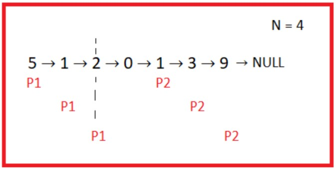

What is a Linked List
A linked list is a unidirectional linear data structure consisting of a series of interconnected nodes, each node storing the address of the other node. They are linked to each other with the help of a pointer.

The first element of a linked list is the data element while the second element is a pointer to the node(structure/class). A linked list can be implemented either with the help of a structure or a class.

### How to allocate space to the new node?

Using malloc:
Eg. int* a = (int*)malloc(5*sizeof(int));
struct Node{
int data;
struct Node* next;
Struct Node*n = (struct Node*)malloc(sizeof(struct Node));
}
### Using new keyword:
Node* n = new Node(val, NULL);
Note: It is recommended not to change the head pointing to the linked list. 

### Basic Operations
The basic operations on a Linked list includes searching, insertion and deletion.

Searching: We have to traverse the linked list to search for a data key.
Time complexity: O(N)
Space complexity: O(1)

Note: We can not use binary search even if the elements were present in sorted form. Since we do not have random access to the mid node as in the case of arrays.

### Insertion: 
The insertion at the head of a linked list is O(1) while the insertion in between the linked list is generally of O(N) time complexity.
Time complexity: start: O(1)
end: O(N)
Space complexity: O(1)

### Deletion: 
Deletion in dynamic memory is done by using the delete keyword. It is generally advisable to delete the occupied memory space if it is not in use.
delete(tmp);
### Middle Node
We have been given a linked list and we have to return the value present at the middle node.

Input: 5 → 4 → 10 → 3 → 2 → NULL

Output: 10

Input: 10 → 20 → 30 → 40 → 50 → 60 → NULL

Output: 40

### Approach:

2 pass algorithm - We can iterate on the linked list to find its length (N) and reiterate to find the middle element at node N/2.
Time complexity: O(N)
Space complexity: O(1)

1 pass algorithm - We can use two pointers - fast and slow, and move them along the linked list with fast hopping two steps while slow hopping only one. This way, the slow pointer will be pointing to the middle element when the fast reaches NULL or the element pointing to NULL.
Time complexity: O(N)
Space complexity: O(1)

Note: Avoid Null pointer exception error. It occurs when we try to use the arrow operator on a pointer pointing to Null.  

### Delete N-th Node From End

We have been given a linked list and an integer N (<=size of the list). We have to delete the Nth node from the end.

Eg. For list - 1 → 5 → 2 → 4 → 7 → 16, N = 3.
The modified list will be - 1 → 5 → 2 → 7 → 16

### Approach:

2 pass algorithm - We can iterate on the linked list to find its length (L) and reiterate to delete the Nth element from the end i.e L-N+1 element from the beginning.
Time complexity: O(N)
Space complexity: O(1)

1 pass algorithm - We can assign two pointers - P1 & P2 such that P2 is more hops away than P1. We can then move both of them linearly and P1 will reach the node containing the address of Nth node from the end as P2 reaches the last element of the list.

Note: If P2 reaches Null while P1 is at the head, this implies that we have to delete the first element. Therefore we also have to update the head pointer.

Time complexity: O(N)
Space complexity: O(1)  

### Reverse Linked List Iteratively
We have been given a linked list and we have to reverse it.

### Approach:

### Using stacks - 
We can iterate on the linked list to fill the stack and later reiterate on the linked list to change its elements.
Time complexity: O(N)
Space complexity: O(N)

### Note: 
It is not a good approach because -
It can create problems while dealing with complex data types.
In this approach, only the values have changed and not the address. Thus, any program which was using these addresses may show unexpected behaviour.

We can create two pointers - prev and curr, pointing to the last element of reversed linked list and the first element of the unreversed linked list respectively. We can then iterate on the linked list to reverse it.
Time complexity: O(N)
Space complexity: O(1)

### Note: 
Do not forget to change the head of the linked list.  

### Reverse Linked List Recursively
We have to reverse a given linked list recursively.

### Steps:

Delink the head of the remaining linked list.
Make a recursion call to reverse the remaining linked list.
Link back the detached node.
Return the new head.
Note: Each recursive call will return the same head i.e. the address of the last element of the original linked list.

### Palindrome Linked List
We have been given a linked list where every node contains a digit ∈ [0, 9]. Check whether it is a palindrome or not.

Input: 1 → 0 → 3 → 0 → 1

Output: true

### Approach:

Brute Force - We can compare the elements from the head and the tail one by one respectively.
Time complexity: O(N^2)
Space complexity: O(1)

Using stacks - We can store the elements of the linked list in a stack. After that we can iterate on the linked list comparing it with the stack elements.
Time complexity: O(N)
Space complexity: O(N)

Reverse the second half - We can reverse the second half of the linked list and then iterate simultaneously on the first and the second half to compare them. We can use getMid() and reverse() for finding the middle element and reversing the second half respectively.

Time complexity: O(N)
Space complexity: O(1)

K-Reverse a Linked List
We have to k-reverse a linked list. k-reverse means that we have to reverse the chunks of size k in the linked list.

Input: 1 → 9 → 3 → 7 → 4 → 6 ; k = 2

Output: 9 → 1 → 7 → 3 → 6 → 4

Input: 2 → 5 → 4 → 6 → 8 → 10 → 3 → 1 ; k=3

Output: 4 → 5 → 2 → 10 → 8 → 6 → 3 → 1

Note: Do not reverse a chunk if its size is smaller than k. In cases where N%k!=0.

### Approach:

We can solve it using recursion as the iterative code might be lengthy and contains the possibility of making errors.

Time complexity: O(N)
Space complexity: O(N/k)

### Cycle Detection - 1
We have been given a linked list. Return true if it contains a cycle otherwise false.

### Approach:

### Hashing - 
We can create a hashmap or a treemap storing the addresses of all the nodes. If any address gets repeated while traversing then there exists a cycle in the list.

Time complexity: O(N)  //using an ordered/treemap

O(NlogN)    //using a hashmap

Space complexity: O(N)

Note: Node* generally stores memory addresses and they can be stored in long integers.

We can create two pointers fast & slow initialised to head. We can hop them 2 & 1 node respectively. Hence, there will be a point when fast == slow, if there exists a cycle otherwise no cycle exists.
Time complexity: O(N)
Space complexity: O(1)  

### Cycle Detection - 2

Given a linked list. Find the first node of the loop in the linked list. Return NULL if there is no loop in the linked list.

Eg.

### Output: 2

### Approach:-

We can use a hashing approach. With the help of hashing, we can find the first node of the loop. Traverse the linked list and check if the node is already present. If present, that node will be the first node. We can return that node. After traversing the list, if we do not get any nodes, then we return NULL.

Time complexity:- O(N)

Space complexity:- O(N)

We can take a pointer to a slow node into temp and a pointer to a head node and start traversing the cycle with the help of a temp node. If the temp node is meeting p, that node is the starting node of the loop, else move p to the next node and do it until the first node is found.

Time complexity:-  O(L * (N-L)), where L is the length of the list from where the loop is starting.

Space complexity:- O(1)

Code:-

    Node* isCycle(Node *head){
    
    bool hasCycle = false;
    
    Node *slow = head , *fast = head;
    
    while(fast and fast->next){
    
    slow = slow->next;
    
    fast = fast->next->next;
    
    if(slow == fast){
    
    hasCycle = true;
    
    break;
    
    }
    
    }
    
    if(!hasCycle) return NULL;
    
    Node *p = head;
    
    while(1) {
    
    Node *temp = slow;
    
    while(temp != p){
    
    temp = temp->next;
    
    if(temp == slow) break;
    
    }
    
    if(temp == p) return temp;
    
    p = p->next;
    
    }
    
    return NULL; }

### Merge Linked Lists Iteratively
Merge Linked List:-

Given two sorted linked lists. We have to merge the links in such a way that the resultant linked list is also a sorted linked list and contains all the elements of list1 and list2.

Eg. List1 = [ 1, 2, 5,6]

       List2 = [ 2 , 3, 5]

      Result  = [1, 2, 2, 3, 5, 5, 6] .

Approach:- We can use the idea of merge function in merge sort.

Take the start pointer of both lists and take the head and tail of the resultant linked list.

Use the idea such that if the first ptr value is lesser than the second ptr, make a new node of the first ptr and put the tail->next to this node then move the first ptr, tail node. If the first ptr value is greater than or equal to the second ptr, make a new node of the second ptr and put the tail->next to this node and then move the second ptr, tail node.

After this, we will get the merged sorted list.

Time complexity -> O(length(list1) + length(list2))

Space complexity -> O(length(list1) + length(list2)) (As each time we are making a new node so that’s why the space is O(length(list1) + length(list2))

Can we do better in terms of space?

We can do this if we will not make a separate copy of the node. If we use the node and manipulate the pointer for merging the list, the space complexity will become O(1).

Algorithms:-

Declare a resHead and tail of the resultant list.

Make the smaller node to the head and tail of the resultant list.

Now take two pointers start1 and start2 for both lists.

Compare the list and manipulate the list according to its requirements.

### Merge Linked Lists Recursively
Merge the linked list recursively:-

We have already solved this problem in an iterative manner.

For solving any problem with the help of recursion, we should immediately think of breaking the problem into smaller subproblems, and with the help of a smaller subproblem solution, see if we can build our original problem solution?

Here we have given two sorted lists and we have to merge them in such a way that the final list should contain all the nodes and also should be in a sorted order.

Let’s consider two lists:

L1 -> 10->12->16

L2 -> 5->11

Break this problem into smaller subproblems, then take the head of the resultant list. Here 5 will be the head of the list because it is the smallest among all other elements and now if we have the resultant list of (10->12->16, 11), then simply assign the reshead -> next as the head of the smaller linked list.

Algorithm:-

1. Take the head and tail of the resultant list.

2. Compare the element of both the list, if the first list element is smaller than the second list, make the tail -> next, as the first list node and do first = first->next else make the tail->next as the second list and do second = second->next;

3. Base case will be if any list becomes null return the non-null list.

Dry Run:- 

Resultant list will be 5->10->11->12->16.

Merge K Linked Lists
Merge k list:-

Given k sorted lists. Merge all the lists in such a manner that the final list should contain all the nodes and should be sorted.

Eg.

L1 1->2->4->7

L2 2->3->6->7

L3 3->4->7->9

L4 2->4->9->10

So final list should be 1->2->2->2->3->3->4->4->4->6->7->7->7->9->9->10.

Approach:-

1. A naive approach can merge two lists at a time, and merge the resultant list with the next list.

Consider 4 lists L1, L2, L3, and L4.

here^

L’’’ will be the final resultant list.

Time complexity -> O(N * K^2).

2. We can use the idea of divide and conquer which has already been used in merge sort. The idea is to merge the first k/2 lists and the last k/2 lists recursively. After getting the head of the first and second half, merge the two heads. This final head will be the final resultant list.

Here consider L0, L1, L2, and L3 four lists. Merge function Merge(i,j) means merge the list from i to j .

Algorithms:-

Call the recursive Merge function for the first k/2 list and the last k/2 list.

Merge the head of both the list for the first and second half.

The base case will be if the range of the list is 1, then return that list.

ime complexity:- O(N*K*logK)

Space complexity:- recursion call stack

Clone Linked List - 1
Given a linked list that contains a next pointer and a unique pointer called a random pointer. You will have to make a deep copy of the given linked list. You have to initialise the same set of nodes at another memory location and they should organise in the same manner.

Eg. (image)

Approach:-

Let's make a copy of a simple linked list without worrying about the random pointer. After making a copy of the original linked list, we have to attach the random pointer in the copy list.

One idea can be to take the current node and find it’s a random pointer from the original list. Now traverse the copy list and find the same node value in the copy list which will work as a random node for the current node.

This idea will not work when there will be a duplicate node in the linked list.

(image)

Another idea can be to track the random node position by traversing the original list and moving the position in the copy node, attaching the random pointer. But the time complexity of this solution will be O(N^2) as each time we are traversing the original list to find the position of the random node.

We can optimise the above idea by using a hashmap.

Instead of finding the position of each node every time, we can in fact map every original node to its copy node.

Now, first of all make a copy of the linked list by the next pointer without worrying about random pointers. Map the original node to its copy node in the map and again traverse the original linked list. Get the random node of the current node and attach the current copy node random pointer to copy the random node with the help of the map. After doing this for all nodes, our problem will be solved.

Algorithm:-

Part1 :

Make a copy of the original linked list with the help of the next pointer and without worrying about random pointers.

Map each original node to its copy node using the map.

Part2:

Traverse the original linked list and for each node and get its random node by using a random pointer. Attach the current copy node random pointer to its random node copy pointer with the help of a map.

Pseudo code:-

Mp[currnode] -> random = mp[currnode->random]

A random node can be null too, so keep that in mind.

Perform this for all the nodes.

            Time complexity -> O(N)

            Space complexity -> O(N)

Clone Linked List - 2
In the previous solution, we solve this problem using O(N) extra space . here we will solve this problem using constant extra space.

We are spending our space storing the cloned node of the original node into the map. So can we avoid it?

Instead of storing the cloned node on the map, we can add that node next to its original node. So first of all build the list and cloned node in such a way that it contains all original nodes and cloned nodes next to their original node. after building the list, now assign the random pointer of the cloned node. after assigning all the random pointers of cloned node, separate the original list and copy the list.

Algorithm:-

Traverse the original list and make a copy of the cur node and add this copy node to the cur next node.

Assign the random pointer to the copied node.

Separate the original node in one list and copy the node in another list.

Return another list.

Pseudo code:-

      Node *cur = head;

// build the list

      while(cur != NULL){

          Node *temp = new Node(cur->data);

          Node *next = cur->next;

          cur->next = temp;

          temp->next = next;

          Cur = next;

       }

// assign the random pointer

Cur = head;

while(cur != NULL){

cur->next->random = cur->random != NULL ? cur->random->next : NULL;

Cur = cur -> next -> next;

}

// separate the list

Node *dummyNode = new Node(-1);

curNode = head;

Node *tail = dummyNode;

while(curNode){

tail->next = curNode->next;

tail = curNode->next;

curNode->next = curNode->next->next;

curNode = curNode->next;

}

return dummyNode->next;

Time complexity:- O(N)

Space complexity:- O(1)

Flatten a Linked List
Flatten a linked list:-

Given a linked list which has node structure mentioned below:

Struct node{

Int data;

Struct node *next;

Struct node *down;// may be null or can point at the head of another same type of linked list.

};

We can say that we have given a multi-level linked list. We have to flatten the linked list. Flattening means, all the nodes should be on a single level. Down pointer of every node should be null.

Eg:

Order can be anything, the main concern is that it should contain all the nodes and the down pointer of every node should be null.

Approach:-

The idea is to start traversing the list and if its down pointer is null, add this node to the resultant flattened list.

If its down pointer is not null, first take the head of the down pointer and make the curnode->down = NULL and add the head of this down pointer to the last of the original list then add curnode to the resultant list. For the addition of this head easily, we can keep track of the original list and after each addition, and we will also have to update our tail.

Why does this approach work?

This approach will work fine because we are moving the down pointer to the end of the original list, so if this down pointer list contains multiple down pointer, then these nodes will flatten into a straight line when the curnode will reach that node and the next down pointer will add on to the end of the original list. This will perform till all nodes are not flattened.

Algorithm:-

1. Traverse the original list and take a resultant head list.

2. If the down pointer of currnode is not null then take the pointer of the curnode down and now make currnode->down = null , add down pointer to last of the original list and add curnode to the resultant list.

3. If the down pointer of curnode is null, add this node to the resultant head list.

4. Do this when curnode is not null.

Time complexity:- O(2 * numberofNode) = O(N)

Dry run:- 

Instead of adding a down pointer to the last, we can add it just next to curnode. It depends upon our ordering of the output.

Doubly Linked List
Doubly Linked List:-

A doubly linked list is a linked list in which we can move in forward as well as backward directions. It contains an extra previous pointer in its structure.

The structure of the node is given below for a doubly linked list.

Struct DLL{

Int data;

DLL *next;

DLL *prev;

};

Eg.

10 <-> 20 <-> 30 <-> 40 <-> 50.

We can traverse the list in a forwarding direction with the help of the next pointer and backward direction with the help of the previous pointer.

Insertion of a Node:-

First of all, reach the position at which we want to add a new node. Make the desired pointer change.

Eg.

10 <-> 20 <-> 30 <-> 40 <-> 50.

For the given list, let’s suppose we want to add node 15 after 10.

Pseudo code:-

DLL *temp = curNode->next;

curNode->next = n;

temp->prev = n;

n->prev = curNode;

n->next = temp;

// image of pointer change.

Deletion of a Node:-

First of all, reach the position at which we want to add a new node. Make the desired pointer change.

Eg.

10 <-> 20 <-> 30 <-> 40 <-> 50.

Let's say we want to delete node 30;

Pseudo code:-

DLL *n = curNode->next;

curNode->next = curNode->next->next;

Node *tmp = curNode->next;

tmp->prev = tmp->prev->prev;

Delete (n);

LRU Cache - 1

LRU Cache - 2
class LRUCache{

Struct Node{

int key;

int val;

Node *prev ;

Node *next ;

Node(int key_ , int val_){

key = key_;

val = val_;

prev = next = NULL;

}

};

public:

int maxSize , curSize;

Node *head;

Node *tail;

unordered_map<int,Node*> keyToAddress

LRUCache(int capacity) {

maxSize = capacity;

curSize = 0;

head = tail  = NULL;

}

Node *addToTail(int key , int val){

Node *n = new Node(key,val);

if(!tail){

Head = n , tail = n;

} else {

tail->next = n;

n->prev = tail ;

tail = n;

}

curSize++;

return n;

}

void moveToTail (Node *node, int val){

node->val = val;

if(node == tail) {

return;

}

if(node == head) {

head = head->next;

head->prev = NULL;

} else {

node->prev->next = node->next;

node->next->prev = node->prev;

}

node->prev = tail;

node->next = NULL;

tail->next = node;

tail = node;

}

void deleteAtHead(){

Node *tmp = head;

head = head->next;

if (head)

head->prev = NULL;

Else

tail = head;

delete(temp);

curSize–;

}

int get(int key){

int ans;

if(keyToAddress.find(key) == keyToAddress.end()) ans = -1;

else{

Node *n = keyToAddress[key];

ans  = n->val;

moveToTail(n , n->val);

}

return ans;

}

void put(int key , int value){

if(keyToAddress.find(key) != keyToAddress.end()){

moveToTail(keyToAddress[key] , value);

return;

}

if(curSize < maxSize) {
keyToAddress[key] = addToTail(key , value);

} else {

keyToAddress.erase(head->key);

deleteAtHead();

keyToAddress[key] = addToTail(key , value);

}

}

 

